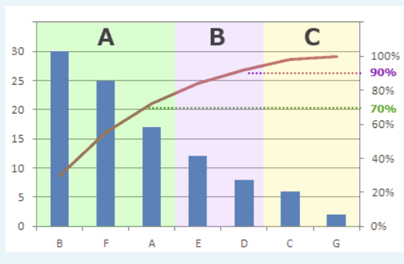
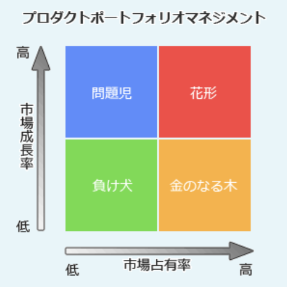
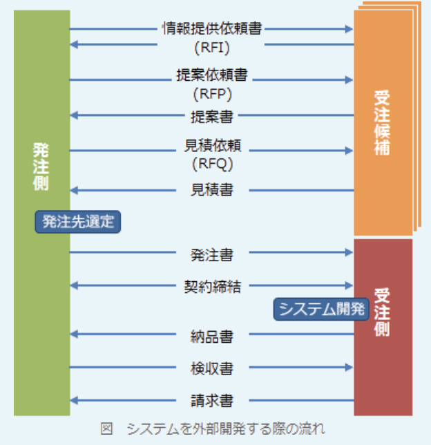
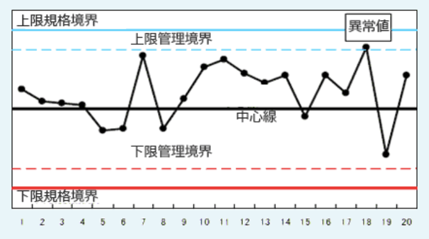
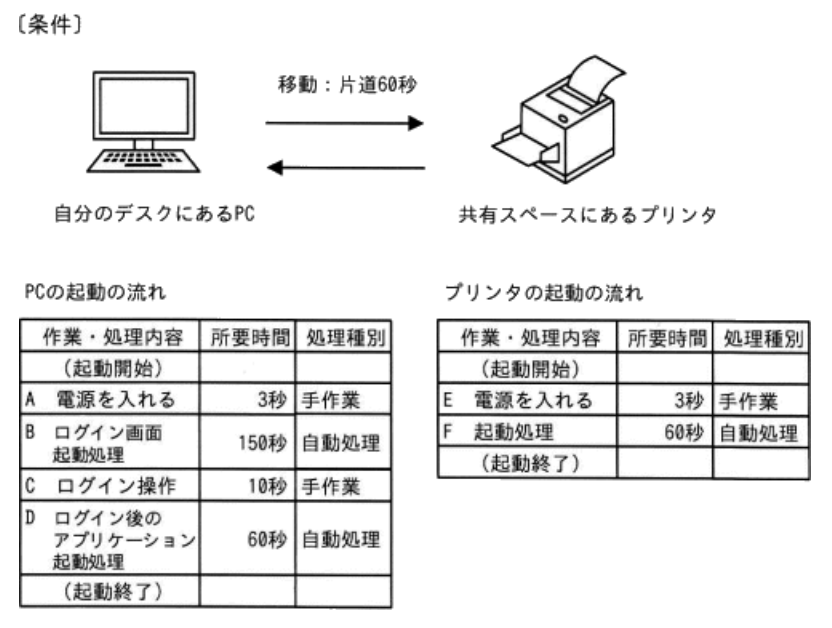
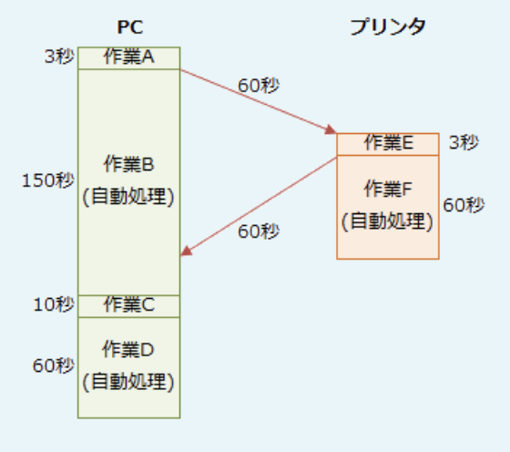

### 令和3年公開問題

### `ストラテジ系`

---
1.E-R図を使用してデータモデリングを行う理由

- A.**顧客や製品といった業務の管理対象間の関係を図示し、その業務上の意味を明らかにする**  
現実世界にどのようなデータが存在し、どのように関連し合って機能しているのかを可視化することで、管理対象の業務上の位置付けを明らかする

- 業務上でのデータのやり取りを把握し、ワークフローを明らかにする  
実体同士の静的な関連を表現したものであり、データの流れは表現できない。ワークフローを把握するには業務フロー図やアクティビティ図、BPMN(*Business Process Model and Notation*)の使用が適している

- 現行業務でのデータの流れを把握し、業務遂行上の問題点を明らかにする  
データを中心に業務の流れを把握するにはDFD(*Data Flow Diagram*)の使用が適している

- データ項目を詳細に検討し、データベースの実装方法を明らかにする  
E-R図等でモデリングされた概念モデルを、具体的にどのDBモデル(関係モデル、階層モデル、ネットワークモデル、NoSQLなど)を使って実現するかということ。E-R図は特定のDBモデルに依存していないので、どの実装方法を用いるかまでを決定するわけではない

---
2.国際標準化機関に関する記述

- A.**ITUは、電気通信分野の国際標準化機関である**  
電気通信技術の国際標準化組織。人々をつなぐための情報通信技術の標準化や、世界的な無線周波数帯域や衛星軌道の割当てを行っている。ITUにより勧告された規格として、電子メール交換のフォーマット(X.400)、デジタル証明書のフォーマット(X.509)および動画圧縮技術(H.264)等がある

- ICANNは、工業や科学技術分野の国際標準化機関である  
IPアドレスの割当て方針の決定、DNSルートサーバの運用監視、DNS管理に関する調整などを世界規模で行う組織。最後の「NN」がName & Number、DNSとIPアドレスを示しています。IPアドレスが世界中で重複しないように管理している団体で、ISPはICANNとの契約によりIPアドレスの使用許可を受けることになっている。工業や科学技術分野の国際標準化はISOの役割

- IECは、電子商取引分野の国際標準化機関である  
電気・電子工学・電子技術に関する分野の規格を国際的に統一することを目的とする標準化団体。策定される標準の一部はISOと共同開発している(ISO/IEC xxxxxという規格名である)。なお、企業間の電子商取引分野の標準化を行っている団体としてはRosetta Net(ロゼッタネット)がある

- IEEEは、会計分野の国際標準化機関である  
アメリカ合衆国に本部を持ち、電気工学・電子工学技術分野における国際的な標準化を行っている専門家組織。無線LAN規格である"IEEE802.11"を含む。会計分野ではIFRS(国際会計基準)を決定しているIASB(国際会計基準審議会)がある

---
3.人間の脳神経の仕組みをモデルにして、コンピュータプログラムで模したものを表す用語

- A.**ニュートラルネットワーク**  
人間や動物の脳神経をコンピュータ上でモデル化したもの。人工知能やディープラーニングなどの機械学習に用いられている

- ソーシャルネットワーク  
人間同士がつながることを目的としてコンピュータネットワーク上に構築された社会的ネットワーク。SNSやLINE、YouTube、広い意味ではQ&Aサイト、電子掲示板なども含まれる

- デジタルトランスフォーメーション  
クラウド、モバイル、AI、IoTなどの新たなデジタル技術を駆使して、生活を便利にしたり、既存のビジネス構造に破壊的な変革をもたらしたりするなどの、新しい価値を生み出すイノベーションのこと

- ブレーンストーミング  
参加者から様々なアイディアを幅広く集めるために、批判の禁止・自由奔放・質より量・結合 / 便乗歓迎というルールに則って行われる討議方法

---
4.エンタープライズリサーチの説明

- A.**企業内の様々なシステムに蓄積されている定型又は非定型なデータを、一元的に検索するための仕組み**

インターネットの検索エンジンを利用するのと同じ感覚で、組織内に点在する大量の資料・データ群から目的のものを見つけるための企業内検索エンジン。導入することで、目的のデータにたどりつくまでの時間短縮や、企業が保有するデータの有効活用が期待できる

- 自然言語処理を実現するための基礎データとなる、電子化された大量の例文データベース  
コーパス(*Corpus*)の説明

- 写真や書類などを光学的に読み取り、デジタルデータ化するための画像入力装置  
スキャナーの説明

- 情報システムや業務プロセスの現状を把握し、あるべき企業の姿とのギャップを埋めるための目標を設定し、全体最適化を図ること  
エンタープライズアーキテクチャの説明

---
5.クラウドコンピューティングの説明

- A.**ソフトウェアやハードウェアなどの各種リソースを、インターネットなどのネットワークを経由して、オンデマンドでスケーラブルに利用すること**

目的のコンピュータ処理を行うために、自社のシステム資源に代えてインターネット上のコンピュータ資源やサービスを利用するシステムの形態。従来の自社運用のシステムは、企業内でハードウェア・ソフトウェア・データを管理していたのに対し、クラウドコンピューティングではサービスを提供する側に設置されているため、「導入までの期間が短縮できる」「システムの維持管理に要するコストが軽減できる」「使用量に応じてシステムを柔軟に拡張できる」などの利点がある

- システム全体を管理する大型汎用機などのコンピュータに、データを一極集中させて処理すること  
集中処理システムの説明

- 情報システム部門以外の人が自らコンピュータを操作し、自分や自部門の業務に役立てること  
EUC(*End User Computing*)の説明

- ネットワークを介して、複数台のコンピュータに処理を分散させ、処理結果を共有すること  
分散処理システムの説明。ネットワークを介して分散処理をする形態はグリッドコンピューティングとも呼ばれる

---
6.インターネットに接続できる機能が搭載されており、車載センサーで計測した情報をサーバへ送信し、そのサーバから運転に関する情報のフィードバックを受けて運転の支援などに活用することができる自動車を表す用語

- A.**コネクテッドカー**  
インターネット接続機能を有し、サーバと情報をやり取りできる自動車

インターネット接続機能を搭載し、ICT端末としての能力を備える自動車。車両の状態や周囲の道路状況などの様々なデータをセンサーにより取得し、ネットワークを介して集積・分析することで、新たな価値を生み出すことが期待されている。事故時に自動的に緊急通報を行うシステムや、走行実績に応じて保険料が変動するテレマティクス保険、盗難時に車両の位置を追跡するシステム等が実用化されつつある

- カーシェアリング  
分単位や時間単位といった短い時間で自動車を借りられるサービス。レンタカーの利用単位は1日や6時間など、ある程度の長時間だが、カーシェアリングはそれよりも短い単位で借りることができ、マイカーのように買い物や送り迎え等の普段使いに使えるという特徴がある

- カーナビゲーションシステム  
自動車の現在位置情報をもとに目的地までの経路案内をするシステム

- 電気自動車  
ガソリンや軽油ではなくバッテリーに蓄えた電気の力で走行する自動車

---
7.著作権法によって保護の対象と成り得るもの

- A.**インターネットに公開されたフリーソフトウェア**
- A.**DBの操作マニュアル**

・プログラム言語  
・規約(プロトコルやインターフェイス)  
・解法(アルゴリズムや論理手順)  
上位以外は著作権法の保護対象。フリーソフトウェアはプログラム著作物(10条1項9号)として、DBの操作マニュアルは言語の著作物(10条1項1号)として、それぞれ著作権法で保護される

- プログラム言語
- プログラムのアルゴリズム

---
8.画期的な製品やサービスが消費者に浸透するに当たり、イノベーションへの関心や活用の時期によって消費者をアーリーアダプタ・アーリーマジョリティ・イノベータ・ラガード・レイトマジョリティの5グループに分類することができる。活用の時期が2番目に早いグループとして位置付けられ、イノベーションの価値を自ら評価し、残る大半の消費者に影響を与えるグループ

- A.**アーリーアダプタ**  
*Early Adopters*:初期採用者。流行に敏感で、情報収集を自ら行い、判断する人。他の消費層への影響力が大きく、オピニオンリーダーとも呼ばれる

早い順から2番目に位置し、発言した意見や感想が顧客の購買行動に重要な影響を与える層はアーリーアダプタ。医薬品業界における著名教授、ファッション業界におけるモデルや芸能人、最近だとYouTuberなどが挙げられる。  
(レイトマジョリティ)  
*Late Majority*:後期追随者。比較的懐疑的な人。周囲の大多数が試している場面を見てから同じ選択をする。フォロワーズとも呼ばれる。  
イノベーションの普及においては、イノベータとアーリーアダプタで構成される初期市場で受け入れられても、アーリーマジョリティ以降で構成されるメイン市場に普及させることは難しいと知られており、キャズム理論では、このアーリーアダプタとアーリーマジョリティの間に存在する乗り越えるのが困難な溝を「キャズム」と読んでいる

- アーリーマジョリティ  
*Early Majority*:前期追随者。比較的慎重派な人。平均より早くに新しいものを取り入れる。ブリッジピープルとも呼ばれる

- イノベータ  
*Innovators*:革新者。冒険心にあふれ、新しいものを進んで採用する人

- ラガード  
*Laggards*:遅滞者。最も保守的な人。流行や世の中の動きに関心が薄い。イノベーションが伝統になるまで採用しない。伝統主義者とも呼ばれる

---
9.不正競争防止法で規制されているもの

- A.**不正な利益を得ようとして、他社の商品名や社名に類似したドメイン名を使用する行為**

不正競争防止法は、事業者間の公正な競争等を確保するため、不正競争の防止および不正競争に係る差止め請求や損害賠償請求について定めた法律。公平さを欠く不当な手段により市場競争をする行為が不当行為として規制されている  
1.周知な表示を使用して混同を生じさせる行為  
2.他人の著名な商品等表示を冒用する行為  
3.他人の商品の形態を模倣した商品を提供する行為  
4.営業秘密の侵害  
5.限定提供データを不正取得する行為  
6.技術的制限手段の無効化装置などの提供行為  
7.ドメイン名の不正取得などの行為  
8.原産地、品質等の誤認を惹起する行為  
9.他人の信用を毀損する行為  
10.代理人などの商標冒用行為

- キャンペーンの応募者の個人情報を、応募者に無断で他の目的のために利用する行為  
個人情報保護法により規制される

- 他人のIDとパスワードを不正に入手し、それらを使用してインターネット経由でコンピュータにアクセスする行為  
不正アクセス禁止法により規制される

---
10.技術ロードマップの説明

- A.**対象とする分野において、実現が期待されている技術を時間軸とともに示したもの**

縦軸に対象の技術・製品・サービス・市場、横軸には時間の経過をとり、それらの要素の将来的な展望や進展目標を時系列で表した図表のこと。技術開発に携わる人々が、技術の将来像について科学的な裏付けのもとに集約した意見をもとに策定され、研究者・技術者にとって、研究開発の指針となる重要な役割を果たす。企業内の目標管理目的で作成するものから、政府が国としてのビジョンを示すために作成するものまで様々ある

- カーナビゲーションシステムなどに用いられている最短経路の探索機能の実現に必要な技術を示したもの
- 業務システムの開発工程で用いるソフトウェア技術の一覧を示したもの
- 情報システム部門の人材が習得すべき技術をキャリアとともに示したもの

---
11.RPA(*Robotic Process Automation*)の特徴

- A.**受注データの入力や更新など、PCで実施する定型的な作業に適している**  
PC上での定型的作業を自動化することができる

- 新しく設計した部品を少ロットで試作するなど、工場での非定型的な作業に適している  
工場の現場部門ではなく、主にバックオフィス(間接部門)で活用する技術。また非定型的な作業は自動化できない

- 同じ設計の部品を大量に製造するなど、工場での定型的な作業に適している  
ハードウェアのロボットを使うわけではないので、物理的な製品組み立て等はできない

- システムエラー発生時に、状況に応じて実行する処理を選択するなど、PCで実施する非定型的な作業に適している  
RPAに適しているのは定型作業。AIを組み合わせたタイプではAIの判断によりある程度イレギュラーな状況にも対応できるが、原則として、状況に応じた判断が伴う非定型作業には不向き

---
12.労働者派遣についての記述で適切なもの

- A.**派遣労働者であった者を、派遣元との雇用期間が終了後、派遣先が雇用してもよい**  
派遣元は、派遣労働者に対し、派遣期間終了後に派遣先に雇用されることを制限してはいけない。派遣期間の終了後に、派遣先がその派遣労働者を雇用しても問題ない

- 派遣契約の種類によらず派遣労働者の選任は派遣先が行う  
紹介予定派遣に該当する場合を除き、派遣先が派遣労働者を選ぶことはできない。派遣先は「派遣労働者の性別や年齢の指定」「履歴書の事前送付」「事前面接の要求」など、派遣労働者を特定することを目的である行為をしないように努めなければならない

- 派遣労働者の給与を派遣先が支払う  
労働者派遣契約では、雇用関係は派遣元と派遣労働者の間にある。派遣労働者の賃金は派遣元が支払う。派遣先から派遣元に派遣料金が支払われ、その中から派遣元が派遣労働者に支払うという流れ

---
13.FinTechの事例

- A.**証券会社において、顧客がPCの画面上で株式売買を行うときに、顧客に合った投資信託を提案したり自動で資産運用を行ったりする、ロボアドバイザのサービスを提供する**

FinTech(フィンテック)は、金融(*Finance*)と技術(*Technology*)を組み合わせた造語で、金融サービスと情報技術の結び付きにより生み出される、様々な革新的な動きを総称した言葉。スマートフォンなどを使った送金もその1つと言える。モバイル決済やロボアドバイザ(AIによる投資助言)、ソーシャルレンディング、ブロックチェーン、アカウントアグリゲーションなどもFinTechの例

- 銀行において、災害や大規模障害が発生した場合に勘定系システムが停止することがないように、障害発生時には即時にバックアップシステムに切り替える  
フォールトトレラントシステムの説明。金融サービスではない

- クレジットカード会社において、消費者がクレジットカードの暗証番号を規定回数連続で間違えて入力した場合に、クレジットカードを利用できなくなるようにする  
ロックアウトの仕組み。金融サービスではない

- 損害保険会社において、事故の内容や回数に基づいた等級を設定しておき、インターネット自動車保険の契約者ごとに、1年間の事故履歴に応じて等級を上下させるとともに、保険料を変更する  
ノンフリート等級制度の説明。以前から存在しており、ICT技術を用いていない

---
14.ソフトウェアライフサイクルを、企画プロセス・要件定義プロセス・開発プロセス・運用プロセスに分けるとき、システム化計画を踏まえて、利用者及び他の利害関係者が必要とするシステムの機能を明確にし、合意を形成するプロセス

- A.**用件定義プロセス**  
利害関係者ニーズの識別と制約事項の定義を行い、新たに構築する業務、システムの仕様、及びIT化の範囲と機能を明確にし、それらをシステム取得者側の利害関係者間で合意する

企画プロセスでシステム化計画が決定された後、要件定義プロセスでは、利害関係者ニーズの識別と制約条件を定義し、それに基づいて業務要件、機能要件、非機能要件など(システムの機能や性能)を決定するという流れになる。運用の後には、保守プロセスもある。運用中のシステム / ソフトウェアに対する変更や機能改善への対応、プログラムの欠陥への対応のためにプログラムの修正を実施する

- 企画プロセス  
経営事業の目的・目標を達成するために必要となるシステムに対する基本方針をまとめ、実施計画を得る

- 開発プロセス  
要求事項をもとに、顧客のニーズに合ったシステム / ソフトウェアを開発する

- 運用プロセス  
当初の目的の環境で、システム / ソフトウェア製品を運用する

---
15.A社の情報システム部門は、B社のソフトウェアパッケージを活用して、営業部門が利用する営業支援システムを構築することにした。構築に合わせて、EUC(*End User Computing*)を推進するとき、業務データの抽出や加工、統計資料の作成などの運用を行う組織として最も適切なもの

- A.**A社の営業部門**  
A社のシステム部門ではEUCを推進したいので、利用部門である営業部門が、自らの目的に合わせてデータの加工や抽出などを行うのが適切

コンピュータを利用して日々の業務を行っている者が、自部門で使用するシステムの構築や運用管理に積極的に携わったり、コンピュータを自主的に操作したりすることにより、自分あるいは部門内の業務に役立てること。利用部門の人が、自らの目的のために表計算ソフトやDBソフトを高度に活用することもEUCの1つ

- A社の情報システム部門
- B社のソフトウェアパッケージ開発部門
- B社のソフトウェアパッケージ導入担当部門

---
16.マーチャンダイジングの説明

- A.**店舗などにおいて、商品やサービスを購入者のニーズに合致するような形態で提供するために行う一連の活動のこと**  

主に店頭において、消費者の求める商品を、適切な数量、適切な価格、適切なタイミング等で提供するための一連の活動を表す言葉。商品の調達、値付け、陳列、販促などがある。マーチャンダイズ(*Merchandise*)は、"商品"や"商品を売買する"という意味の英語

- 消費者のニーズや欲求、購買動機などの基準によって全体市場を幾つかの小さな市場に区分し、標的とする市場を絞り込むこと  
セグメンテーションの説明

- 製品の出庫から販売に至るまでの物の流れを統合的に捉え、物流チャネル全体を効果的に管理すること  
ロジスティクスの説明

- 配送コストの削減と、消費者への接触頻度増加によるエリア密着性向上を狙って、同一エリア内に密度の高い店舗展開を行うこと  
ドミナント戦略の説明

---
17.プロバイダが提供したサービスにおいて発生した事例のうち、プロバイダ責任制限法によって、プロバイダの対応責任の対象となり得るもの

- A.**氏名などの個人情報が電子掲示板に掲載されて、個人の権利が侵害された**  
電子掲示板は不特定多数の人が見ることのできるコンテンツ。個人の氏名・住所等の公開はプライバシー権の侵害行為に該当するため、電子掲示板に個人情報が掲載された場合、プロバイダ等の対応責任の対象となり得る

インターネット上のWebページ、SNS、電子掲示板のように不特定多数の者が閲覧する通信について、その情報を媒介するプロバイダ等の「損害賠償責任の制限」および、それらの通信で権利を侵害された者に与えられる「発信者情報の開示請求権」を定めた法律。この法律でいう「特定電気通信役務提供者」にはプロバイダのほか、電子掲示板の運営者やサーバ管理者も含まれる。  
プロバイダ責任制限法では、情報の流通により他人の権利が侵害されていると知っていて、かつ、送信防止措置が技術的に可能なのに対処をしないプロバイダ等は、当該情報流通により生じた損害を賠償する責を負うとされている。利用者から寄せられた権利侵害情報等で権利侵害を知ったプロバイダ等には、送信防止措置等の対応をする責任があるということ

- 受信した電子メールの添付ファイルによってマルウェアに感染させられた  
刑法のウイルス作成罪に抵触する行為

- 無断で利用者IDとパスワードを使われて、ショッピングサイトにアクセスされた  
不正アクセス禁止法が規制する行為

---
18.戦略目標の達成状況を評価する指標には、目標達成のための手段を評価する先行指標と、目標達成度を評価する結果指標の2つがある。戦略目標が"新規顧客の開拓"であるとき、先行指標として適切なもの

- A.**見込み客訪問件数**

戦略目標の達成状況を評価する指標をKPI(*Key Performance Indicator*)という。目標を達成するための施策や活動の実施状況を測定する「先行指標」と、目標への到達度合いを測定する「結果指標」の2種類がある  
設問では"新規顧客の開拓"が戦略目標となっている。"新規顧客の開拓"を達成するためには、新しい顧客を得るために見込み客に対して営業活動を行う必要がある。新規客の訪問件数を増やし(手段)、結果、新規顧客を獲得する(結果)という関係になるので、先行指標は「見込み客訪問件数」が適切となる。「新規契約獲得率」等は結果指標に当たる

- 売上高増加率
- 新規契約獲得率 => これは結果指標
- 総顧客増加率

---
19.ビッグデータの分析に関する記述

- A.**大量のデータから未知の状況を予測するためには、統計学的な分析手法に加え、機械学習を用いた分析も有効である**  
膨大な量のデータを処理するので、AI等の機械学習を用いた分析も有効。AI等に分析させることで、予想していなかった新たな知見が得られることもある

典型的なデータベースソフトウェアが把握、蓄積、運用し、分析できる能力を超えたサイズのデータを指す言葉で、一般的には数十テラバイトから数ペタバイトのデータがビッグデータとして扱われる。今まではデータ処理ができずに放っておかれていた多種多様なデジタルデータを活用し、事業に役立つ知見を導出する動きがトレンドになっている。  
*Volume*(膨大なデータ量)、*Variety*(データの多様性)、*Velocity*(リアルタイムのデータ生成)の特性があり、1日に何億回も発生するSNSへの投稿、インターネット検索データ、センサーネットワークで取得されるデータなどがある

- テキストデータ以外の、動画や画像、音声データは、分析の対象として扱うことができない  
ビッグデータには多種多様なデータが含まれるので、画像、動画、音声などのマルチメディアコンテンツも分析対象となる

- 電子掲示板のコメントやSNSのメッセージ、Webサイトの検索履歴など、人間の発信する情報だけが、人間の行動を分析することに用いられる  
センサーネットワークから日々得られる情報なども分析対象となる。最新だと新型コロナに伴う人流の分析などもその1つ

- ブログの書き込みのような、分析されることを前提としていないデータについては、分析の目的にかかわらず、対象から除外する  
ブログやSNSの書込み等の非構造化データも分析対象となる

---
20.画像認識システムにおける機械学習の事例

- A.**果物の写真をコンピュータに大量に入力することで、コンピュータ自身が果物の特徴を自動的に抽出することができるようになった**  
大量の学習画像をシステムに与えることで、システムが特徴点を自律的に学習し、完全に同じものでなくても同じものであると認識できるようになる。  
他にも、動物の画像を大量に学習させることで、その動物であるかないかを判別できるようになったり、商品のパンの画像を学習させることで、パン屋で自動レジが可能になったりするなどの活用例がある

- オフィスのドアの解錠に虹彩の画像による認証の仕組みを導入することによって、セキュリティが強化できるようになった  
虹彩認証では、事前に登録した本人の虹彩パターンと入力された虹彩のパターンを、あらかじめ定義されたアルゴリズム(ドーグマンアルゴリズムなど)によって照合する。アルゴリズムによる判定でも十分な精度が出るため、通常、機械学習は利用されていない

- スマートフォンが他人に利用されるのを防止するために、指紋の画像認識でロック解除できるようになった  
指紋認証では、事前に登録した本人の指紋画像と入力された指紋画像を、パターンマッチングやマニューシャ(特徴点)方式によって照合する。アルゴリズムによる判定でも十分な精度が出るため、通常、機械学習は利用されていない

- ヘルプデスクの画面に、システムの使い方についての問合せを文字で入力すると、会話形式で応答を得ることができるようになった  
チャットボットに関する記述。チャットボットには、自然言語処理の機械学習が使用されている

---
21.ABC分析の事例

- A.**自社の商品を、売上高の高い順に3つのグループに分類して分析する**  
パレート図を使って分析する要素・項目群を大きい順に並べ、上位70%を占める要素群をA、70% ~ 90%の要素群をB、それ以外の要素群をCとしてグルーピングする分析手法。全体の中で重点的に管理すべき要素を明らかにすることができる

- 顧客の消費行動を、時代、年齢、世代の3つの観点から分析する  
コーホート分析の事例

- マーケティング環境を、顧客、競合、自社の3つの観点から分析する  
3C分析の事例

- リピート顧客を、最新購買日、購買頻度、購買金額の3つの観点から分析する  
RFM分析の事例

---
22.業務パッケージを活用したシステム化を検討している。情報システムのライフサイクルを、システム化計画プロセス、要件定義プロセス、開発プロセス、保守プロセスに分けたとき、システム化計画プロセスで実施する作業として最も適切なもの

- A.**機能、性能、価格などの観点から業務パッケージを評価する**  
システム化の基本的な方針や前提条件を確認し、システム化の目的、システム化のスケジュール、プロジェクト推進体制などを取りまとめる

業務パッケージの導入に際しては、現行の業務モデルとパッケージが前提とする業務モデルの適合度を測るフィット & ギャップ分析が必要不可欠。適合しない要件や仕様については、カスタマイズ等で実現の方針を検討したり、業務をパッケージに合わせたりすることになるので、システム化に踏み切る前に候補となるパッケージ製品を評価し、自社で採用できるかどうかを検討しなければならない。これはシステムの企画段階で行うべき作業であり、設問のプロセスの中だと「システム化計画プロセス」で実施すべき作業に当たる

- 業務パッケージの標準機能だけでは実現できないので、追加開発が必要なシステム機能の範囲を決定する  
用件定義プロセスで実施する作業。開発するシステムに必要な機能や性能および制約条件を洗い出し、利害関係者と合意する

- システム運用において発生した障害に関する分析、対応を行う  
保守プロセスで実施する作業。リリース後のシステムを修正したり改善したりする。要件定義プロセスで合意した要件を満たすシステムを設計、開発、テストする

- システム機能を実現するために必要なパラメータを業務パッケージに設定する  
開発プロセスで実施する作業

---
23.プロダクトポートフォリオマネジメントは、企業の経営資源を最適配分するために使用する手法であり、製品やサービスの市場成長率と市場におけるシェアから、その戦略的な位置付けを4つの領域に分類する。市場シェアは低いが急成長市場にあり、将来の成長のために多くの資金投入が必要となる領域

- A.**問題児**  
成長率は高いが占有率は低いので、花形製品とするためには多額の投資が必要になる。投資が失敗し、そのまま成長率が下がれば負け犬になってしまうため、慎重な対応を必要とする分野

PPMは、縦軸と横軸に「市場成長率」と「市場占有率」を設定したマトリックス図を4つの象限に区分し、製品の市場における位置付けを分析して資源配分を検討する手法

- 金のなる木  
市場の成長がないため追加の投資が必要ではなく、市場占有率の高さから安定した資金・利益の流入が見込める分野

- 花形  
占有率・成長率ともに高く、資金の流入も大きいが、成長に伴い占有率の維持には多額の資金の投入を必要とする分野

- 負け犬  
成長率・占有率がともに低く、新たな投資による利益の増加も見込めないため市場からの撤退を検討するべき分野

---
24.テレワークに関する記述

- A.**ITを活用した、場所や時間にとらわれない柔軟な働き方のこと**  

ICT（情報通信技術）を活用した、場所や時間にとらわれない柔軟な働き方のこと。形態として、在宅勤務、モバイルワーク、サテライトオフィス勤務およびSOHO（*Small Office* / *Home Office*）などがある。テレ(*tele*)は遠隔という意味がある。  
通勤時間短縮、業務効率化、遠隔地の優秀な人材の確保、オフィスコストの削減、ワークライフバランスの向上といったメリットがある一方、仕事とそれ以外の切り分けが困難、長期間労働、対面のコミュニケーションの不足、労働時間・進捗・評価・情報セキュリティ等の管理などの課題がある

- ある業務に対して従来割り当てていた人数を増員し、業務を細分化して配分すること  
ワークシェアリングの説明

- 個人が所有するPCやスマートデバイスなどの機器を、会社が許可を与えた上でオフィスでの業務に利用させること  
BYOD(*Bring Your Own Device*)の説明

- 仕事の時間と私生活の時間の調和に取り組むこと  
ワークライフバランスの説明

---
25.暗号資産に関する記述

- A.**暗号資産の利用者は、暗号資産交換業者から契約の内容などの説明を受け、取引内容やリスク、手数料などについて把握しておくとよい**  
暗号資産交換業者は顧客に対し、取引の概要、手数料や報酬、元本欠損のおそれ、法定通貨でないこと、暗号資産の特性、相手がいない場合には換金できないことなどの重要な事項を告げることになっている。利用者はこれらの説明を受け、暗号資産に関するリスク等の把握に努めるべき

いわゆる仮想通貨と呼ばれる物理的な実体のないデジタル通貨のこと。ブロックチェーンという分散型台帳技術を基盤にして開発された。暗号資産はインターネットの取引所を通じて他者および法定通貨と交換でき、店舗によっては決済手段として利用できる所もある。  
国が発行し価値を保証する法定通貨とは異なり、暗号資産には中央銀行的な管理主体が存在しないので価値に関して何の保証もない。トラブルも多いので取引をする際にはその点を十分に理解して自己責任で行う必要がある

- 暗号資産交換業の登録業者であっても、利用者の情報管理が不適切なケースがあるので、登録が無くても信頼できる業者を選ぶ  
内閣総理大臣の登録を受けた暗号資産交換業者でなければ行ってはならない。登録を受けていない業者は違法業者。暗号資産交換業者には、資金決済法に基づき情報の安全管理措置が義務付けられており、違法業者はこれらを行っていない可能性が高いので危険

- 暗号資産の価格変動には制限が設けられているので、価値が急落したり、突然無価値になるリスクは考えなくてよい  
暗号資産取引には株式のようにストップ高、ストップ安という値幅制限がない。実体的な価値がないので、価格が急落したり突然無価値になったりするリスクがある

- 金融庁や財務局などの官公署は、安全性が優れた暗号資産の情報提供を行っているので、官公署の職員から勧められた暗号資産を主に取引する  
官公署が暗号資産に関するトラブルについて注意喚起を行うことはあっても、暗号資産取引を勧めることはない。もし見かけたら詐欺

---
26.企業の人事機能の向上や、働き方改革を実現することなどを目的として、人事評価や人材採用などの人事関連業務に、AIやIoTといったITを活用する手法を表す用語

- A.**HRTech**  
人事管理にAIやIoTなど新しいICT技術を活用する手法

HR(*Human Resource* = 人事) × *Tech*(テクノロジー)を組み合わせた造語で、人的資源の管理にICT技術を活用しようとする活動やサービスの総称。HRテックの分野を大きく分けると、人事管理、人材開発、労務管理、福利厚生などの機能を提供する「人事・組織システム」と、求人やロボット・AIなど機能を提供する「労働力の獲得サービス」がある

- eラーニング  
実際に教室に通う、書籍を読むといった従来の学習方法ではなく、PCやモバイル機器を用いて講義を視聴したり問題を解いたりするなど、ICT技術を活用して行う学習や教育方法の総称

- FinTech  
金融(*Finance*)と技術(*Technology*)を組み合わせた造語で、金融サービスと情報技術を結びつけたさまざまな革新的な動きのこと

- コンピテンシー  
ビジネスにおいて高い業績を上げる人材の思考傾向や行動特性のこと

---
27.BYODの事例

- A.**私物のスマートフォンから会社のサーバにアクセスして、電子メールやスケジューラーを利用することができるようにした**  
従業員が個人的に所有するPCやスマートフォンなどの情報端末を組織の許可を得た上で職場に持ち込み、それを業務に使用すること。情報機器の調達コストの削減ができる一方、情報漏洩やウイルス感染などのセキュリティリスクは大きくなる

- 大手通信事業者から回線の卸売を受け、自社ブランドの通信サービスを開始した  
MVNO(仮想移動体通信事業者)の事例

- ゴーグルを通してあたかも現実のような映像を見せることで、ゲーム世界の臨場感を高めた  
VR(*Virtual Reality*:仮想現実)の事例

- 図書館の本にICタグを付け、簡単に蔵書の管理ができるようにした  
RFIDの事例

---
28.当期末損益計算資料から求められる経常利益

|                |     |
|----------------|-----|
|売上高           |3,000|
|売上原価          |1,500|
|販売費及び一般管理費|500  |
|営業外費用        |15   |
|特別損失          |300  |
|法人税            |300  |

- A.**985(百万円)**  
企業の普段の利益を表す指標で、営業利益に営業外損益を加算して求める  
経常利益 = 営業利益 + 業外収益 - 営業外費用  
営業利益は「売上総利益 - 販売費及び - 般管理費」、売上総利益は「売上高 - 売上原価」で求めるので、経常利益は以下の手順で求める  
売上総利益 = 3,000 - 1,500 = 1,500  
営業利益 = 1,500 - 500 = 1,000  
経常利益 = 1,000 - 15 = 985

---
29.粗利益を求める計算式

- A.**(売上高) - (売上原価)**

- (営業利益) + (営業外収益) - (営業外費用)  
経常利益を求める計算式

- (経常利益) + (特別利益) - (特別損失)  
税引前当期純利益を求める計算式

- (税引前当期純利益) - (法人税、住民税及び事業税)  
(税引後)当期純利益を求める計算式

---
30.情報の取扱いに関する不適切な行為不正アクセス禁止法で定められている禁止行為に該当するもの

- A.**オフィス内で拾った手帳に記載されていた他人の利用者IDとパスワードを無断で使って、自社のサーバにネットワークを介してログインし、格納されていた人事評価情報を閲覧した**  
ネットワークを介してアクセスし、他人のIDとパスワードを使って、制限されている情報にアクセスしたので不正アクセス行為に該当する

不正アクセス禁止法は、不正アクセス行為やそれを助長する行為を禁止する法律。不正アクセス行為とは、「アクセス制御機能を有するコンピュータに」「ネットワークを通じてアクセスし」「本人や管理者の承諾なく他人の認証情報を入力し」「アクセス制御によって制限されている機能を利用可能にする」という4つの要件を満たすもの

- 同僚が席を離れたときに、同僚のPCの画面に表示されていた、自分にはアクセスする権限のない人事評価情報を閲覧した  
他人のID・パスワードを使って利用可能にしたわけではなく、閲覧したのが他人の認証情報ということでもないので、不正アクセス行為には該当しない

- 部門の保管庫に保管されていた人事評価情報が入ったUSBメモリを上司に無断で持ち出し、自分のPCで人事評価情報を閲覧した  
USBメモリはネットワークに接続されておらず、またアクセス制御がされていないので不正アクセス行為には該当しない。社内データの持ち出しは刑法の窃盗罪に当たることがある

---
31.APIエコノミーに関する記述

- A.**インターネットを通じて、様々な事業者が提供するサービスを連携させて、より付加価値の高いサービスを提供する仕組み**  
Webサービスを運営する企業によって提供され、インターネット経由でそのWebサービスの機能にアクセスできる接続仕様のこと。Yahoo!APIや、TwitterAPI、GoogleマップAPI、AmazonAPIなど

APIエコノミー(API経済圏)は、これらの他社から提供されるWeb APIを連携・活用してサービスや価値を創出する経済の仕組みのこと。APIの利用側としては自社で同じ機能を開発をすることなく利用できるメリットがあり、APIを公開する側にはサービス使用に伴う課金で収益を得るほか、単純に自社サービスの広まりによりユーザー数が増加することがメリットとなる

- 著作権者がインターネットなどを通じて、ソフトウェアのソースコードを無料公開する仕組み  
オープンソースソフトウェアの説明

- 定型的な事務作業などを、ソフトウェアロボットを活用して効率化する仕組み  
RPA(*Robotic Process Automation*)の説明

- 複数のシステムで取引履歴を分散管理する仕組み  
ブロックチェーンの説明

---
32.サイバーセキュリティ基本法に規定されているもの

- A.**サイバーセキュリティに関して、国や地方公共団体が果たすべき責務**  
国は、基本理念にのっとり、サイバーセキュリティに関する総合的な施策を策定し、及び実施する責務を有する(4条)、地方公共団体は、基本理念にのっとり、国との適切な役割分担を踏まえて、サイバーセキュリティに関する自主的な施策を策定し、及び実施する責務を有する(5条)と規定されている

- A.**サイバーセキュリティに関して、国民が努力すべきこと**  
国民は、基本理念にのっとり、サイバーセキュリティの重要性に関する関心と理解を深め、サイバーセキュリティの確保に必要な注意を払うよう努めるものとする（9条）としており、サイバーセキュリティの確保についての努力義務が規定

- A.**サイバーセキュリティに関する施策の推進についての基本理念**  
サイバーセキュリティに対する脅威に対して、国、地方公共団体、重要社会基盤事業者等の多用な主体の連携により対応する等、6つの基本理念が規定されています(3条)

---
33.コンピュータシステム開発の外部への発注において、発注金額の確定後に請負契約を締結した。契約後、支払までに発注側と受注側の間で交わされる書類の組合せのうち、適切なものはどれか。契約内容の変更はないものとする

- A.**納品書、検収書、請求書**  
請負契約をした後なので契約締結前に発行される提案書と見積書は対象外。  
請負契約が成立すると、受注側はシステム完成に向けて作業を開始する。その後、受注側は完成したシステムを発注側に納品する。このときに発行されるのが納品書。  
発注側は納品されたシステムを検収し、検収でOKが出れば受注側に**検収書**を発行します。検収とは、システム開発を発注した側(ユーザ)が、要求した機能や性能を満たしているかを検証し、納品の可否を判断する工程。  
検収にてOKをもらった受注側は、システム開発の請負代金を発注側に請求する。このときに発行されるのが**請求書**

---
34.SCMの導入による業務改善の事例

- A.**ネットワークを利用して売上情報を製造元に伝達するようにしたので、製造元が製品をタイムリーに生産し、供給できるようになった**  
売上情報を踏まえて製造元が適時に生産していくことで、欠品や余剰在庫の減少効果が望める

SCM(*Supply Chain Management*)は、生産・在庫・購買・販売・物流などのすべての情報をリアルタイムに共有し、一元管理することによって、生産から販売に至る一連の流れ全体(サプライチェーン)の効率を大幅に向上させることを目指す経営手法。SCMシステムの導入により**納期短縮や在庫削減**といった効果が期待できる

- インターネットで商品を購入できるようにしたので、販売チャネルの拡大による売上増が見込めるようになった  
オムニチャネルの事例

- 営業担当者がもっている営業情報や営業ノウハウをデータベースで管理するようにしたので、それらを営業部門全体で共有できるようになった  
SFA(*Sales Force Automation*)の導入事例

- 販売店の売上データを本部のサーバに集めるようにしたので、年齢別や性別の販売トレンドの分析ができるようになった  
POS(*Point Of Sales*)の導入事例

---
35.ある製造業では、後工程から前工程への生産指示や、前工程から後工程への部品を引き渡す際の納品書として、部品の品番などを記録した電子式タグを用いる生産方式を採用している。サプライチェーンや内製におけるジャストインタイム生産方式の1つであるこのような生産方式

- A.**かんばん方式**  
工程間の中間在庫の最少化を目的として"かんばん"と呼ばれる生産指示票を使う生産システムで、ジャストインタイム生産方式を実現するために重要な役割を果たす要素

前工程がムダに部品を多く造り、後工程に貯めてしまうという、それまでの非効率な生産性を改善するため、かんばん方式では後工程の部品数が一定数以下になった時点で後工程が前工程から必要分を引き取り、前工程は引き取られた分だけを補充するという「後工程引き取り方式」で生産を行う

- クラフト生産方式  
熟練した職人が手間をかけて全部または一部の工程を手工業で生産する方式(高級時計の製造過程のような想像)

- セル生産方式  
1人または少数の作業者チームで製品の全組立て工程(および製品検査)を行う形態(多品種少量の生産に適している)

- 見込み生産方式  
生産開始時の需要予測に基づき、見込み数量を生産する方式

### `マネジメント系`

---
36.開発期間10か月、開発の人件費予算1,000万円のプロジェクトがある。5か月経過した時点で、人件費の実績は600万円であり、成果物は全体の40%が完成していた。このままの生産性で完成まで開発を続けると、人件費の予算超過はいくらになるか

- A.**500万円**  
進捗率40%で600万円かかっているため、そのまま100%まで継続すると、600 / 0.4 = 1,500万円

---
37.システムの利用者数が当初の想定よりも増えてシステムのレスポンスが悪化したので、増強のためにサーバを1台追加することにした。動作テストが終わったサーバをシステムに組み入れて稼働させた。この作業を実施するITサービスマネジメントのプロセス

- A.**リリース及び展開管理**  
変更管理プロセスで承認された変更作業について、実際のサービス提供システムへの変更作業を行う

- インシデント管理  
システムの異常終了や構成機器の障害発生などのようにサービスの中断やサービス品質の低下につながるような事象が発生した時に、サービスの中断時間を最小限に抑えて速やかに回復することを目指す

- 変更管理  
変更作業にともなうリスクを管理し、リスクとメリットを考慮してリリースを実施するかどうかの評価を行う

- 問題管理  
インシデントの発生原因を究明し、特定した原因についての恒久的な対策を提示する

---
38.システム監査の手順

- A.システム監査は、**監査計画**に基づき**予備調査、本調査、評価・結論**の手順によって実施しなければならない  
結合テスト、システムテスト、運用テスト => システム開発におけるテスト工程の進め方

情報システムの信頼性・安全性・効率性などの向上のために、客観的な立場であるシステム監査人が情報システムを総合的に評価し、助言・勧告・改善活動のフォローアップまでを行う。  
個別の監査計画に基づき、「予備調査、本調査、評価・結論」の手順で実施するとされている。システム監査基準(平成30年)においても、「監査計画策定、予備調査、本調査、監査調書の作成、監査報告書の提出、フォローアップ」の順で進めるとされている。予備調査は、「監査対象部門や関連部門に照会を行うなどして監査対象の実態を把握するためのプロセス」、本調査は、「監査の結論を裏付けるための監査証拠を入手するプロセス」

---
39.プロジェクトマネジメントのプロセスには、プロジェクトコストマネジメント・プロジェクトコミュニケーションマネジメント・プロジェクト資源マネジメント・プロジェクトスケジュールマネジメントなどがある。システム開発プロジェクトにおいて、テストを実施するメンバを追加するときのプロジェクトコストマネジメントの活動として最も適切なもの

- A.**新規に参加するメンバの人件費を見積もり、その計画を変更する**

プロジェクトのコストを見積り、当初の予算と進捗状況から費用が予算内に収まるように管理を行うプロセス。コストはプロジェクトを実施するのにかかる費用なので、人件費を見積もって計画(予算)を変更する活動が該当する

- 新規に参加するメンバに対して情報が効率的に伝達されるように、メーリングリストなどを更新する  
プロジェクトコミュニケーションマネジメントの活動

- 新規に参加するメンバに対する、テストツールのトレーニングをベンダーに依頼する  
プロジェクト資源マネジメントの活動

- 新規に参加するメンバに担当させる作業を追加して、スケジュールを変更する  
プロジェクトスケジュールマネジメントの活動

---
40.同一難易度の複数のプログラムから成るソフトウェアのテスト工程での品質管理において、各プログラムの単位ステップ数当たりのバグ数をグラフ化し、上限・下限の限界線を超えるものを異常なプログラムとして検出したい。作成する図として最も適切なもの

- A.**管理図**  
工程の状態や品質を時系列に表した図のことで、工程が安定した状態にあるかどうかを判断するために用いる。日ごとに不良品の個数を記録し、統計的に求めた上方管理限界と下方管理限界を超えた位置に値が記録された場合には、その日に何らかの異常が発生していることが分かる

- 特性要因図  
現れた特性(結果)とそれに影響を及ぼしたと思われる要因の関係を体系的に表わした図。多くの要因が複雑に絡みあっているときに、直接的な原因と間接的な原因に分別したり、真の問題点を明らかにしたりすることができる

- パレート図  
値の大きい順に分析対象の項目を並べた棒グラフと、累積構成比を表す折れ線グラフを組み合わせた複合グラフで、主に複数の分析対象の中から、重要な要素を識別するために使用される

- レーダチャート  
複数項目の基準値に対する比率をプロットし、各点を線で結んだ形状によって、全体のバランスを比較するのに適した図。各項目は円状または正多角形状に配置されるので、クモの巣グラフとも呼ばれる

---
41.クラスや継承という概念を利用して、ソフトウェアを部品化したり再利用することで、ソフトウェア開発の生産性向上を図る手法

- A.**オブジェクト指向**  
データと処理をまとめたクラスを定義して、ソフトウェア開発の生産性や保守性の向上を図る手法

多くの仕様に共通する機能を"クラス"という単位でひとまとめにしておき、他の開発プロジェクトで再利用可能にする設計方法。既にあるクラスと似たクラスを作る場合には1から作るのではなく、親となる既存クラスを"継承"した子クラスを作成し、親クラスと挙動が異なる部分だけを記述すれば済むので、生産性が向上する。  
仮に、犬クラスと猫クラスを作りたいとき、犬クラスと猫クラスそれぞれを作るのではなく、犬と猫に共通の部分を定義したクラス(例えば動物クラス)を作成し、犬クラスおよび猫クラスは動物クラスを"継承"して作るというイメージ。動物が持つ属性や操作が共通化され、後から鳥クラスを作るときにも動物クラスを再利用できる

- 構造化  
コンピュータのプログラム上の手続きをいくつかの単位に分け、段階的に詳細化した構造で記述すること

- プロセス中心アプローチ  
業務の処理手順に着目して、システム分析を実施する手法

- プロトタイピング  
システム開発プロセスの早い段階でシステムの試作品をつくり、利用者にそのイメージを理解させ、承認を得ながら開発を進めていく開発モデル

---
42.システム開発プロジェクトにおいて、利用者から出た要望に対応するため、プログラムを追加で作成することになった。このプログラムを作成するため、先行するプログラムの作成を終えたプログラマを割り当てることにした。そして、結合テストの開始予定日までに全てのプログラムが作成できるようにスケジュールを変更し、新たな計画をプロジェクト内に周知した。このように変更要求をマネジメントする活動

- A.**プロジェクト統合マネジメント**  
プロジェクトのすべての変更要求は、プロジェクト統合マネジメントが受け付け管理を行う

プロジェクトマネジメント活動で生じる様々なプロセスグループを全体的な視点から相互に管理・調整することを目的とする活動で、「統合変更管理」というプロセスを持つ。プロジェクトマネジメントのプロセスは、スコープ、コスト、スケジュールなどのいくつかの活動に分かれるが、あらゆるプロセスで生じた変更要求は、プロジェクト統合マネジメントの統合変更管理プロセスで内容を審議した後、承認または却下が決定される

- プロジェクト資源マネジメント  
プロジェクトを遂行するために必要な物的およびチーム資源を見積り、獲得し、管理する活動

- プロジェクトスコープマネジメント  
プロジェクトの実施範囲(スコープ)を定義し、成果物単位でプロジェクト全体を階層的に要素分解したWBSの作成などを行う管理活動

- プロジェクトスケジュールマネジメント  
プロジェクトのスケジュールの計画、策定、実行、管理をする活動

---
43.A社で新規にシステムを開発するプロジェクトにおいて、システムの開発をシステム要件定義、設計、プログラミング、結合テスト、総合テスト、運用テストの順に行う。A社は、外部ベンダーのB社と設計、プログラミング及び結合テストを委託範囲とする請負契約を結んだ。A社が実施する受入れ検収はどの工程とどの工程の間で実施するのが適切か

- A.**結合テストと総合テストの間**

受入れ検収は、開発を外部委託した場合において、発注先から成果物が納品される際に成果物の品質を検証する工程。発注元が作成したテスト計画や合否判断をもとに発注元の主導で行われ、成果物が要求事項を満たしているかどうかを確認する。  
A社は、B社に"設計、プログラミング、結合テスト"を委託しているので、結合テストが終わった段階でB社からA社に納品が行われる。A社はこのタイミングで受入れ検収をすることになる

---
44.ITサービスマネジメントにおいて、サービスデスクが受け付けた難度の高いインシデントを解決するために、サービスデスクの担当者が専門技術をもつ二次サポートに解決を委ねること

- A.**エスカレーション**  
サービスデスク(ヘルプデスク)において、システム利用者からの問合せに対して担当者が対処できない場合に、より対処能力に優れた上位の組織や担当者または管理者などに依頼して対応を引き継ぐこと

- FAQ(*Frequently Asked Questions*)  
何回も繰り返し質問される項目とその質問への回答をまとめたもの。頻繁に問合せがある内容をその解決策とともに利用者に提示することで、利用者が既知の問題を自分で解決できるようになり、サポートへの問合せ回数や問題解決までの時間を削減することができる

- SLA(*Service Level Agreement*)  
サービス提供者とサービス利用者の間でサービスの品目や品質に関して結ぶ契約のこと

- ワークアラウンド  
インシデント発生時の応急処置的な回復策。完全な解決策がまだ存在しないインシデントや問題の悪影響を低減または排除するためインシデントごとに策定される

---
45.ITIL(*Information Technology Infrastructure Library*)に関する記述

- A.**ITサービスの提供とサポートに対して、ベストプラクティスを提供している**

ITサービスを適切に運用管理するためのベストプラクティス(成功事例)を包括的にまとめたフレームワーク。ITサービスマネジメントの分野で広く支持され、業界標準の教科書的な位置付けになる。英国商務省(OGC：*Office Of Government Commerce*)によって作成されている

- ITシステム開発とその取引の適正化に向けて、作業項目を1つ1つ定義し、標準化している  
共通フレームの説明

- ソフトウェア開発組織の成熟度を多段階のレベルで定義している  
CMMI(*Capability Maturity Model Integration*:統合能力成熟度モデル)の説明

- プロジェクトマネジメントの知識を体系化している  
PMBOKの説明

---
46.システム要件定義で明確にするもののうち、性能に関する要件

- A.**照会機能の応答時間**

システム化の目的を達成するために必要となるシステムの能力。単位時間当たりの処理数(スループット)、レスポンスタイムやターンアラウンドタイム、同時接続ユーザー数、ピーク時間帯の資源利用率などの項目がある

- 業務要件を実現するシステムの機能  
機能に関する要件

- システムの稼働率  
可用性に関する要件

- 障害の復旧時間  
回復性や信頼性に関する要件

---
47.システム開発プロジェクトにおいて、成果物として定義された画面・帳票の一覧と、実際に作成された画面・帳票の数を比較して、開発中に生じた差異とその理由を確認するプロジェクトマネジメントの活動

- A.**プロジェクトスコープマネジメント**  
プロジェクトの実施範囲(スコープ)を定義し、成果物単位でプロジェクト全体を階層的に要素分解したWBSの作成などを行う管理プロセス。プロジェクトの遂行に必要な作業を過不足なく洗い出すことを目的とする。プロジェクトの実施中、予定と実績を比較し成果物が過不足なく作成されたかどうかを確認する作業(差異分析)で、スコープマネジメントの活動に該当する

- プロジェクト資源マネジメント  
プロジェクトを遂行するために必要な物的およびチーム資源を見積り、獲得し、管理する活動

- プロジェクト調達マネジメント  
プロジェクトに必要な資機材やサービスの外部調達に関する管理活動

- プロジェクト品質マネジメント  
プロジェクト作業に係る各プロセスの品質および成果物の品質を保ち、定められた品質基準を達成するための管理活動

---
48.既存のプログラムを外側から見たソフトウェアの動きを変えずに内部構造を改善する活動

- A.**リファクタリング**  
外部から見たときの振る舞いを変えずに、既存ソフトウェアの内部構造を変えることをいう。完成済のプログラムを改善し、高効率化や保守性の向上を図ることを目的として行われる。  
アルゴリズムを見直して処理効率を向上させる、プログラム内で複数行われる共通処理を関数化して保守性を向上させる、変数名の改善やコメントの追加などで可読性を良くする、などがリファクタリングの例

- テスト駆動開発  
求める機能を明確化するために、プログラムを記述するよりも前にテストケースを作成する開発手法。テストをパスする最低限の実装を行った後で、機能を維持したままコードを洗練していくという手順で開発を進める

- ペアプログラミング  
2人1組で1つのプログラムの実装を行い、1人が実際のコードをコンピュータに打ち込み、もう1人はそれをチェックしながら補佐するという役割を随時交代しながら作業を進めていく手法

- リバースエンジニアリング  
既存ソフトウェアの動作を解析するなどして、製品の構造を分析し、そこから製造方法や動作原理、設計図、ソースコードなどを調査する技法

---
49.ITガバナンスに関する記述

- A.**経営者**は、現在及び将来のITの利用についての評価とIT利用が事業の目的に合致することを確実にする役割がある

経営陣がステークホルダのニーズに基づき、組織の価値を高めるために実践する行動であり、情報システムのあるべき姿を示す情報システム戦略の策定及び実現に必要となる組織能力。ITを用いた企業統治という意味がある。ITガバナンスの構築と推進は経営者の責務であり、経営目標を達成するための情報システム戦略の策定、組織規模でのIT利活用の推進などがITガバナンスの活動に該当する。  
経営者の職務3つ:  
1.現在及び将来のIT利用について評価する  
2.IT利用が事業の目的を合致することを確実にするために計画及び方針の準備及び実施を指示する  
3.方針への適合及び計画の実績をモニターする

---
50.自分のデスクにあるPCと共有スペースにあるプリンターの起動を1人で行う。PCとプリンターの起動は図の条件で行い、それぞれの作業・処理は逐次実行する必要がある。自動処理の間は、移動やもう片方の作業を並行して行うことができる。自分のデスクにいる状態でPCの起動を開始し、移動してプリンターを起動した上で自分のデスクに戻り、PCの起動を終了するまでに必要な最短の時間

- A.**223**

PCのログイン画面起動の自動処理のタイミングでプリンタの起動を行う。  
PCの電源を入れる(3s)  
ログイン画面起動処置(150s)  
この間に、  
プリンタに移動(~~60s~~)  
プリンタの電源を入れて起動(~~3s~~)  
PCに戻る(~~60s~~)  
PCのログイン操作(10s)  
PCのアプリケーション起動処理(60s)  
要する時間を合算すると「3 + 150 + 10 + 60 = 223s」

---
51.アジャイル開発を実施している事例

- A.**分析システムの開発において、分析の精度の向上を図るために、固定された短期間のサイクルを繰り返しながら分析プログラムの機能を順次追加する**  
短期間のサイクルを繰り返して機能を順次追加していくのが特徴

「俊敏な」「すばやい」という意味の英単語で、顧客の要求に応じて、迅速かつ適応的にソフトウェア開発を行う軽量な開発手法の総称。変化する顧客ニーズに対応するため、要件定義、設計、開発、テスト、リリースのサイクルを1カ月以内の短期間で繰り返しながら、徐々にシステムの完成度を高めていくのが特徴の開発モデル。有名なフレームワークとして、スクラム、XP(エクストリームプログラミング)がある

- AIシステムの予測精度を検証するために、開発に着手する前にトライアルを行い、有効なアルゴリズムを選択する  
PoC(*Proof of Concept*:概念検証)の事例

- IoTの様々な技術を幅広く採用したいので、技術を保有するベンダーに開発を委託する  
アウトソーシングの事例

- IoTを採用した大規模システムの開発を、上流から下流までの各工程における完了の承認を行いながら順番に進める  
ウォーターフォール開発の事例。全体計画の立てやすさや進捗管理のしやすさから大規模開発に向いている

---
52.自社の情報システムに関して、BCP(事業継続計画)に基づいて、マネジメントの視点から行う活動

- A.**重要データのバックアップを定期的に取得する**  
災害等により重要データが失われてしまうと業務の復旧ができない。よって、定期的にバックアップを取得しておく必要がある

- A.**非常時用の発電機と燃料を確保する**  
災害や落雷による停電で情報システムが動かなくなるおそれがある。停電時でも業務を継続できるようにするには、自家発電するための発電機と燃料を備えておく必要がある

- A.**複数の通信網を確保する**  
インターネット回線やLAN構成機器に障害が発生すると、情報システムによるサービスが停止してしまう。複数の回線を用意しておくことは業務継続への備えとなる

- A.**復旧手順の訓練を実施する**  
実際の有事の際にBCPどおりに動けるように、定期的に復旧訓練を行うことが有効

---
53.ITサービスにおけるSLMに関する説明

- A.**SLMでは，SLAで合意した定量的な目標の達成状況を確認するために，サービスの提供状況のモニタリングやレビューを行う**  
サービス提供状況を監視し、レビューし、目標値に対してどの程度達成できたかを定期的に報告することもSLMの活動

SLA(サービスレベル合意書)に基づき、顧客要件を満たすITサービスの提供を実現し、その品質の継続的な改善に必要なプロセスを構築するための管理活動。サービスレベルの維持・管理を行うために「モニタリング」「レポーティング」「レビュー」「改善」というPDCAサイクルを繰り返す

- SLMでは、SLAで合意したサービスレベルを維持することが最優先課題となるので、サービスの品質の改善は補助的な活動となる  
SLAのサービスレベルを維持することはもちろん大事だが、サービスレベルのさらなる向上もSLMの主要な活動の1つ

- SLMの目的は、顧客とサービスの内容、要求水準などの共通認識を得ることであり、SLAの作成が活動の最終目的である  
顧客と合意したSLAを維持し、サービス品質を改善するのが目的。作成することが最終目的ではない

- SLMを効果的な活動にするために、SLAで合意するサービスレベルを容易に達成できるレベルにしておくことが重要である  
サービスレベルは業務達成目標に基づいて定義する。達成できるかどうかでレベルを設定するのは不適切

---
54.WBSを作成するときに、作業の記述や完了基準などを記述した補助文書を作成する。この文書の目的として

- A.**WBSで定義した作業の内容と意味を明確に定義する**

プロジェクト目標を達成し、必要な成果物を過不足なく作成するために、プロジェクトチームが実行すべき作業を、成果物を主体に階層的に要素分解したもの。WBSは成果物や作業名だけが列挙された図なので、個々の作業の内容までは表現できない。このためWBSの構成要素に関する作業内容等を記述し、WBSを補完する文書が必要となる。この文書は一般的に「WBS辞書」と呼ばれ、各構成要素毎に以下の内容が記述される。  
・識別コード  
・成果物の詳細や作業内容  
・前提条件と制約条件  
・担当組織  
・受入基準

- WBSで定義した作業で使用するデータの意味を明確に定義する
- WBSで定義した作業の進捗を管理する
- WBSで定義した作業のスケジュールのクリティカルパスを求める
