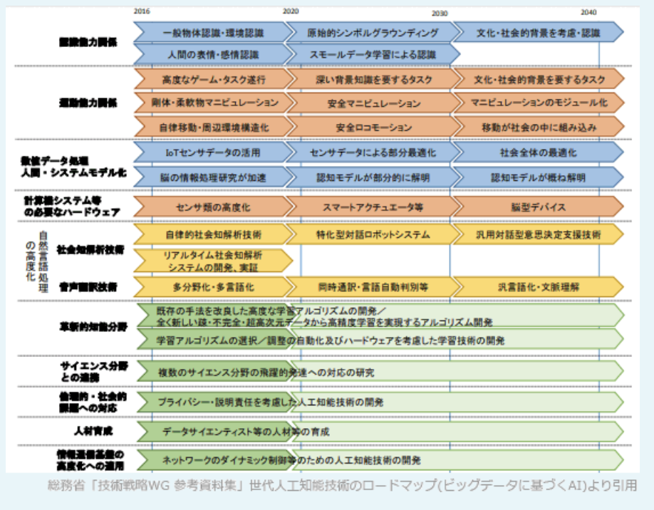

### 令和3年公開問題

### `ストラテジ系`

---
1.E-R図を使用してデータモデリングを行う理由

- A.**顧客や製品といった業務の管理対象間の関係を図示し、その業務上の意味を明らかにする**  
現実世界にどのようなデータが存在し、どのように関連し合って機能しているのかを可視化することで、管理対象の業務上の位置付けを明らかする

- 業務上でのデータのやり取りを把握し、ワークフローを明らかにする  
実体同士の静的な関連を表現したものであり、データの流れは表現できない。ワークフローを把握するには業務フロー図やアクティビティ図、BPMN(*Business Process Model and Notation*)の使用が適している

- 現行業務でのデータの流れを把握し、業務遂行上の問題点を明らかにする  
データを中心に業務の流れを把握するにはDFD(*Data Flow Diagram*)の使用が適している

- データ項目を詳細に検討し、データベースの実装方法を明らかにする  
E-R図等でモデリングされた概念モデルを、具体的にどのDBモデル(関係モデル、階層モデル、ネットワークモデル、NoSQLなど)を使って実現するかということ。E-R図は特定のDBモデルに依存していないので、どの実装方法を用いるかまでを決定するわけではない

---
2.国際標準化機関に関する記述

- A.**ITUは、電気通信分野の国際標準化機関である**  
電気通信技術の国際標準化組織。人々をつなぐための情報通信技術の標準化や、世界的な無線周波数帯域や衛星軌道の割当てを行っている。ITUにより勧告された規格として、電子メール交換のフォーマット(X.400)、デジタル証明書のフォーマット(X.509)および動画圧縮技術(H.264)等がある

- ICANNは、工業や科学技術分野の国際標準化機関である  
IPアドレスの割当て方針の決定、DNSルートサーバの運用監視、DNS管理に関する調整などを世界規模で行う組織。最後の「NN」がName & Number、DNSとIPアドレスを示しています。IPアドレスが世界中で重複しないように管理している団体で、ISPはICANNとの契約によりIPアドレスの使用許可を受けることになっている。工業や科学技術分野の国際標準化はISOの役割

- IECは、電子商取引分野の国際標準化機関である  
電気・電子工学・電子技術に関する分野の規格を国際的に統一することを目的とする標準化団体。策定される標準の一部はISOと共同開発している(ISO/IEC xxxxxという規格名である)。なお、企業間の電子商取引分野の標準化を行っている団体としてはRosetta Net(ロゼッタネット)がある

- IEEEは、会計分野の国際標準化機関である  
アメリカ合衆国に本部を持ち、電気工学・電子工学技術分野における国際的な標準化を行っている専門家組織。無線LAN規格である"IEEE802.11"を含む。会計分野ではIFRS(国際会計基準)を決定しているIASB(国際会計基準審議会)がある

---
3.人間の脳神経の仕組みをモデルにして、コンピュータプログラムで模したものを表す用語

- A.**ニュートラルネットワーク**  
人間や動物の脳神経をコンピュータ上でモデル化したもの。人工知能やディープラーニングなどの機械学習に用いられている

- ソーシャルネットワーク  
人間同士がつながることを目的としてコンピュータネットワーク上に構築された社会的ネットワーク。SNSやLINE、YouTube、広い意味ではQ&Aサイト、電子掲示板なども含まれる

- デジタルトランスフォーメーション  
クラウド、モバイル、AI、IoTなどの新たなデジタル技術を駆使して、生活を便利にしたり、既存のビジネス構造に破壊的な変革をもたらしたりするなどの、新しい価値を生み出すイノベーションのこと

- ブレーンストーミング  
参加者から様々なアイディアを幅広く集めるために、批判の禁止・自由奔放・質より量・結合 / 便乗歓迎というルールに則って行われる討議方法

---
4.エンタープライズリサーチの説明

- A.**企業内の様々なシステムに蓄積されている定型又は非定型なデータを、一元的に検索するための仕組み**

インターネットの検索エンジンを利用するのと同じ感覚で、組織内に点在する大量の資料・データ群から目的のものを見つけるための企業内検索エンジン。導入することで、目的のデータにたどりつくまでの時間短縮や、企業が保有するデータの有効活用が期待できる

- 自然言語処理を実現するための基礎データとなる、電子化された大量の例文データベース  
コーパス(*Corpus*)の説明

- 写真や書類などを光学的に読み取り、デジタルデータ化するための画像入力装置  
スキャナーの説明

- 情報システムや業務プロセスの現状を把握し、あるべき企業の姿とのギャップを埋めるための目標を設定し、全体最適化を図ること  
エンタープライズアーキテクチャの説明

---
5.クラウドコンピューティングの説明

- A.**ソフトウェアやハードウェアなどの各種リソースを、インターネットなどのネットワークを経由して、オンデマンドでスケーラブルに利用すること**

目的のコンピュータ処理を行うために、自社のシステム資源に代えてインターネット上のコンピュータ資源やサービスを利用するシステムの形態。従来の自社運用のシステムは、企業内でハードウェア・ソフトウェア・データを管理していたのに対し、クラウドコンピューティングではサービスを提供する側に設置されているため、「導入までの期間が短縮できる」「システムの維持管理に要するコストが軽減できる」「使用量に応じてシステムを柔軟に拡張できる」などの利点がある

- システム全体を管理する大型汎用機などのコンピュータに、データを一極集中させて処理すること  
集中処理システムの説明

- 情報システム部門以外の人が自らコンピュータを操作し、自分や自部門の業務に役立てること  
EUC(*End User Computing*)の説明

- ネットワークを介して、複数台のコンピュータに処理を分散させ、処理結果を共有すること  
分散処理システムの説明。ネットワークを介して分散処理をする形態はグリッドコンピューティングとも呼ばれる

---
6.インターネットに接続できる機能が搭載されており、車載センサーで計測した情報をサーバへ送信し、そのサーバから運転に関する情報のフィードバックを受けて運転の支援などに活用することができる自動車を表す用語

- A.**コネクテッドカー**  
インターネット接続機能を有し、サーバと情報をやり取りできる自動車

インターネット接続機能を搭載し、ICT端末としての能力を備える自動車。車両の状態や周囲の道路状況などの様々なデータをセンサーにより取得し、ネットワークを介して集積・分析することで、新たな価値を生み出すことが期待されている。事故時に自動的に緊急通報を行うシステムや、走行実績に応じて保険料が変動するテレマティクス保険、盗難時に車両の位置を追跡するシステム等が実用化されつつある

- カーシェアリング  
分単位や時間単位といった短い時間で自動車を借りられるサービス。レンタカーの利用単位は1日や6時間など、ある程度の長時間だが、カーシェアリングはそれよりも短い単位で借りることができ、マイカーのように買い物や送り迎え等の普段使いに使えるという特徴がある

- カーナビゲーションシステム  
自動車の現在位置情報をもとに目的地までの経路案内をするシステム

- 電気自動車  
ガソリンや軽油ではなくバッテリーに蓄えた電気の力で走行する自動車

---
7.著作権法によって保護の対象と成り得るもの

- A.**インターネットに公開されたフリーソフトウェア**
- A.**DBの操作マニュアル**

・プログラム言語  
・規約(プロトコルやインターフェイス)  
・解法(アルゴリズムや論理手順)  
上位以外は著作権法の保護対象。フリーソフトウェアはプログラム著作物(10条1項9号)として、DBの操作マニュアルは言語の著作物(10条1項1号)として、それぞれ著作権法で保護される

- プログラム言語
- プログラムのアルゴリズム

---
8.画期的な製品やサービスが消費者に浸透するに当たり、イノベーションへの関心や活用の時期によって消費者をアーリーアダプタ・アーリーマジョリティ・イノベータ・ラガード・レイトマジョリティの5グループに分類することができる。活用の時期が2番目に早いグループとして位置付けられ、イノベーションの価値を自ら評価し、残る大半の消費者に影響を与えるグループ

- A.**アーリーアダプタ**  
*Early Adopters*:初期採用者。流行に敏感で、情報収集を自ら行い、判断する人。他の消費層への影響力が大きく、オピニオンリーダーとも呼ばれる

早い順から2番目に位置し、発言した意見や感想が顧客の購買行動に重要な影響を与える層はアーリーアダプタ。医薬品業界における著名教授、ファッション業界におけるモデルや芸能人、最近だとYouTuberなどが挙げられる。  
(レイトマジョリティ)  
*Late Majority*:後期追随者。比較的懐疑的な人。周囲の大多数が試している場面を見てから同じ選択をする。フォロワーズとも呼ばれる。  
イノベーションの普及においては、イノベータとアーリーアダプタで構成される初期市場で受け入れられても、アーリーマジョリティ以降で構成されるメイン市場に普及させることは難しいと知られており、キャズム理論では、このアーリーアダプタとアーリーマジョリティの間に存在する乗り越えるのが困難な溝を「キャズム」と読んでいる

- アーリーマジョリティ  
*Early Majority*:前期追随者。比較的慎重派な人。平均より早くに新しいものを取り入れる。ブリッジピープルとも呼ばれる

- イノベータ  
*Innovators*:革新者。冒険心にあふれ、新しいものを進んで採用する人

- ラガード  
*Laggards*:遅滞者。最も保守的な人。流行や世の中の動きに関心が薄い。イノベーションが伝統になるまで採用しない。伝統主義者とも呼ばれる

---
9.不正競争防止法で規制されているもの

- A.**不正な利益を得ようとして、他社の商品名や社名に類似したドメイン名を使用する行為**

不正競争防止法は、事業者間の公正な競争等を確保するため、不正競争の防止および不正競争に係る差止め請求や損害賠償請求について定めた法律。公平さを欠く不当な手段により市場競争をする行為が不当行為として規制されている  
1.周知な表示を使用して混同を生じさせる行為  
2.他人の著名な商品等表示を冒用する行為  
3.他人の商品の形態を模倣した商品を提供する行為  
4.営業秘密の侵害  
5.限定提供データを不正取得する行為  
6.技術的制限手段の無効化装置などの提供行為  
7.ドメイン名の不正取得などの行為  
8.原産地、品質等の誤認を惹起する行為  
9.他人の信用を毀損する行為  
10.代理人などの商標冒用行為

- キャンペーンの応募者の個人情報を、応募者に無断で他の目的のために利用する行為  
個人情報保護法により規制される

- 他人のIDとパスワードを不正に入手し、それらを使用してインターネット経由でコンピュータにアクセスする行為  
不正アクセス禁止法により規制される

---
10.技術ロードマップの説明

- A.**対象とする分野において、実現が期待されている技術を時間軸とともに示したもの**

縦軸に対象の技術・製品・サービス・市場、横軸には時間の経過をとり、それらの要素の将来的な展望や進展目標を時系列で表した図表のこと。技術開発に携わる人々が、技術の将来像について科学的な裏付けのもとに集約した意見をもとに策定され、研究者・技術者にとって、研究開発の指針となる重要な役割を果たす。企業内の目標管理目的で作成するものから、政府が国としてのビジョンを示すために作成するものまで様々ある

- カーナビゲーションシステムなどに用いられている最短経路の探索機能の実現に必要な技術を示したもの
- 業務システムの開発工程で用いるソフトウェア技術の一覧を示したもの
- 情報システム部門の人材が習得すべき技術をキャリアとともに示したもの

---
11.RPA(*Robotic Process Automation*)の特徴

- A.**受注データの入力や更新など、PCで実施する定型的な作業に適している**  
PC上での定型的作業を自動化することができる

- 新しく設計した部品を少ロットで試作するなど、工場での非定型的な作業に適している  
工場の現場部門ではなく、主にバックオフィス(間接部門)で活用する技術。また非定型的な作業は自動化できない

- 同じ設計の部品を大量に製造するなど、工場での定型的な作業に適している  
ハードウェアのロボットを使うわけではないので、物理的な製品組み立て等はできない

- システムエラー発生時に、状況に応じて実行する処理を選択するなど、PCで実施する非定型的な作業に適している  
RPAに適しているのは定型作業。AIを組み合わせたタイプではAIの判断によりある程度イレギュラーな状況にも対応できるが、原則として、状況に応じた判断が伴う非定型作業には不向き

---
12.労働者派遣についての記述で適切なもの

- A.**派遣労働者であった者を、派遣元との雇用期間が終了後、派遣先が雇用してもよい**  
派遣元は、派遣労働者に対し、派遣期間終了後に派遣先に雇用されることを制限してはいけない。派遣期間の終了後に、派遣先がその派遣労働者を雇用しても問題ない

- 派遣契約の種類によらず派遣労働者の選任は派遣先が行う  
紹介予定派遣に該当する場合を除き、派遣先が派遣労働者を選ぶことはできない。派遣先は「派遣労働者の性別や年齢の指定」「履歴書の事前送付」「事前面接の要求」など、派遣労働者を特定することを目的である行為をしないように努めなければならない

- 派遣労働者の給与を派遣先が支払う  
労働者派遣契約では、雇用関係は派遣元と派遣労働者の間にある。派遣労働者の賃金は派遣元が支払う。派遣先から派遣元に派遣料金が支払われ、その中から派遣元が派遣労働者に支払うという流れ

---
13.FinTechの事例

- A.**証券会社において、顧客がPCの画面上で株式売買を行うときに、顧客に合った投資信託を提案したり自動で資産運用を行ったりする、ロボアドバイザのサービスを提供する**

FinTech(フィンテック)は、金融(*Finance*)と技術(*Technology*)を組み合わせた造語で、金融サービスと情報技術の結び付きにより生み出される、様々な革新的な動きを総称した言葉。スマートフォンなどを使った送金もその1つと言える。モバイル決済やロボアドバイザ(AIによる投資助言)、ソーシャルレンディング、ブロックチェーン、アカウントアグリゲーションなどもFinTechの例

- 銀行において，災害や大規模障害が発生した場合に勘定系システムが停止することがないように，障害発生時には即時にバックアップシステムに切り替える  
フォールトトレラントシステムの説明。金融サービスではない

- クレジットカード会社において、消費者がクレジットカードの暗証番号を規定回数連続で間違えて入力した場合に、クレジットカードを利用できなくなるようにする  
ロックアウトの仕組み。金融サービスではない

- 損害保険会社において、事故の内容や回数に基づいた等級を設定しておき、インターネット自動車保険の契約者ごとに、1年間の事故履歴に応じて等級を上下させるとともに、保険料を変更する  
ノンフリート等級制度の説明。以前から存在しており、ICT技術を用いていない

---
14.A社の情報システム部門は、B社のソフトウェアパッケージを活用して、営業部門が利用する営業支援システムを構築することにした。構築に合わせて、EUC(*End User Computing*)を推進するとき、業務データの抽出や加工、統計資料の作成などの運用を行う組織として最も適切なもの

- A.**A社の営業部門**  
A社のシステム部門ではEUCを推進したいので、利用部門である営業部門が、自らの目的に合わせてデータの加工や抽出などを行うのが適切

コンピュータを利用して日々の業務を行っている者が、自部門で使用するシステムの構築や運用管理に積極的に携わったり、コンピュータを自主的に操作したりすることにより、自分あるいは部門内の業務に役立てること。利用部門の人が、自らの目的のために表計算ソフトやDBソフトを高度に活用することもEUCの1つ

- A社の情報システム部門
- B社のソフトウェアパッケージ開発部門
- B社のソフトウェアパッケージ導入担当部門
