### 令和4年公開問題

### `ストラテジ系`

---
1.著作権及び特許権に関する記述で適切なもの

- A.**特許権の取得には出願と登録が必要だが、著作権は出願や登録の必要はない**  
特許権等の産業財産権を取得するには、特許庁に出願し審査を経て登録を受けることが必要。一方、著作権は創作と同時に自動的に発生するので出願や登録を受ける必要はない

- 偶然2つの同じようなものが生み出された場合、発明に伴う特許権は両方に認められるが、著作権は一方の著作者にだけ認められる  
特許権は排他独占的な権利であり、同一発明について複数の特許権が認められることはなく、先に出願した者にのみ認められる。著作権は、他人が独自に創作したものには及ばないので、両方の著作者にそれぞれ著作権が認められる

- ソフトウェアの場合、特許権も著作権もソースプログラムリストに対して認められる  
ソースプログラムリストは、コンピュータプログラムを紙へ印刷したり画面へ表示したりした提示(リスト)そのもの。ソフトウェアも全体として自然法則を利用していて、「自然法則を利用した技術的思想の創作」と認められるものは特許権の対象となるが、ソースプログラムリストは情報の単なる表示で、技術的思想ではないので特許権の対象とはならない。一方、著作権では出力したソースプログラムリストも著作物として権利の対象になる

---
2.年齢、性別、家族構成などによって顧客を分類し、それぞれのグループの購買行動を分析することによって、集中すべき顧客層を絞り込むマーケティング戦略

- A.**セグメントマーケティング**  
対象市場を、顧客の年齢、性別、職業、地域などによって分割(セグメント化)し、それぞれのセグメントに適したマーケティングを行うこと。人々のニーズが多様化していく中で、セグメントごとにそれぞれのニーズにあった製品・販売・プロモーションを行うことで有効な効果を得ることを目的としている

- サービスマーケティング  
サービスを商品とする企業が、その提供するサービスについて行うマーケティング活動。サービスは無形であり、有形の製品とは異なった特徴があるので、サービスの構造的特性に適したマーケティングを行っていこうとする考え方

- ソーシャルマーケティング  
利益追求目的のマーケティングではなく、社会全体の公益や福祉向上を意識した広報活動やプロモーションを行うことで、製品・サービスの販売につなげていこうとするマーケティング活動

- マスマーケティング  
市場全体を1つと捉え、TVコマーシャルなどの大規模なプロモーションを行い、単一製品をすべての顧客に対し、画一的なマーケティングを行う手法。高度成長期におけるマーケティング戦略のベースとなった手法で、セグメントマーケティングやワントゥワンマーケティングと対比する意味で使われる

---
3.ゲーム機、家電製品などに搭載されている、ハードウェアの基本的な制御を行うためのソフトウェア

- A.**ファームウェア**  
ハードウェアにROMなどの形で組み込まれ、そのハードウェアを制御するプログラムのこと。ハードウェアとソフトウェアの中間に位置することから、HardとSoftの中間の言い回しであるFirm(硬い、堅固な)と呼ばれている

- グループウェア  
組織内での情報の管理や共有にコンピュータネットワークを活用し、組織を効率的に運営することを目的としたソフトウェア。主な機能として、電子会議室、電子掲示板、スケジュール管理、会議室予約、文書共有、ワークフローシステム(電子決裁)がある

- シェアウェア  
一定の期間、全機能を無償で利用できる試用期間が設けられており、試用期間後に継続して利用する場合は、使用料金(ライセンス料)を開発者に支払う仕組みになっているソフトウェア

- ミドルウェア  
OSとアプリケーションの中間に位置するソフトウェアの総称。OSとアプリケーションの間に入り、特定のアプリケーション群に共通の機能を提供したり、複数のアプリケーションの連携をとったりする役割を担う。DBMS、Webサーバ、仮想化ソフト、Java仮想マシンなどがミドルウェアに分類される

---
4.ITの活用によって個人の学習履歴を蓄積、解析し、学習者1人1人の学習進行度や理解度に応じて最適なコンテンツを提供することによって、学習の効率と効果を高める仕組みとして、最も適切なもの

- A.**アダプティブラーニング**  
従来からある画一的な集団学習でなく、生徒ごとの能力や進捗度・習熟度に合わせて、1人ひとりに最適化された学習内容を提供する教育方法のこと。ICTを利活用することにより、生徒ごとの学習状況データの蓄積、ログに基づいた適切な学習コンテンツの選択、先生と生徒または生徒同士のコミュニケーション機能などが容易となったことにより実現した。ICT技術を教育分野に活用するEdTech(*Education Technology*)の一例と言える

- タレントマネジメント  
社員個人の持つ能力に注目し、個々人の資質や才能を育成・維持して適材適所で活用することで企業の持続的発展を目指す人事管理手法。全ての人材を個性をもつタレント(才能・手腕のある人)と捉え、それぞれの能力を最大限に発揮させることを目標とする

- ディープラーニング  
様々な入力情報に対する処理結果を人間の脳を数学モデルで模したコンピュータネットワークに学習させることで、画像認識や音声認識、自然言語処理などの問題に対する解を見いだす機械学習の手法。この技術の登場で、従来より人工知能の性能が飛躍的に向上した

- ナレッジマネジメント  
企業が保持している情報・知識、個人が持っているノウハウや経験などの知的資産を共有して、組織として新たな知識を生み出し、創造的な仕事につなげていく経営管理手法。形式知だけでなく暗黙知を含めた幅広い知識を共有・整理して活用する

---
5.NDAに関して適切なもの

- A.**契約当事者がもつ営業秘密などを特定し、相手の秘密情報を管理する意思を合意する契約**

NDA(*Non Disclosure Agreement*)は、守秘義務契約(秘密保持契約)と訳され、営業秘密や個人情報などをやり取りする取引を行う場合に、その情報の開示の目的、範囲、管理方法、禁止事項などを明確にするために締結される契約

- 企業などにおいて、情報システムへの脅威の監視や分析を行う専門組織  
SOC(*Security Operation Center*)の説明

- 提供するサービス内容に関して、サービスの提供者と利用者が合意した、客観的な品質基準の取決め  
SLA(*Service Level Agreement*)の説明

- プロジェクトにおいて実施する作業を細分化し、階層構造で整理したもの  
WBS(*Work Breakdown Structure*)の説明

---
6.自社開発した技術の特許化に関する記述で、直接的に得られることが期待できる効果で適切なもの

- A.**当該技術に関連した他社とのアライアンスの際に、有利な条件を設定できる**  
特許技術を持っていることはその業界での強みとなる。他社が当該技術を使用したい場合、自社に有利な条件でアライアンス(業務提携)をすることができる可能性が高まる

- A.**当該技術の開発費用の一部をライセンスによって回収できる**  
特許技術を他社に実施許諾することにより、ライセンス料を受け取れる可能性があり、特許権から直接的に得られる収益となる

- A.**当該技術を用いた商品や事業に対して、他社の参入を阻止できる**  
特許権は、一定期間その技術を独占排他的に使用することができる権利。権利侵害者に対しては差し止めや損害賠償を請求できる権利が認められているため、競合他社がその技術を用いて市場に参入するのを法的に阻止することができる

---
7.業務と情報システムを最適にすることを目的に、例えばビジネス、データ、アプリケーション、技術の4つの階層において、まず現状を把握し、目標とする理想像を設定する。次に現状と理想との乖離を明確にし、目標とする理想像に向けた改善活動を移行計画として定義する。このような最適化の手法

- A.**EA(*Enterprise Architecture*)**  
社会環境や情報技術の変化に素早く対応できるよう、全体最適の観点から業務とシステムを同時に改善していくためのフレームワーク。理想像とするTo-Beモデルを作成し、現状のシステムであるAs-Isモデルと比較することで、目標とする次期モデルを作成していく。業務とシステム構造を、ビジネス、データ、アプリケーション、テクノロジの4つの体系で表すことが特徴

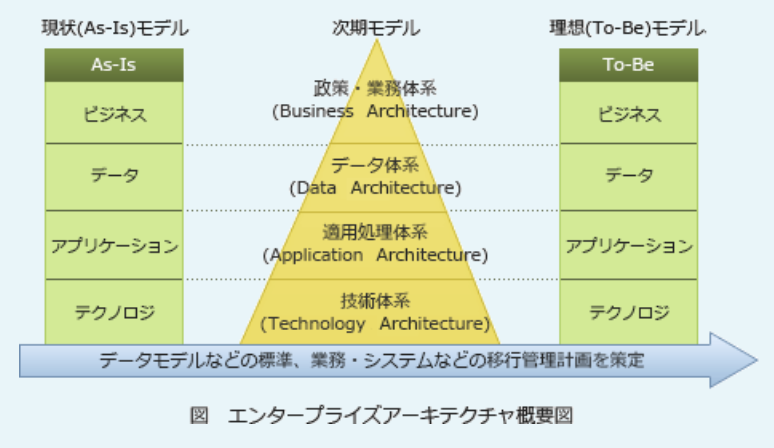

- BI(*Business Intelligence*)  
業務システムに蓄積された膨大なデータを分析・加工・見える化することで必要な情報を引き出し、ビジネスの意思決定に役立てる手法や技術

- MOT(*Management of Technology*)  
技術経営とも呼ばれ、技術開発の成果によって事業利益を獲得することを目的とした経営手法。イノベーションの創出を推進し、技術資産を豊富に蓄えることで市場競争力を強化する

- SOA(*Service Oriented Architecture*)  
利用者から見た各業務システムの機能をいくつかの独立した部品に分けてサービスとして定義し、業務プロセスとの対応付けや他のソフトウェアとの連携を容易にする手法

---
8.ある業務システムの再構築に関して、複数のベンダーにその新システムの実現イメージの提出を求めるRFIを予定している。その際、同時にベンダーからの提出を求める情報として適切なもの

- A.**適用可能な技術とその動向**

RFI(*Request For Information*:情報提供依頼)は、企業が調達や業務委託をする準備段階において、提案依頼書の作成に先立ち、ベンダー企業に対して情報の提供を公式に依頼することを言う。RFIを発行することによって相手方が保有する技術・経験や、情報技術動向、導入予定のシステムが技術的に実現可能であるかどうかなどを確認することができる。  
RFIでは、ベンダー企業に対しシステム化の目的や業務概要を明示し、会社概要、製品情報、導入実績、情報技術動向などの情報を得ることを目的とする。なぜRFIをベンダー企業に発行するのかというと、発注側がその情報について知らないため。**ベンダー企業のみが深く知っている情報**が提出を受けるべき情報となる

- 現行システムの概要
- システム再構築の狙い
- 新システムに求める要件  
=> 発注側が知っている。情報提供の前提としてRFIに明示すべき事項

---
9.不適切な行為で、不正アクセス禁止法において規制されている行為

- A.**他人の電子メールの利用者IDとパスワードを、正当な理由なく本人に無断で第三者に提供する**  
不正アクセス禁止法では、業務その他正当な事由がある場合を除き、他人の認証情報を第三者に提供する行為を禁止している

- A.**他人の電子メールの利用者IDとパスワードを本人に無断で使用して、ネットワーク経由でメールサーバ上のその人の電子メールを閲覧する**  
ネットワークで接続されたコンピュータに対し、他人の認証情報を入力してログインすることは不正アクセス行為に該当し、不正アクセス禁止法で禁止されている

不正アクセス禁止法は、不正アクセス行為やそれを助長する行為を禁止する法律。「アクセス制御機能を有するコンピュータに」「ネットワークを通じてアクセスし」「本人や管理者の承諾なく他人の認証情報を入力し」「不正アクセス制御によって宣言されている機能を利用可能にする」という4つの要件を満たすもの。  
「不正アクセス行為そのもの」「業務その他正当な理由がある場合を除いて、第三者に他人の認証情報を提供する行為」「不正アクセス行為のために、他人の認証情報を取得する行為」「不正アクセス行為のために、他人の認証情報を保管する行為」「管理者になりすまし、または管理者であると誤認させて認証情報であると誤認させて認証情報の提供を要求する行為」の5つが禁止されている

- メールサーバにアクセスできないよう、電子メールの利用者IDとパスワードを無効にするマルウェアを作成する  
マルウェアを作成する行為は、不正アクセス禁止法ではなく刑法(不正指令電磁的記録作成等)で規制されている

---
10.特許戦略を策定する上で重要な"特許ポートフォリオ"について述べたものはどれか

- **企業が保有や出願している特許を、事業への貢献や特許間のシナジー、今後適用が想定される分野などを分析するためにまとめたもの**

特許ポートフォリオは、組織が保有または出願している特許群を整理してまとめたもの。特許ポートフォリオを分析することで、今後取得すべき特許を明らかにしたり、知的財産戦略に関する意思決定に役立てたりすることができる

- 技術イノベーションが発生した当初は特許出願が多くなる傾向だが、市場に支配的な製品の出現によって工程イノベーションにシフトし、特許出願が減少すること  
A-Uモデルというイノベータ理論の説明

- 自社製品のシェアと市場の成長率を軸にしたマトリックスに、市場における自社や競争相手の位置付けを示したもの  
製品の位置付けで、PPM(プロダクトポートフォリオマネジメント)の説明

- 複数の特許権者同士が、それぞれの保有する特許の実施権を相互に許諾すること  
クロスライセンスの説明

---
11.与信限度額が3,000万円に設定されている取引先の5月31日業務終了時までの全取引が表のとおりであるとき、その時点での取引先の与信の余力は何万円か。受注分も与信に含めるものとし、満期日前の手形回収は回収とはみなさないものとする

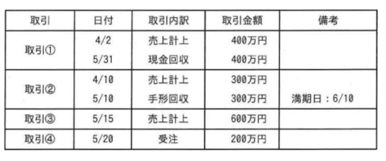

- A.**1,900**

与信限度額とは、取引先ごとに定められる債権額の限度。債権額とは未回収の売上額、与信の余力は「与信限度額 - 現在の債権額」と考える。受注も含めた取引先に対する売上の合計は、  
400万円 + 300万円 + 600万円 + 200万円 = <u>1,500万円</u>  
回収済の金額は、満期日前の手形は回収とみなさないとあり、5 / 10に回収した手形の満期日は6 / 10なので、5 / 31時点では回収額に含まない。回収済の金額は5 / 31の現金回収の400万円のみ。5 / 31の取引先に対する債権額は、  
1,500万円 - 400万円 = 1,100万円  
与信限度額は3,000万円なので、与信の余力は、  
3,000万円 - 1,100万円 = 1,900万円

---
12.クラウドファンディングは、資金提供の形態や対価の受領の仕方の違いによって、貸付型・寄付型・購入型・投資型などの種類に分けられる。A社は新規事業の資金調達を行うために、クラウドファンディングを通じて資金提供者と匿名組合契約を締結し、利益の一部を配当金として資金提供者に支払うことにした。A社が利用したクラウドファンディングの種類で適切なもの

- A.**投資型クラウドファンディング**  
資金提供の見返りとして事業利益の一部を受け取る。株式購入型や匿名組合契約型がある。匿名組合契約は、当事者の一方が相手方の営業のために出資をし、その営業から生ずる利益を分配する取り決めの契約のこと

クラウドファンディングは、群衆(*Crowd*)と資金調達(*Funding*)という言葉を組み合わせた造語で、インターネットを通じて不特定多数の賛同者から資金を集める仕組み。起業家、クリエイター、福祉事業を推進する団体が活動資金を調達する場として注目されている

- 貸与型クラウドファンディング  
企業や個人に対して資金を貸し付け、利息と元本返済金を受け取る。ソーシャルレンディングと呼ばれることもある

- 寄付型クラウドファンディング  
単純な寄付目的で資金提供を行い、見返りがない

- 購入型クラウドファンディング  
資金提供の見返りとして商品やサービスを受け取る

---
13.情報公開法に基づいて公開請求することができる文章で適切なもの

- A.**総務省などの行政機関が作成、保有する行政文書**

情報公開法は、正式名称を「行政機関の保有する情報の公開に関する法律」といい、国の行政機関が保有する情報を公開・開示するための請求手続きを定めた法律。原則として1件300円の手数料を支払えば、行政機関や独立行政法人等の職員が組織的に使うものとして保有している文書、図画や電子の開示を請求できる仕組みになっている

- 国会などの立法機関が作成、保有する立法文書
- 最高裁判所などの司法機関が作成、保有する司法文書
- 証券取引所に上場している企業が作成、保有する社内文書

---
14.市販のソフトウェアパッケージなどにおけるライセンス契約の1つであるシュリンクラップ契約に関する記述で最も適切なもの

- A.**ソフトウェアパッケージの包装を開封してしまうと、使用許諾条件を理解していなかったとしても、契約は成立する**  
使用許諾条件の内容を知っていたかどうかにかかわらず、包装を開封した時点で契約内容を承諾したのと同じ法律効果が生じる

ソフトウェアの購入者が包装を開封することで使用許諾契約に同意したとみなす契約方式で、量販店で販売されるソフトウェアパッケージに使われている。この契約方式では、包装や外箱の表面に使用許諾条件が印刷されていて、その中に「包装の開封と同時に契約条項に同意したものをみなす」旨の条項が含まれている。シュリンクラップ(*Shrink-wrap*)は、製品の包装のこと

- ソフトウェアパッケージの包装を開封しても、一定期間内であれば、契約を無効にできる  
原則としては開封後に契約を無効にすることはできない。未使用であれば返品できる旨の条項が使用許諾契約に含まれていることもあるが、使用開始した場合には無効にすることはできない

- ソフトウェアパッケージの包装を開封しても、購入から一定期間ソフトウェアの利用を開始しなければ、契約は無効になる  
開封した時点で契約は成立し、使用しなくても契約は有効に存続する。自動的に無効になることはない

- ソフトウェアパッケージの包装を開封しなくても、購入から一定期間が経過すると、契約は成立する  
契約が成立するのは開封した時点なので、購入後に開封しなければ契約は成立しない

---
15.業務プロセスを例示するUMLのアクティビティ図を使ってモデリングしたとき、表現できるもの

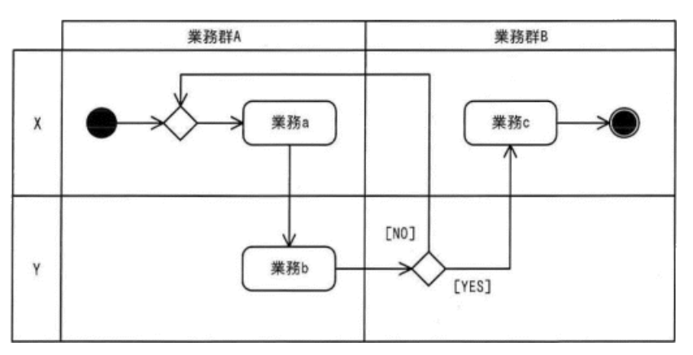

- A.**業務で必要となる人の役割**

アクティビティ図は、ビジネスプロセスの流れやプログラムの制御フローのような一連の手続きを可視化できる図で、フローチャートが起源。フローチャートと似た表記法で処理の流れを記述できるほか、処理の分岐やマージ、並行処理のフォークやジョイン、タイマ制御や例外処理なども表現できる。  
アクティビティ図は、アクティビティ(モデリング対象のプロセス)で実行される個々のステップをアクションとして表現している。"洗車する"というアクティビティの場合、洗剤で洗う、水ですすぐ、拭く、乾燥させるなどがアクションとなる(設問の図だと業務a ~ cがアクションに該当する)。アクションは、人やシステムが実行する動作、計算、処理などを表すので、選択肢のうち例示のアクティビティ図が表現できるものは「業務で必要となる人の役割」だけ

- 業務で必要となるコスト
- 業務で必要となる時間
- 業務で必要となる成果物の品質指標

---
16.マイナンバーの説明で適切なもの

- A.**付与されたマイナンバーを、自由に変更することはできない**

- 海外居住者を含め、日本国籍を有する者だけに付与される  
マイナンバーは日本国内に住民票をもつ人に対して付与される。外国籍であっても付与されるが、海外居住者には付与されない

- 企業が従業員番号として利用しても構わない  
マイナンバーの使途は、「社会保障」「税」「災害対策」における法令で定められた行政事務の処理手続に限られている。従業員番号として使用することはできない

- 申請をすれば、希望するマイナンバーを取得できる  
マイナンバーは住民票コードを一定の規則で変換して得られた12桁の数字なので、個人が希望する番号を取得することはできない

---
17.BYODの事例で適切なもの

- A.**会社が利用を許可した私物のスマートフォンを業務で使用する**

BYOD(*Bring Your Own Device*)は、従業員が個人的に所有するPCやスマートフォンなどの情報端末を職場に持ち込み、組織の承認の下でそれを業務に使用することを表す言葉。企業側はBYODを導入することで、これまで従業員に支給していた情報機器の調達コストや通信費を削減できるなどのメリットがあるが、管理が不十分な端末を業務に使用することになるので情報漏えいやマルウェア感染などのセキュリティリスクは増加する

- 会社から貸与されたスマートフォンを業務中に私的に使用する  
会社から貸与されたIT機器を使用しているためBYODではない

- 会社から貸与されたスマートフォンを業務で使用する  
会社から貸与されたIT機器を使用しているためBYODではない

- 私物のスマートフォンを業務中に私的に使用する  
業務ではなく、私的目的に使用しているためBYODではない

---
18.インダストリー4.0から顕著になった取組に関する記述で適切なもの

- A.**顧客ごとに異なる個別仕様の製品の、多様なITによるコスト低減と短納期での提供**  
インダストリー4.0(第4次産業革命)で可能になる取組として、大量生産並みの生産性を保ちながらオーダーメイドの製品作りを行うマス・カスタマイゼーションがある

インダストリー4.0(第4次産業革命)は、主に製造業において、IoTやAIの利活用により飛躍的に産業構造が変革し、生産性の向上や効率化が図られること。水力・蒸気機関による機械製造設備が導入された第1次産業革命、石油と電力による大量生産が始まった第2次産業革命、IT技術による第3次産業革命に続く歴史的な変化として位置付けられている

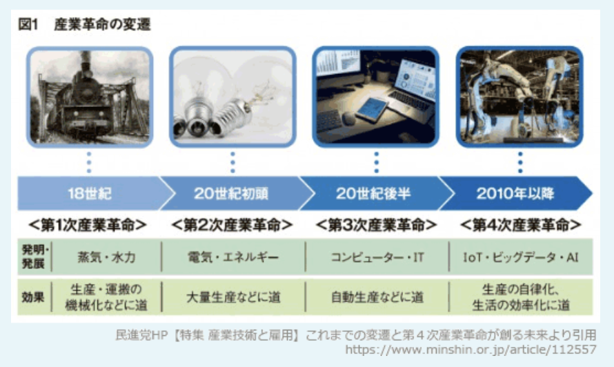

- 蒸気機関という動力を獲得したことによる、軽工業における、手作業による製品の生産から、工場制機械工業による生産への移行  
第1次産業革命の特徴

- 製造工程のコンピュータ制御に基づく自動化による、大量生産品の更なる低コストでの製造  
第3次産業革命の特徴

- 動力の電力や石油への移行とともに、統計的手法を使った科学的生産管理による、同一規格の製品のベルトコンベア方式での大量生産  
第2次産業革命の特徴

---
19.製造販売業A社は、バランススコアカードの考え方を用いて戦略テーマを設定した。業務プロセス(内部ビジネスプロセス)の視点に基づく戦略テーマとして最も適切なもの

- A.**部品の共有化比率の向上**

BSC(バランススコアカード)は、企業のビジョンと戦略を実現するために、「財務」「顧客」「業務プロセス」「学習と成長」という4つの視点から業績を評価・分析する手法。  
1.戦略目標  
2.重要成功要因(CSF)の洗出し  
3.業績評価指標(KPI)の設定  
4.アクションプラン策定  
この流れで、戦略を具体的な行動へ落とし込んで達成までを管理する  
・財務の視点 => 売上高、ROA、ROE、株価、売上高利益率など  
・顧客の視点 => 顧客満足度、成約率、客単価、クレーム件数など  
・業務プロセス(内部ビジネスプロセス)の視点 => 納期順守率、平均リードタイム、不良率、改善提案件数など  
・学習と成長の視点 => 年間教育 / 訓練時間、資格取得数、特許取得数、従業員の満足度など

- 売上高の拡大  
財務の視点に基づく戦略テーマ

- 顧客ロイヤリティの拡大  
顧客の視点に基づく戦略テーマ

- 従業員の技術力強化  
学習と成長の視点に基づく戦略テーマ

---
20.あるデータを表現するため、1個のJANコードか1個のQRコードのどちらかの利用を検討する。表現できる最大のデータ量の大きい方を採用する場合、検討結果として適切なもの

- A.**QRコードを採用する**  
JANコードは数字のみで最大13字なのに対して、QRコードは数字だけであれば7,089字を格納できるほど表現できる最大データ量には差がある

・JANコード  
市販商品に付いていることでお馴染みの黒の縦棒と白のスペースで数字を表現するバーコード規格。最大13桁(チェックデジットを含む)の数字で製造業者と商品を識別できるようになっている(事業者コード、商品アイテムコード、チェックディジット)

・QRコード  
情報を縦横の2次元で表すコード規格。格納できるデータ量が多く、またバーコードのように数字だけではなく英字、漢字、ひらがな、カタカナなどの多言語データも格納することができ、携帯電話でのURLの読取り、スマホ決済、販売店や工場における在庫管理など多方面で利用されている。隅の四角い位置検出パターンによって360度読み取り可能、汚れなどがあっても正確に読み取れるように誤り訂正語を含むなどの特徴もある

---
21.政府が定める"人間中心のAI社会原則"では、3つの価値を理念として尊重し、その実現を追求する社会を構築していくべきとしている。実現を追求していくべき社会の姿を挙げたもの

- A.**持続性ある社会**
- A.**多様な背景を持つ人々が多様な幸せを追求できる社会**
- A.**人間の尊厳が尊重される社会**

人間中心のAI社会原則は、AI(人工知能)を有効かつ安全に利用できる社会を構築するために必要となる社会の在り方を示した規範。  
持続可能な世界を構築するための鍵となる技術としてAIが注目されている。AIは人間の情報処理能力を上回るため確かに便利だが、強力であるがゆえ使い方を間違えれば不利益をもたらし得る存在と言える。AIの適切な開発と社会実装に関する原則として、日本政府により本則が定められた。  
人間中心のAI社会原則では、AIの利活用が進む社会において、1.人間の尊厳が尊重される社会、2.多様な背景を持つ人々が多様な幸せを追求できる社会、3.持続性ある社会、という3つの価値の実現を追求する社会を構築することを基本理念としている。その実現のために社会が留意すべき原則として以下の7つを規定している  
1.人間中心の原則  
2.教育・リテラシーの原則  
3.プライバシーの原則  
4.セキュリティ確保の原則  
5.公正競争確保の原則  
6.公平性・説明責任及び透明性の原則  
7.イノベーションの原則

- 人間があらゆる労働から解放される社会

---
22.SCMシステムを構築する目的

- A.**商品の生産から消費に関係する部門や企業の間で、商品の生産、在庫、販売などの情報を相互に共有して管理することによって、商品の流通在庫の削減や顧客満足の向上を図る**  
生産から消費までの情報を共有して、モノや情報の流れを最適化することにより、在庫削減や納期短縮といった効果を目指すのがSCMシステム

SCM(*Supply Chain Management*)は、生産・在庫・購買・販売・物流などのすべての情報をリアルタイムに共有し、一元管理することによって、生産から販売に至る一連の流れ全体(サプライチェーン)の効率を大幅に向上させることを目指す経営手法。SCMシステムの導入により納期短縮や在庫削減といった効果が期待できる

- 企業のもっている現在の強み弱みを評価し、その弱みを補完するために、どの企業と提携すればよいかを決定する  
SWOT分析や3C分析に関する説明

- 顧客に提供する価値が調達、開発、製造、販売、サービスといった一連の企業活動のどこで生み出されているのかを明確化する  
バリューチェーン分析に関する説明

- 多種類の製品を生産及び販売している企業が、利益を最大化するために、最も効率的・効果的となる製品の製造・販売の組合せを決定する  
PPM分析に関する説明

---
23.オプトアウトに関する記述で適切なもの

- A.**住宅地図の利用者が、地図上の自宅の位置に自分の氏名が掲載されているのを見つけたので、住宅地図の作製業者に連絡して掲載を中止させた**  
オプトアウトは本人が反対の意思を示さない限り、メールの配信や情報の提供に同意したとみなす方式。何ら許可なく既に利用されている情報を利用者の意思表示により使用禁止にした事例が該当

・オプトアウト  
原則として許可されている状態で、利用者が不許可の意思を示すことにより禁止となる仕組み
例:住宅地図業者(表札や郵便受けを調べて住宅地図を作成し、販売)、データベース事業者(ダイレクトメール用の名簿等を作成し販売)、クッキーの受入れ拒否など  
・オプトイン  
原則としては許可されていない状態で、利用者が許可の意思を示すことにより有効となる仕組み  
例:個人への広告・宣伝メールの配信や、個人情報の第三者提供など

- SNSの事業者が、お知らせメールの配信を希望した利用者だけに、新機能を紹介するメールを配信した  
オプトインに関する記述

- 通信販売の利用者が、Webサイトで商品を購入するための操作を進めていたが、決済の手続が面倒だったので、画面を閉じて購入を中止した  
オプトアウトは、購入を途中で取りやめることを表す言葉ではない

- ドラッグストアの事業者が、販売予測のために顧客データを分析する際に、氏名や住所などの情報をランダムな値に置き換え、顧客を特定できないようにした  
匿名加工情報に関する記述

---
24.教師あり学習の事例に関する記述で適切なもの

- A.**録音された乳児の泣き声と、泣いている原因から成るデータを収集して入力することによって、乳児が泣いている原因を泣き声から推測する**  
泣き声に対するその原因という、テストデータと正解の組が教師データとして与えられているため、教師あり学習に該当する

・教師あり学習  
訓練データとして、ラベル(正解)付きデータを使用する学習方法。入力に対する正しい出力の例を与えることで、入力と出力の関係を学習させる  
・教師なし学習  
訓練データとして、ラベルなしデータを使用する学習方法。クラスタリングなどのためにデータ構造を学習させる  
・強化学習  
正解データの代わりに、与えられた環境における個々の行動に対して得点や報酬を与える学習方法。一連の行動に対して評価値を与えることで高い得点を取るための行動、すなわち最良の行動を自律的に学習させる

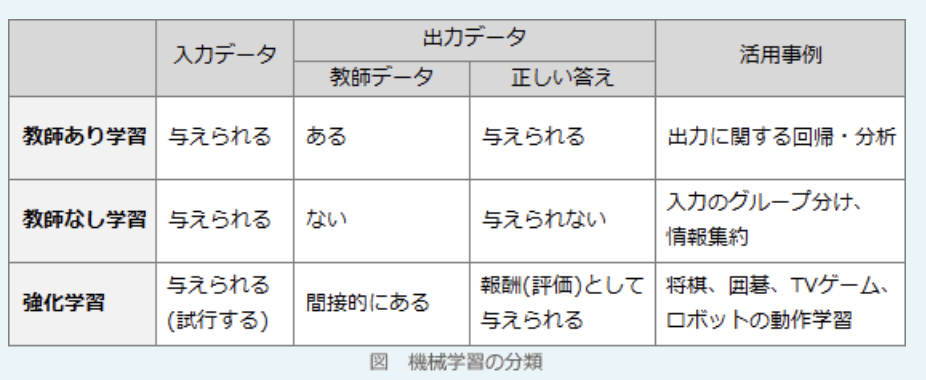

- 衣料品を販売するサイトで、利用者が気に入った服の画像を送信すると、画像の特徴から利用者の好みを自動的に把握し、好みに合った商品を提案する  
与えられたデータの特徴点をもとに類似するグループに分けるのは教師なし学習の事例

- 気温、天候、積雪、風などの条件を与えて、あらかじめ準備しておいたルールベースのプログラムによって、ゲレンデの状態がスキーに適しているか判断する  
ルールベースAIの事例。予め人が与えたルールに基づき判断するため、システムは学習を行わない

- 麺類の山からアームを使って1人分を取り、容器に盛り付ける動作の訓練を繰り返したロボットが、弁当の盛り付けを上手に行う  
多くの試行を繰り返すことで最終的に最適な行動に行き着いているため、強化学習の事例

---
25.業務プロセスの改善に当たり、業務プロセスを表記するために用いられる図表

- A.**DFD**  
業務におけるデータの流れを中心として、業務プロセスをモデリングする構造化分析の手法。データフロー、プロセス、データストア、データの源泉の4つの構成要素を組み合わせて、業務およびデータの流れとその関係を表す

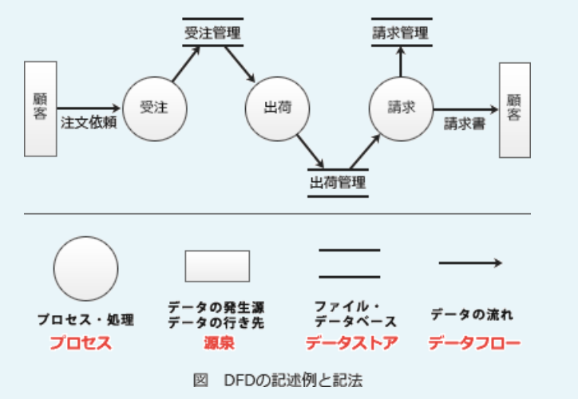

- A.**アクティビティ図**  
業務プロセスの流れやプログラムの制御フローのような一連の手続きを可視化できる図。フローチャートと似た表記法で処理の流れを記述できるほか、処理の分岐やマージ、並行処理のフォークやジョイン、タイマ制御や例外処理なども表現できる

- パレート図  
値の大きい順に分析対象の項目を並べた縦棒グラフと、累積構成比を表す折れ線グラフを組み合わせた複合グラフで、主に複数の分析対象の中から、重要な要素を識別するために使用される

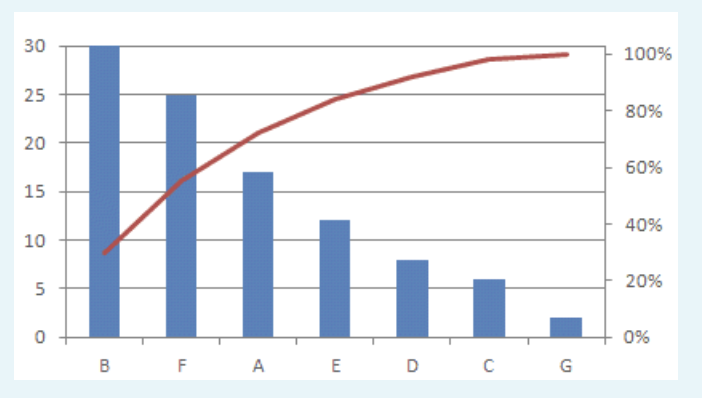

- レーダチャート  
中心から正多角形状に配置される各項目の軸に、値や基準値に対する比率をプロットし、各点を線で結んだ形状で表す図。量の大小を把握しつつ、項目同士のバランスを比較するのに適している

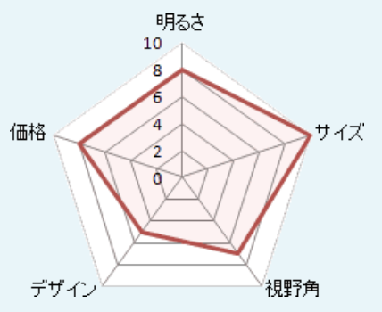

---
26.自社が保有していない技術やノウハウを、他社から短期間で補完するための手段

- A.**アライアンス**  
いわゆる業務提携のことで、企業同士が連携、共同して事業を進めていくことを表す。締結することで、他社が保有している技術やノウハウを得るなどの不得意分野の補完や、事業投資リスクの軽減といった効果が期待できる

- BPR  
*Business Process Reengineering*の略。既存の組織やビジネスルールを抜本的に見直し、職務、業務フロー、管理機構、情報システムを再設計する手法

- インキュベーション  
起業家や新事業の育成を支援する場のこと

- ベンチマーキング  
自社の製品・サービス・プロセスを定量的・定性的に測定し、それを業界で最も成功を収めている企業(ベスト企業)のものと比較し、そのギャップを把握する分析手法

---
27.個人情報保護法で定められた、特に取扱いに配慮が必要となる"要配慮個人情報"に該当するもの

- A.**信条**

要配慮個人情報とは、個人情報のうち本人に対する不当な差別、偏見その他の不利益が生じないようにその取扱いに特に注意すべき情報。個人情報保護法では、要配慮個人情報を取得しようとする際にはあらかじめ本人の同意を得ることを義務付けている。単純な国籍の情報は人種には含まず、学歴は社会的身分には含まないとされている  
「人種(単純な国籍や"外国人"という情報は含まない)」  
「信条」  
「社会的身分(職業的地位や学歴は含まない)」  
「病歴」  
「犯罪の経歴」  
「犯罪により害を被った事実」  
「身体障害、知的障害、精神障害(発達障害を含む)その他の個人情報保護委員会規則で定める心身の機能の障害があること」  
「本人に対して医師等により行われた健康診断等の結果」

- 学歴
- 国籍
- 資産額

---
28.A社のある期の資産、負債及び純資産が次のとおりであるとき、経営の安全性指標の1つで、短期の支払能力を示す流動比率は何%か

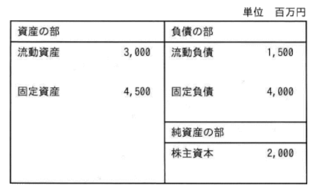

- A.**200**

流動負債に対する流動資産の割合を示す財務指標で、この値が高いほど企業の短期支払い能力は高いと判断される。一般的には200%以上あれば問題ないとされ、逆に100％を下回っていると危険な状態にあると判断される。  
流動比率(%) = 流動資産 / 流動負債 * 100  
流動資産とは概ね1年以内に現金化できる資産のことで、現預金、売掛金、受取手形、前払金、棚卸資産などが含まれる。流動負債とは概ね1年以内に支払期限を迎える負債のことで、買掛金、支払手形、未払費用、短期借入金などが含まれる。  
貸借対照表より流動資産は3,000百万円、流動負債は1.500百万円なので、流動比率は200%となる

---
29.マネーロンダリングの対策に関する記述で適切なもの

- A.**金融取引に当たり、口座開設時の取引目的や本人確認を徹底し、資金の出所が疑わしい取引かどうかを監視する**  
口座開設時に取引時確認を行なっているため適切

金融犯罪や麻薬取引、組織犯罪など違法な取引によって得たお金を、架空口座を転々とさせたり入出金を繰返し行うことによりその出所や真の所有者が分からないようにし、あたかも正当な手段で得た資金であるかのように見せかける行為。ロンダリング(*laundering*)には「洗濯」という意味がある  
特に金融機関等はマネーロンダリングに悪用されやすいため、マネーロンダリングやテロ資金供与の防止対策として犯罪収益移転防止法が定められ、預貯金口座の開設や大口現金取引、クレジットカード契約の締結等などの一定の取引を行う際には、本人確認や取引目的、職業や事業内容などの確認とその記録が義務付けられている

- 紙幣の印刷に当たり、コピー機では再現困難な文字や線、傾けることによって絵が浮かび上がるホログラムなどの技術を用いて、複製を困難にする  
偽造防止技術に関する記述

- 税金の徴収に当たり、外国にある子会社の利益を本国の親会社に配当されたものとみなして、本国で課税する  
タックスヘイブン税制に関する記述

- 投資に当たり、安全性や収益性などの特徴が異なる複数の金融商品を組み合わせることによって、1つの事象によって損失が大きくなるリスクを抑える  
分散投資のためのポートフォリオに関する記述

---
30.営業利益を求める計算式

- A.**(売上総利益) - (販売費及び一般管理費)**

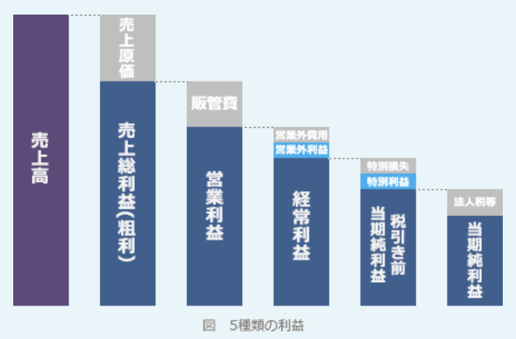

- (売上高) - (売上原価)  
売上総利益(粗利益)の計算式

- (経常利益) + (特別利益) - (特別損失)  
税引前当期純利益を求める計算式

- (税引前当期純利益) - (法人税、住民税及び事業税)  
当期純利益を求める計算式

---
31.コールセンターの顧客サービスレベルを改善するため、顧客から寄せられたコールセンター対応に関する苦情を分類集計する。苦情の多い順に、件数を棒グラフ、累積百分率を折れ線グラフで表し、対応の優先度を判断するのに適した図

- A.**パレート図**  
値の大きい順に分析対象の項目を並べた縦棒グラフと、累積構成比を表す折れ線グラフを組み合わせた複合グラフで、主に**複数の分析対象の中から重要な要素を識別する**ために使用される

- PERT図  
アローダイアグラムともいい、プロジェクトの各作業を矢印で、作業の結合点を"〇"で示すことで、作業間の関連性や順序関係を視覚的に表現する図

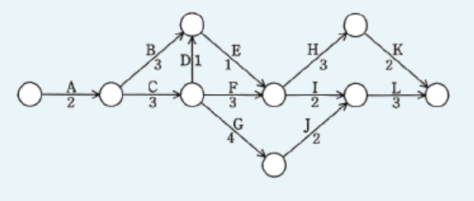

- 管理図  
中央線および上限と下限を示す限界線を引いて、製品などの特性値を打点することで、工程の状態や品質を時系列に表した図で、工程が安定した状態にあるかどうかを判断するために用いる

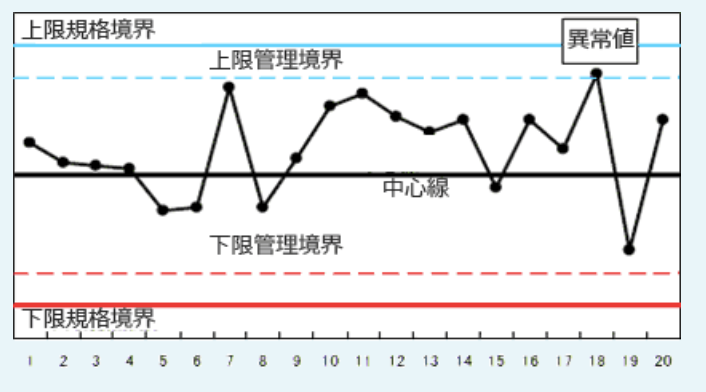

- 特性要因図  
特性(結果)とそれに影響を及ぼしたと思われる要因(原因)の関係を体系的に表した図。直接的な原因と間接的な原因に分別したり、主要または根本原因を明確にするために用いられる

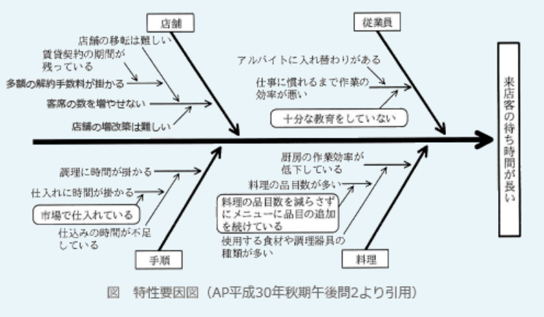

---
32.コンカレントエンジニアリングを適用した後の業務の流れを表した図として最も適したものはどれか。矢印は業務の流れを示し、その上に各作業名を記述する

A.  
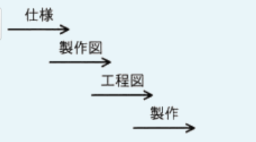

主に製造業において、設計から生産に至るまでの各プロセスを**同時並行的に行う**ことで、開発期間や納期の短縮および生産コストの削減を図る手法。コンカレント(*concurrent*)は、「並行」「同時に(発生)」などを意味する英単語

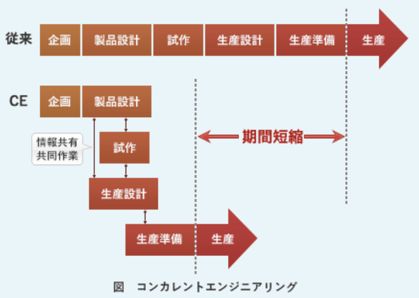

---
33.IT機器やソフトウェア、情報などについて、利用者の身体の特性や能力の違いなどにかかわらず、様々な人が同様に操作、入手、利用できる状態又は度合いを表す用語として適切なもの

- A.**アクセシビリティ**  
年齢や身体的制約・利用環境などにかかわらず、誰もが製品や建物やサービスなどを支障なく利用できるかどうかの状態やその度合いのこと

- スケーラビリティ  
主にソフトウェアやシステムの拡張可能性のことを指す言葉

- ダイバーシティ  
企業活動に人種や性別などの違いから生じる様々な価値観を取り込むことによって、新たな価値の創造や組織のパフォーマンス向上につなげようとする考え方

- トレーサビリティ  
対象とする物品およびその部品や原材料の生産から販売に至るまでの流通履歴を確認できる状態にあること。追跡可能性と呼ばれる

---
34.あるオンラインサービスでは、新たに作成したデザインと従来のデザインのWebサイトを実験的に並行稼働し、どちらのWebサイトの利用者がより有料サービスの申込みに至りやすいかを比較、検証した。このとき用いた手法として最も適切なもの

- A.**A / Bテスト**  
主にインターネットマーケティングで行われる施策を判断するための手法の1つ。1つのコンテンツに対して異なる2パターンのWebページ、広告バナー、広告文等を用意して、ランダムにユーザーに閲覧・利用してもらい、それぞれの効果を測定し比較することで、どちらのパターンがクリック率(CTR)やコンバージョン率(CVR)が優れているかを検証する

- ABC分析  
パレート図を使って分析する要素・項目群を大きい順に並べ、上位70%を占める要素群をA、70% ~ 90%の要素群をB、それ以外の要素群をCというようにグルーピングすることで、重点的に管理すべきグループとそうでないグループを明らかにする手法

- クラスタ分析  
観測データを類似性によって集団や群に分類し、その特徴となる要因を分析する手法。複数の異なる性質のものが混ざり合っている対象の中から類似したものを集めてグルーピングし、個々の分析対象を群に分類する

- リグレッションテスト  
退行テスト / 回帰テストとも呼ばれ、システムに変更作業を実施した場合に、それによって以前まで正常に機能していた部分に不具合や影響が出ていないかを検証するテスト

---
35.あるコールセンターでは、AIを活用した業務改革の検討を進めて、導入するシステムを絞り込んだ。しかし、想定している効果が得られるかなど不明点が多いので、試行して実現性の検証を行うことにした。このような検証の名称

- A.**PoC**  
*Proof of Concept*の略で、新しい概念や理論、原理を実証するために行われる小規模な実現や研究的な実験のこと。本番導入に先んじてモデルシステムを試験的に構築し、その有効性を調査・検証するために行う。データ分析やAI関連の世界は、仮説を立てそれに基づいてモデルを作り、データを使って仮説を検証するという流れとなるため、特にPoCの実施が重要

- IoT  
*Internet of Things*の略。情報端末ではない電子機器や機械類などの「モノ」にインターネット接続・通信機能やセンサー機能を持たせ、それらの機器が情報を相互にやり取りしたり、収集した情報を処理・蓄積したりすることで、監視、制御、最適化、自律化などの新たな付加価値を得る仕組み

- SoE  
*Systems of Engagement*の略。ITシステムをその目的で分類した概念で、顧客や企業との関係を深めるために構築されるシステムのこと

- SoR  
*Systems of Record*の略。ITシステムをその目的で分類した概念で、ビジネス上のデータを正確に記録することを主眼とするシステムのこと

### `マネジメント系`

---
36.プロジェクトで作成するWBSに関する記述で適切なもの

- A.**WBSではプロジェクトで実施すべき作業内容と成果物を定義するので、作業工数を見積もるときの根拠として使用できる**  
WBSでは成果物や作業が細かく定義されるので、それぞれの作業工数やスケジュールの予測を立てやすくなる。分割した成果物や作業ごとに作業工数を割り当て、それを積み上げて全体の作業工数を見積もる手法

*Work Breakdown Structure*の略で、プロジェクト目標を達成し、必要な成果物を過不足なく作成するために、プロジェクトチームが実行すべき作業を、成果物を主体に階層的に要素分解したもの。各作業ごとに内容・スケジュール・目標を設定することでプロジェクト管理をしやすくする目的で用いられる

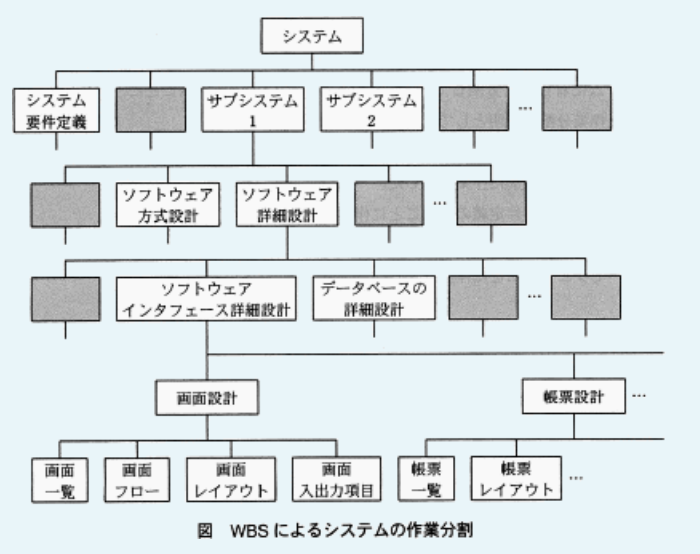

- WBSにはプロジェクトのスコープ外の作業も検討して含める  
プロジェクトで実施しない作業はWBSに記述しない

- 全てのプロジェクトにおいて、WBSは成果物と作業内容を同じ階層まで詳細化する  
プロジェクト、工程、成果物によって、どの階層まで詳細化すべきかは異なる

- プロジェクトの担当者がスコープ内の類似作業を実施する場合、WBSにはそれらの作業を記載しなくてよい  
WBSにはスコープ内の作業を過不足なく含めるため、他の作業の類似作業であっても記載しなければならない

---
37.システムによる内部統制を目的として、幾つかの機能を実装した。次の処理は、どの機能の実現例として適切か  
ログイン画面を表示して利用者IDとパスワードを入力する。利用者IDとパスワードの組合せがあらかじめ登録されている内容と一致する場合は業務メニュー画面に遷移する。一致しない場合は遷移せずにエラーメッセージを表示する

- A.**システムによるアクセス制御**

利用者IDとパスワードで認証を行い、正しい値が入力されたときにだけシステムの業務利用を許可にしている。利用者IDとパスワードの組による認証は、システムを利用しようとする人が正当な利用者であるかどうかを確認し、システムの不正な使用を防止するという意味合いがある。正当な利用者だけが情報資産に対してアクセスできるように管理することを「アクセス制御」と言う

- システム障害の検知  
利用者IDとパスワードによる認証ではシステム障害を検知することはできない

- 利用者に対するアクセス権の付与  
アクセス権の付与とは、人やグループごとに操作可能な範囲を限定すること。設問の機能は権限付与に関するものではない

- 利用者のパスワード設定の妥当性の確認  
パスワード設定の妥当性とは、パスワードが命名規則やガイドラインに当てはまっているかどうかのこと。設問の機能ではパスワード設定の妥当性を確認することはできない

---
38.XP(エクストリームプログラミング)の説明で最も適切なもの

- A.**要求の変化に対応した高品質のソフトウェアを短いサイクルでリリースする、アジャイル開発のアプローチの1つである**  
アジャイル開発の方法論の1つ

エクストリームプログラミング(XP:*eXtreme Programming*)は、1990年代後半、ケント・ベック氏らによって提唱されたソフトウェア開発手法でアジャイルソフトウェア開発と称される一連の手法の先駆けとなったもの。「プログラマーは人間である」という思想のもと、叩き台となるプログラムを早期に開発し、短いサイクルで頻繁にテストとリリースを繰り返すことで、顧客の要求への対応力と生産性を高め、リスクを軽減することを目的としている。  
XPでは、ソフトウェア開発に有益である要素を4カテゴリ、19のプラクティスとして定義している

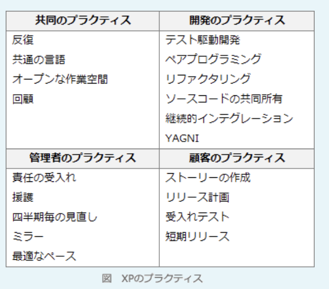

- テストプログラムを先に作成し、そのテストに合格するようにコードを記述する開発手法のことである  
プロダクトコードと並行してテストコードを書き、小まめに実行して結果を見ながら開発するというテストファーストで進めることをテスト駆動開発(TDD)という。テスト駆動開発は、XPのプラクティスの1つ

- 1つのプログラムを2人のプログラマが、1台のコンピュータに向かって共同で開発する方法のことである  
ペアプログラミングは、2人1組で実装を行い、1人が実際のコードをコンピュータに打ち込み、もう1人はそれをチェックしながら補佐するという役割を随時交代しながら作業を進めること。XPのプラクティスの1つ

- プログラムの振る舞いを変えずに、プログラムの内部構造を改善することである  
外部から見た時の振る舞いを変えずに、ソフトウェアの内部構造を改善することをリファクタリングといい、XPのプラクティスの1つ

---
39.提供するITサービスの価値を高めるためにはサービスの提供価格、どのようなことができるかというサービスの機能、可用性などを維持するサービスの保証の3つのバランスを考慮する必要がある。インスタントメッセンジャのサービスに関する記述のうち、サービスの保証に当たるもの

- A.**24時間365日利用可能である**  
可用性(利用者が必要な時にシステムを利用可能である特性)に関する記述なので、サービスの保証に該当する

- ゲームなどの他のソフトウェアと連携可能である  
機能(サービスにできること)に関する記述なので、サービスの機能に該当する

- 無料で利用可能である  
価格に関する記述なので、サービスの提供価格に該当する

- 文字の代わりに自分で作成したアイコンも利用可能である  
機能に関する記述なので、サービスの機能に該当する

---
40.ITガバナンスに関する記述で適切なもの

- A.**経営陣が組織の価値を高めるために実践する行動であり、情報システム戦略の策定及び実現に必要な組織能力のこと**

企業が競争優位性を構築するために、IT戦略の策定・実行をガイドし、あるべき方向へ導く組織能力であり、ITへの投資・効果・リスクを継続的に最適化するための組織的な仕組み。ITを用いた企業統治という意味がある。経営目標を達成するためのIT戦略の策定、組織規模でのIT利活用の推進などがITガバナンスの活動に該当する。ITガバナンスの構築と推進は経営者の責務

- ITサービスマネジメントに関して、広く利用されているベストプラクティスを集めたもの  
ITILに関する記述

- システム及びソフトウェア開発とその取引の適正化に向けて、それらのベースとなる作業項目の1つ1つを定義して標準化したもの  
共通フレームに関する記述

- プロジェクトの要求事項を満足させるために、知識、スキル、ツール、技法をプロジェクト活動に適用すること  
プロジェクトマネジメントに関する記述

---
41.テレワークを推進しているある会社では、サテライトオフィスを構築している。サテライトオフィスで使用するネットワーク機器やPCを対象に、落雷による過電流を防止するための対策を検討した。有効な対策として最も適切なもの

- A.**サージ防護に対応した機器の設置**  

施設の近くで落雷があると瞬間的に高い電圧(サージ)が発生し、この大きな電流が電話回線や電線を通じて施設内に侵入するとコンピュータが壊れてしまうおそれがある。この過電流の被害から機器を守るためにOAタップなどに組み込まれているのがサージ防護

- グリーンITに対応した機器の設置  
省エネなど地球環境に優しいIT機器を利用することで、環境保全を推進していくという考え方。環境負荷の低減には有効だが、過電流からの保護とは関係ない

- 無線LANルータの設置  
無線LANに接続するPCは被害を免れるが、電源や無線LANルータ等のネットワーク機器を守ることはできない

- 無停電電源装置の設置  
停電対策には有効だが、過電流対策にはならない

---
42.システムの開発側と運用側がお互いに連携し合い、運用や本番移行を自動化する仕組みなどを積極的に取り入れ、新機能をリリースしてサービスの改善を行う取組を表す用語

- A.**DevOps**  
開発を意味する*Development*と、運用を意味する*Operations*を組み合わせた造語で、開発担当チームと運用担当チームが緊密に協力・連携し、自動化ツールなどを活用して柔軟かつスピーディに開発を進めるソフトウェア開発手法

- RAD  
*Rapid Application Development*の略。統合開発環境によるプログラミングの半自動化や、視覚的な方法を用いたユーザインターフェイスの設計、モジュール開発などの機能を備える開発ツールを使い、短期間に目的プログラムを作成することを重視した開発スタイル

- オブジェクト指向開発  
データと、そのデータに対する操作を1つのまとまりとして管理し、そのまとまりを組み合わせてソフトウェアを開発する手法

- テスト駆動開発  
プログラムを記述する前にその機能に合うテストケースを作成し、そのテストを通過するようにプログラムを実装するテストファーストの開発手法

---
43.図のアローダイアグラムにおいて、作業Bが2日遅れて完了した。そこで、予定通りの期間で全ての作業を完了させるため、作業Dに要員を追加することにした。作業Dに当初20名が割り当てられているとき、作業Dに追加する要員は最少で何名必要か。要員の作業効率は一律である

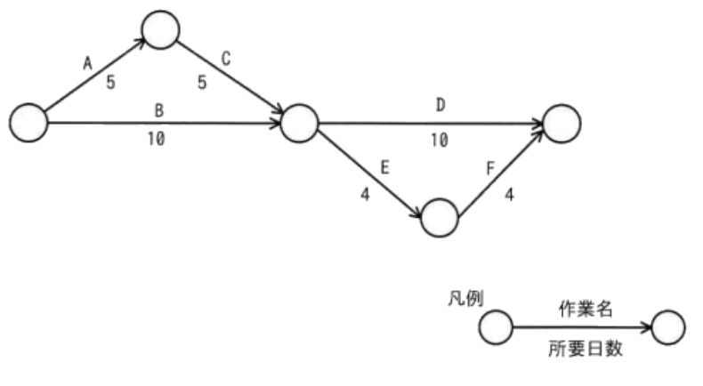

- A.**5**  
A, C, D => 20日  
A, C, E, F => 18日  
B, D => 20日  
B, E, F => 18日  
クリティカルパスの最短所要日数は20日。作業が2日遅れたため、作業Dを8日で終える必要がある。  
10日 * 20人 = 200人日  
200人日 / 8日 = 25人  
以上より、追加人数は少なくとも5人必要

---
44.ITサービスマネジメントにおけるインシデント管理の目的として適切なもの

- A.**インシデントによって中断しているサービスを可能な限り迅速に回復する**

サービスマネジメントを構成するプロセスの1つで、システムの異常終了や構成機器の障害発生などのようにサービスの中断やサービス品質の低下につながるような事象(インシデント)が発生した時に、サービスの中断時間を最小限に抑えて速やかに回復することを目指すプロセス

- インシデントの原因を分析し、根本的な原因を解決することによって、インシデントの再発を防止する  
問題管理の目的。インシデントや障害原因を調査し、再発防止のための恒久的な対策を提案することを目的としたプロセス

- サービスに対する全ての変更を一元的に管理することによって、変更に伴う障害発生などのリスクを低減する  
変更管理の目的。変更作業に伴うリスクを管理し、リスクとメリットを考慮してリリースを行うかどうかの評価を行うプロセス

- サービスを構成する全ての機器やソフトウェアに関する情報を最新、正確に維持管理する  
構成管理の目的。すべてのIT資産を明確化し、これらのIT資産情報の情報を構成管理データベース(CMDB)に記録し、その維持管理を行うとともに、他のプロセスの活動が円滑に進むように構成情報の提供を行うプロセス

---
45.ブラックボックステストについて適切な記述

- A.**プログラムの入力と出力に着目してテストする**

システムへの入力とそれに対して得られる出力だけに着目して、様々な入力に対して仕様書どおりの出力が得られるかどうかを検証していくテストで、主にシステムテストや運用テストにおいて用いられる。同値分割、限界値分析、原因 - 結果グラフ、エラー推測などの手法がある。システムの内部構造を考慮しない(隠された)状態で検証を行うのでブラックボックステストと呼ばれる

- プログラムの全ての分岐についてテストする
- プログラムの全ての命令についてテストする
- プログラムの内部構造に基づいてテストする  
=> プログラムの詳細設計書などを見ながら、プログラムの内部構造が正しいかどうかを検証するのでホワイトボックステスト

---
46.ファシリティマネジメントに関する実施事項で適切なもの

- A.**コンピュータを設置した建物への入退館の管理**  
建物に関する管理なので、ファシリティマネジメントの活動

- A.**停電時のデータ消失防止のための無停電電源装置の設置**  
システム基盤となる設備を保護するための施策なので、ファシリティマネジメントの活動

- 社内のPCへのマルウェア対策ソフトの導入と更新管理  
情報セキュリティマネジメントの施策。一般的に個々のPCの管理はファシリティマネジメントに含まれない

- 情報システムを構成するソフトウェアのライセンス管理  
IT資産管理の施策。管理対象が物的な資産ではないので、ファシリティマネジメントではない

---
47.ソフトウェア保守に関する記述のうち適切なもの

- A.**本番環境で運用中のシステムに対して、法律改正に伴うソフトウェア修正もソフトウェア保守に含まれる**  
法律改正やOSアップデート等のビジネス環境の変化に対応する修正(適応保守)はソフトウェア保守に含まれる

ソフトウェア保守は、運用開始後のシステムやソフトウェアに対して変更や機能改善への対応、プログラムの欠陥(バグ)への対応、ビジネス環境の変化に応じたプログラムの修正作業などを実施すること。「運用開始後の」というのがポイントで、大きく5つに大別される。  
・是正保守  
ソフトウェア製品の引渡し後に発見された問題を訂正するために行う受身の修正  
・予防保守  
引渡し後のソフトウェア製品の潜在的な障害が運用障害になる前に発見し、是正を行うための修正  
・完全化保守  
引渡し後のソフトウェア製品に機能の追加や変更、性能強化などの改良を行うための修正  
・適応保守  
引渡し後、変化した(変化している)環境において、ソフトウェア製品を使用できるように保ち続けるために実施する修正  
・緊急保守  
是正保守を行うまでシステムの運用を確保するための、計画外で一時的な修正

- 本番環境で運用中のシステムに対して、ソフトウェアの潜在不良を発見し、障害が発生する前に修正を行うことはソフトウェア保守には含まれない  
運用中のシステムに対する潜在的な不良の修正(予防保守)は、ソフトウェア保守に含まれる

- 本番環境で運用中のシステムに対して、ソフトウェアの不具合を修正することがソフトウェア保守であり、仕様変更に伴う修正はソフトウェア保守には含まれない  
運用中のシステムに対する機能変更や改良のための修正(完全化保守)は、ソフトウェア保守に含まれる

- 本番環境で運用中のシステムに対する修正だけでなく、納入前のシステム開発期間中に実施した不具合の修正もソフトウェア保守に含まれる  
開発期間中に行う修正は、ソフトウェア保守に含まれない

---
48.システム開発プロジェクトの品質マネジメントにおいて、品質上の問題と原因との関連付けを行って根本原因を追究する方法の説明で適切なもの

- A.**候補となる原因を魚の骨の形で整理し、根本原因を検討する**  
特性要因図に関する記述。特性要因図は、結果とそれに影響を及ぼしたと思われる原因の関係を体系的に表す図で、直接的な原因と間接的な原因に分別したり、主要または根本原因を明確にしたりするために役に立つ

- 管理限界を設定し、上限と下限を逸脱する事象から根本原因を推定する  
管理図に関する記述。管理図は異常を検知するための方法で、原因を特定することはできない

- 原因の候補リストから原因に該当しないものを削除し、残った項目から根本原因を紋り込む  
問題と原因との関連付けを行われていない。ある原因が別の問題の原因にもなっていたり、ある問題が別の問題の原因になっていたりするため、根本原因を特定するには体系的に分析することが必要

- 複数の原因を分類し、件数が多かった原因の順に対処すべき根本原因の優先度を決めていく  
問題と原因の関連付けが行われていない。件数の多かった原因が対処を優先すべき根本原因とは限らない

---
49.ITサービスの利用者からの問合せに自動応答で対応するために、チャットボットを導入することにした。このようにチャットボットによる自動化が有効な管理プロセスとして最も適切なもの

- A.**インシデント管理**

ITサービスについて利用者からの問合せを一元的に受け付ける機能や部署のことをサービスデスクという。サービスデスクは様々な管理プロセスを支える機能だが、特に関連の深い業務の1つとしてインシデント管理がある。サービスデスクでは、利用者からの問合せのうち、サービスの中断やサービス品質の低下につながる事象をインシデントとして扱い、記録、対応、解決までをフォローする(これらがインシデント管理の活動のため)。  
チャットボットを導入すればサービスデスクの負担が軽減され、それが効率的なインシデント管理の活動につながる

- 構成管理  
全てのIT資産を明確化し、これらのIT資産情報を構成管理データベース(CMDB)に記録し、その維持管理を行うとともに、他のプロセスの活動が円滑に進むように構成情報の提供を行うプロセス

- 変更管理  
変更作業に伴うリスクを管理し、リスクとメリットを考慮してリリースを行うかどうかの評価を行うプロセス

- 問題管理  
インシデントや障害原因を調査し、再発防止のための恒久的な対策を提案することを目的としたプロセス

---
50.120kステップのソフトウェアを開発した。開発の各工程における生産性の実績が表のとおりであるとき、開発全体の工数は何人月か。生産性は1人月当たりのkステップとする(単位:kステップ / 人月)

|工程|生産性|
|---|-----|
|設計|6.0  |
|製造|4.0  |

- **50**  
開発全体の工数は、設計工程に要する工数と製造工程に要する工数の合計となる。「開発規模 / 生産性 = 開発工数」が成り立つ。  
・設計工程  
120kステップを6.0kステップ / 人月で設計すると、20人月  
・設計工程  
120kステップを4.0kステップ / 人月で設計すると、30人月  
合計すると50人月となる

---
51.ITサービスマネジメントにおけるSLAに関する記述

- A.SLAは、**顧客**と**サービスの供給者**との間で交わされる合意文書である。**顧客**が期待するサービスの目標値を定量化して合意した上でSLAに明記し、**サービスの供給者**はこれを測定・評価した上でサービスの品質を改善していく  
SLA(*Service Level Agreement*)は、サービス利用者とサービス提供者との間で、サービスの品質の内容について合意した文書のこと。サービスの品目とその水準、水準が達成できなかった場合のペナルティなどが盛り込まれる

---
52.A社がB社にシステム開発を発注し、システム開発プロジェクトを開始した。プロジェクトの関係者のうち、プロジェクトのステークホルダとなるもの

- A.**A社の経営者**
- A.**A社の利用部門**
- A.**B社のプロジェクトマネージャ**
- A.**B社の技術支援する協力会社**  
プロジェクトメンバ、プロジェクトマネージャ、取引先、顧客、株主、経営者、地域など、プロジェクトの意思決定、活動、成果に影響を受ける可能性のあるすべての人やグループ。日本語では「利害関係者」という。組織の内外、直接的・間接的を問わず、そのプロジェクトが利益になる者、損害になる者の両方が含まれる

---
53.システム監査人が、合理的な評価・結論を得るために予備調査や本調査のときに利用する調査手段に関する記述

- A.**コンピュータを利用した監査技法の活用**  
システム監査を支援する専用のソフトウェア等を利用したシステム監査。システム監査基準において監査技法の1つとして記載されている

- A.**資料や文書の閲覧**  
資料や文書の閲覧は、予備調査で必要な資料や情報を入手したり、本調査で監査証拠を入手したりするために行われる

- A.**ヒアリング**  
監査対象部門や関連部門にシステム監査人が質問し、回答を得る手法(インタビュー)。予備調査でも本調査でも行われる

- EA(*Enterprise Architecture*)の活用  
社会環境や情報技術の変化に素早く対応できるよう、全体最適の観点から業務とシステムを同時に改善していくためのフレームワーク

---
54.顧客からの電話による問合せに対応しているサービスデスクが次のようなオペレータ支援システムを導入した。このシステム導入で期待できる効果  
顧客とオペレータの会話をシステムが認識し、瞬時に知識DBと照合、次に確認すべき事項や最適な回答の候補をオペレータのディスプレイに表示する

- A.**経験の浅いオペレータでも最適な回答候補を基に顧客対応することができるので、オペレータによる対応のばらつきを抑えることができる**  
顧客対応が共通化されるので、オペレータによる対応のばらつきを減らす効果が望める

- A.**対応に必要な情報をオペレータが探す必要がなくなるので、個々の顧客対応時間を短縮することができる**  
回答に必要となる情報が自動でディスプレイに表示されるので、速やかな対応が可能となり、結果として1人当たり顧客対応時間の削減につながる

- 顧客の用件を自動的に把握して回答するので、電話による問合せに24時間対応することができる  
オペレータの回答を支援することが目的であって、チャットボットのように自動で回答することはできない

### `テクノロジ系`

---
55.情報セキュリティにおけるPCI DSSの説明で適切なもの

- A.**クレジットカード情報を取り扱う事業者に求められるセキュリティ基準**

PCI DSS(*Payment Card Industry Data Security Standard*)は、クレジットカードに関連するデータを安全に取り扱うことを目的として策定された、クレジットカード情報保護のためのグローバルなセキュリティ基準。クレジットカード関連サービスを提供する企業は、カード会員データを保護するためにPCI DSSに規定された技術面および運用面の要件をセキュリティ基準のベースラインとして利用することになる

- コンピュータなどに内蔵されるセキュリティ関連の処理を行う半導体チップ  
TPM(*Trusted Platform Module*)の説明

- コンピュータやネットワークのセキュリティ事故に対応する組織  
CSIRT(シーサート)の説明

- サーバやネットワークの通信を監視し、不正なアクセスを検知して攻撃を防ぐシステム  
IPS(*Intrusion Prevention System*)の説明

---
56.ランサムウェアによる損害を受けてしまった場合を想定して、その損害を軽減するための対策例として適切なもの

- A.**PC内の重要なファイルは、PCから取外し可能な外部記憶装置に定期的にバックアップしておく**

他人のコンピュータのデータを勝手に暗号化してデータにアクセスできないようにし、元に戻すための復元プログラムを買うように迫るマルウェア。コンピュータのデータを人質にとり、金銭を要求する動作から「身代金要求型ウイルス」とも呼ばれる。  
ランサムウェアが要求した金銭を支払ったとしても暗号化が解除される保証はないため、もし被害を受けてしまった場合にはバックアップからの復元で回復するのが基本的な対処法。被害に備えて日頃からバックアップを取っておく必要がある。IPAではランサムウェアへの対策として4点を挙げている。  
1.定期的にバックアップを取得する(最重要)  
2.OSおよびソフトウェアを常に最新の状態に保つ  
3.セキュリティソフトを導入し、定義ファイルを常に最新の状態に保つ  
4.メールやSNSの添付ファイルや本文中のURLに注意する

- Webサービスごとに、使用するIDやパスワードを異なるものにしておく  
パスワードリスト攻撃への対策

- マルウェア対策ソフトを用いてPC内の全ファイルの検査をしておく  
損害を受けた後に検査しても意味がない。ランサムウェアの被害に遭うとファイルへのアクセスができなくなるため、ファイルの検査を行うこともできなくなる

- 無線LANを使用するときには、WPA2を用いて通信内容を暗号化しておく  
通信内容の盗聴への対策

---
57.推論に関する記述

- **帰納推論**は、個々の事例を基にして事例に共通する規則を得る方法であり、得られた規則は**成立しないことがある**  
既に知っている事実を基にして未知の事実を予想する方法。ここの事例から共通する規則を導いているので帰納推論になる。結果は事例内で認められる結果なので全体を代表しているとは限らない。反証が見つかるなどして成立しないこともある

・演繹推論  
普遍的な事実を"大前提"、個別の事実を"小前提"とし、これらを踏まえて理論的に結論を導く方法  
例:人間は必ず死ぬ(大前提) => ソクラテスは人間である(小前提) => ソクラテスは死ぬだろう(結論)  
・帰納推論  
複数の既成事実から共通規則や類似点を見つけ、結論を導く方法  
例:ヤギはメーと鳴く(事例)、牛はモーと鳴く(事例)、カラスはカーと鳴く(事例) => 動物はそれぞれ異なる声で鳴く(結論)

---
58.ISMSの計画、運用、パフォーマンス評価及び改善において、パフォーマンス評価で実施するもの

- A.**内部監査**  
情報セキュリティマネジメントシステム(ISMS)への要求事項を示したJIS Q 27001では、各フェーズで実施すべきことを以下のように規定している(PDCAサイクルのJIS版のようなもの)  
・計画  
リスク及び機会に対処する活動(情報セキュリティリスクアセスメントと情報セキュリティリスク対応)、情報セキュリティ目的及びそれを達成するための計画策定  
・運用  
運用の計画及び管理(計画フェーズで決定した活動を実施するため必要なプロセスを計画し、実施し、管理する)
・パフォーマンス評価  
監視、測定、分析及び評価、内部監査  
・改善  
不適合及び是正処置、継続的改善

- 運用の計画及び管理  
運用フェーズで実施する

- 不適合の是正処置  
改善フェーズで実施する

- リスクの決定  
計画フェーズで実施する

---
59.データの平均値と中央値の組み合わせ  
10, 20, 20, 20, 40, 50, 100, 440, 2000

- A.平均値:**300**、中央値:**40**  
平均値  
データの値を合計して、データの個数で割った値  
中央値  
データの値を大小で並べた時に中央に位置する値  
最頻値  
データの中で最も多く出現する値

---
60.公開鍵暗号方式で使用する鍵に関する記述  
- それぞれ公開鍵と秘密鍵をもつA社とB社で情報を送受信するとき、他者に通信を傍受されても内容を知られないように、情報を暗号化して送信することにした。A社からB社に情報を送信する場合、A社は「**B社の公開鍵**」を使って暗号化した情報をB社に送信する。B社はA社から受信した情報を「**B社の秘密鍵**」で復号して情報を取り出す

公開鍵暗号方式は、暗号化と復号に異なる鍵を使用する暗号方式。暗号化鍵と復号鍵は1対のペアとして生成され、ある暗号化鍵で暗号化されたデータは、その鍵のペアである復号鍵でしか元のデータに戻せない。暗号化鍵は広く公開し、復号鍵は漏えいしないように厳重に管理する。  
公開鍵暗号方式で暗号化通信を行うときには、送信者は受信者の公開鍵で送信データを暗号化し送信する。受信者は自身の秘密鍵で暗号化された送信データを復号する。暗号化は誰でも行えるが、復号を行えるのは正規の受信者に限られるため、通信内容の秘匿性が保たれる

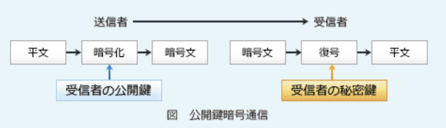

---
61.大学のキャンパス案内のWebページ内に他のWebサービスが提供する地図情報を組み込んで表示するなど、公開されているWebページやWebサービスを組み合わせて1つの新しいコンテンツを作成する手法

- A.**マッシュアップ**  
Web上に公開されている様々なWebサービスを組み合わせて、新しいWebサービスを作り出す手法のこと。Web上には様々なWebサービスのAPIが公開されているため、自社開発をしなくてもそれらのWebサービスを積極的に活用することで、短期間でサービスを開発し、リリースすることができる

- シングルサインオン  
ユーザー認証を一度受けるだけで、許可された複数のサーバやアプリケーションへのアクセスについても認証する仕組み

- デジタルフォレンジックス  
不正アクセスや情報漏えいなどのセキュリティインシデントの発生時に、原因究明や法的証拠を保全するために対象となる電子的記録を収集・解析すること

- トークン  
情報セキュリティにおいては、認証でワンタイムパスワードを生成する物理的デバイスのことを指す

---
62.アドホックネットワークの説明

- A.**アクセスポイントを経由せず、端末同士が相互に通信を行う無線ネットワーク**

アクセスポイントを介さずに、端末同士が1対1で直接通信する無線ネットワークのこと。無線LANの動作モードの1つとして規定されています。ゲーム機同士やスマートフォン同士で直接通信したり、IT機器とプリンターが直接通信したりするのが身近な例。アドホックとは反対にアクセスポイントを介して通信する方式は、インフラストラクチャモードと呼ぶ

- インターネット上に、セキュリティが保たれたプライベー卜な環境を実現するネットワーク  
VPN(*Virtual Private Network*)の説明

- サーバと、そのサーバを利用する複数台のPCをつなぐ有線ネットワーク  
LAN(*Local Area Network*)に該当する

- 本店と支店など、遠く離れた拠点間を結ぶ広域ネットワーク  
WAN(*Wide Area Network*)に該当する

---
63.スマートフォンやタブレットなどの携帯端末に用いられている、OSS(*Open Source Software*)であるOS

- A.**Android**  
Google社が開発しているLinuxベースのオープンソースのOS。スマートフォンやタブレット、テレビやプロジェクタ、カーナビなど幅広い製品に搭載されている

- iOS  
Apple社が開発しているモバイル端末用のOSで、オープンソースではない

- Safari  
Apple社が開発しているWebブラウザで、オープンソースではない

- Windows  
Microsoft社が開発しているOSで、オープンソースではない

---
64.ファイアウォールの設置によって実現できる事項として適切なもの

- A.**外部に公開するWebサーバやメールサーバを設置するためのDMZの構築**  
ネットワークを外部、内部、中間的なエリア(DMZ)に分離し、各セグメント間の通信をファイアウォールで制御することで独立した3つの区画として管理することができる

- A.**外部のネットワークから組織内部のネットワークへの不正アクセスの防止**  
外部から内部ネットワークへの不正な通信は、ファイアウォールで遮断することができる。ファイアウォールの主な役割の1つ

不正なデータの通過を阻止するためにネットワーク同士の境界線に設置する機器や機能

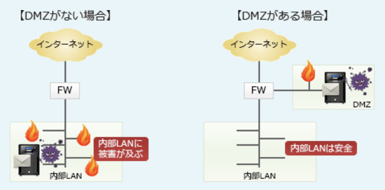

- サーバルームの入り口に設置することによるアクセスを承認された人だけの入室  
通信を制御するためのもので、物理的な入退室管理に使うものではない

- 不特定多数のクライアントからの大量の要求を複数のサーバに動的に振り分けることによるサーバ負荷の分散  
負荷分散の機能はない。負荷分散を行う機器はロードバランサ

---
65.条件によって、関係データベースで管理する"従業員"表と"部門"表を作成した。"従業員"表の主キーとして最も適切なもの  
1.各従業員は重複のない従業員番号を1つもつ  
2.同姓同名の従業員がいてもよい  
3.各部門は重複のない部門コードを1つもつ  
4.1つの部門には複数名の従業員が所属する  
5.1人の従業員が所属する部門は1つだけである

従業員  
従業員番号:従業員名:部門コード:生年月日:住所  
部門  
部門コード:部門名:所在地

- A.**従業員番号**

主キーは関係データベースにおいて、テーブル(表)中の各行を一意に特定できる値をもつ属性(列)または属性の組合せで最小のもの。主キーはテーブルごとに設定される。条件1から、従業員番号だけで従業員番号表の各行を特定することができる

- 従業員番号と部門コード  
最小のものでないといけないため、部門コードが余分

- 従業員名  
同姓同名の従業員がいる場合に1つの行を特定できない

- 部門コード  
複数の従業員が同じ部門に属することが考えられるため、部門コードでは従業員表の1行を特定はできない。部門コードは部門表の主キー

---
66.IoT機器やスマートフォンなどに内蔵されているバッテリの容量の表記において、100mAhの意味として適切なもの

- A.**100mAの電流を1時間放電できる**  
バッテリ容量の表記の単位であるmAhは、1時間でバッテリの容量全部を放電した場合にどれだけの電流を流せるかを表す。値が大きいほどバッテリの容量も多いということになる

---
67.ディープラーニングに関する記述

- A.**コンピュータが大量のデータを分析し、ニュートラルネットワークを用いて自ら規則性を見つけ出し、推論・判断を行う**

ディープラーニング(深層学習)は、コンピュータに自ら学習する能力を与える機械学習の1つで、人間や動物の脳神経をモデル化したアルゴリズム(ニューラルネットワーク)を多層化したものを用意し十分な量のデータを与えることで、コンピュータが人間の力なしに自律的に特徴点やパターンを学習することをいう。人工知能分野における要素技術の1つで、これまでの機械学習よりも精度が優れていることから、近年におけるAIの急激な発展と普及の根幹を支える技術となっている

- インターネット上に提示された教材を使って、距離や時間の制約を受けることなく、習熟度に応じて学習をする方法である  
eラーニングの説明

- 体系的に分類された特定分野の専門的な知識から、適切な回答を提供する  
エキスパートシステムの説明

- 1人1人の習熟度、理解に応じて、問題の難易度や必要とする知識、スキルを推定する  
アダプティブラーニングの説明

---
68.無線LANルータにおいて、外部から持ち込まれた端末用に設けられた、"ゲストポート"や"ゲストSSID"などと呼ばれる機能によって実現できることの説明として適切なもの

- A.**端末から内部ネットワークには接続をさせず、インターネットにだけ接続する**  
ゲストポートは、無線LANルータを介して内部ネットワークに接続させず、インターネットにだけ接続できる機能

- 端末がマルウェアに感染していないかどうかを検査し、安全が確認された端末だけを接続する  
検疫ネットワークの説明。ゲストポートは、マルウェアの検査をする機能ではない

- 端末と無線LANルータのボタン操作だけで、端末から無線LANルータへの接続設定ができる  
WPS(*Wi-Fi Protected Setup*)の説明。ベンダーによってはAOSS(*AirStation One-Touch Secure System*)や、らくらく無線スタートという名称が付いていることもある

- 端末のSSIDの設定欄を空欄にしておけば、SSIDが分からなくても無線LANルータに接続できる  
SSIDのANY接続の説明。端末の検索でアクセスポイントが見つかりパスワードだけ入力すれば接続できるのは、ANY接続が許可されているため

---
69.サイバーキルチェーンの説明

- A.**情報システムへの攻撃段階を、偵察、攻撃、目的の実行などの複数のフェーズに分けてモデル化したもの**

サイバーキルチェーンは、サイバー攻撃の手順を攻撃者の視点からいくつかの段階に分けモデル化したもの。攻撃の段階としては、「偵察」「武器化」「配送」「攻撃」「インストール」「遠隔操作」「目的達成」の7段階が一般的。攻撃者の視点からサイバー攻撃を見ることで、各段階における防御策の立案に役立てることができる

- ハブやスイッチなどの複数のネットワーク機器を数珠つなぎに接続していく接続方式  
デイジーチェーン接続の説明

- ブロックと呼ばれる幾つかの取引記録をまとめた単位を、1つ前のブロックの内容を示すハッシュ値を設定して、鎖のようにつなぐ分散管理台帳技術  
ブロックチェーンの説明

- 本文中に他者への転送を促す文言が記述された迷惑な電子メールが、不特定多数を対象に、ネットワーク上で次々と転送されること  
チェーンメールの説明

---
70.電子メールにデジタル署名を付与することによって得られる効果

- A.**完全性が向上する**  
情報が完全で、改ざん・破壊されていない特性を示す

送信元の確認と改ざん検知を目的とした技術。電子メールにデジタル署名をすることで、もし通信経路で改ざんがあってもそれを検知できるようになる。これによりデータの完全性が高まる

- 可用性が向上する  
ユーザが必要な時に、必要な機能を利用可能である特性を示す

- 機密性が向上する  
許可された正規のユーザだけが情報にアクセスできる特性を示す

---
71.文書作成ソフトがもつ機能である禁則処理が行われた例

- A.**行頭に置こうとした句読点や閉じ括弧が、前の行の行末に移動した**

特に日本語の文書作成・組版において、行の最後や行の先頭にあると変な文字(禁則文字)がそこにきた場合、自動的に次の行や前の行に移動させること。文書作成ソフトには文章を読みやすくする目的で禁則処理の機能が備わっていることが多い。  
句読点や記号(!や?)、小さい文字(っゃゅょ)、閉じカッコなどが行頭に来ないようにする、記号(¥$@#など)や開きカッコが行末にこないようにする

- 改行後の先頭文字が、指定した文字数分だけ右へ移動した  
オートインデント機能の例

- 行頭の英字が、小文字から大文字に変換された  
キャピタライズ処理の例

- 文字列の文字が、指定した幅の中に等間隔に配置された  
均等割り付けの例

---
72.情報セキュリティにおける機密性・完全性・可用性とインシデントによって損なわれたものの組み合わせ

可用性
- A.**DDoS攻撃によって、Webサイトがダウンした**  
Webサイトのダウンによりサービスを利用できなくなるので、可用性が低下する

完全性
- A.**キーボードの打ち間違いによって、不正確なデータが入力された**  
不正確なデータが混入するとデータの正しさが低下し、完全性が低下する

機密性
- A.**PCがマルウェアに感染したことによって、個人情報が漏洩した**  
秘密情報を正規の利用者以外の第三者に知られたため、機密性が低下する

---
73.膨大な数のIoTデバイスをインターネットに接続するために大量のIPアドレスが必要となり、IPアドレスの長さが128ビットで構成されているインターネットプロトコルを使用することにした。このプロトコルはどれか

- A.**IPv6**  
現在使われているIP(*Internet Protocol*)は、アドレス長が32ビットのIPv4と、アドレス長が128ビットのIPv6。IPv4は約43億個のIPアドレスしか表現できずアドレス空間の不足が現実化したため、徐々にIPv6への移行が行われている

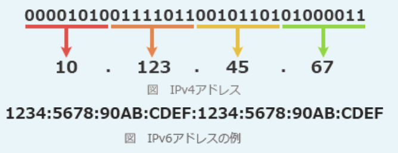

---
74.サーバ室など、セキュリティで保護された区画への入退室管理において、1人の認証で他者も一緒に入室する共連れの防止対策として、利用されるもの

- A.**アンチパスバック**  
利用者IDごとに入退室の時刻を記録することで、以下のような矛盾がある入退室行動を制限する。
1.直近の記録が入室である利用者の入室行動  
2.直近の記録が退室である、または入室記録がない利用者の退室行動  
通常の利用ならば入室と退室はペアになっているため、このような矛盾は生じない。しかし「他人が入室する際に一緒に入室してしまう」「他人が退室するのとすれ違いに入室する」などの共連れ行為で入室した利用者は、正当な方法での退室が禁止されることになる。1人ずつ通過できるゲートの設置、監視カメラの設置、常駐警備員の配置なども対策となる

- コールバック  
受信側が一旦回線を切断した後、発信側にかけ直すことでアクセス権をもつ端末であることを確認する方法

- シングルサインオン  
利用者認証を一度受けるだけで許可された複数のサーバへのアクセスについても認証する技術

- バックドア  
1度不正侵入に成功したコンピュータやネットワークにいつでも再侵入できるように、攻撃者によって設けられた通信接続の機能

---
75.バイオメトリクス認証に関する記述

- A.**筆跡やキーストロークなどの本人の行動的特徴を利用したものも含まれる**  
個人の行動特性を認証鍵として用いる方式もある

人間の身体的な特徴や行動の特性など個人に固有の情報を用いて本人の認証を行う方式。事前に本人の生体特徴情報を認証システムに登録しておき、認証時にはセンサーで読み取った情報を比較することで本人確認を行う仕組み。  
認証方式として、身体的特徴を鍵として用いるものに指紋、静脈パターン、虹彩、声紋、顔、網膜による認証などがあり、行動的特徴を鍵として用いるものには筆跡認証などがある

- 指紋や静脈を使用した認証は、ショルダーハックなどののぞき見行為によって容易に認証情報が漏えいする  
認証鍵となる生体情報は見ただけでコピーできるものではないので、のぞき見されても容易に漏えいすることはない

- 装置が大型なので、携帯電話やスマートフォンには搭載できない  
スマートフォンの本人認証として指紋認証や顔認証が実用化されている

- 他人を本人と誤って認証してしまうリスクがない  
他人であるにもかかわらず本人であると誤認してしまう確率(他人受入率)と、本人であるにもかかわらず本人ではないと判断されてしまう確率(本人拒否率)が一定割合で存在する

---
76.情報セキュリティのリスクマネジメントにおけるリスク対応を、リスク回避・リスク共有・リスク低減・リスク保有の4つに分類するとき、情報漏えい発生時の損害に備えてサイバー保険に入ることはどれに分類されるか

- A.**リスク共有**  
対象業務をアウトソーシングしたり損害保険を掛けたりするなどして、リスクを1つ以上の他者と共有すること(病気の保険とか)

保険に入ることにより、損害発生時の金銭的な負担の全部または一部が保険会社に移る。保険会社は発生する損害を負担することになるため、リスクは保険会社と共有されることになる。リスクに対して金銭的な手当をすることをリスクファイナンシングといい、リスク共有策の代表的な事例

- リスク回避  
リスク源を除去してリスクが現実化する確率をゼロにすること(飲酒運転禁止みたいな)

- リスク低減  
リスクが現実化する確率を低くする、もしくはリスクが現実化したときの損害を小さくすること、またはその両方(手順書とか)

- リスク保有  
リスクに対してあえてコントロールを行わず、リスクをそのまま受け入れること

---
77.トランザクション処理のACID特性に関する記述

- A.**データの更新時に、一連の処理が全て実行されるか、全く実行されないように制御することによって、原子性を保証することができる**  
ACID特性のうち原子性に関する記述。トランザクション処理は、必ずコミットかロールバックで終了することで原子性が確保されている

ACID特性は、データベースのトランザクション処理が備えるべき4つの性質(*Atomicity*・*Consistency*・*Isolation*・*Durability*)の頭文字を並べた言葉。  
*Atomicity*:原子性  
トランザクション内の処理がすべて実行されるか、または全く実行されないことを保証する性質  
*Consistency*:一貫性  
トランザクションによりデータの矛盾が発生せず、常にデータベースの整合性が保たれていることを保証する性質  
*Isolation*:独立性  
複数のトランザクションを同時に実行した場合と、順番に実行した場合の結果が等しくなることを保証する性質  
*Durability*:永続性  
一旦正常終了したトランザクションの結果は、以後システムに障害が発生しても失われないことを保証する性質

- 索引を用意することによって、データの検索時の検索速度を高めることができる  
データベースへのアクセス効率を向上させるために、検索対象となるデータ項目に対して設定するインデックスの記述

- DBの複製を複数のサーバに分散配置することによって、可用性を高めることができる  
レプリケーションに関する記述

- テーブルを正規化することによって、データに矛盾や重複が生じるのを防ぐことができる  
正規化とは、データの重複や矛盾が生じるのを防ぎ、保守性を高めるために、テーブルを一定の規則に従って分割・整理すること。ACID特性はトランザクションに関連することなので無関係

---
78.関数checkDigitは、10進9桁の整数の各桁の数字が上位の桁から順に格納された整数型の配列originalDigitを引数として、次の手順で計算したチェックデジットを戻り値とする。プログラム中のaに入れる字句として、適切なものはどれか。配列の要素番号は1から始まる  
1.配列originalDigitの要素番号1 ~ 9の要素の値を合計する  
2.合計した値が9より大きい場合は、合計した値を10進の整数で表現したときの各桁の数字を合計する。この操作を、合計した値が9以下になるまで繰り返す  
3.2で得られた値をチェックデジットとする。

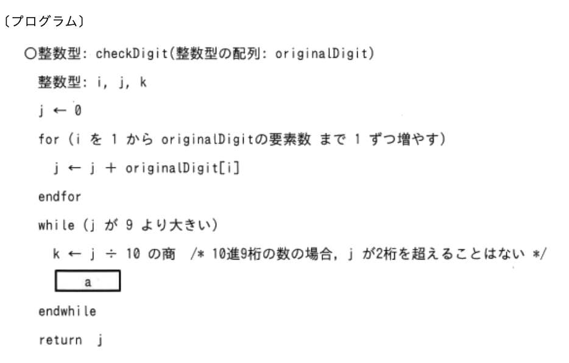

- A.**j ← k + (j - 10 * k)**

while文に入ったときの変数jには、for文の繰返し処理により、  
1の結果、配列originalDigitの要素番号1 ~ 9の要素の値を合計値が格納されている。  
2の結果、変数j >= 9の場合、「合計した値を10進の整数で表現したときの各桁の数字を合計する」ことになっている。j = 35の場合、jに格納する値は8  
プログラムを見ると、aの1行前では、k ← j ÷ 10の商という処理を行っている。これは変数kに変数jの十の位の数字を求める処理。j = 35であれば、kに3が格納される  
次に解答群を見ると、aは変数jに代入する処理なので、変数jの一の位の数字を求めてそれと変数k(十の位の数字)とを足し合わせる処理をしなければならないことが分かる。2桁の数の一の位の数字を求めるには、  
35 - 30 = 5 → 35 - 3 * 10 = 5  
このように、2桁の数からその十の位の数字 * 10を引くことによって実現でき、これを変数kと変数jを使って表すと「j - k * 10」という式になる

---
79.流れ図で示す処理を終了した時のxの値

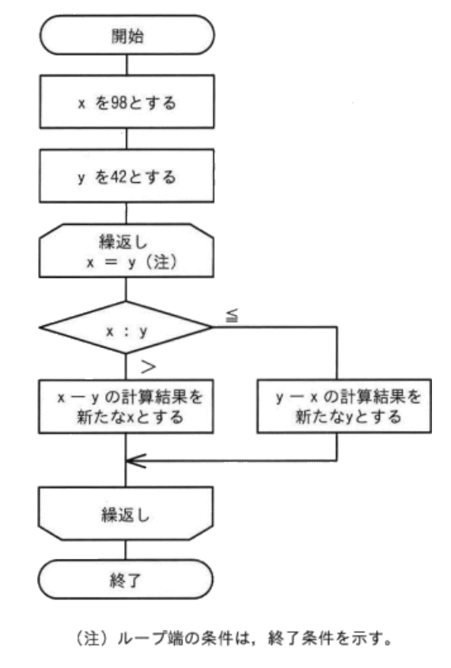

- A.**14**

x > yなので、x ← 98 - 42 = 56  
x > yなので、x ← 56 - 42 = 14  
x <= yなので、y ← 42 - 14 = 28  
x <= yなので、y ← 28 - 14 = 14  
x = yとなり、繰返し処理が終了

---
80.自動車などの移動体に搭載されたセンサーや表示機器を通信システムや情報システムと連動させて、運転者へ様々な情報をリアルタイムに提供することを可能にするもの

- A.**テレマティクス**  
電気通信(*Telecommunication*)と情報科学(*Informatics*)から作られた造語で、自動車や輸送車両などの移動体で通信システムを利用し、様々なサービスを提供することの総称。カーナビと連動してリアルタイムな情報を提供する、緊急時などにコールセンターとつながる、リモート操作などのサービスが実用化されている

- アクチュエータ  
入力された電気信号を力学的な運動に変換する駆動機構で、機械や電気回路の構成要素。IoT関連だと、電子錠システムにおける回転ラッチのようなハンドルやレバー、ロボットの関節部、電子弁などコンピュータからの指示を受けて伸縮・屈伸・回転する部分が該当する

- キャリアアグリゲーション  
周波数帯の異なる複数の搬送波を束ねることで高速な無線通信を実現する仕組み。キャリア(*Carrier*)は運搬人という意味、アグリゲーション(*aggregation*)は集約・集合という意味

- スマートメータ  
インターネット機能を有し、自動で検針できる電力メーター

---
81.CPUの性能に関する記述

- A.**32ビットCPUと64ビットCPUでは、64ビットCPUの方が一度に処理するデータ長を大きくできる**  
CPUのビット数は一度の演算で処理できるビット長を表す

- CPU内のキャッシュメモリの容量は、少ないほどCPUの処理速度が向上する  
CPUと主記憶(メインメモリ)の速度差を埋めるために搭載されている記憶装置。容量が多いほどキャッシュメモリにアクセスする割合が上がるので、CPUの処理速度は向上する。容量が少ないと遅い主記憶にアクセスしなければならないのでCPUの処理効率は下がる

- 同じ構造のCPUにおいて、クロック周波数を下げると処理速度が向上する  
コンピュータの内部ではクロックという信号に同期して処理が行われている。クロック周波数は、クロックが1秒間に何回発振されるかを表す数値。同期の回数が多ければそれだけ単位時間当たりに多くの処理をすることができるので、一般にコンピュータの機種・製品が同じであればクロック周波数が高いほど処理速度は速くなる

- デュアルコアCPUとクアッドコアCPUでは、デュアルコアCPUの方が同時に実行する処理の数を多くできる  
デュアルコアCPUはCPUコアを2つ搭載したCPU、クアッドコアCPUはCPUコアを4つ搭載したCPU。それぞれのコアには別の処理を割り振ることができるので、一般的にはコア数が多いクアッドコアCPUのほうが多くの処理をすることができる

---
82.A社では、従業員の利用者IDとパスワードを用いて社内システムの利用者認証を行っている。セキュリティを強化するために、このシステムに新たな認証機能を1つ追加することにした。このシステムに追加することによって、二要素認証になる機能

- A.**A社の従業員証として本人に支給しているICカードを読み取る認証**  
ICカードは持っている情報に該当するので、二要素認証になる

- A.**あらかじめシステムに登録しておいた本人の顔の特徴と、認証時にカメラで読み取った顔の特徴を照合する認証**  
生体情報は有している情報に該当するので、二要素認証になる

ICカードとパスワード、指紋とパスワードなどのように、利用者が**知っている**・**持っている**・**有している**情報のうち2種類の要素を組み合せて認証を行う方式。  
・知っている:ユーザーID、パスワード、ジェスチャー、PINコードなど  
・持っている:ICカード、キャッシュカード、ワンタイムパスワードトークンなど  
・有している:指紋、虹彩、顔、静脈その他の生体情報など  
利用者IDとパスワードは"知っている"情報に該当するので、二要素認証になるのは"持っている"または"有している"情報による認証を組み合わせた場合

- あらかじめシステムに登録しておいた本人しか知らない秘密の質問に対する答えを入力させる認証  
秘密の質問に対する答えは知っている情報なので、二要素認証にはならない

---
83.データを行と列から成る表形式で表すDBのモデル

- A.**関係モデル**  
データを列と行から成る二次元の表として管理するモデル。複数の表は属性の値で関連付けられる。現在最も普及しているDBモデルで、DBといえば大体は関係DBを指す

- オブジェクトモデル  
データとその処理方法を1つにまとめて定義し、オブジェクトとして記憶装置に格納するモデル。テーブル設計は行わない

- 階層モデル  
データを木構造で構成し、あるレコードには1つの親レコードと複数の子レコードが関連をもつモデル。親と子は1対多の関係で関連付けられる(ほぼ用いられない)

- ネットワークモデル  
データ同士の関連を網の目のように表現するモデル。各データ間は多対多の関係で関連付けられる

---
84.IoT機器の記録装置としても用いられ、記録媒体が半導体でできており物理的な駆動機構をもたないので、HDDと比較して低消費電力で耐衝撃性も高いもの

- A.**SSD**  
SSD(*Solid State Drive*)は、記憶媒体としてUSBメモリと同じフラッシュメモリを用いる補助記憶装置で、HDDの代替として利用できる。ハードディスクのようにディスクを持たないため、ヘッドのシークタイムやサーチタイムがなく高速に読み書きできる。また、モータがないため消費電力が少ない、機械的に駆動する部品がないため衝撃に強いといった特徴がある

- DRM  
DRM(*Digital Rights Management*)は、デジタルコンテンツの著作権を保護することを目的とした技術の総称。データの暗号化、コピーガード、利用者認証、利用可能期間の設定などの仕組みによって不正な複製や再利用を防止する

- DVD  
データ記録メディアとして利用される光学ディスクの1つ

- HDMI  
映像と音声をデジタルデータで転送するAV機器向けのインタフェース規格。テレビやレコーダ、PCの入出力端子として使われている

---
85.情報セキュリティポリシーを、基本方針・対策基準・実施手順の3つの文書で構成したとき、これらに関する説明のうち適切なもの

- A.**基本方針は、対策基準や実施手順を定めるためのトップマネジメントの意思を示したものである**  

組織が保有する情報資産の情報セキュリティ対策について総合的・体系的かつ具体的にとりまとめたもの。一般的にセキュリティポリシー群は、組織のセキュリティの目標と目標を達成するために組織の構成員がとるべき行動等を宣言するポリシー(基本方針)、基本方針に従い何を実施しなければならないのかを規定するスタンダード(対策基準)、対策基準を詳細化し手順を示すプロシージャ(実施手順)で構成される。

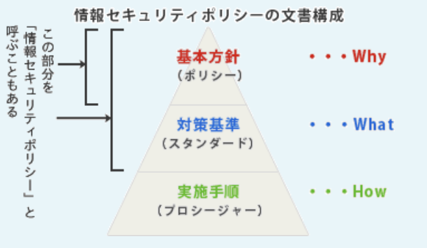

・基本方針  
組織の経営者が、「情報セキュリティに本格的に取り組む」という姿勢を示し、情報セキュリティの目標と、その目標を達成するために企業がとるべき行動を社内外に宣言するもの。「なぜセキュリティが必要か」という「Why」について規定し、何をどこまで守るのか(対象範囲)、誰が責任者かを明確にする。業界標準、該当する法令、政府規制への準拠を宣言する場合もある  
・対策基準  
基本方針で作成した目的を受けて、「何を実施しなければならないか」という「What」について記述する。組織的に情報セキュリティ対策を行うためのルール集で、人事規程や就業規程などの類の企業の構成員が守るべき「規程類」に相当する。実際に守るべき規程を具体的に記述し、適用範囲や対象者を明確にする  
・実施手順  
対策基準で定めた規程を実施する際に、「どのように実施するか」という「How」について記述する。マニュアル的な位置づけの文書であり、詳細な手順を記述する

- 実施手順は、基本方針と対策基準を定めるために実施した作業の手順を記録したものである  
基本方針と対策基準を確実に実行するための個々の業務手順・運用規則・マニュアルに相当する。基本方針と対策基準を作成するための作業手順ではない

- 対策基準は、ISMSに準拠した情報セキュリティポリシーを策定するための文書の基準を示したものである  

- 対策基準は、情報セキュリティ事故が発生した後の対策を実施手順よりも詳しく記述したものである  

---
86.情報セキュリティにおけるリスクアセスメントを、リスク特定・リスク分析・リスク評価の3つのプロセスに分けたとき、リスク分析に関する記述

- A.**受容基準と比較できるように、各リスクのレベルを決定する必要がある**  
リスクのレベルを決定するのはリスク分析の活動

リスクアセスメントは、対象組織に存在するリスクを認識し、リスクの大きさを評価し、そのリスクが許容できるか否かを決定する一連のプロセス。JIS Q 27000で「リスク特定・リスク分析及びリスク評価のプロセス全体」と定義されているように、リスク特定・リスク分析・リスク評価までの活動を含む  
・リスク特定  
リスクを発見し、認識する  
リスク所有者を特定する  
・リスク分析  
リスクの特質を理解し、リスクレベルを決定する  
リスクが実際に生じた場合の損害の大きさ及び起こりやすさを算定する  
・リスク評価  
リスク分析の結果と事前に定めておいたリスク基準とを比較する  
リスク対応のために、分析したリスクの優先順位付けを行う

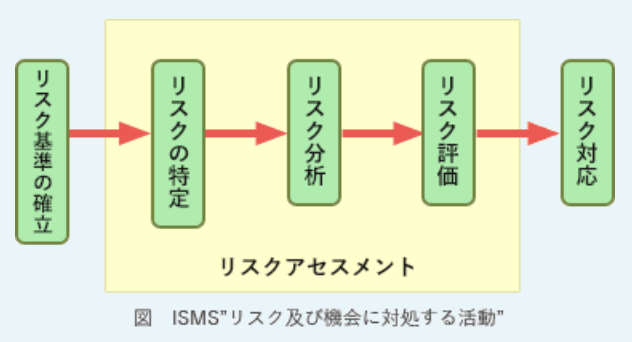

- 全ての情報資産を分析の対象にする必要がある  
リスク分析が対象とするのはリスク特定で認識されたリスク。リスクが認識されなかった情報資産についてはリスク分析の対象外

- 特定した全てのリスクについて、同じ分析技法を用いる必要がある  
リスク分析には、ベースラインアプローチ、詳細リスク分析、非公式アプローチなどいくつか手法がある。1つの手法を用いることもできるが、分析にかかる時間とコストを最適化するため、組織や情報資産の重要度に応じて複数の手法を組み合わせることもできる

- リスクが受容可能かどうかを決定する必要がある  
リスクが需要可能か決定するのはリスク対応のプロセス

---
87.メールサーバから電子メールを受信するためのプロトコルの1つで、次の特徴をもつもの  
1.メール情報をPC内のメールボックスに取り込んで管理する必要がなく、メールサーバ上に複数のフォルダで構成されたメールボックスを作成してメール情報を管理できる  
2.PCやスマートフォンなど使用する端末が違っても、同一のメールボックスのメール情報を参照・管理できる

- A.**IMAP**  
*Internet Message Access Protocol*の略。電子メールをクライアントコンピュータ上のメールソフトではなくメールサーバ上で管理することで、複数の端末が利用する場合のメール状態の一元管理やメールの選択受信などの機能を実現したメール受信用プロトコル。POP(*Post Office Protocol*)と異なり、メールをPCに取り込んでもメールサーバ上にメールが残るという特徴がある

- NTP  
*Network Time Protocol*の略。ネットワークに接続されたサーバとクライアントのシステム時計を正しい時刻(協定世界時:UTC)に合わせるためのプロトコル

- SMTP  
*Simple Mail Transfer Protocol*の略。インターネット環境において、クライアントからメールサーバに電子メールを送信したり、メールサーバ間で電子メールを転送したりするのに用いられるプロトコル

- WPA  
*Wi-Fi Protected Access*の略。無線LANにおいてクライアント端末とアクセスポイントの間の通信を暗号化する規格

---
88.IoTデバイスで収集した情報をIoTサーバに送信するときに利用されるデータ形式に関する記述  

- A.**csv**形式は、コンマなどの区切り文字でデータの区切りを示すデータ形式であり、**XML**形式は、マークアップ言語であり、データの論理構造を、タグを用いて記述できるデータ形式である

CSV(*Comma Separated Value*)は、氏名, 住所, 生年月日のように各項目値をコンマで区切って記述するデータ形式。1つの行が1件のデータを表す。  
RSS(*RDF Site Summary*)は、ブログやニュースサイト、電子掲示板などのWebサイトで、効率の良い情報収集や情報発信を行うために用いられるXMLベースの文書フォーマットの総称。  
JSON(*JavaScript Object Notation*)は、{パラメータ名1 : 値1, パラメータ名2 : 値2}というようにコロンで連結したパラメータ名と値の組をコンマで区切って指定する形式。  
XML(*eXtensible Markup Language*)は、ユーザーが独自に定義したタグを用いて文書構造を記述するマークアップ言語

---
89.電子メールを作成するときに指定する送信メッセージに用いられるテキスト形式とHTML形式に関する記述

- A.**電子メールの本文の任意の文字列にハイパーリンクを設定できるのは、テキスト形式ではなく、HTML形式である**  
本文内に任意のハイパーリンクを設定できるのはHTML形式

・テキスト形式  
文字装飾等のない文字だけで記述されるもの  
・HTML形式  
HTML(*HyperText Markup Language*)で記述され、Webページと同じように文字の装飾やレイアウト、画像の挿入などを自由自在に行うことができるもの

HTML形式ではWebページと同じようにスクリプト(ブラウザ上で実行されるプログラム)を記述することもできるので、攻撃者が悪意のあるスクリプトを挿入する余地があり、メールを開くと同時にHTML中のスクリプトが自動実行されることにより被害を受ける可能性がある。一昔前は攻撃のおそれがあるとしてHTML形式でメールを送るのはマナー違反とされていたが、最近ではビジネスでHTML形式のメールを使うことも普通になってきたため、攻撃に使われるリスクも高まっているといえる。取り扱う際には危険性があることを再確認しておく必要がある

- 受信した電子メールを開いたときに、本文に記述されたスクリプトが実行される可能性があるのは、HTML形式ではなく、テキスト形式である  
本文内に記述されたスクリプトが実行される可能性があるのは、HTML形式

- 電子メールにファイルを添付できるのは、テキスト形式ではなく、HTML形式である  
ファイルの添付はテキスト形式、HTML形式のどちらでもできる

- 電子メールの本文の文字に色や大きさなどの書式を設定できるのは、HTML形式ではなく、テキスト形式である  
本文の文字を装飾することができるのは、HTML形式

---
90.ディレクトリ又はファイルがノードに対応する木構造で表現できるファイルシステムがある。ルートディレクトリを根として図のように表現したとき、中間ノードである節及び末端ノードである葉に対応するものの組合せとして最も適切なもの

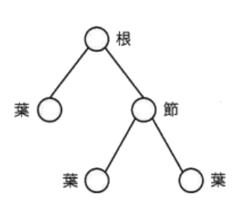

- A.節:**ディレクトリ**、葉:**ディレクトリ又はファイル**  
ディレクトリは、ファイルや別のディレクトリを格納できる箱のようなもので、Windowsではフォルダと呼ばれる。ディレクトリにはファイルや別のディレクトリを格納することができるが、ファイルの中に別のファイルやディレクトリを格納することはできない。  
一般的にファイルシステムは木構造になっていてノード間には親子関係がある。節は子ノードを持っているのでディレクトリに対応する。葉は子を持たないノードなのでファイルまたは空のディレクトリに対応する

---
91.ソーシャルエンジニアリングに該当する行為の例

- A.**肩越しに盗み見して入手したパスワードを利用し、他人になりすましてシステムを不正利用する**  
人のミスや心理的な隙に付け込むことで秘密情報を不正に取得する方法の総称。  
関係者を装って電話でパスワードを聞き出す(なりすまし)、肩越しに画面やキー入力を見る(ショルダーハッキング)、プリンターやデスクやごみ箱に残された書類を漁る(トラッシング)などの行為がソーシャルエンジニアリングの代表例

- あらゆる文字の組合せを総当たりで機械的に入力することによって、パスワードを見つけ出す  
ブルートフォース攻撃(総当たり攻撃)の事例

- 標的のサーバに大量のリクエストを送りつけて過負荷状態にすることによって、サービスの提供を妨げる  
DoS攻撃の事例

- プログラムで確保している記憶領域よりも長いデータを入力することによってバッファをあふれさせ、不正にプログラムを実行させる  
バッファオーバーフロー攻撃の事例

---
92.IoTエリアネットワークの通信などに利用されるBLEは、Bluetooth4.0で追加された仕様である。BLEに関する記述で適切なもの

- A.**一般的なボタン電池で、半年から数年間の連続動作が可能なほどに低消費電力である**  
BLEは、主にIoT向けの低消費電力の無線通信方式

BLE(*Bluetooth Low Energy*)は、無線通信規格Bluetoothの一部で、低消費電力に特化した通信モード。ボタン電池1個で数ヶ月から数年間の連続稼働ができるほど省電力性に優れ、低コストであることからIoTネットワークでの活用が期待されている。最大通信距離は選択する速度によって異なるが10ｍ ~ 400ｍ程度

- Wi-Fiのアクセスポイントとも通信ができるようになった。  
無線LANとは通信方式が異なるため互換性はない

- 従来の規格であるBluetooth3.0以前と互換性がある  
Bluetooth3.0以前とは通信方式が異なるため互換性はない

- デバイスとの通信には、赤外線も使用できる  
通信には従来からのBluetoothと同じく2.4GHz帯の電波を使用する。赤外線は使用できない

---
93.A3判の紙の長辺を半分に折るとA4判の大きさになり、短辺:長辺の比率は変わらない。A3判の長辺はA4判の長辺のおよそ何倍か

- A.**1.41**

用紙サイズ同士は相似形であり、用紙サイズが1つ小さくなるごとに用紙の面積が半分になる。辺の長さを見てみると、A4判の長辺はA3判の短辺と同じ、A4判の短辺はA3の長辺の半分の長さになっている。

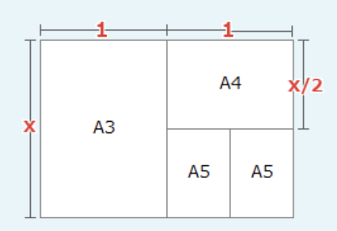

A3判とA4判の短辺：長辺の比は変わらないため、  
x : 1 = 1 : x / 2  
x ** 2 / 2 = 1  
x ** 2 = 2  
x = 2 ** 0.5

---
94.インクジェットプリンターの印字方式

- A.**インクの微細な粒子を用紙に直接吹き付けて印字する**  
微細なインク粒をプリンターヘッドのノズルから紙に直接吹き付けることで印刷するプリンタ。本体価格やランニングコストの安さ、用途の広さから一般家庭に普及している

- インクリボンを印字用のワイヤなどで用紙に打ち付けて印字する  
インパクトプリンターの印字方式。カーボン紙や感圧紙などの複写用紙に印刷する際に使われるプリンター

- 熱で溶けるインクを印字ヘッドで加熱して用紙に印字する  
熱転写プリンターの印字方式

- レーザ光によって感光体にトナーを付着させて用紙に印字する  
レーザプリンターの印字方式

---
95.攻撃対象とは別のWebサイトから盗み出すなどによって、不正に取得した大量の認証情報を流用し、標的とするWebサイトに不正に侵入を試みるもの

- A.**パスワードリスト攻撃**  
複数のサイトで同様のID・パスワードの組合せを使用している利用者が多いという傾向を悪用したもので、あるサイトに対する攻撃などによって得られた利用者IDとパスワードのリストを用いて、別のサイトへの不正ログインを試みる攻撃

- DoS攻撃  
通常ではありえない数の通信をサーバに送り付けサーバやネットワーク回線を過負荷状態にし、システムダウンやサービス停止などの障害を作為的に引き起こす攻撃手法

- SQLインジェクション  
Webアプリケーションに対してDBへの命令文を構成する不正な入力データを与え、Webアプリケーションが想定していないSQL文を意図的に実行させることで、DBを破壊したり情報を不正取得したりする攻撃

- フィッシング  
銀行やクレジットカード会社、ショッピングサイトなどの企業を装ったメールを送付し、誘導先の偽サイトで個人情報を不正に取得する行為

---
96.関数calcXと関数calcYは、引数inDataを用いて計算を行い、その結果を戻り値とする。関数calcXをcalcX(1)として呼び出すと、関数calcXの変数numの値が、1 → 3 → 7 → 13と変化し、戻り値は13となった。関数calcYをcalcY(1)として呼び出すと、関数calcYの変数numの値が、1 → 5 → 13 → 25と変化し、戻り値は25となった。プログラム中のa・bに入れる字句の適切な組合せ

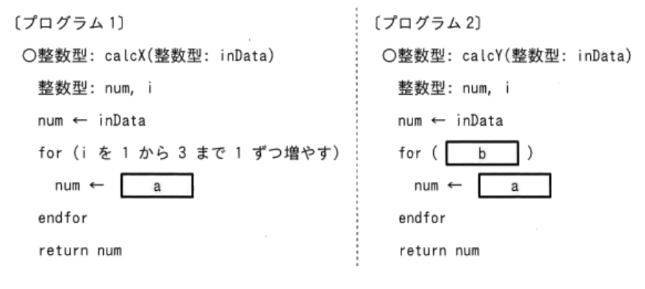

- A.**a:num + 2 * i**
- A.**b:iを2から6まで2ずつ増やす**

a:2 * num + iのとき  
num = 2 * 1 + 1 = 3  
num = 2 * 3 + 2 = 8  
num = 2 * 8 + 3 = 19

a:num + 2 * iのとき => こちらが適切  
num = 1 + 2 * 1 = 3  
num = 3 + 2 * 2 = 7  
num = 7 + 2 * 3 = 13

b:iを1から7まで3ずつ増やす  
num = 1 + 2 * 1 = 3  
num = 3 + 2 * 4 = 11  
num = 7 + 2 * 7 = 21

b:iを2から6まで2ずつ増やす => こちらが適切  
num = 1 + 2 * 2 = 5  
num = 5 + 2 * 4 = 13  
num = 13 + 2 * 6 = 25  

---
97.水田の水位を計測することによって、水田の水門を自動的に開閉するIoTシステムがある。図中のa・bに入れる字句の適切な組合せ

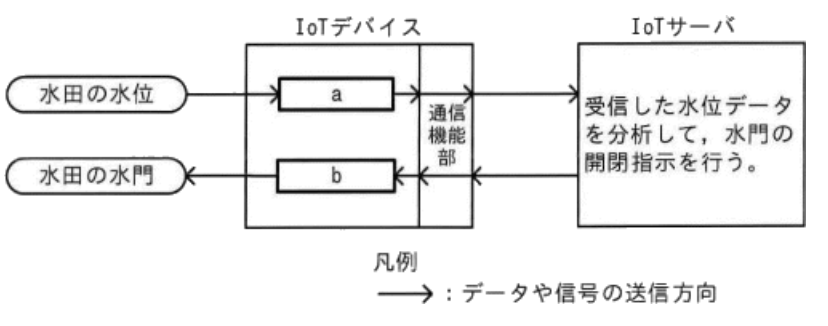

- A.**a:センサ**
- A.**b:アクチュエータ**

・センサ  
制御対象から測定した様々なアナログ情報を電気信号やデジタル情報に変換して、IoTサーバに送信する  
・IoTゲートウェイ  
IoTデバイスとIoTサーバの通信を中継する。この設問ではIoTデバイスとIoTサーバが直接通信しているのでIoTゲートウェイは使用しない  
・アクチュエータ  
IoTサーバからの指示を受け、制御対象に物理的な動作を行わせる  
