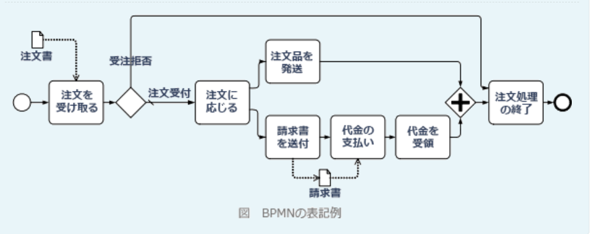
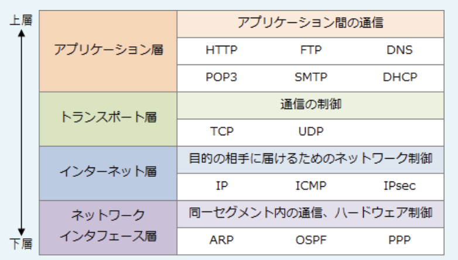

### 令和5年公開問題

### `ストラテジ系`

---
1.新しいビジネスモデルや製品を開発する際に、仮説に基づいて実用に向けた最小限のサービスや製品を作り、短期に顧客価値の検証を繰り返すことによって、新規事業などを成功させる可能性を高める手法

- A.**リーンスタートアップ**  
起業プロセスに関わる無駄をなくし、科学的にマネジメントを行うことで、起業・新事業・新製品開発で陥りやすい失敗を少なくすることを目的としている

- カニバリゼーション  
新たに市場に参入した商品が、類似する既存の自社商品の売り上げを奪ってしまう現象。自社商品同士でシェアを奪い合う現象

- 業務モデリング  
組織内で行っている業務を図式化して、全体像を可視化すること。ER図やDFD、フローチャートなどがあり、システム開発やビジネスプロセスの分析や改善に繋がることを目的としている

- デジタルトランスフォーメーション(DX)  
クラウド、モバイル、AI、IoTなどのデジタル技術を戦略的に活用して、生活を便利にしたり既存のビジネス構造に変革を起こすなど、新たな価値を生み出すイノベーション

---
2.著作権法によって定められた著作物に該当するもの

- A.**原稿なしで話した講演の録音**  
言語の著作物に該当する

- 時刻表に掲載されたバスの到着時間  
単なるデータなど事実を伝達する情報表示は該当しない。文芸、学術、美術、音楽の範囲に属しないという点も直作物性が否定される

- 創造性の高い技術の発明  
現に創作された"もの"である必要がある。思想・アイデアなので著作物ではない

---
3.観光などで訪日した外国人がもたらす経済効果を示す言葉

- A.**インバウンド需要**  
海外から日本国内に訪れる人々の消費活動でもたらされる経済効果

- アウトソーシング  
自社の業務を外部の業者に委託すること

- アウトバウンド需要  
日本国内の人々が海外に訪れるときの消費活動でもたらされる経済効果。海外旅行や海外製品の購入など

- インキュベーター  
新規ビジネスを世に出そうとする起業家や創業間もないベンチャー企業を支援する組織や団体

---
4.ASP利用方式と自社開発の自社センター利用方式(以下"自社方式")の採算性を比較する。次の条件のとき、ASP利用方式の期待利益(効果額－費用)が自社方式よりも大きくなるのは、自社方式の初期投資額が何万円を超えたときか。ここで、比較期間は5年とする  
・両方式とも、システム利用による効果額は500万円 / 年とする  
・ASP利用方式の場合、初期費用は0円、利用料は300万円 / 年とする  
・自社方式の場合、初期投資額は定額法で減価償却計算を行い、5年後の残存簿価は0円とする。運用費は100万円 / 年とする  
・金利やその他の費用は考慮しないものとする

- A.**1,000万円**  
両方式の効果額は同じ(500万円 * 5年 = 2,500万円)。単純にASP利用方式の費用が自社方式の費用より小さければ、ASP利用方式の機体利益が大きくなるため、費用が逆転するポイントを考えていく  
・ASP方式では初期費用は0円、300万円 / 年なので、5年間の費用は**1,500万円**  
・初期投資額と運用費の合計。運用費は100万円 / 年なので、5年間の費用は、初期投資額A + 500万円  
ASP利用方式の費用(1,500万円)よりも、自社方式の費用が大きくなるのは、  
「1,500万円 < A + 500万円」  
初期投資額が1,000万円を超えればASP利用方式の機体利益のほうが大きくなる

---
5.RPAの活用方法

- A.**提携的な事務処理の効率化**  
*Robotic Process Automation*は、AIやロボット技術を活かして、手作業で行なっていた定型的なPC作業をソフトウェアのロボットにより自動化する仕組み。プログラミングスキルを持たない人でも自動実行する仕組みを作成できる。決まった手順によって繰り返し行う定型的なPC作業に適している

- M&Aなどの戦略の採択  
一度限りの複雑な意思決定プロセスが必要な業務はRPAに適していない

- 個人の嗜好に合わせたサービス提供  
決まった手順を繰り返す処理しかできないため適していない

- 大量の行動データからの規則性抽出  
規則性を導くのには適していない。AIやデータマイニングツールの使用が適している

---
6.顧客の行動や天候、販売店のロケーション等の多くの項目から成るデータを取得している。データ分析から販売数量の変化を説明する際に、使用するパラメータをできるだけ少数に絞りたい。この時に用いる分析法

- A.**主成分分析**  
複数の要因が相互に関連している場合に、その群の特性を決定している主な要因を合成変数として求める手法。データセットの相関性を使用し、複数のパラメータを結合した"主成分"という新たな変数に情報を集約することで行う

- ABC分析  
パレート図を使って分析する要素・項目群を大きい順に並べ、上位70%を占める要素群をA、70 ~ 90%の要素群をB、それ以外の要素群をCとしてグルーピングすることで重要性の高い層とそれ以外を明らかにする手法

- クラスター分析  
複数の変数(項目、属性、次元数)を持つデータを利用し、変数間の相互の関係性を捉えるために使われる統計的手法。性質の異なる対象の中から、類似したものを集めてグルーピングするために使われる

- 相関分析  
2つの要素間にある関係性を分析する統計手法。要素が増加した時、他方の要素がどう変化するか調べ、結果は-1 ~ +1の値を取る相関係数として著される

---
7.経営戦略に基づいて策定される情報システム戦略の責任者として適切なもの

- A.**CIO**  
*Chief Information Officer*(最高責任者)の略で、企業や組織で、経営戦略を達成するために、どうIT化すれば良いか考えて情報戦略を立案し、具体的なIT投資計画を策定し、実現に最終的な責任をもつ

- 期間システムの利用部門の部門長  
期間システムの運用業務の責任者

- システム開発プロジェクトマネージャー  
プロジェクトの目的となっているシステム開発の責任者

- システム企画担当者  
情報システム戦略の責任者ではない

---
8.KGI(*Key Goal Indicator*)とKPI(*Key Performance Indicator*)の組み合わせで正しいもの

- **KGI:制約件数・KPI:提案件数**

KGI(重要目標達成指標)  
達成すべき到達目標を、定量的で測定可能な数値で表したもの。目標の達成度を測るために使う。客観的で最終的に達成したい目標

KPI(重要業績評価指標)  
目標達成のために行う活動の実施状況を測定するために使う。KGIを達成するための具体的なアクション

---
9.ソーシャルメディアポリシーを制定する目的

- A.**企業がソーシャルメディアを使用する際の心得やルールなどを取り決めて、社外の人々が理解できるようにするため**  
ソーシャルメディアポリシーは社内外に向けて伝達される。社外に公開することで、企業のソーシャルメディアの向き合い方について透明性が増し、ブランドイメージの保護や、ステークホルダからの信頼性が向上するなどのメリットがある

- A.**企業に属する役員や従業員が、公私限らずにソーシャルメディアを使用する際のルールを示すため**  
従業員の情報発信をコントロールし、自社のブランドイメージの保護や、ステークホルダに沿った情報発信を促すことにも繋がる

ソーシャルメディアポリシーは、起業がソーシャルメディアを使用するにあたり、目的や心構え、情報発信する従業員が遵守すべき基本原則やルールを対外的に明らかにしたもの。従業員に対してルール遵守を徹底する場合は、ソーシャルメディアガイドラインと呼ばれる

- ソーシャルメディアが企業に対して取材や問い合わせを行う際の条件や窓口での取扱いのルールを示すため  
ソーシャルメディアの提供側が作成するものではなく、ソーシャルメディアを利用する企業が制定するもの。問い合わせ先や問い合わせのルールを示すものではない

---
10.フォーラム標準に関する記述として適切なもの

- A.**特定の分野に関心のある複数の企業などが集まって結成した組織が、規格として作ったもの**  
技術や関心のある複数の企業などが共通の規格を定めるために集まりフォーラムと呼ばれる組織を結成し、その組織内で合意によって作られた業界の実質的な標準。Web標準を定めるW3CやIETF, DVD, MPEG, USB, Blue toothあどがフォーラム標準の規格

- 工業製品が、定められた品質、寸法、機能及び形状の範囲内であることを保証したもの  
これは日本産業規格(JIS)

- 公的な標準化機関において、透明かつ公正な手続きの下、関係者が合意の上で制定したもの  
デジュール標準(デジュレスタンダード)の説明。ISO, ANSI, IEEE, JIS規格などが該当する

- 特定の企業が開発した仕様が広く利用された結果、事実上の業界標準になったもの  
デファクト標準(デファクトスタンダード)の説明。Windows, PhotoShop, Microsoft Office, Google検索などが該当する

---
11.IoTやAIなどのITを活用し、戦略的にビジネスモデルの刷新や新たな付加価値を生み出していくことなどを示す言葉

- A.**デジタルトランスフォーメーション**  
クラウド、モバイル、AI、IoTなどの新たなデータとデジタル技術を戦略的に活用してビジネスを変革し、競争上の優位性を確立すること

- デジタルサイネージ  
デジタル技術を活用して平面ディスプレイやプロジェクタなどによって映像や情報を表示する広告媒体のこと

- デジタルディバイド  
PCやインターネットなどの情報通信技術を使いこなせる人とそうでない人の間に生じる待遇、貧富、機会などの格差

- デジタルネイティブ  
生まれた時からスマホやインターネットなどが側にあり、それらの中で生活することや電子機器を利活用することが当たり前の環境の中で育った世代

---
12.スマホに内蔵された非接触型ICチップと外部のRFIDリーダによって、実現しているサービスの事例

- A.**駅の自動改札を通過する際の定期券として利用する**  
スマホにはカードと同じようにICチップが埋め込まれており、これが改札機に搭載されているRFIDリーダと通信を行っている

RFID(*Radio Frequency Identification*)は、ID情報の埋め込んだICチップと電磁界や電波によって、数cm ~ 数mの範囲で無線により情報のやり取りを行う技術。他にも自動レジ、物流や在庫の荷物管理、入退室管理など様々な活用例がある

- 移動中の通話の際に基地局を自動的に切り替えて通話を保持する  
ハンドオーバーに関する記述。基地局同士で情報をやり取りすることで実現されている仕組み

- 海外でも国内と同じ電子メールなどのサービスを利用する  
ローミングに関する記述。契約している通信事業者のサービスエリア外でも、他の通信事業者の回線を借りることで通信サービスを利用できる仕組み

- 決定手続情報を得るためにQRコードを読み込む  
QRコード決済は、スマホの画面に表示されたQRコードを、店舗のQRコードリーダが読み込むことで実現されている

---
13.ある製品の今月の売上高と費用。販売単価を1,000円から800円に変更するとき、赤字にならないためには少なくとも毎月何個を販売する必要があるか。固定費及び製品1個当たりの変動費は変化しないものとする。

- A.**6,000個**  
赤字にならないために必要な販売個数を知りたいため、利益ゼロの売上高である損益分岐点売上高を求めることになる。  
「損益分岐点売上高 = 固定費 / (1 - 変動比率)」  
変動比率は、売上高に対する変動費の割合。販売単価は800円、変動費は700円なので、変動比率は7 / 8。公式に公式に当てはめると、  
600,000円 / (1 - (7 / 8)) = 4,800,000円  
1個800円の製品を売るため、  
4,800,000円 / 800円 = 6,000個

---
14.AIの活用領域の一つである自然言語処理が利用されている事例で適切なもの

- A.**Webサイト上で、日本語の文章を入力すると即座に多言語に翻訳される**  
機械翻訳は自然言語処理の代表的な利用例

AIの活用領域には、音声認識、画像認識、自然言語処理がある。自然言語処理は、人間が普段使っている言葉をコンピュータに処理させる技術を扱う分野で言葉を分析し、理解し、生成するなどの処理を行う。機械翻訳、テキストマイニング、情報抽出、対話システムなどに利用されている

- A.**災害時にSNSに投稿された文字情報をリアルタイムで収集し、地名と災害情報などを解析して被災状況を把握する**  
日常的な文章や会話の意味を理解し、必要な情報を抽出している

- A.**スマートスピーカーを利用して、音声によって家電の操作や音楽の再生を行う**  
人間の発した音声を文字にする処理には音声処理が、その言葉を理解して適切な指示を出すには自然減処理が使われている

- 駐車場の出入口に設置したカメラでナンバープレートを撮影して文字認識処理をし、精算済みの車両がゲートに近付くと自動で開く  
ナンバープレートの画像から文字を認識するのには画像認識が使われている。ただし、画像認証によりAIが認識するのは数字などの識別記号に過ぎないので、自然言語処理をしているとは言えない

---
15.パスワードに関連した不適切な行為のうち、不正アクセス禁止法で規制されている行為

- A.**人気のショッピングサイトに登録されている他人のIDとパスワードを、無断で第三者に伝えた**  
業務上必要な場合や正当な理由がある場合を除き、他人の認証情報を第三者に教える行為は、不正アクセス行為を助長する行為として、不正アクセス禁止法で規制されている

不正アクセス禁止法は、不正アクセス行為やそれを助長する行為を禁止する法律。「アクセス制御機能を有するコンピュータに」「ネットワークを通じてアクセスし」「本人や管理者の承諾なく他人の認証情報を入力し」「不正アクセス制御によって宣言されている機能を利用可能にする」という4つの要件を満たすもの。  
「不正アクセス行為そのもの」「業務その他正当な理由がある場合を除いて、第三者に他人の認証情報を提供する行為」「不正アクセス行為のために、他人の認証情報を取得する行為」「不正アクセス行為のために、他人の認証情報を保管する行為」「管理者になりすまし、または管理者であると誤認させて認証情報であると誤認させて認証情報の提供を要求する行為」の5つが禁止されている

- 業務を代行してもらうために、社内データベースアクセス用の自分のIDとパスワードを同僚に伝えた  
自分の認証情報を他人に提供することは禁止されない。また、不正アクセス目的でなければ他人の認証情報を取得しても問題ない

- 自分のPCに、社内データベースアクセス用の自分のパスワードのメモを貼り付けた  
自分の認証情報を公開しているだけなので問題はない。情報セキュリティ上よくないので、セキュリティ管理規定に接触することはある

- 電子メールに添付されていた文書をPCに取り込んだ。その文書の閲覧用パスワードを、その文書を見る権利のない人に教えた  
パスワード付ファイルのパスワードも識別符号といえるが、自らの認証情報を他人に提供することは禁止されない。セキュリティ管理上の問題となる

---
16.コールセンターにおける電話応対業務において、AIを活用し、より有効なFAQシステムを実現する事例として適切なもの

- A.**電話応対時に、質問の音声から感情と内容を読み取って解析し、FAQから最適な回答候補を選び出す確度を高める**  
AIの音声認識と自然言語処理により適切なFAQを選んでいるため

FAQ(*Frequently Asked Question*)は、何回も繰り返し質問される項目と回答をまとめたコンテンツのことで、Q&Aと呼ばれるもの。頻繁にある問い合わせの内容と答えを提示することで、素早く解決できるようになるため、サポートデスクのコスト削減につながる

- オペレータ業務研修の一環で、既存のFAQを用いた質疑応答の事例をWebの画面で学習する  
応対品質の向上は期待できるが、AIを活用していない

- ガイダンスに従って入力されたダイヤル番号に従って、FAQの該当項目を担当するオペレータに振り分ける  
従来からある電話自動音声応答システム(IVR:*Interface Voice Response*)の事例で、AIを活用していない

- 受信した電話番号から顧客の情報、過去の問い合わせ内容及び回答の記録を、顧客情報データベースから呼び出してオペレータの画面に表示する
従来からあるCTI(*Computer Telephony Integration*)システム(電話・FAXとコンピュタシステムを連携させる仕組み)の事例で、AIを活用していない

---
17.ITの進展や関連するサービスの拡大によって、様々なデータやツールを自社のビジネスや日常に業務に利用することが可能となっている。データやツールを課題解決などのために適切に活用できる能力を示す用語として適切なもの

- A.**情報リテラシー**  
情報(*Information*)と識字(*Literacy*)を合わせた言葉で、PCやモバイル機器を利用して情報の整理・蓄積を行い、必要な情報を収集・評価・発信したりすることなど、情報を利活用する能力のこと。「電子メールソフトやWebブラウザが使いこなせる」「著作家やライセンス契約などに関する基本的な知識を持ち、情報を適切に取り扱える」「探索、収集、整理、分析、評価、表現、発信などの目的に応じて適切なソフトウェアを選択できる」などが評価項目となる

- アクセシビリティ  
高齢者や障害を含むあらゆる人が、様々な製品、建物、サービスなどを支障なく平等に利用できるようになっているかを表す度合いのこと

- コアコンピタンス  
長年の企業活動により築成された他者と差別化できる企業独自のノウハウや技術

- デジタルディバイド  
PCやインターネットなどの情報通信技術を使いこなせる人とそうでない人の間に生じる待遇、貧富、機会などの格差

---
18.EUの一般データ保護規則(GDPR)に関する記述で適切なもの

- A.**EU域内に拠点がある事業者が、EU域内に対してデータやサービスを提供している場合、提供の対象となる**

- A.**EU域内に拠点がない事業者が、アジアや米国などEU域外に対してだけデータやサービスを提供している場合、適用の対象とならない**

EU(欧州連合)で適用されている個人情報保護に関する法規則。適用範囲はEU内に拠点を置く組織だけに限らず、EUの外の地域であってもEUに商品やサービスを提供していて、EU居住者の個人情報を扱うのであれば適用範囲に含まれる

| |EU内の事業者|EU外の事業者|
|-|----------|-----------|
|EU内に商品・サービスを提供|適用アリ|適用ナシ|
|EU外に商品・サービスを提供|適用アリ|適用ナシ|

---
19.住宅地に設置してある飲料の自動販売機に組み込まれた通信機器と、遠隔で自動販売機を監視しているコンピュータが、ネットワークを介してデータを送受信することによって在庫管理を実現するような仕組みがある。このように、機械同士がネットワークを介して互いに情報をやり取りすることによって、自律的に高度な制御や動作を行う仕組みはどれか

- A.**M2M**  
*Machine to Machine*は、機械同士が、通信ネットワークを通じて情報をやり取りすることで、人間を介さずに自律的に強調して管理・制御を行う仕組みを指す言葉。在庫量を遠隔で把握できる仕組みを構築して、補充量を確認する手間を省くなどの事例がある

- MOT  
*Management Of Technology*の略。イノベーションの創出や技術資産の蓄積など、技術開発の成果によって事業利益を獲得することを目的として経営手法(技術経営)

- MRP  
*Material Requirements Planning*の略。部品表と生産計画をもとに必要な資材の所要量を求め、これを基準に在庫・発注・納入の管理を支援するシステム(資材所用計画)

- O2O  
*Online to Office*の略。インターネットで情報を知った顧客が、実店舗に足を運んでくれるように誘導する販売戦略の総称

---
20.資本活用の効率性を示す指標

- A.**総資本回転率**  
売上高に対する総資本の割合を示す指標で、企業がもつ固定資産や流動資産などの資本をどれだけ効率的に活用しているかを表す。高いほど、企業は企業は少ない資本で大きな売上高を達成していることになり、資本の活用効率が高いことを示す

- 売上高営業利益率  
売上高に対する営業利益の割合を示す指標で、事業者の本業における収益性を表す

- 自己資本比率  
層資本に対する自己資本の割合を示す指標で、財務の安定性・健全性を表す

- 損益分岐点比率  
売上高に対する損益分岐点売上高の比率を示す指標で、収益構造から見た経営の安全性を表す

---
21.フリーミアムの事例で適切なもの

- A.**名刺を個人で登録・管理する基本機能を無料で提供し、社内関係者との間での顧客情報の共有や人物検索などの追加機能を有料で提供する名刺管理サービス**

フリーミアムは、フリー(無料)とプレミアム(割増料金)を合わせた造語で、基本的なサービス・製品は無料で提供し、高度な機能や特別な機能は料金を課金するビジネスモデル。サービスに触れてもらう機会を最大化し、大量の新規顧客の捕まえてから、下記をしてくれる利用者を獲得する構造

- 購入した定額パスをもっていれば、期限内は何杯でもドリンクをもらえるファーストフード店のサービス  
定額使い放題なので、サブスクリプションの事例

- 無料でダウンロードして使うことはできるが、プログラムの改変は許されていない統計解析プログラム  
フリーソフトの説明

- 有料広告を収入源とすることによって、無料で配布している地域限定の生活情報などの広報誌  
テレビなどのメディアでよく見られる無料の形態で、コンテンツを無料で提供し、消費者の興味に対して第三者が広告料を支払うもの。従来からよくある三者間市場であり、フリーミアムではない

---
22.資金決済法における前払式支払手段に該当するもの

- A.**全国のデパートや商店などで共通に利用可能な使用期限のない商品券**  
紙の商品券は、前もって対価を支払って購入し、その後物品の購入等に使えるため前払式支払手段に該当する

資金決済法は、前払式支払手段、資金移動業、暗号資産交換業等を規制する法律。前払式支払手段とは、「金額または物品・サービスの数量が、証票や電子機器(証票等)に記載・記録されていること」「対価が支払われていること」「証票等やその財産的価値と結びついてID番号等が発行されること」「証票等やID番号等の提示で物品の購入やサービスの提供を受けられること」の4条件を満たす。例としては、紙型の商品券、プリペイドカード、決済用ICカード、モバイル決済、サーバ上で管理するギフトカード(Amazonギフトカードなど)などがある。ただし、6ヶ月未満の有効期間が設定されている支払手段は適用除外となる

- Webサイト上で預金口座から振込や送金ができるサービス  
資金決済法における資金移動業に該当する

- インターネット上で電子的な通貨として利用可能な暗号資産  
資金決済法における暗号資産に該当する。暗号資産も財産的価値をもつ記録という意味では同じだが、不特定の者を相手として使用や売買できる点が前払式支払手段との違い

- 店舗などでの商品購入時に付与され、同店での次回の購入代金として利用可能なポイント  
商品購入時に付く付くポイントも財産的価値があるが、ポイント取得のために対価を支払っていないので前払式支払手段に該当しない

---
23.OMG(*Object Management Group*)によって維持されており、国際規格ISO / IEC 19510として標準化されているビジネスプロセスのモデリング手法及び表記法

- A.**BPMN**(ビジネスプロセスモデリング表記法)  
11個の基本要素を用いて、ビジネスプロセスをワークフローとして視覚的に表現するための手法

- BABOK  
*Business Analysis Body of Knowledge*の略。経営ニーズやステークホルダの課題を調査・整理・検証して取りまとめるビジネス分析のノウハウやベストプラクティスを体系化したビジネスアナリシス知識体系ガイドという書籍

- BPO  
*Business Process Outsourcing*の略。自社のコアビジネス以外の業務の一部または全部を外部の業者に委託すること

- BPR  
*Business Process Reengineering*の略。既存の組織やビジネスルールを抜本的に見直し、職務・業務フロー・管理機構・情報システムを再設計する手法

---
24.需要量が年間を通じて安定している場合、定量発注方式に関して適切なもの

- A.**最適な発注量は、発注費用と在庫維持費用の総額が最小となる場合である**

定量発注方式  
発注時期は決まっておらず、在庫が一定数を下回った時点で予め決まっている最適発注量を発注する方式。調達期間が短い品目や、消費量が安定している品目に適している

定期発注方式  
予め決まった間隔で発注を行い、等間隔で定期的に行う方式で、発注日の都度、在庫数、予想需要量、安全在庫などを考えて最適な量を発注する。需要量の変化が大きい品目や、細かな管理を要する重要在庫を体調とすることが多い

- 発注回数の多寡で比較したとき、発注回数の多い方が商品を保管するスペースを広くする必要がある  
必要となる在庫スペースは。発注量の大きさによって異なる。発注回数には影響を受けない

- 発注は毎週金曜日、毎月末など、決められた同じサイクルで行われる  
定期発注方式の説明

- 毎回需要予測に基づき発注が行われる  
定期発注方式の説明。定量発注方式は毎回同じだけ発注するので、需要予測に基づく発注は行わない

---
25.企業の行為に関して、コンプライアンスにおいて問題となる恐れのある行為

- A.**人気のあるWebサイトを運営している企業が、広告主から宣伝の依頼があった特定の商品を好意的に評価する記事を、広告であることを表示することなく一般の記事として掲載した**  
ステルスマーケティング、不正(やらせ)レビューなど、一般消費者が事業者による宣伝のための表示であることを判別できないものは、不当表示として景品表示法違反に当たる

- A.**フランスをイメージしてデザインしたバッグを国内で製造し、原産国の国名は記載せず、パリの風景写真とフランス国旗だけを印刷したタグを添付して、販売した**  
消費者に誤認されるようなデザインや商品パッケージ、不当表示として景品表示法違反に当たる。消費者が原産国を判別することが困難な場合において、原産国以外の国名、地名、国旗等を表示することは、誤認されるおそれのある表示として禁止されている

コンプライアンスは、企業倫理に基づき、ルール、マニュアル、チェックシステムなどを整備し、法令や社会規範を遵守した企業活動を行うこと。単に法令を遵守するという意味に留まらず、握手のガイドラインや業界規則、明文化されていない社会通念や慣習、社会倫理等も考慮して行動するという意味が含まれる

- 新商品の名称を消費者に浸透させるために、誰でも応募ができて、商品名の一部を答えさせるだけの簡単なクイズを新聞や自社ホームページ、雑誌などに広く掲載し、応募者の中から抽選で現金10万円が当たるキャンペーンを実施した  
新聞、テレビ、雑誌、WEBサイトなどで広く周知し、来店を条件とせず、金品等が提供される企画(オープン懸賞)は、取引付随性がないため、景品表示法の対象外となる。オープン懸賞である場合には、提供できる金品について最高額の制限がないため問題とならない

---
26.組立製造販売業A社では経営効率化の戦略として、部品在庫を極限まで削減するためにかんばん方式を導入することにした。この戦略実現のために、A社が在庫管理システムとオンラインで連携させる情報システムとして最も適切なものはどれか。なお、A社では在庫管理システムで部品在庫も管理している。また、現在は他のどのシステムも在庫管理システムと連携していないものとする

- A.**部品購買システム**  
かんばん方式は、工程間の中間在庫の最少化を目的として、"かんばん"と呼ばれる生産指示表を使う生産システムで、ジャストインタイム生産方式を実現するために役割を果たす要素。  
前工程がムダに部品を多く作り、後工程に貯めてしまうという、それまでの非効率的な生産性を改善するために、後工程の部品数が一定以下になった時点で後工程が前工程から必要分を引き取り、前工程は引き取られた分だけ補充するという「後工程引き取り方式」で生産を行う。  
ある部品在庫数が一定以下となった時点で自動的に発注を行う仕組みが必要

---
27.ファミリーレストランチェーンAでは、店舗の運営戦略を検討するために、店舗ごとの座席数、客単価及び売上高の3要素の関係を分析することにした。各店舗の3つの要素を、1つの図表で全店舗分可視化するときに用いる図表として最も適切なもの

- A.**バブルチャート**  
2つの変数を縦横の軸を配置し、3つ目の変数を円の大きさや色で表現することで3つのデータの関連性を視覚的に表すことができる図表

- ガントチャート  
棒グラフの一種で、予定と実績を2本の横棒で表した図。主にスケジュール管理に用いる図表で、3つの量を表すことができない

- マインドマップ  
アイデア・情報・思考などの流れを視覚的に表す図表。中心となる要素から放射状に伸ばした線(ブランチ)に沿って言葉やイメージを記述していく。要素ごとの量を表すことには適していない

- ロードマップ  
縦軸に対象の対象の技術・製品・サービス・市場を、横軸には時間経過をとり、それらの要素の将来的な展望や進展目標を時系列で表した図表。要素ごとの量を表すことには適していない

---
28.AIを開発するベンチャー企業のA社が、資金調達を目的に金融商品取引所に初めて上場することになった。企業の未公開の株式を新たに公開することを表す用語として最も適切なもの

- A.**IPO**  
*Initial Public Offering*(新規公開株)は、株式会社が事業に必要な資金の調達を目的として、自己の株式を株式市場に新規公開すること

- LBO  
*Leveraged Buyout*の略。買収のための自己資金がない場合などに、買収対象企業の資産または将来キャッシュフローを担保に資金を調達して買収すること

- TOB  
*Take Over Bid*の略で公開株式買付のこと。特定企業の支配権の取得や拡大を目的として、一定期間内に一定の価格で買い取ることを公示して、不特定多数の株主から大量の株式を買い集めること。不特定多数の株主から株式市場外で株式等を買い集める制度のこと

- VC  
*Venture Capital*の略。大きな成長の見込みがある未上場のスタートアップ企業やベンチャー企業に対し、出資を行う投資会社(ファンド)のこと

---
29.不正な販売行為を防ぐために、正当な理由なく映像ソフトのコピープロテクトを無効化するプログラムの販売行為を規制している法律

- A.**不正競争防止法**  
技術的制限手段を無効化する物品の販売やサービスの提供は、不正競争防止法により規制される

事業者間の公正な競争等を確保するため、営業秘密侵害、原産地偽装、コピー商品の販売などの不正競争を規制する法律。この法律では、10種類の行為を不正競争として規制している。  
1.周知な表示を使用して混同を生じさせる行為  
2.他人の著名な商品等表示を冒用する行為  
3.他人の商品の形態を模倣した商品を提供する行為  
4.営業秘密の侵害  
5.限定提供データを不正取得する行為  
6.技術的制限手段の無効化装置などの提供行為  
7.ドメイン名の不正取得などの行為  
8.原産地、品質等の誤認を惹起する行為  
9.他人の信用を毀損する行為  
10.代理人などの商標冒用行為  
コピープロテクトを無効化するプログラムを販売する場合のように、技術的手段により制限されているコンテンツの視聴や記録、プログラムの実行、情報の処理を可能とする装置やプログラム等を提供する行為は、6番に該当し禁止されている

- 商標法  
商品・サービスを識別するための名称やマークの権利を保護する法律。自身の証票を独占的に使用でき、他人に対しては商標権の侵害行為を差し止めることができる

- 特定商取引に関する法律  
訪問販売、通信販売、電話勧誘販売取引、連鎖販売取引などのトラブルの起きやすい7つの取引(特定商取引)が公正に行われるためのルールを定め、購入者等の利益を保護する法律

- 不正アクセス行為の禁止等に関する法律  
不正アクセスと、不正アクセス行為とそれを助長する行為を規制する法律

---
30.犯罪によって得た資金を正当な手段で得たように見せかける行為を防ぐために、金融機関などが実施する取組を表す用語

- A.**AML**  
*Anti-Money Laundering*の略。マネーロンダリングを防止するために犯罪収益転移防止法に基づいて金融機関等が実施する、取引時の確認、取引記録の作成・保管、疑わしい取引の届出などの一連の取組のこと。金融犯罪や麻薬取引、組織犯罪などの違法な取引で得たお金を、正当な手段で得た資金であるかのように見せかける行為のこと

- インサイダー取引規制  
業務等に関する非公開の重要事実を知った役員等の内部関係者が、その情報を利用して市場で株式や債券の売買を行い、不当な利益を得ることを禁止する金商品取引法の規制

- スキミング  
不正利用や情報窃取(セッシュ)を目的として、磁気ストライプカードの情報を不正に読み取る行為。情報が暗号化されて記録されているICカードは、スキミング被害に遭いにくい構造

- フィッシング  
実際に企業を装ったWebサイトやメールを使ってユーザを誘い、偽サイトに誘導するなどして個人情報を不正に取得する行為

---
31.様々な企業のシステム間を連携させる公開されたインタフェイスを通じて、データやソフトウェアを相互利用し、企業との協業を促進しながら新しいサービスを創出することなどで、ビジネスを拡大していく仕組みを表す用語

- A.**APIエコノミー**  
外部の企業や個人がもつデータやサービスをWeb APIなどの仕組みで連携・活用し、新たなサービスや価値を創出する経済の仕組みのこと

- アウトソーシング  
いわゆる外注のことで、自社の業務の一部または全部を外部の業者に委託すること

- シェアリングエコノミー  
モノやサービスを所有するのではなく、インターネット上のプラットフォームを介して個人間で使っていないモノ・場所・技術などを貸し借り・売買することで共有する経済の動きのこと

- プロセスイノベーション  
製品やサービスそれ自体でなく、生み出す過程にある工程や物流の技術革新のこと。プロセス改善によって品質や生産性向上、コスト削減や環境負荷の低減などを実現する

---
32.新システムの導入を予定している企業や官公庁などが作成するRFPの説明で適切なもの

- A.**ベンダー企業にシステム導入目的や機能概要などを示し、提案書の提出を求めるもの**

RFP(*Request For Proposal*:提案依頼書)は、情報システムの**調達を予定している企業・組織**が、発注先候補の**ITベンダー**に対して具体的なシステム提案を依頼する文書。委託する**システムへの要求事項**や調達要件及び制約事項などが盛り込まれる

- ベンダー企業から情報収集を行い、システムの技術的な課題や実現性を把握するもの  
RFI(Request for Information:情報提供依頼書)の説明

- ベンダー企業と発注者との間でサービス品質のレベルに関する合意事項を列挙したもの  
システム用件定義書の説明

- ベンダー企業にシステムの導入目的や機能概要などを示し、提案書の提出を求めるもの  
SLA(*Service Level Agreement*)の説明

---
33.製品Aを1個生産するのに部品aが2個、部品bが1個必要である。部品aは1回の発注数量150個、調達期間1週間、部品bは1回の発注数量100個、調達期間2週間の購買部品である。製品Aの6週間の生産計画と、部品a、部品bの1週目の手持在庫が表のとおりであるとき、遅くとも何週目に部品を発注する必要があるか。部品の発注、納品はそれぞれ週の初めに行われるものとし、納品された部品はすぐに生産に利用できるものとする

- A.**3週目**

製品Aを40個生産するには、部品a80個、部品bが40個必要。2週目から毎週製品Aを40個生産すると、各部品の在庫量は以下のように減る。

| |1週目|2週目|3週目|4週目|
|-|----|-----|----|----|
|部品a|250|170|90|10|
|部品b|150|110|70|30|

4週目までは当初の在庫で賄えるが、5週目に生産するための在庫が不足するため、5週目の初めに納品が行われるように部品を発注する必要がある。調達期間を加味すると、部品aは4週目、部品bは3週目に注文する必要がある

---
34.「人間中心のAI社会原則」において、AIが社会に受け入れられ適正に利用されるために、社会が留意すべき事項として記されているもの

- A.**AIの利用は、憲法及び国際的な規範の保障する基本的人権を侵すものであってはならない**  
人間中心のAI社会原則は、AIを有効かつ安全に利用する際に守るべき7原則を示したもの(人間中心の原則、教育・リテラシーの原則、プライバシーの原則、セキュリティ確保の原則、公正競走確保の原則、公平性・説明責任及び透明性の原則、イノベーションの原則)。AIは人間の情報処理能力を上回る一方、使い方次第で不利益をもたらす存在にもなり得る。

- AIの利用に当たっては、人が利用方法を判断し決定するのではなくAIが自律的に判断し決定できるように、AIそのものを高度化しなくてはならない  
AIの利用にあたっては、人が自らどのように利用するかの判断を決定を行うことが求められる

- AIを早期に普及させるために、まず高度な情報リテラシーを保有する者に向けたシステムを実現し、その後、情報弱者もAIの恩恵を享受できるシステムを実現するよう、段階的に発展させていかなくてはならない  
各ステークホルダは、AI普及の過程で情報弱者や技術弱者を生じさせず、AIの恩恵を全ての人が享受できるよう、使いやすいシステムの実現に配慮すべきである

---
35.第4次産業革命に関する記述で適切なもの

- A.**医療やインフラ、交通システムなどの生活における様々な領域で、インターネットやAIを活用して、サービスの自動化と質の向上を図る**

第4次産業革命は、製造業において、**IoTやAIの利活用により**飛躍的に産業構造が変革し、生産性の向上や効率化が図られること。水力・蒸気機関による機械製造設備が導入された第1次産業革命、石油と電力による大量生産が始まった第2次産業革命、IT技術による第3次産業革命に続く歴史的な変化として位置付けられている

- エレクトロニクスを活用した産業用ロボットを工場に導入することによって、生産の自動化と人件費の抑制を行う  
第3次産業革命の説明

- 工場においてベルトコンベアを利用した生産ラインを構築することによって、工業製品の大量生産を行う  
第2次産業革命の説明

- 織機など、軽工業の機械の動力に蒸気エネルギーを利用することによって、人手による作業に比べて生産性を高める  
第1次産業革命の説明

### `マネジメント系`

---
36.サービスデスクの業務改善の関する記述で適切なもの

- A.**サービスデスクが受け付けた問合せの内容や回答、費やした時間などを記録して分析を行う**  
受け付けた問い合わせの内容、受付時刻、回答内容、対処に要した時間などを適切に記録しておけば、問い合わせ対応の詳細を把握することができる。課題や改善点を見つけ出し、サービスデスク業務の改善につなげることが可能

- 障害の問合せに対して一時的な回避策は提示せず、根本原因及び解決策の検討に注力する体制を組む  
根本原因や恒久的な解決策を検討するのは問題管理プロセスの役割。問い合わせのあった問題について可能な限り迅速に通常のサービス状態に回復することを目標としており、既知の回避策(ワークアラウンド)が特定されている場合、それを提示してサービスの迅速な回復を図るべき

- 利用者が問合せを速やかに実施できるように、問合せ窓口は問合せの種別ごとにできるだけ細かく分ける  
様々な問題を一元的に受け付ける「単一窓口(SPOC:*Single Point of Contact*)」であることを求められる

- 利用者に対して公平性を保つように、問合せ内容の重要度にかかわらず受付順に回答を実施するように徹底する  
インパクトや緊急度で優先度をつけ、その優先度順に処理していく。真に解決が必要な問合せが後回しにされてしまい、サービスに悪影響を与える恐れがある

37.システム監査人の行動規範で正しいもの

- A.システム監査人は、監査対象となる組織と同一の指揮命令系統に属していないなど、**外観上の独立性**が確保されている必要がある。また、システム監査人は**客観的な立場**で公正な判断を行うという精神的な態度が求められる

システム監査人は、システム監査を専門的な観点から公平かつ客観的に実施するために、監査対象から独立した立場であることが求められる。備えるべき独立性には「外観上の独立性」「精神上の独立性」がある。監査対象と同じ指揮命令系統に属する者が監査を行った場合、少なからず利害関係を有することとなるため公平な監査とは言えない。また、客観性を欠くとシステム監査の品質及び信頼性を著しく損なうことになる

---
38.システム開発プロジェクトの品質目標を検討するため、複数の類似プロジェクトのプログラムステップ数と不良件数の関係性を示す図で適切なもの

- A.**散布図**  
縦横軸に2項目の量や大きさ等を対応させて分析対象のデータを打点した図で、2種類のデータの関係性を表すために使用される

2項目間の分布・相関関係を把握するのに使用されるのは散布図のみ

- 管理図  
中央線および上限と下限を示す境界線を引いて、製品などの特性値を打点することで工程の状態や品質を時系列を表した図で、工程が安定した状態にあるかどうかを判断するために用いる

- 特性要因図  
現れた特性(結果)とそれに影響を及ぼしたと思われる要因の関係を体系的に表した図。多くの要因が複雑に絡み合っているときに、直接的いな原因と間接的な原因を分別したり、真の問題点を明らかにしたりすることができる

- パレート図  
パレート図は、値の大きい順に分析対象の項目を並べた棒グラフと、累積構成比を表す折れ線グラフを組み合わせた複合グラフ。主に複数の分析対象の中から重要である要素を識別するために使用する

---
39.運用中のソフトウェアの仕様書がないので、ソースコードを解析してプログラムの仕様書を作成する手法

- A.**リバースエンジニアリング**  
既存ソフトウェアの動作を解析するなどして、製品の構造を分析し、製造方法や動作原理、設計図、ソースコードなどを調査する技法

- コードレビュー  
システム開発の実装段階において、開発者が書いたプログラムのソースコードを確認して問題点や改善点を発見するための活動。バグやエラー、パフォーマンス上の問題、実装ミス、コーディング規約やプログラミング標準への準拠性などを審査する

- デザインレビュー  
システム開発の各設計段階において、設計仕様書やプロトタイプの内容を確認して問題点や改善点を発見するための活動。システムに実装される機能、システム方式、インタフェイス、UI、セキュリティなどが適切に設計されているかどうかを審査する

- リファクタリング  
外部から見たプログラムの動作を変えずに、ソースコードの内部構造を改良したり整理したりすること。完成済のプログラムを改善し、高効率化や保守性の向上を図ることを目的として行われます

---
40.ソフトウェア開発におけるDevOpsに関して適切なもの

- A.**開発側と運用側が密接に連携し、自動化ツールなどを取り入れることによって、仕様変更要求などに対して迅速かつ柔軟に対応する**  
"開発側と運用側の連携"・"自動化ツール"がキーワード°

DevOps(デブオプス)は、開発を意味するDevelopmentと、運用を意味するOperationsを組み合わせた造語。開発と運用が緊密に協力・連携し、自動化ツールなどを活用して柔軟でスピーディに開発を進めるソフトウェアの開発手法。継続的インテグレーション・デリバリ・デプロイメントの3つのプラクティスを利用することにより、開発効率の向上、迅速なリリース、信頼性の向上、共同作業による文化の醸成などが期待できる

- 運用側で利用する画面のイメージを明確にするために、開発側が要件定義段階でプロトタイプを作成する  
プロトタイプ開発に関する記述

- 開発側が、設計・開発・テストの工程を順に実施して、システムに必要な全ての機能及び品質を揃えてから運用側に引き渡す  
ウォーターフォール開発に関する記述

- 1つのプログラムを2人の開発者が共同で開発することによって、生産性と信頼性を向上させる  
ペアプログラミングに関する記述

---
41.Dが2日遅延し、Fが3日前倒しして作業を完了した。作業全体の所要日数の変化

- A.**2日前倒し**  
予定の所要日数は、3つのパスのうち所要期間が最も多くなるパスの日数  
A, C, F => 2 + 4 + 5 = 11日  
B, D, F => 3 + 1 + 5 = 9日  
B, E, G => 3 + 1 + 2 = 9日  
当初は、11日間で作業全体が完了する予定だった。Dが2日遅れ、Fが3日前倒しとなるとアローダイアグラムは次のように変化する  
A, C, F => 2 + 4 + 2 = 8日  
B, D, F => 3 + 3 + 2 = 9日  
B, E, G => 3 + 1 + 2 = 9日  
作業全体が終了するのは9日目。したがって、両者を比較して2日前倒しとなる

---
42.ソフトウェア開発における、テストに関する記述とテスト工程の組み合わせ

- 単体テスト  
A.**プログラムの内部パスを網羅的に確認する**  
プログラム単体で内部構造の適切性を確認する

- 結合テスト  
A.**ソフトウェア間のインターフェイスを確認する**  
ソフトウェア間のインターフェイスを確認する

- システムテスト  
A.**運用予定時間内に処理が終了することを確認する**  
非機能要件を満たしているかどうか、開発したシステムが、システムとして定義された要件を備えているかどうか検証する

システム完成後には運用テストや導入テストもある

---
43.ソフトウェア導入作業に関して適切なもの

- A.**本番稼働中のソフトウェアに機能追加する場合、機能追加したソフトウェアの導入計画書を作成し、合意を得てソフトウェア導入作業を実施する**  
新規導入時だけでなく既存のソフトウェアに機能追加する場合でも、導入計画書を作成し、関係者の合意を得た上で導入を実施する必要がある

ソフトウェア導入は、開発されたシステム・ソフトウェアを実環境に導入するための計画を作成し、導入計画に従い、利用者を支援しながらソフトウェアを実環境に導入するプロセス。スケジュール、実施手順、必要な資源、並行運用の計画、失敗時の対処方法、利用者支援などが含まれる

- 新規開発の場合、導入計画書の作成はせず、期日までに速やかに導入する  
ソフトウェア導入作業の実施に先立って、導入計画書を作成し、関係者からの合意を得ることが求められる

- ソフトウェア導入作業を実施した後、速やかに導入計画書と導入報告書を作成し、合意を得る必要がある  
導入報告書の合意は作業実施後で問題ないが、導入計画書は作業実施前に関係者の合意を得る必要がある

- ソフトウェアを自社開発した場合、影響範囲が社内になるので導入計画書の作成後に導入し、導入計画書の合意は導入後に行う  
導入計画を作成するのは導入作業に係るプロセスを低減する目的があるので、自社開発ソフトの導入だとしてもこれらを定めることは重要

---
44.A社のIT部門では、ヘルプデスクのサービス可用性の向上を図るために対応時間を24時間に拡大することを検討している。ヘルプデスク業務をA社から受託しているB社は、これを実現するためにチャットボットをB社に導入して活用することによって、深夜時間帯は自動応答で対応する旨を提案したところ、A社は24時間対応が可能であるのでこれに合意した。この合意に用いる文書として最も適切なもの

- A.**SLA**  
*Service Level Agreement*の略でサービスレベル合意のこと。提供者と顧客の間でサービスの品質に関して結ぶ契約で、サービスの品目・水準・水準未達の場合のペナルティ項目などが盛り込まれる

- BCP(*Business Continuity Plan*)  
事業継承計画のこと。予期せぬ重大災害が発生した場合に、必要最低限の事業を継続しつつ、事業を早期に復旧・再会できるようにするための行動計画を指す

- NDA(*Non Disclosure Agreement*)  
秘密保持契約(守秘義務契約)のこと。企業秘密や個人情報などをやり取りする取引を行う場合に、その情報の開示や目的・範囲・管理方法・禁止事項などを明確にするために締結される契約を指す

- SLM(*Service Level Management*)  
サービスレベル管理のこと。SLAに基づいて顧客要件を満たすITサービスの提供を実現し、その品質の継続的な改善に必要なプロセスを構築するための管理活動

---
45.プロジェクトマネジメントでは、スケジュール・コスト・品質といった競合する制約条件のバランスを取ることが求められる。計画している開発スケジュールを短縮することになった場合の対応で適切なもの

- A.**資源の追加によってコストを増加させてでもスケジュールを遵守することを検討する**  
スケジュールの制約が厳しくなったことに対して、追加の資源を投入する、つまりコストの制約を緩めることで対応している適切な対応

プロジェクトは、対象範囲(スコープ)、納期(スケジュール)、予算(コスト)の3つの制約の上に成り立っており相互に関連している。このバランス関係は「プロジェクト管理の三角形」と呼ばれ、1つに変更があった場合には、他の要素のうち少なくとも1つは変更しないといけないことを示している

- 提供するシステムの高機能化を図ってスケジュールを遵守することを検討する  
高機能化(スコープの拡大)をすると、余計にスケジュールを遵守することが困難になる

- プロジェクトの対象スコープを拡大してスケジュールを遵守することを検討する  
提供するシステムの高機能化をすると、余計にスケジュールを遵守することが困難になる

- プロジェクトメンバーを削減してスケジュールを遵守することを検討する  
投入する資源を少なくすると、余計にスケジュールを遵守することが難しくなる

---
46.ITサービスに関する指標には、ITサービスが利用できなくなるインシデントの発生間隔の平均時間であるMTBSI(*Mean Time Between Service Incidents*)があり、サービスの中断の発生しにくさを表す。ITサービスにおいてMTBSIの改善を行っている事例として、最も適切なもの

- A.**サービスを提供しているネットワークの構成を二重化することによって、ネットワークがつながらなくなる障害の低減を図る**  
ネットワーク障害によるサービス中断のリスクを低減することができるため、MTBSIの延長につながる要素と言える

MTBSI(*Mean Time Between Service Incidents*)は、システムの稼働率で登場するMTBF(平均故障間隔)のITサービス版。システムまたはITサービスに障害が発生した時点から、次に障害が発生した時点までの平均時間のこと。ITサービスの信頼性の指標として使われる

- インシデント対応事例のデータベースを整備し分析することによって、サービス中断から原因究明までの時間の短縮を図る  
サービス中断からの回復時間(MTRS)ではなく、サービスが継続している時間(MTBSI)を長くしたいので誤り

- サービスのメニューを増やすことによって、利用者数の増加を図る  
サービスの構成アイテムが増えると構成の複雑度が増し、その分だけ一定水準のサービスを提供し続けることは難しくなる。そのため、MTBSIの短縮につながる要素と言える

- ヘルプデスクの要員を増やすことによって、サービス利用者からの個々の問合せにおける待ち時間の短縮を図る  
サービスデスクの品質指標である平均応答時間(ASA:*Average Speed of Answer*)の改善にはつながるが、MTBSIの改善にはならない

---
47.ホスティングサービスのSLAの内容と関連するITサービスマネジメント

- サービス可用性管理(稼働時間と可用性には密接な関係がある)  
A.**サーバが稼働している時間**  
合意したサービス継続と可用性について、合意した目標を達成することを確実にする

- 容量・能力管理(サービス構成アイテムの容量に関する)  
A.**ディスクの使用量が設定したしきい値に達したことを検出した後に、指定された担当者に通知するまでの時間**  
合意した現行または将来の容量・能力・パフォーマンスの要求事項を満たすため、十分な容量・能力を提供することを確実にする

- 情報セキュリティ管理(情報セキュリティに関する)  
A.**不正アクセスの検知後に、指定された担当者に通知するまでの時間**  
情報資産を保護するためにセキュリティ管理策を設け、情報セキュリティがサービスの設計や移行に組み込まれることを確実にする

---
48.システム環境整備に関する記述で適切な組み合わせ

- A.企業などがシステム環境である建物や設備などの資源を最善の状態に保つ考え方として**ファシリティマネジメント**がある。その考え方を踏まえたシステム環境整備の施策として、突発的な停電が発生したときにサーバに一定時間電力を供給する機器である**UPS**の配備などがある

- A.**ファシリティマネジメント**  
組織が保有または使用する全施設資産、およびそれらの利用環境を経営戦略的視点から総合的かつ統括的に企画、管理、活用する管理手法

- A.**UPS**(*Uninterruptible Power Supply*)  
落雷などによる突発的な停電が発生したときに、自家発電装置が電源を供給し始めるまで、またはシステムが安全に終了するまでの間、サーバに電源を供給する役目をもつ機器

- サービスレベルマネジメント(SLM)  
合意された水準のサービスを提供するための管理活動

- IPS(*Instruction Prevention System*)  
システムやネットワークを監視し、不正または異常な通信を検知して、管理者に警告メールなどで通知するとともに、その通信をブロックするシステム

---
49.リファクタリングの説明で正しいもの

- A.**ソフトウェアが提供する機能仕様を変えずに、内部構造を改善すること**

リファクタリングは、外部から見たときの振る舞いを変えずに、既存ソフトウェアの内部構造を変えることをいう。完成済のプログラムを改善し、高効率化や保守性の向上を図ることを目的として行う。  
アルゴリズムを見直して処理効率を向上させる、プログラム内で複数行われる共通処理を関数化して保守性を向上させる、変数名の改善やコメントの追加などで可読性を良くする、などがリファクタリングの例

- ソフトウェアの動作などを解析して、その仕様を明らかにすること  
リバースエンジニアリングの説明

- ソフトウェアの不具合を修正し、仕様どおりに動くようにすること  
デバッグの説明

- 利用者の要望などを基に、ソフトウェアに新しい機能を加える修正をすること  
ソフトウェア保守の説明

---
50.内部統制において、不正防止を目的とした職務分掌(ブンショウ)に関する事例として、最も適切なもの

- A.**申請者は自身の申請を承認できないようにする**  
申請者自身が承認できる状況では不正を起こす隙がある。職務を分けることで、内部不正の機会を無くしているので適切

職務分掌とは、不正や間違いが発生するリスクを減らし、業務が正しく行われるように各担当者の職責と権限を適切に分離をすることを言う。業務の担当者と承認者を分ける、特定の者だけにしかできない業務を作らないなど、それぞれの担当者間で適切に相互牽制を働かせることが、内部不正が起こりにくい組織体制につながる

- 申請部署と承認部署の役員を兼務させる  
申請とその承認という相対する業務の責任を1人の者に持たせるのは、権限や職責を分担させるという職務分掌の意義から言って不適切

- 一つの業務を複数の担当者が手分けして行う  
1つの業務を分担して行うように割り振ることではない

- 一つの業務を複数の部署で分散して行う  
1つの業務を分担して行うように割り振ることではない。1つの業務を複数の部署で行う運用は、責任の所在が不明確になるので適切ではない

---
51.ITサービスマネジメントにおいて、過去のインシデントの内容をFAQとしてデータベース化した。それによって改善が期待できる項目に関する記述で適切なもの

- A.**利用者からの問合せに対する一次解答率が高まる**  
FAQに登録されている質問はサービスデスク要員のスキルによらず回答できるようになるため、一次サポートで解決できる問合せの割合が増える効果が期待できる

FAQ(*Frequently Asked Question*)は、何回も繰り返し質問される項目と回答をまとめたコンテンツのことで、Q&Aとも呼ばれる。頻繁にある問い合わせの内容と答えを提示することで素早く解決できるようになるため、サポートデスクのコスト削減につながる

- ITサービスに関連する構成要素の情報を必要な場合にいつでも確認できる  
構成管理DBを構築することによる効果で、FAQとは無関係

- 要因候補の業務経歴を確認し、適切な要因配置を立案できる  
人材DBを構築することによる効果で、FAQとは無関係

---
52.会計監査の目的で適切なもの

- A.**日常の各種取引の発生から決算報告書への集計に至るまで、不正や誤りのない処理が行われていることを確認する**

会計監査は、企業や組織の財務諸表や決算書が、一般に公正妥当と認められる企業会計の基準に準拠しているか、企業の財政状態、経営成績、キャッシュフローの状況が適切に表示されているかどうかを第三者が評価するもの。組織内部で自主的に実施する内部監査と、外部の会計監査人によって実施される外部監査がある。  
会計監査では、財務報告の基となった会計情報や会計処理に誤り、不正、誤謬(ゴビュウ)、虚偽表示がないかといったことが監査人によりチェックされる

- 経理システムを含め、利用しているITに関するリスクをコントロールし、ITガバナンスが実現されていることを確認する  
システム監査の説明

- 経理部門が保有しているPCの利用方法をはじめとして、情報のセキュリティに係るリスクマネジメントが効果的に実施されていることを確認する  
情報セキュリティ監査の説明

- 組織内の会計業務などを含む諸業務が組織の方針に従って、合理的かつ効率的な運用が実現されていることを確認する  
業務監査の説明

---
53.ITが適切に活用されるために企業が実施している活動を、ルールを決める活動・ルールに従って行動する活動に分けたとき、ルールを決める活動に該当するもの

- A.**IT投資判断基準の確立**  
後に続く様々な活動が定めた判断基準に従って動くため、"ルールを決める活動"に該当する

- SLA遵守のためのオペレーション管理  
SLAというルールを順守するための管理活動であり、"ルールに従って行動する活動"に該当する

- 開発プロジェクトの予算管理  
プロジェクトの予算という基準を順守するための管理活動であり、"ルールに従って行動する活動"に該当する

- 標準システム開発手法に準拠した個別のプロジェクトの推進  
標準システム開発手法というルールを守るための管理活動であり、"ルールに従って行動する活動"に該当する

---
54.システム開発のプロジェクトマネジメントに関する記述で、スコープのマネジメントの失敗事例

- A.**作成する機能の範囲をあらかじめ決めずにプロジェクトを開始したので、開発期間を超過した**  
プロジェクトで実施する範囲の定義が不十分だったことにより起きた失敗なので、スコープマネジメントの問題

- A.**プロジェクトで実施すべき作業が幾つか計画から欠落していたので、システムを完成できなかった**  
実施すべき作業の見落としによる失敗なので、スコープマネジメントの問題

スコープマネジメントは、プロジェクトの遂行に必要な作業を過不足なく定義し、その詳細を記述し、定めた実施範囲をプロジェクト終了まで管理することを目的とするプロセスで、スコープの定義やWBSの作成を行います。スコープマネジメントとくれば「プロジェクトで実施する作業の範囲」を指す

- 開発に必要な人件費を過少に見積もったので、予算を超過した  
予算の計画と管理を行うのは、コストマネジメント

- 開発の作業に必要な期間を短く設定したので、予定期間で開発を完了させることができなかった  
スケジュールの計画と管理を行うのは、タイムマネジメント

---
55.ソフトウェア開発の仕事に対し、10名が15日間で完了する計画を立てた。しかし仕事開始日から5日間は、8名しか要員を確保できないことが分かった。計画どおり15日間で仕事を完了させるためには6日目以降は何名の要員が必要か。各要員の生産性は同じものとする

- A.**11名**  
作業が完成するまでに必要となる作業数(工数)は、要員数と時間の積で求める。今回の場合、工数は150人日となる。  
8人が仕事開始日から5日間で終了できる工数は、  
8人 * 5日 = 40人日  
残り110人日を10日で完成させるために必要な要員数は、  
110人日 / 10日 = 11人

### `テクノロジ系`

---
56.ISMSクラウドセキュリティ認証に関して適切なもの

- A.**クラウドサービス固有の管理策が適切に導入、実施されていることを認証するものである**
通常のISMS認証(JIS Q 27001)に加え、クラウドサービスに固有のセキュリティ管理策(JIS Q 27017)が適切に導入され、実施されていることを認証する制度。JIPDEC(日本情報経済社会推進協会)によって運用されている

- PaaS、SaaSが対象であり、IaaSは対象ではない  
いずれも認証対象としている

- クラウドサービスを提供している組織が対象であり、クラウドサービスを利用する組織は対象ではない  
クラウドサービスのプロバイダ(提供者)だけでなく、カスタマ(利用者)も対象としています。JIS Q 27017(クラウドサービスのための情報セキュリティ管理策の実践の規範)は、利用者側・提供者側それぞれの実施基準を示しているので、認証対象も両方

- クラウドサービスで保管されている個人情報について、適切な保護措置を講じる体制を整備し、運用していることを評価して、プライバシーマークの使用を認める制度である  
個人情報保護マネジメントシステムを対象とするプライバシーマーク制度(JIS Q 15001認証)の説明

---
57.IoTデバイスにおけるセキュリティ対策で、耐タンパ性をもたせる対策として適切なもの

- A.**内蔵ソフトウェアを難読化し、解読に要する時間を増大させる**  
ソフトウェアの難読化・暗号化により、デバイスの動作解析をしにくくしているので耐タンパ性を高める対策に当たる

耐タンパ性は、ハードウェアやソフトウェアのセキュリティレベルを表す指標で、外部からの物理的接触により機器内部の構造を不当に解析・改変したり、重要データを取り出そうとしたりする行為に対してどの程度の耐性を有するかを表す。タンパー(*tamper*)には「変更する」「改ざんする」「弄る(イジル)」などの意味がある。  
IoTデバイスの耐タンパ性は、機密データの守秘性を高める、内部動作の解析を困難にする、分解すると壊れるようにするなど、デバイスの内部を保護することにより向上する

- サーバからの接続認証が連続して一定回数失敗したら、接続できないようにする  
外部からの不正アクセスを防ぐことを目的とした対策で、耐タンパ性は向上しない

- 通信するデータを暗号化し、データの機密性を確保する  
通信データの盗聴や改ざんを防ぐことを目的とした対策で、耐タンパ性は向上しない

- 内蔵ソフトウェアにオンラインアップデート機能をもたせ、最新のパッチが適用されるようにする  
機能の不具合の改善や不正利用の防止を目的とした対策で、耐タンパ性は向上しない

---
58.Webサイトなどに不正なソフトウェアを潜ませておき、PCやスマートフォンなどのWebブラウザからこのサイトにアクセスしたとき、利用者が気付かないうちにWebブラウザなどの脆弱性を突いてマルウェアを送り込む攻撃はどれか

- A.**ドライブバイダウンロード**
Webサイトに悪意のあるプログラムを埋め込み、Webブラウザを通じて利用者が気付かないようにそのプログラムをダウンロードさせたり自動的に実行させる攻撃。脆弱性のある利用環境だとWebページを閲覧しただけでマルウェアの被害に遭うおそれがある。単独で攻撃に使用されることもあり、また標的型攻撃や水飲み場攻撃などで補助的に使用されることもある

- DDoS攻撃  
インターネット上の多数のコンピュータから同時に大量のパケットを送り付けることで、標的のサーバやネットワークを過負荷状態にする分散型のサービス停止攻撃

- SQLインジェクション  
Webアプリケーションに対してDBへの命令文を構成する不正な入力データを与え、Webアプリケーションが想定していないSQL文を意図的に実行させることで、DBを破壊したり情報を不正取得したりする攻撃

- フィッシング攻撃  
実際の企業を装ったWebサイトやメールを使ってユーザーを誘い、偽サイトに誘導するなどして個人情報を不正に取得する行為

---
59.関係DBで管理された"会員管理"表を正規化して、"店舗"表、"会員種別"表及び"会員"表に分割した。"会員"表として適切なものはどれか。表中の下線は主キーを表し、一人の会員が複数の店舗に登録した場合は会員番号を店舗ごとに付与するものとする

- A.**<u>会員番号</u> / <u>店舗コード</u> / 会員名 / 会員種別コード**

DBの正規化は、データベースを構築する際にデータの重複や矛盾を排除する目的で、データ同士の関連を保ったまま複数の表に分解していく作業。正規化は次のように3段階の手順を踏んで行う  
・第1正規化  
属性値に含まれる繰り返し項目をなくす  
・第2正規化  
主キーが複数の項目の組み合わせから成る複合主キーのときに、主キーの一部の項目によって一意に決まる項目を別表に移す
・第3正規化  
主キー以外の項目によって一意に決まる項目を別表に移す  
(実践)  
<u>店舗コード</u> / 店舗名 / <u>会員番号</u> / 会員名 / <u>会員種別コード</u> / 会員種別名  
・第1正規化  
=> 会員完了表は、既に全ての項目の値が単一値なので第1正規系の条件を満たしている  
・第2正規化  
=> 会員管理表の主キーは"店舗コード"と"会員番号"の複合主キー。会員管理表の項目を見ると、"店舗コード"が決まれば"店舗名"が一意に決まることがわかり、この関係を別表に移すことができる。一方、"会員番号"は店舗ごとに付与されるので、"会員番号"のみで会員を一意に識別することはできない。よって、こちらは別表に分けることはできない  
・第3正規化  
=> 会員管理表の項目を見ると、非主キー列である"会員種別コード"が決まれば"会員種別名"が一意に決まることがわかるので、この関係を別表に移す  
分離すると、<u>会員番号</u> / <u>店舗コード</u> / 会員名 / 会員種別コードとなる

---
60.手続printArrayは、配列integerArrayの要素を並べ替えて出力する。手続printArrayを呼び出したときの出力はどれか。配列の要素番号は1から始まる

- A.**1, 2, 3, 4**

プログラムをトレースしていくと以下の流れになる  
1.integerArray = {2, 4, 1, 3}  
integerArrayの要素数 = 4  
nを1から3まで繰り返す

n = 1 のループ処理  
mを1から3まで繰り返す  
integerArray[1] = 2、integerArray[2] = 4  
2 > 4 は false なので、何も処理しない  
integerArray[2] = 4、integerArray[3] = 1  
4 > 1 は true なので、2つの位置を入れ替える  
integerArray = {2, 1, 4, 3}  
integerArray[3] = 4、integerArray[4] = 3  
4 > 3 は true なので、2つの位置を入れ替える  
integerArray = {2, 1, 3, 4}

n = 2 のループ処理  
mを1から2まで繰り返す  
integerArray[1] = 2、integerArray[2] = 1  
2 < 1 はtrueなので、2つの位置を入れ替える  
integerArray = {1, 2, 3, 4}  
integerArray[2] = 2、integerArray[3] = 3  
2 < 3 は false なので、処理しない

n = 3 のループ処理  
mを1から1まで繰り返す
integerArray[1] = 1、integerArray[2] = 2
1 < 2 はfalseなので、何も処理しない  
ループ処理が狩猟時点で、要素は{1, 2, 3, 4}となっている

---
61.IoTシステムなどの設計、構築及び運用に際しての基本原則とされ、システムの企画、設計段階から情報セキュリティを確保するための方策

- A.**セキュリティバイデザイン**  
情報セキュリティをシステムの企画・設計段階から確保するための方針。開発プロセス早期の段階からセキュリティ対策を組み込んでおくことで、後付けでセキュリティ機能を追加する場合と比べ手戻りが少ない・低コスト・保守性の向上などの利点がある。特にIoT機器では、運用段階に入ってからセキュリティ対策を新たに講じることが難しいため、セキュリティバイデザインの考え方が重要

- セキュアブート  
コンピュータの起動(ブート)時に、実行しようとするOSやデバイスドライバに付されたデジタル署名をUEFI（BIOS）が持つデジタル証明書で検証することで、信頼できるソフトウェアかどうかをチェックする仕組み。起動時に不正なソフトウェアが実行されることを防止し、コンピュータの起動を安全に行うセキュリティ機能のこと

- ユニバーサルデザイン  
文化・言語・国籍の違い、年齢・老若男女などの個人の差異、障害・能力のあるなしにかかわらず、誰もが使いやすく利用できることを目指す施設・製品・情報の設計のことを言う。公平性、自由度の高さ、簡単さ、わかりやすさ、安全性、負担の少なさ、空間の広さがユニバーサルデザインの7原則とされている

- リブート  
コンピュータのOSを終了し、すぐに再起動すること

---
62.情報セキュリティにおける、認証要素3種類で適切なもの

- A.**所持情報・生体情報・知識情報**  
・知っている情報  
ユーザーID、パスワード、秘密の質問、ジェスチャー、PINコードなどの**知識ベース**の認証要素  
・所有している情報  
携帯電話、ICカード、キャッシュカード、ワンタイムパスワードトークンその他物理的デバイスなどの**所持ベース**の認証要素  
・有している情報  
指紋、虹彩、顔、声、静脈、筆跡などの**生体的特徴ベース**の認証要素  
個人情報は第三者が知っていることも多いため認証に使うのは不適切

---
63.容量が500GバイトのHDDを2台使用して、RAID0、RAID1を構成したとき、実際に利用可能な記憶容量の組合せ

- A.RAID0:**1Tバイト**、RAID1:**500Gバイト**  
RAID(**Redundant Arrays of Inexpensive Disks**)は複数のディスクを組み合わせ、1つの仮想的なディスクとして扱うことで信頼性や性能を向上させる技術。  
RAIDには6つのレベルがあり、そのうちRAID0とRAID1は以下のような組合せ。  
RAID0(ストライピング)  
複数のディスクに分散してデータを書き込むことで、アクセス性能を向上させる  
RAID1(ミラーリング)  
同じデータを2台のディスクに書き込むことで信頼性を向上させる。実質記憶容量は50%であり記憶効率は悪い  
RAID0は冗長データを持たず複数のディスクに振り分けて書込む方式なので、実用量そのままの「500Gバイト * 2台 = 1Tバイト」を使うことができる。一方、RAID1は同じデータを複数のディスクに書き込むため実際に使用できる容量は、実容量の半分の500Gバイトとなる

---
64.関数sigmaは正の整数を引数maxで受け取り、1からmaxまでの整数の総和を戻り値とする。プログラム中のaに入れる字句として適切なもの

- A.**calcX ← calcX + n**  
関数sigmaは、1からmaxまでの整数の総和を返すので、sigma(5)を呼び出したとすると、15を返すのが適切な動作。  
それまでの合計値calcXにnの値を加算することを繰り返せばよいため、「calcX ← calcX + n」が適切

---
65.Wi-Fiのセキュリティ規格であるWPA2で、PCを無線LANルータと接続するときに設定するPSKの説明で正しいもの

- A.**アクセスポイントへの接続を認証するときに用いる符号(パスフレーズ)で、この符号に基づいて、接続するPCごとに通信の暗号化に用いる鍵が生成される**  
PSK(**Pre-Shared Key**:事前共有鍵)は、無線LANにアクセスするときに入力する8 ~ 63文字のパスフレーズ。アクセスポイントはSSIDとPSKの組合せにより接続してくる端末を認証する。Wi-Fi接続におけるパスワードのようなもので、市販の据え置き型無線ルータだと、暗号化キー、セキュリティキー、ネットワークキーなどの名称で本体の表面に記載してある(必要に応じて変更可能)

- アクセスポイントへの接続を認証するときに用いる符号(パスフレーズ)であり、この符号に基づいて、接続するPCごとにプライベートIPアドレスが割り当てられる  
プライベートIPアドレスの割り振りに使われる情報ではない

- 接続するアクセスポイントを識別するために用いる名前であり、この名前に基づいて、接続するPCごとに通信の暗号化に用いる鍵が生成される  
接続するアクセスポイントを識別するために用いる名前はSSID

- 接続するアクセスポイントを識別するために用いる名前であり、この名前に基づいて、接続するPCごとにプライベートIPアドレスが割り当てられる  
接続するアクセスポイントを識別するために用いる名前はSSID

---
66.トランザクション処理におけるコミットの説明で適切なもの

- A.**トランザクションが正常に処理されたときに、DBへの更新を確定させること**  
トランザクション処理におけるコミットは、トランザクションによるDBへの一連の処理が矛盾なく処理が完了したときに、DBに対する変更内容を確定する処理。  
トランザクションには原子性という特性があり、「コミットにより処理が全て実行される」「ロールバックにより処理が全て実行されない」のいずれかの状態で終了しなければならない。全ての処理が正しく実行されたときに行われる動作がコミット

- あるトランザクションが共有データを更新しようとしたとき、そのデータに対する他のトランザクションからの更新を禁止すること  
排他制御の説明

- 何らかの理由で、トランザクションが正常に処理されなかったときに、DBをトランザクション開始前の状態にすること  
ロールバックの説明

- 複数の表を、互いに関係付ける列をキーとして1つの表にすること  
結合操作の説明

---
67.ネットワーク環境で利用されるIDSの役割で適切なもの

- A.**ネットワークなどに対する不正アクセスやその予兆を検知し、管理者に通知する**  
*Instruction Detection System*(侵入検知システム)の略で、コンピュータやネットワークを監視し、不正または異常な通信を検知したときに、管理者に警告メールなどで通知するシステム。ファイアウォールが外部からの不正アクセスをシャットアウトする壁のようなものであるのに対し、IDSはその壁を越えてきた不正侵入を検知する役割を持る。ただし、不正や異常を通知するだけで通信を遮断する機能は持たない。  
ネットワーク上を流れる通信パケットを監視するネットワーク型IDSと、監視対象のサーバにインストールされて、サーバ上の受信データやログから不正侵入やデータの改ざんを検知するホスト型IDSがある

- IPアドレスとドメイン名を葬儀に変換する  
DNS(*Domain Name System*)の役割

- ネットワーク上のコンピュータの時刻を同期させる  
NTP(*Network Time Protocol*)の役割

- メールサーバに届いた電子メールを、メールクライアントに送る  
POP(*Post Office Protocol*)やIMAP(*Internet Message Access Protocol*)の説明

---
68.インターネット上のコンピュータでは、Webや電子メールなど様々なアプリケーションプログラムが動作し、それぞれに対応したアプリケーション層の通信プロトコルが使われている。これらの通信プロトコルの下位にあり、基本的な通信機能を実現するものとして共通に使われる通信プロトコル

- A.**TCP / IP**  
インターネットの基盤技術であるTCP / IPでは、異機種のコンピュータ同士の相互接続を容易にするため通信機能をいくつかの階層に分け、それぞれの階層に求められる機能を定義している。主な通信プロトコルは以下のように分類される

---
69.配列に格納されているデータを探索するときの、探索アルゴリズムに関する記述で適切なもの

- A.**線形探索法で探索するのに必要な計算量は、探索対象となる配列の要素数に比例する**  
要素がn個であるデータ群から線形探索法で探すとき、目的のデータが1番最初にあれば1回、最後にあればn回の比較が必要となる。どこに目的のデータがあるかはランダムで、線形探索法の平均比較回数は(N－1) / 2回となる(データ総数のおよそ半分)。データ群が多いほど平均比較回数も増える比例関係にある

線形探索法  
データ群の先頭から1つずつ順に値を比較していく。データ群が整列されていなくても探索できるが、平均比較回数はデータの総数の半分なので探索効率は悪い

2分探索法  
要素が昇順または降順に整列されたデータ群に対して、探索範囲を半分に狭めることを繰り返して目的のデータを探索する。「探索範囲の中央に位置する値と目的のデータを比較する」「目的のデータの方が小さければ中央から探索範囲の最後まで、目的のデータの方が大きければ探索範囲の最初から中央まで探索範囲から除外して、探索範囲を半分にする」という操作を繰り返して効率よく目的のデータを探すことができる

ハッシュ法  
目的のデータ探索キーをハッシュ関数にかけて、データの格納位置を直接計算する方法。基本的に1回の探索で目的の値に辿り着くことができる

- 2分探索法は、探索対象となる配列の先頭の要素から順に探索する  
配列の先頭の要素から順に探索するのは線形探索法。2分探索法は、「探索範囲の中央に位置する値と比較する」「探索範囲を2分の1に狭める」を繰り返して探索する方法

- 線形探索法を用いるためには、探索対象となる配列の要素は要素の値で昇順又は降順にソートされている必要がある  
線形探索法ではデータ群の整列は不要。データ群を予め整列しておく必要があるのは2分探索法

- 探索対象となる配列が同一であれば、探索に必要な計算量は探索する値によらず、2分探索法が線形探索法よりも少ない  
探索対象が同一である場合、2分探索法は線形探索法よりも平均比較回数が少なくなる。平均比較回数なので、たまたま配列の先頭のほうに目的のデータが存在した場合など、探索する値によっては線形探索法のほうが少ない計算量で探索できることもある。2分探索法では事前に整列をしておく必要があるため、その分の計算量が必要になる面で不利

---
70.Webサービスなどで信頼性を高め、利用者からの多量のアクセスを処理するため、複数のコンピュータを連携させて全体として1つのコンピュータであるかのように動作させる技法

- A.**クラスタリング**  
システム構成におけるクラスタリングは、複数のコンピュータを通信システムを介して論理的に結合し、1つの大きなコンピュータとして取扱う技術。多数のコンピュータを結合することで1台のコンピュータでは得ることのできない処理性能や可用性を得ることができる。現代のスパコンは、クラスタリングによって大量の資源を集約するのが主流。クラスタとは「ブドウの房」という意味

- スプーリング  
低速な入出力装置をメモリ上で行うことでCPUの使用効率を上げる技術。CPU上で発生した入出力処理(印刷データなど)を外部記憶装置などに任せて順次処理をさせることで、CPUが入出力の終了を待つ時間が減り、システムのスループットを向上させることができる

- バッファリング  
コンピュータやネットワークにおいて、処理速度の違いを調整して滞りなく処理を行うために、一時的に一定のデータ量を保持しておく処理

- ミラーリング  
コンピュータやネットワークなどのデジタルデータを取り扱う世界で、同じデータを複数の場所に保持しておくこと。ハードディスクのRAID1構成を指すこともある

---
71.IoTシステムにおけるエッジコンピューティングに関する記述で適切なもの

- A.**IoTデバイスの増加によるIoTサーバの負荷を軽減するために、IoTデバイスに近いところで可能な限りのデータ処理を行う**

エッジコンピューティングは、利用者や端末と物理的に近い場所に処理装置を分散配置して、ネットワークの端点でデータ処理を行うシステム形態。処理装置をクラウド上に中央配置する従来の方式と対比する意味で用いられる。
特にIoTシステムでは、多数のIoTデバイスからデータをクラウドにアップロードし、クラウド上の処理装置で処理した結果をIoTデバイスに返すという処理を行うと、リアルタイム性が損なわれたりネットワーク負荷が増大したりといった問題が起こる。エッジコンピューティングを採用し、IoTデバイスの近くに中間処理を行うIoTゲートウェイを配置することでIoTサーバに送るデータ量を減らしたり、ネットワーク遅延を低減したりすることができ、高いリアルタイム性が要求されるIoTに適した技術として注目されている

- 一定時間ごとに複数の取引をまとめたデータを作成し、そのデータに直前のデータのハッシュ値を埋め込むことによって、データを相互に関連付け、改ざんすることを困難にすることによって、データの信頼性を高める  
ブロックチェーンの説明

- ネットワークの先にあるデータセンター上に集約されたコンピュータ資源を、ネットワークを介して遠隔地から利用する  
クラウドコンピューティングの説明

- 明示的にプログラミングすることなく、入力されたデータからコンピュータが新たな知識やルールを獲得できるようにする  
機械学習の説明

---
72.情報セキュリティのリスクマネジメントにおけるリスク対応を、リスク回避・リスク共有・リスク低減・リスク保有の4つに分類したとき、リスク共有の説明で適切なもの

- A.**保険への加入など、リスクを一定の合意の下に別の組織へ移転(分散)することで、リスクが顕在化したときの損害を低減すること**  
保険に加入することで、リスクが実際に発生した場合の損害額の負担を自社と保険会社で分配することになる。リスクの一部を他者に移すコントロールは、リスク共有に該当する

- 個人情報を取り扱わないなど、リスクを伴う活動自体を停止したり、リスク要因を根本的に排除したりすること  
リスク源を除去してリスクが現実化する確率をゼロにする、なくすコントロールは、リスク回避に該当する

- 災害に備えてデータセンターを地理的に離れた複数の場所に分散するなど、リスクの発生確率や損害を減らす対策を講じること  
リスクが現実化する確率、または発生時の損害額を減らすコントロールはリスク軽減に該当する

- リスクの発生確率やリスクが発生したときの損害が小さいと考えられる場合に、リスクを認識した上で特に対策を講じず、そのリスクを受け入れること  
リスクが現実化する確率が低い、または対策にかかる費用が損害額を下回る場合に、意図的に何も対策を講じずにリスクを受け入れる対応は、リスク保有に該当する

---
73.攻撃者がコンピュータに不正侵入したとき、再侵入を容易にするためにプログラムや設定の変更を行う手口を表す用語

- A.**バッグドア**  
一度不正侵入に成功したコンピュータやネットワークにいつでも再侵入できるよう、攻撃者によって設置された仕掛け。外部からの問い合わせに呼応するプログラムを潜り込ませたり、OSの設定ファイルを書き換えたりすることによって仕掛けられる

- 盗聴  
ネットワークに流れているデータを第三者が不正に読み取る行為(スニッフィング)

- フィッシング  
実際の企業を装ったWebサイトやメールを使ってユーザーを誘い、偽サイトに誘導するなどして個人情報を不正に取得する行為

- ポートスキャン  
検査対象のコンピュータやルータの全部または一部の通信ポートに信号を送り、サービスの稼働状態を外部から調査すること

---
74.ニュートラルネットワークに関する記述で適切なもの

- A.**ディープラーニングなどで用いられる、脳神経系の仕組みをコンピュータで模したモデル**

人間や動物の脳神経網の特性を計算機上のシミュレーションによって表現することを目指した数学モデル。人工知能やディープラーニングなどの機械学習に用いられている。  
脳内は神経細胞であるニューロンのネットワークにより構成されているが、ニューロンは他のニューロンから神経伝達物質を受け取り、その合計値がしきい値を超えた場合に「発火」して、次のニューロンに情報伝達を行うメカニズムになっている。ニューラルネットワークでは、個々のニューロンをパーセプトロンというアルゴリズムでモデル化し、ネットワーク化することで脳神経網をシミュレーションしている。ニューラルネットワークを多層化したものがディープラーニングネットワーク

- PC、携帯電話、情報家電などの様々な情報機器が、社会の至る所に存在し、いつでもどこでもネットワークに接続できる環境  
ユビキタスネットワークの説明

- 国立情報学研究所が運用している、大学や研究機関などを結ぶ学術研究用途のネットワーク  
学術情報ネットワーク(SINET)の説明

- 全国の自治体が、氏名、生年月日、性別、住所などの情報を居住地以外の自治体から引き出せるようにネットワーク化したシステム  
住民基本台帳ネットワークシステム(住基ネット)の説明

---
75.表計算ソフトを用いて、2科目X、Yの点数を評価して合否を判定する。それぞれの点数はワークシートのセルA2、B2に入力する。合格判定条件(1)又は(2)に該当するときはC2に"合格"、それ以外のときは"不合格"を表示する。セルC2に入力する式  
(合格判定条件)  
(1):科目Xと科目Yの合計が120点以上である  
(2):科目X又は科目Yのうち、少なくとも1つが100点である

| |A   |B   |C   |
|-|----|----|----|
|1|科目X|科目Y|合否|
|2|50  |80   |合格|

- A.**IF(論理和((A2＋B2)≧120, A2＝100, B2＝100), '合格', '不合格')**  
「科目Xと科目Yの合計が120点以上」「科目Xが100点」「科目Yが100点」いずれかの条件を満たせば良いため、論理和が適切。trueの時に合格、そうでなければ不合格と表示させるため、合格、不合格の順で入力する

---
76.品質管理担当者が行っている検査を自動化することを考えた。10,000枚の製品画像と、それに対する品質管理担当者による不良品かどうかの判定結果を学習データとして与えることによって、製品が不良品かどうかを判定する機械学習モデルを構築した。100枚の製品画像に対してテストを行った結果は表のとおりである。品質管理担当者が不良品と判定した製品画像数に占める、機械学習モデルの判定が不良品と判定した製品画像数の割合を再現率としたとき、このテストにおける再現率は幾らか

- A.**0.50**  
品質管理担当者が不良品と判断した数は10枚。そのうち機械学習モデルも不良と判定した数は5枚。再現率は0.5

---
77.受験者10,000人の4教科の試験結果は表のとおりで、いずれの教科の得点分布も正規分布に従っていたとする。ある受験者の4教科の得点が全て71点であったときこの受験者が最も高い偏差値を得た教科はどれか

|   |平均点|標準偏差|
|---|-----|-------|
|国語|62   |5      |
|社会|55   |9      |
|数学|58   |6      |
|理科|60   |7      |

- A.**数学**  
(71点 - 58点) / 6点 = 2.1  
偏差値 = 2.1 * 10 + 50 = 71

偏差値は、集団の平均値を50、標準偏差の値を10として、ある値が平均からどれだけ離れているかを示す指標。  
偏差値は「(個人の得点 - 平均点) / 標準偏差 * 10 + 50」で求められる

- 国語  
(71点 - 62点) / 5点 = 1.8  
偏差値 = 1.8 * 10 + 50 = 68

- 社会  
(71点 - 55点) / 9点 = 1.7  
偏差値 = 1.7 * 10 + 50 = 67

- 理科  
(71点 - 60点) / 7点 = 1.5  
偏差値 = 1.5 * 10 + 50 = 65

---
78.関係データベースの主キーの設定に関する記述で適切なもの

- A.**値が他のレコードと重複するものは主キーとして使用できない**  
主キーは、一意性と非NULL性をともに有するフィールド(列・属性)でないといけない。値が表のレコード中で一意である(他のレコードの値と重複しない)必要がある

- A.**複数のフィールドを使って主キーを構成できる**  
表中のレコードを一意に特定するために、複数のフィールドの値の組合せで構成される主キーを使用することもできる(複合主キー)

- インデックスとの重複設定はできない  
インデックスは検索を高速に行うためにフィールドに設定するものだが、主キーに対して設定することもできる

- 主キーの値は数値でなければならない  
レコード(行)を一意に特定することができれば、データ型は問われない

---
79.PDCAに基づいてISMSを運用している組織活動において調査報告があった。この調査はPDCAモデルのどのプロセスで実施されるか  
社外からの電子メールの受信に対しては、情報セキュリティポリシーに従ってマルウェア検知システムを導入し、維持運用されており、日々数十件のマルウェア付き電子メールの受信を検知し、破棄するという効果を上げている。しかし、社外への電子メールの送信に関するセキュリティ対策のための規定や明確な運用手順がなく、社外秘の資料を添付した電子メールの社外への誤送信などが発生するリスクがある

- A.**C(Check)**  
Plan(計画) => Do(実行) => Check(評価) => Act(見直し・改善)を繰り返すことで業務を継続的に改善する手法  
Plan:リスクアセスメント、情報セキュリティポリシーの策定  
Do:計画段階で選択した対策の導入・運用  
Check:対策実施状況の監視・測定、実施効果のレビュー・監査  
Act:管理策の維持、対策の見直し及び改善  
設問の調査報告は、セキュリティ施策の実施に関して監査的なアプローチで問題点を指摘するため、Checkのプロセスに該当する活動

---
80.USBメモリなどの外部記憶媒体をPCに接続したとき、その媒体中のプログラムや動画などを自動的に実行したり再生したりするOSの機能で、マルウェア感染の要因ともなるもの

- A.**オートラン**  
コンピュータにCDやUSBメモリなどの外部媒体を接続した際に、自動的にその媒体中の指定プログラムを実行する仕組み。DVD挿入時に行われる自動再生やインストーラが自動で立ち上がるなど有用な場面もあるが、攻撃者により悪意のあるプログラムを実行されるようになっていると、接続しただけでマルウェアに感染してしまう危険性がある。セキュリティのためにはOSの設定で無効にしておくことが推奨される

- オートコレクト  
入力された文字列中の誤入力や使い間違いの誤りを自動的に訂正する入力補助機能

- オートコンプリート  
先頭の数文字を入力すると入力履歴から候補を探し出し自動的に表示する入力補助機能。ブラウザやテキストエディタなどに搭載されている

- オートフィルター  
表中から指定条件に合致するデータだけを表示して、その他を非表示にする表計算ソフトの機能

---
81.HDDを廃棄するとき、HDDからの情報漏洩防止策として適切なもの

- A.**データ消去用ソフトウェアを利用し、ランダムなデータをHDDの全ての領域に複数回書き込む**  
ランダムな値を全領域に書き込むことでデータの復元は不可能に成る

- A.**ドリルやメディアシュレッダーなどを用いてHDDを物理的に破壊する**  
物理的に破壊すればデータの復元は不可能になる

組織内で使用していたハードディスク、電子媒体、機密情報を含む書類等の情報資産は、情報漏えいを防止するため、復元不可能にした後に廃棄することに注意しなければならない。ハードディスクであれば全領域の上書き・物理的な破壊・物理フォーマット、CD / DVDなどの電子媒体は裁断、書類は細かく裁断・粉砕するか溶解処理をしてから廃棄することが必要。組織内で処分することが面倒であれば、専門の事業者に廃棄を依頼し、データ消去証明書を発行してもらう方法もある  
HDDのデータ抹消手段としては、以下のようなものがある  
・全て0またはランダムな値で全領域に少なくとも1回は書き込む  
・HDDの全領域を暗号化して、暗号化鍵・復号鍵を抹消する  
・消磁装置で消磁する  
・細断、分解、粉砕、または認可された焼却炉で焼却する

- ファイルを消去した後、HDDの論理フォーマットを行う  
論理フォーマットは、ファイルシステムの構造情報を初期化する機能で、外見上はファイルが消えたように見える。しかし、実際にはハードディスク内に書き込まれたデータは残ったままで、復元されてしまう可能性がある。ゴミ箱に入れる(ゴミ箱を空にする)、論理フォーマットする、OSを出荷時の状態に初期化しても、HDD内のデータは消えない

---
82.OSS(*Open Source Software*)に関して適切なもの

- A.**ソースコードに手を加えて再配布することができる**
ソフトウェアは著作物であり、同一性保持権により著作者の同意なく内容を変えることができないのが原則だが、OSSライセンスで配布されているソフトウェアは自由に改変でき、自由に再配布することができる

- ソースコードの入手は無償だが、有償の保守サポートを受けなければならない  
OSSライセンスで配布されているソフトウェアは、そのソースコードが誰でも無償で入手可能になっている必要がある。有償サポートを提供することも自由だが、受けなければならないわけではない

- 著作権が放棄されており、無断で利用することができる  
著作権が放棄されたソフトウェアはパブリックドメインソフトウェア(PDS)

---
83.スマートフォンなどで、相互に同じアプリケーションを用いて、インターネットを介した音声通話を行うときに利用される技術

- A.**VoIP**
*Voice over IP*(ボイップ)は、音声データをIPネットワークで伝送する技術。アナログ音声を各種符号化方式でデジタル化し、IPネットワーク上のパケットに乗せることで音声データのリアルタイム伝送を行う。Skypeや無料電話アプリのほか、ビデオ会議やSMSなどに活用されている

- MVNO  
*Mobile Virtual Network Operator*の略で、仮想移動体通信事業者のこと。自身では無線通信回線設備を保有せず、ドコモやau、ソフトバンクといった電気通信事業者の回線を間借りして移動通信サービスを提供する事業者

- NFC  
**Near Field Communication**の略。数cm ~ 10cm程度の至近距離での無線通信を行う国際標準規格。非接触型ICカードの技術に基づいて開発されたもので、おサイフケータイ機能やSuica、WAON、楽天Edy、nanacoなどの電子マネーICカードで使用されている通信規格

- NTP  
*Network Time Protocol*の略。ネットワークに接続されたサーバとクライアントのシステム時計を正しい時刻(協定世界時:UTC)に合わせるためのプロトコル

---
84.メッセージダイジェストを利用した送信者のデジタル署名が付与された電子メールに関する記述で適切なもの

- A.**電子メール本文の改ざんの防止はできないが、デジタル署名をすることによって、受信者は改ざんが行われたことを検知することはできる**  
デジタル署名は、公開鍵暗号方式を使って通信内容が改ざんされていないことを保証する技術。改ざんの検知は可能だが、改ざんの防止・訂正の機能は持たない

- デジタル署名を受信者が検証することによって、不正なメールサーバから送信された電子メールであるかどうかを判別できる  
送信者のデジタル署名を検証しても、メールサーバの正当性は確認できない

- デジタル署名を送信側メールサーバのサーバ証明書で受信者が検証することによって、送信者のなりすましを検知できる  
デジタル署名は送信者の秘密鍵で暗号化されているので、送信側メールサーバの公開鍵で復号することはできない

- デジタル署名を付与すると、同時に電子メール本文の暗号化も行われるので、電子メールの内容の漏えいを防ぐことができる  
デジタル署名はデータの改ざんを検知するための技術であり、暗号化は行われない

---
85.IoT機器におけるソフトウェアの改ざん対策にも用いられ、OSやファームウェアなどの起動時に、それらのデジタル署名を検証し、正当であるとみなされた場合にだけそのソフトウェアを実行する技術

- A.**セキュアブート**  
コンピュータの起動(ブート)時に、実行しようとするOSやデバイスドライバに付されたデジタル署名をUEFI(BIOS)が持つデジタル証明書で検証することで、不正なソフトウェアが実行されないようにする仕組み。セキュアブートを行うことで、HDDのブートセクタに感染するタイプのマルウェアの被害も防止できる

- GPU  
*Graphics Processing Unit*の略。コンピュータにおいて画像処理を専門に担当するハードウェア部品。動画再生や3DCGのレンダリングなどの定型的かつ大量の演算が要求される処理において、CPUの補助演算装置として機能する

- RAID  
*Redundant Arrays of Inexpensive Disks*の略。複数のディスクを組み合わせ、1つの仮想的なディスクとして扱うことで信頼性や性能を向上させる技術

- リブート  
コンピュータのOSを終了し、すぐに再起動すること

---
86.ハイブリッド暗号方式を用いてメッセージを送信したい。メッセージと復号用の鍵の暗号化手順を表した図において、メッセージの暗号化に使用する鍵を(1)とし、(1)の暗号化に使用する鍵を(2)としたとき、図のa、bに入れる字句の適切な組み合わせ

- A.a:**共通**・b:**公開**  
ハイブリッド暗号方式は、共通鍵暗号方式と公開鍵暗号方式を組み合わせて暗号化通信を実現する方式。TLSやS / MIMEで採用されている。  
現在一般的に利用されているのは、公開鍵暗号方式を使用して共通鍵を安全に共有し、実際の暗号化通信はその共通鍵を用いて行うというもの。両者を組み合わせることで、共通鍵暗号方式で課題となる鍵管理の安全性・共有の煩雑さを解消し、かつ公開鍵暗号方式の問題である暗号化・復号の計算量の多さを克服している。  
メッセージを暗号化しているのは**共通鍵**、共通鍵を暗号化しているのは、**受信者側の公開鍵**

---
87.IoTエリアネットワークでも用いられ、電気を供給する電力線に高周波の通信用信号を乗せて伝送させることによって、電力線を伝送路としても使用する技術

- A.**PLC**  
*Power Line Communications*の略。電力線を通じてデータ通信を行う技術。データと電力に異なる周波数帯域を用いて合成した信号を1本のケーブルで送ることで、電力とデータ通信の両立を実現している。電源供給用の既存配線を使ってデータ通信ができるので、追加の配線を引く必要がないことがメリット。コンセントに挿すだけで使えるPLCアダプタという製品もある

- PoE  
*Power over Ethernet*の略。イーサネットのLANケーブルを通じて電力を供給する技術

- エネルギーハーベスティング  
周りの環境からの微弱なエネルギーを収穫(harvest)して電力に変換する技術の総称。日本語では「環境発電技術」と呼ばれ、長時間放置状態で稼働するIoTデバイスの電源問題を解決する技術として注目されている

- テザリング  
スマートフォンなどのモバイル端末がもつ携帯回線などのインターネット接続機能を用いて、他のコンピュータや情報端末をインターネットに接続すること

---
88.読出し専用のDVD

- A.**DVD-ROM**  
*Read Only Memory*の略で、製造時に固定的に書き込まれたデータを読出すことしかできないDVD

- DVD-R  
*Recordable*の略で、一度だけ書き込むことができるDVD

- DVD-RAM  
*Random Access Memory*の略で、何度でも書換え可能なDVD。特別な書込みソフトを使用せずHDDと同じように扱える

- DVD-RW  
*ReWritable*の略で、何度でも書換え可能なDVD

---
89.企業の従業員になりすましてIDやパスワードを聞き出したり、くずかごから機密情報を入手したりするなど技術的手法を用いない攻撃

- A.**ソーシャルエンジニアリング**  
情報通信技術の方法を用いるのではなく、人のミスや心理的な隙に付け込むことでパスワードなどの秘密情報を不正に取得する方法。関係者を装って電話でパスワードを聞き出す(なりすまし)、肩越しに画面やキー入力を見る(ショルダーハッキング)、プリンターやデスクやごみ箱に残された書類を漁る(トラッシング)などの行為

- ゼロデイ攻撃  
OSやソフトウェアに脆弱性が存在することが明らかになった後、開発者からソフトウェアの修正プログラムが提供されるより前に、その脆弱性を悪用して行われる攻撃

- ソーシャルメディア  
従来からある、情報を提供する側と情報を閲覧する側という形態ではなく、一般ユーザーが主体的に参加でき、双方向のコミュニケーションを行うことで社会的な結びつき要素が構築されるように設計されたメディアの総称。ブログ、SNS、Twitterなどのサービスが該当する

- トロイの木馬  
無害で正常に動作している普通のプログラムのように見せかけ、裏ではユーザーのキーストロークを盗んだり、秘密情報を外部に送信したり、バックドアとして不正アクセスに加担したりするなどの攻撃を行うマルウェア

---
90.情報セキュリティにおける物理的及び環境的セキュリティ管理策であるクリアデスクを職場で実施する例

- A.**情報を記録した書類などを机の上に放置したまま離席しない**  
机の上や鍵のない引出しに置かれた書類の盗難・紛失、および、第三者に文書を見られたことによる情報漏えいを避けるために、常に机上を整理整頓し、席を長時間離れる場合には机に重要書類等を放置したままにしないことを求めるルール。JIS Q 27001において物理的及び環境的セキュリティの管理策として挙げられている

- 従業員に固定された机がなく、空いている机で業務を行う  
フリーアドレスの説明

- 机の上のLANケーブルを撤去して、暗号化された無線LANを使用する  
クリアデスクは単に机の上を整理することだけでなく、情報資産を物理的に保護することを指す

- 離席時は、PCをパスワードロックする  
クリアスクリーンの説明

---
91.AIに利用されるニュートラルネットワークにおける活性化関数に関する記述で適切なもの

- A.**一つのニューロンにおいて、入力された値を基に計算し、次のニューロンに渡す値を出力する**

ニューラルネットワークにおいて、ニューロン(パーセプトロン)が受け取る入力値の総和から、目的に応じた最終的な出力値を得るための関数を指す。ステップ関数、シグモイド関数、ソフトマックス関数、ReLU関数などさまざまな種類がある。ニューロンの発火(出力するかしないか)を調整する役割を持つ

- ニューラルネットワークから得られた結果を基に計算し、結果の信頼度を出力する  
評価関数の説明

- 入力層と出力層のニューロンの数を基に計算し、中間層に必要なニューロンの数を出力する  
ニューロンの数を決定する間数ではない

- ニューロンの接続構成を基に計算し、最適なニューロンの数を出力する  
ニューロンの数を決定する間数ではない

---
92.電子メールに関する記述で適切なもの

- A.**メール転送サービスを利用すると、自分名義の複数のメールアドレス宛に届いた電子メールを一つのメールボックスに保存することができる**  
メール転送サービスを設定すれば、受信したメールを別のメールアドレスに自動で転送することができる

- 電子メールのプロトコルには、受信にSMTP、送信にPOP3が使われる  
受信はPOPやIMAP、送信にひあSMTPが使われる

- メーリングリストによる電子メールを受信すると、その宛先には全ての登録メンバーのメールアドレスが記述されている  
配信したいメールをメーリングリストサーバに送信し、メーリングリストサーバが各登録メンバーを宛先としたメールを送る仕組みになっている。一人ひとりにToの宛先指定で配信されるため、他のメンバーのメールアドレスは記載されていない

- メールアドレスの＠の左側部分に記述されているドメイン名に基づいて、電子メールが転送される  
メールアドレスは"ユーザ名@ドメイン名"の形式。ドメイン名は@の右側

---
93.フールプルーフの考え方を適用した例で適切なもの

- A.**利用者がファイルの削除操作をしたときに"削除してよいか"の確認メッセージを表示する**  
フールプルーフ(*fool proof*)は、不特定多数の人が操作するシステムに、入力データのチェックやエラーメッセージの表示などの機能を加えることで人為的ミスによるシステムの誤動作を防ぐように設計する考え方。データ送信のときに確認メッセージの表示や入力値のチェック、手順や整合性のチェックなどの仕組みが挙げられる。分かりやすいユーザーインタフェイス設計もフールプルーフを実現するための一要素。人によるうっかりミスやしくじりを防止することを目的とした設計方針

- HDDをRAIDで構成する  
フォールトトレラント(耐障害性)の考え方

- システムに障害が発生しても、最低限の機能を維持して処理を継続する  
フェールソフトの考え方。機能を全面的には停止させずに一部の機能・性能を落とすことでサービスを維持する

- システムを二重化して障害に備える  
フォールトトレラント(耐障害性)の考え方

---
94.ISMSにおける情報セキュリティ方針に関する記述で適切なもの

- A.**情報セキュリティに対する組織の意図を示し、方針付けしたもの**

情報セキュリティ方針は、組織の経営者が最終的な責任者となり「情報セキュリティに本格的に取り組む」という姿勢を示し、情報セキュリティの目標と、その目標を達成するために企業がとるべき行動を社内外に宣言する文書。情報資産をどのような脅威から、どのようにして守るのかについての基本的な考え方と、情報セキュリティを確保するための体制、組織および運用などが包括的に規定される。  
策定した情報セキュリティ方針は、有効性・妥当性を維持するために定期的な改善をすること、全ての従業員に対して周知させることが求められる

- 企業が導入するセキュリティ製品を対象として作成され、セキュリティの設定値を定めたもの  
セキュリティポリシー設定文書の説明

- 個人情報を取り扱う部門を対象として、個人情報取扱い手順を規定したもの  
個人情報保護方針(プライバシーポリシー)の説明

- 自社と取引先企業との間で授受する情報資産の範囲と具体的な保護方法について、両社間で合意したもの  
NDAの説明

---
95.情報セキュリティにおける機密性、完全性、可用性に関する記述のうち完全性が確保されなかった例

- A.**オペレータが誤ったデータを入力し、顧客名簿に矛盾が生じた**  
データに間違いが含まれると現実の情報との不一致が生じ、データの完全性が低下する。情報の改ざん、間違い、消失、不整合などの事態が該当する

情報セキュリティマネジメントにおいて維持管理すべき3要素は以下の通り  
・機密性(*Confidentiality*)  
許可された正規のユーザーだけが情報にアクセスできる特性を示す  
・完全性(*Integrity*)  
情報が完全で、改ざん・破壊されていない特性を示す  
・可用性(*Availability*)  
ユーザーが必要な時に、必要な機能を利用可能である特性を示す

- ショッピングサイトがシステム障害で一時的に利用できなかった  
可用性が確保されなかった例

- データベースで管理していた顧客の個人情報が漏えいした  
機密性が確保されなかった例

---
96.CPUのクロック周波数や通信速度などを表すときに用いられる国際単位系(SI)接頭語に関する記述で適切なもの

- A.**Mの10の3乗倍はGである**  
メガの10**3倍はギガ

- Gの10の6乗倍はTである  
ギガの10\**6倍はペタ、テラはギガの10**3倍

- Mの10の6乗倍はGである  
メガの10\**6倍はテラ、ギガはメガの10**3倍

- Tの10の3乗倍はGである  
テラの10\**3倍はペタ、ギガはテラの10**-3倍

---
97.サブネットマスクの役割

- A.**IPアドレスの先頭から何ビットをネットワークアドレスに使用するかを定義する**

IPアドレスをネットワークアドレスとホストアドレスに区分するために使用されるビット列。ネットワークアドレス部には1、ホストアドレス部には0が指定し、そのIPアドレスがどのネットワークに属するか、ホストアドレスは何番かを意味付けする役割を果たす

- IPアドレスから、利用しているLAN上のMACアドレスを導き出す  
ARP(*Address Resolution Protocol*)の説明

- コンピュータをLANに接続するだけで、TCP / IPの設定情報を自動的に取得する  
DHCP(*Dynamic Host Configuration Protocol*)の説明

- 通信相手のドメイン名とIPアドレスを対応付ける  
DNS(*Domain Name System*)の説明

---
98.スマートメータ(IoT機器)に関する記述で適切なもの

- A.**住宅などに設置され、電気やガスなどの使用量を自動的に計測し、携帯電話回線などを利用して供給事業者にそのデータを送信する**  

通信機能を有し、電力の使用量を定期的に電力会社へ遠隔報告することができる電力メーター(電力量計)。検針作業のコストダウンになるほか、家電製品と通信を行うことにより家庭内の電力を最適に制御するなどの仕組みが検討されている。利用者にとっては現在の電力使用量をリアルタイムで知ることができるメリットもある

- カーナビゲーションシステムやゲームコントローラーに内蔵されて、速度がどれだけ変化したかを計測する  
加速度センサーの説明

- スマートフォンやモバイルPCなどのモバイル情報端末に保存しているデータを、ネットワークを介して遠隔地から消去する  
MDM(*Mobile Device Management*:モバイルデバイス管理)の説明

- 歩数を数えるとともにGPS機能などによって、歩行経路を把握したり、歩行速度や道のアップダウンを検知して消費エネルギーを計算したりする  
活動量計に関する記述

---
99.バイオメトリクス認証で適切なもの

- A.**タッチペンなどを用いて署名する際の筆跡や筆圧など、動作の特徴を読み取ることによって認証する**  
個人ごとの行動の特性を利用するバイオメトリクス認証の事例

生体認証とも呼ばれ、人間の身体的な特徴や行動の特性など個人に固有の情報を用いて本人の認証を行う方式。事前に本人の生体特徴情報を認証システムに登録し、認証時にはセンサーで読み取った情報と比較することで本人確認を行う仕組み。パスワードと違い情報を忘れる心配がなく、不正利用のリスクが低いのが利点。認証方式として、指紋、静脈パターン、虹彩、声紋(セイモン)、顔、網膜などの種類がある

- 機械では判読が困難な文字列の画像をモニターに表示して人に判読させ、その文字列を入力させることによって認証する  
CAPTCHA(キャプチャ)の例。人間とコンピュータを見分け、プログラムによるスパム行為を防止する目的で設置される

- タッチパネルに表示されたソフトウェアキーボードから入力されたパスワード文字列によって認証する  
個人だけが知っている情報に基づく認証であり、バイオメトリクス認証ではない

- 秘密の質問として、本人しか知り得ない質問に答えさせることによって認証する  
個人だけが知っている情報に基づく認証であり、バイオメトリクス認証ではない

---
100.関係データベースにおける結合操作

- A.**二つの表から、フィールドの値によって関連付けした表を作る**  

- 表から、特定の条件を満たすレコードを抜き出した表を作る。  
選択操作の説明  

- 表から、特定のフィールドを抜き出した表を作る  
射影操作の説明  

- 二つの表から、同じ値をもつレコードを抜き出した表を作る  
共通演算の説明  

