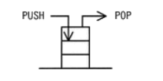
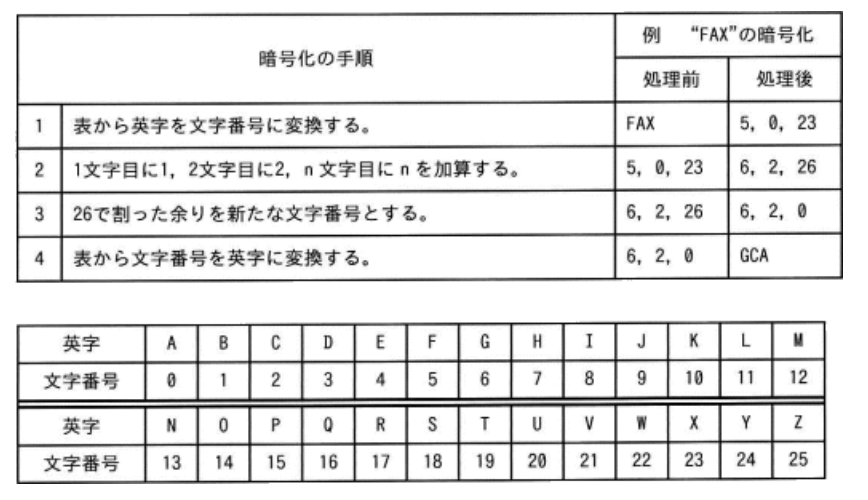
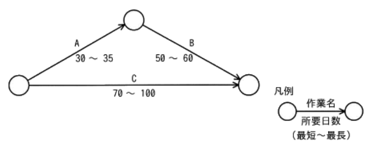
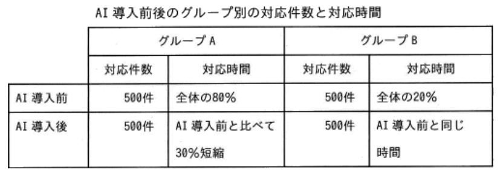
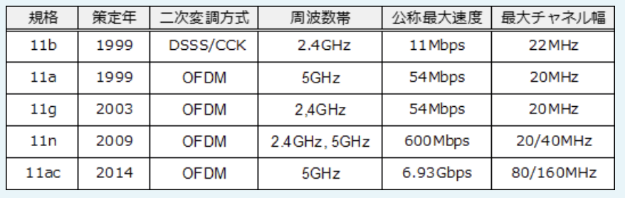
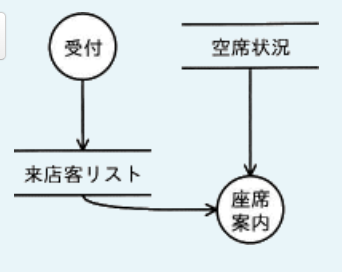
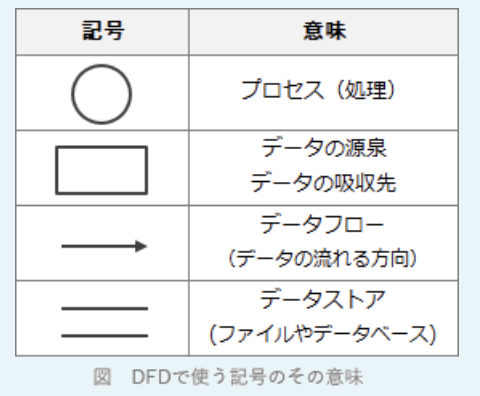
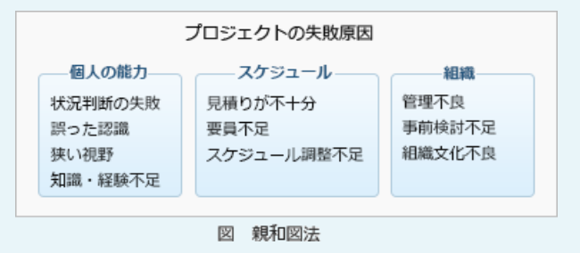
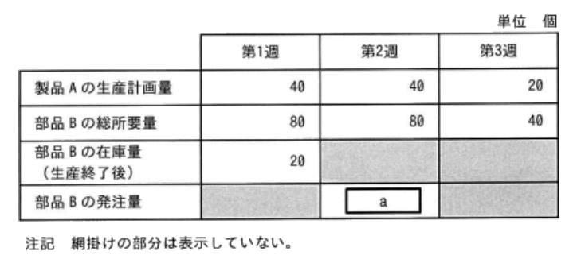

### 過去問(全範囲ランダム)

---
プロジェクトチームの要員に対し、プロジェクトの進行にとって望ましい行動を促進する仕組みを表す用語

- A.**インセンティブ(*incentive*)**  
刺激、奨励、誘因などの意味で、人々の物事に対する意欲を引き出す外部から与えられる要因のこと。「目標を達成するためにプロジェクトチームに対して与えられる出来高の仕組み」(インセンティブ制度)を設けることでノーリスクでプロジェクト進行に対する要員の意欲を高めることが可能

- コンピテンシー(*competency*)  
ビジネスにおいて高い業績を上げる人材の思考傾向や行動特性のこと

- コンプライアンス(*compliance*)  
企業倫理に基づき、法令や社会規範を遵守した企業活動を行うこと

- コンフリクト(*conflict*)  
衝突、争い、論争などの意味。コンピュータ関連では、複数のタスクが同時に同じ資源を利用しようとして発生する競合状態を表す

---
キャッシュフロー計算書において、キャッシュフローの減少要因となるもの

- A.**売掛金の増加**  
売上債権の増加は、期首と比較してその増加分が現金として外部に流出してしまったと考えるため、キャッシュフローの減少要因となる

- 減価償却費の増加  
減価償却費は、固定資産の取得に掛かった費用を使用期間に渡り費用化する手続きで、資金の流出を伴わない費用。キャッシュフロー計算のベースとなる税引前当期純利益はこの減価償却費が引かれている(マイナスの)状態なので、現金流出が無いという実態に合わせるためにキャッシュフロー計算書では減価償却の金額を加算(プラス)し、キャッシュフローゼロとして扱うため、キャッシュフローの増加要因となる

- 在庫の減少  
その減少分の在庫が現金化されたと考えるため、キャッシュフローの増加要因となる

- 短期借入金の増加  
企業内の現金が以前より多くなったと考えるため、キャッシュフローの増加要因となる

---
システムのテスト中に発見したバグを、原因別に集計して発生頻度の高い順に並べ、累積曲線を入れた図表

- A.**散布図**  
分析対象の項目を値の大きい順に並べた棒グラフに累積構成比を表す折れ線グラフを組み合わせた複合グラフで、主に複数の分析対象の中から管理対象とすべき重要な要素を識別するために使用される。システム開発のテストにおいては、原因別のバグ件数を分析し、優先して取り組むべき問題点を明確にするために利用できる(原因別の件数とそ占める割合みたいな感じ)

- 散布図  
縦軸・横軸に2項目の量や大きさ等を対応させて、分析対象のデータを打点した図で、2項目間の分布・相関関係を把握するのに使用される(GDPと人口みたいな)

- 特性要因図  
現れた特性(結果)とそれに影響を及ぼしたと思われる要因の関係を体系的に表わした図。多くの要因が複雑に絡みあっているときに、直接的な原因と間接的な原因に分別したり、真の問題点を明らかにしたりすることができる

- ヒストグラム  
収集したデータをいくつかの区間に分け、区間ごとに該当するデータの出現回数を棒グラフで示した図(年代で分けた人口統計など)

---
知的財産権のうち、産業財産権に該当するもの

- A.**意匠権**(イショウケン)  
製品の価値を高める形状やデザインを保護する、存続期間は出願日から25年

- A.**実用新案権**  
物品の形状、構造または組み合わせに係る考案のうち発明以外のものを保護する、存続期間は出願日から10年

- A.**特許権**  
自然の法則や仕組みを利用した価値ある発明を保護する、存続期間は出願日から20年

人間の知的活動によって創作された財産を保証する権利で、「著作権」と「産業財産権」に分類される。産業財産権は、主として企業活動に関する創作物を保護する権利で、権利として認められるためには関係機関に申請をして登録される必要がある。  
商標権は商品の名称やロゴマークなどを保護する(10年)

- 著作権  
主に文化芸術に関する創作物を保護する権利で、申請しなくとも創作された時点で発生する権利

---
新しい製品を開発する場合に検討するリスク軽減策に関する記述のうち、品質面のリスクを軽減させるもの

- A.**安定した技術を使った製品を開発する**  
安定した技術を使うことで製品に技術的不具合が生じる可能性を下げることができるため、リスク軽減に該当する

- A.**試作品を作成する**  
試作品を作成することで製品の機能や使い勝手などを確認でき、問題点や改善要望などを早い段階で取り入れることが可能になる。これによって不具合が後工程に残ったままになってしまう可能性を下げることができるのでリスク軽減に該当する

- 開発が遅れた場合の保険を掛ける  
リスクが顕在化した場合に備えて保険をかけているので、リスク移転に該当する

---
2台のPCから一つのファイルを並行して更新した。ファイル中のデータnに対する処理が1 ~ 4の順に行われたとき、nは最後にどの値になるか。nの初期値は10であった

- A.**17**  
1.PC-Aがデータnを読み込み、5を引く(5を保持する)  
2.PC-Bがデータnを読み込み、7を足す(17を保持する)  
3.PC-Aが1の結果を、データnに書き込む(5)  
4.PC-Bが2の結果を、データnに書き込む(17)  
複数のクライアントが同じデータを更新しようとするときは、排他制御によって更新の順序を制御しないと、更新処理の消失現象が起こるおそれがある

---
ITサービスマネジメントにおけるITサービス継続性管理とは、災害などの発生時にビジネスへの悪影響を最小限にするための活動である。ITサービス継続性管理においてPDCAサイクルのA(Act)に該当するもの

- A.**レビューやテストの実施結果に基づいて、必要であれば復旧計画書を見直す**  
*Act*に該当する。Checkの結果を受けて計画に対して継続や見直しなどの措置を行うフェーズ

- ITサービスを継続するための復旧方法などを定めた復旧計画書を策定する  
*Plan*に該当する。従来の実績や将来の予測などをもとにして計画を作成する

- 災害の発生を想定して、要員に対する定期的な教育や訓練を実施する  
*Do*に該当する。計画に沿って業務を行う

- 復旧計画の内容についてレビューやテストを実施して検証する  
*Check*に該当する。業務の実施が計画に沿っているかどうかを確認する

---
業務プロセスのモデルを説明したもの

- A.**システム化の対象となるビジネスの活動やデータの流れを明示したもの**

業務で必要なデータとそれに関わる業務活動がどのように絡みあいながら流れていくかに着目し、構造化・組織化したもの。システム化の前提となるモデル化では、E-R図やUMLによる業務・データ分析が行われる

- システム開発でプログラム作成に必要なデータ、機能などを記載したもの  
ソフトウェア詳細設計書やプログラム設計書の説明

- システム開発を外部委託するときの提案依頼に必要な条件を明示したもの  
RFP(*Request For Proposal*)の説明

- システムの開発、運用、保守に必要な組織、資源などを記載したもの  
システム化計画書の説明

---
経営課題と、それを実現するための手法の組み合わせ

- A.**SCM**(*Supply Chain Management*)  
部品の調達から販売までの一貫した効率的な業務プロセスを構築したい  
生産から販売に至る一連の流れに係る情報を一元管理することによって、全体としての効率を大幅に向上させる経営管理手法

- A.**CRM**(*Customer Relationship Management*)  
顧客の嗜好などの情報を把握し、製品の企画、販売促進につなげたい  
顧客に関するあらゆる情報を統合管理し、顧客との長期的な関係を企業活動に役立てる経営管理手法

- A.**POS**(*Point Of Sale*)  
販売時点で、商品名、数量などの売上に関する情報を把握し、適切な在庫補充や売れ筋商品の分析を行いたい  
商品・販売店・販売時間などの情報をリアルタイムで情報システムに取り込み、販売傾向の把握や在庫管理に役立てる管理手法

---
ある商品の前期、当期2期分の売上高と総費用は表のとおり。この商品の1期間の固定費は何千円か。総費用は固定費と変動費の合計であり、固定費及び売上高に対する変動費の割合は、前期、当期ともに変わらないものとする(単位:千円)

|     |前期  |当期   |
|-----|------|------|
|売上高|10,000|11,000|
|層費用|9,000 |9,600 |

- A.**3,000**

層費用は固定費と変動費の合計。変動費は売り上げの増加に伴い増加するので、以下の式で算出できる。  
変動費 = 売上高 * 変動比率  
(売上高 = 変動費 / 変動比率)  
(変動比率 = 変動費 / 売上高)  
固定費及び変動比率は一定という条件のため、固定費をa、変動比率をbとした連立方程式で固定費(a)を導出できる。  
a + 10,000b = 9,000 (前期)  
a + 11,000b = 9,600 (当期)  
1,000b = 600, b = 0.6  
a = 9,000 - 6,000 = 3,000(千円)

---
ある販売会社が扱っている商品の4月末の実在庫数が100個であり、5月10日までの受発注取引は表のとおりである。商品は発注目の5日後に入荷するものとし、販売会社と商品発注先の休日、及び前月以前の受発注取引を考えない場合、5月10日時点の引当可能在庫数は何個か。引当可能在庫数は、その時点の在庫のうち引当可能な数量とする

|取引日|商品の発注|商品の発注|
|-----|--------|---------|
|5月2日|40個    |-        |
|5月3日|-       |50個     |
|5月6日|20個    |-        |
|5月7日|-       |50個     |
|5月9日|30個    |-        |

- A.**60**  
5月7日発注の50個は5月10日には納入されていないので、  
100 - 40 - 20 - 30 + 50 = 60(個)

---
フェールセーフの説明

- A.**故障や操作ミスが発生しても、安全が保てるようにしておく**  
システムに不具合や故障が発生したときに、障害の影響範囲を最小限にとどめ、常に安全を最優先して制御を行う設計方針

工場のロボットの動作範囲内に人間が入った場合、ロボットを制御するシステムはセンサーで危険を察知し機械を停止する。また、道路信号機は停電や故障したときに両方向とも赤点滅(または黄点滅との組合せ)になるように設計されている

- 障害が発生した際に、正常な部分だけを動作させ、全体に支障を来さないようにする  
フェールソフトの考え方

- 組織内のコンピュータネットワークに外部から侵入されるのを防ぐ  
ネットワークからの不正なアクセスを防ぐのはファイアウォール

- 特定の条件に合致するデータだけをシステムに受け入れる  
人為的なミスによる障害を防ぐ、フールプルーフの考え方

---
コンビニエンスストアを全国にチェーン展開するA社では、過去10年間にわたる各店舗の詳細な販売データが本部に蓄積されている。これらの販売データ・過去10年間の気象データ・各店舗近隣のイベント情報との関係を分析して、気象条件・イベント情報と商品の販売量との関連性を把握し、1週間先までの天気予報とイベント情報から店舗ごとの販売予想をより高い精度で行うシステムを構築したい。このとき活用する技術

- A.**ディープラーニングなどのAI技術**

本システムに求められていることは、気象条件、イベント情報と商品の販売量との関連性を分析し、その分析結果に基づいて将来の予測を行うこと。揃っているデータを分析することが目的なので、センサーによるデータ収集(ア)と仮想現実技(VR)(イ)は無関係。  
分析対象となる10年分の販売データは相当なデータ量になる。全国に100店舗、商品数が50という相当少なめな数値で見積もっても分析対象のデータ数は優に1,000万件を超える。表計算ソフトは行数・列数が制限されることもあり(最大100万行程度)、そこまで多い量のデータ分析には向かない。ビッグデータに類する膨大な量のデータの分析では、ディープラーニングなどのAI技術を用いたシステムを構築し、それにデータを学習させる方法が有効

- IoTを用いたセンサーなどからの自動データ収集技術
- 仮想空間で現実のような体験を感じることができる仮想現実技術
- 表計算ソフトを用いて統計分析などを行う技術

---
インターネット上で通信販売を行っているA社は、販売促進策として他社が発行するメールマガジンに自社商品Yの広告を出すことにした。広告は、メールマガジンの購読者が広告中のURLをクリックすると、その商品ページが表示される仕組みになっている。この販売促進策の前提を表のとおりとしたとき、この販売促進策での収支がマイナスとならないようにするためには、商品Yの販売価格は少なくとも何円以上である必要があるか。購入者による商品Yの購入は1人1個に限定されるものし、他のコストは考えないものとする

|番号|説明|割合|
|---|---|----|
|1  |メルマガの購読者数|100,000人|
|2  |1のうち、広告中のURLをクリックする割合|2%|
|3  |2のうち、商品Yを購入する割合|10%|
|4  |商品Yの1個当たりの原価|1,000円|
|5  |販促策に掛かる費用の総額|200,000円|

- A.**2,000**

購入者の人数:  
100,000人 * 0.02 * 0.1 = 200人  
200,000 / 200 = 1,000  
1人当たり1,000円は利益を出す必要がある

---
表計算ソフトを用いて、ワークシートに示す各商品の月別売上額データを用いた計算を行う。セルE2に式`条件付個数(B2:D2, > 15000)`を入力した後、セルE3とE4に複写したとき、セルE4に表示される値

| |A|B|C|D|E|
|-|-|-|-|-|-|
|1|商品名|1月売上額|2月売上額|3月売上額|条件付個数|
|2|商品A|10,000|15,000|20,000||
|3|商品B|5,000|10,000|5,000||
|4|商品C|10,000|20,000|30,000||

- A.**2**

式"条件付個数(B2:D2, > 15000)"  
セルB2 ~ D2の中で15000より大きな値をもつセルの個数を返す。セル番地は相対参照なので、縦(行)方向に複写すると式中の行番号が1つ増える。E4には式"条件付個数(B4:D4, > 15000)"が格納されている

---
ファイルサーバに保存されている文書ファイルの内容をPCで直接編集した後、上書き保存しようとしたら「権限がないので保存できません」というメッセージが表示された。この文書ファイルと保存されているフォルダに設定されていた権限の組合せ

- A.ファイル読取り権限:**あり**
- A.ファイル書込み権限:**なし**
- A.フォルダ読取り権限:**あり**

ファイルやフォルダには、ユーザーやユーザーグループごとに「読取り」「書込み」「実行」などのアクセス権を設定することができる。  
・文書ファイルの内容をPCで直接編集した:  
ファイルサーバ上のファイルをPCで開けたということなので、ファイルとフォルダの読取り権限はある  
・上書き保存しようとしたら権限がなくて失敗  
ファイルの書込み権限はない

---
LPWAの特徴

- A.**低消費電力型の広域無線ネットワークであり、通信速度は携帯電話システムと比較して低速なものの、一般的な電池で数年以上の運用が可能な省電力性と、最大で数十kmの通信が可能な広域性を有している**  
*Low Power Wide Area*は、LP : *LowPower* = 省電力、WA : *WideArea* = 広範囲の名称の通り、省電力・広範囲を特徴とする無線通信規格の総称。伝送速度は遅いものの、省電力でWi-fiやBluetoothが届かない数kmから数十km間の通信をカバーする

IoT(*Internet of Things*)では、各所に配置された個々のIoTデバイスが内部バッテリーのみで長期間続けて稼働することになるため、バッテリー消費をいかに抑えるかがポイント。IoTデバイス同士は制御や情報取得のためにお互いに通信することになるが、この個々の通信はそれほど大きいデータ量ではないので、通信回線の高速性は重要ではない。これらの特徴を踏まえると、IoTネットワークには省電力・低速・広範囲のネットワークが適している。LPWAは、小型デバイスを多数配置した広範囲のIoTネットワークの運用を実現する手段として期待されている

- AIに関する技術であり、ルールなどを明示的にプログラミングすることなく、入力されたデータからコンピュータが新たな知識やルールなどを獲得できる  
機械学習の説明

- 分散型台帳技術の1つであり、複数の取引記録をまとめたデータを順次作成し、直前のデータのハッシュ値を埋め込むことによって、データを相互に関連付け、矛盾なく改ざんすることを困難にして、データの信頼性を高めている  
ブロックチェーンの説明

- 無線LANの暗号化方式であり、脆弱性が指摘されているWEPに代わって利用が推奨されている  
WPA2、WPA3に関する説明

---
労働者派遣法に基づき、A社がY氏をB社へ派遣することとなったときに成立する関係

- A.**B社とY氏との間の指揮命令関係**  
Y氏は派遣先企業であるB社の指揮命令の下で業務に従事することになる

労働者派遣契約は、派遣元企業の従業員が、派遣先企業の指揮命令の下で業務に従事できるようにした労働契約。労働者派遣契約の場合、雇用関係は派遣元企業と派遣労働者の間に、指揮命令関係は派遣先企業と派遣労働者の間に成立する。A社が派遣元企業、B社が派遣先企業、Y氏が派遣労働者となる

- A社とB社との間の委託関係  
A社とB社の間には労働者派遣契約関係が成立する

- A社とY氏との間の労働者派遣契約関係  
A社(派遣元企業)とY氏の間には雇用関係が成立する

- B社とY氏との間の雇用関係  
Y氏は派遣先企業であるB社の指揮命令の下で業務に従事することになる

---
イノベーションのジレンマ

- A.**優良な大企業が、革新的な技術の追求よりも、既存技術の向上でシェアを確保することに注力してしまい、結果的に市場でのシェアの確保に失敗する現象**  
イノベーション分野における理論の1つ。イノベーションを普及させトップに立った先行企業が、真の顧客ニーズを軽視して成功した製品の改良に注力しすぎた結果、破壊的イノベーションを武器にする後続企業にシェアを奪われてしまう現象のこと

- 最初に商品を消費したときに感じた価値や満足度が、消費する量が増えるに従い、徐々に低下していく現象  
限界効用逓減の法則に関する記述

- 自社の既存商品がシェアを占めている市場に、自社の新商品を導入することで、既存商品のシェアを奪ってしまう現象  
カニバリゼーションに関する記述

- 全売上の大部分を、少数の顧客が占めている状態  
パレートの法則に関する記述

---
HyperTextの特徴

- A.**文中の任意の場所にリンクを埋め込むことで関連した情報をたどれるようにした仕組みをもっている**  
ハイパーリンクという参照を使って複数の文書を相互に結び付ける仕組みでHTMLのベースになっている考え方

Webブラウザを介してインターネット上のハイパーテキストを閲覧する仕組みがWWW(*World Wide Web*)。インターネットに限った話ではなく、ローカル環境で扱う文書ファイルなどにも*HyperText*の仕組みは取り入れられている

- いろいろな数式を作成・編集できる機能をもっている  
LaTexなどの説明

- いろいろな図形を作成・編集できる機能をもっている  
SVG(*Scalable Vector Graphics*)などの説明

- 多様なテンプレートが用意されており、それらを利用できるようにしている  
CMS(*Contents Management System*)などが該当する(これだけでは何に関する記述か特定できない)

---
あるメーカーの当期損益の見込みは表のとおりであり、その後広告宣伝費が5億円、保有株式の受取配当金が3億円増加した。最終的な営業利益と経常利益はそれぞれ何億円になるか。広告宣伝費、保有株式の受取配当金以外は全て見込みどおりであったものとする(単位 : 億円)

|項目                 |金額 |
|--------------------|-----|
|売上高               |1,000|
|売上売価             |780  |
|販売費及び一般管理費   |130  |
|営業外収益            |20   |
|営業外費用            |16   |
|特別利益             |2     |
|特別損失             |1     |
|法人税、住民税及び事業税|50    |

A.営業利益:**85**  
A.経常利益:**92**  
広告宣伝費は「販売費及び一般管理費」、受取配当金は「営業外収益」に分類される

営業利益 = 売上高 - 売上原価 - 販売費及び一般管理費  
= 1,000 - 780 - 135 = 85  
経常利益 = 営業利益 + 営業外収益 - 営業外費用  
= 85 + 23 - 16 = 92

---
IoT機器やPCに保管されているデータを暗号化するためのセキュリティチップであり、暗号化に利用する鍵などの情報をチップの内部に記憶しており、外部から内部の情報の取出しが困難な構造をもつもの

- A.**TPM(*Trusted Platform Module*)**  
OSやアプリケーションの改ざん検知、端末認証、ストレージ全体の暗号化などを提供している

PCのマザーボード上に直付けされるセキュリティチップで、暗号化 / 復号や鍵ペアの生成、ハッシュ値の計算、デジタル署名の生成・検証などの機能を有する。内部のデータを読み取ろうとしてもチップへの干渉により物理的に破損する構造になっているため、外部からの攻撃に強い耐性がある

- GPU(*Graphics Processing Unit*)  
コンピュータにおいて画像処理を専門に担当するハードウェア部品

- NFC(*Near Field Communication*)  
至近距離(数cm ~ 1ｍ)での無線通信について定めた国際標準規格で、非接触型ICカードの技術に基づいて開発されたもの

- TLS(*Transport Layer Security*)  
認証、改ざん検知、暗号化通信などの機能を提供するセキュリティプロトコル

---
部外秘とすべき電子ファイルがある。このファイルの機密性を確保するために使用するセキュリティ対策技術

- A.**アクセス制御**  
組織内の情報資産に対して誰がどんな権限でアクセスできるかをコントロールすること。機密性を確保するための対策に該当する

- タイムスタンプ  
電子データに付与することで、付与時点での存在性及びその時刻以後の完全性を確認できる仕組み。完全性を確保するための対策に該当する

- デジタル署名  
電子データの改ざん検知及び送信者の正当性を確認する仕組み。完全性を確保するための対策に該当する

- ホットスタンバイ  
主系と待機系に同じシステムを起動しておき、障害が発生した時に即座に待機系に切り替えることができるようにした方式。可用性を確保するための対策に該当する

---
コンピュータの記憶階層におけるキャッシュメモリ、主記憶及び補助記憶と、それぞれに用いられる記憶装置の組合せ

- A.キャッシュメモリ:**SRAM**  
CPUと主記憶の速度差を埋めるために搭載される記憶装置で、SRAM(*Static RAM*)が用いられる

- A.主記憶:**DRAM**  
CPUが直接読み書きするために実行するプログラムやデータを記憶する装置で、DRAM(*Dynamic RAM*)が用いられる

- A.補助記憶:**SSD**  
主記憶以外の記憶装置のうち、主にコンピュータに常時接続される大容量の記憶装置をいい、磁気ディスクのHDD(*Hard Disk Drive*)や半導体メモリのSSD(*Solid State Drive*)が用いられる

---
システム障害が発生した際、インシデント管理を担当するサービスデスクの役割

- A.**既知の障害事象とその回避策の利用者への紹介**  
利用者に対して単一窓口(SPOC : *Single Point of Contact*)を提供して、インシデントなどの障害、サービス要求、標準的な変更などの様々な問い合わせを受付け、その記録を一元管理する組織。サービス提供者とサービス利用者の接点となり、日々発生するインシデントやサービス要求を処理する。  
サービスデスクでは利用者から受け付けた内容が既知の問題であり、その回避策(ワークアラウンド)が存在する場合には、その場で回避策を伝えて迅速な問題解決を促す

- システム障害対応後の利用者への教育  
インシデントの再発予防策を行うのは問題管理プロセスの役割

- 障害が発生している業務の代行処理  
サービス要求管理プロセスの役割。このプロセスは障害という枠にとらわれず、新規ユーザー登録、パスワードリセット、プリンターのトナー交換など日常的なトラブルにも対処する

- 障害の根本原因調査  
問題管理プロセスの役割

---
プロジェクトマネジメントの進め方に関する説明

- A.**目標を達成するための計画を作成し、実行中は品質、進捗、コストなどをコントロールし、目標の達成に導く**  
プロジェクト活動に知識、スキル、ツール、技法などを適用して、プロジェクト目標を達成できるように管理すること。プロジェクトを立ち上げ、計画を策定し、実行をコントロールし、終結させるまでの一連の活動をカバーしている。  
プロジェクトの実行中は、品質、コスト、進捗(いわゆるQCD)は当然として、その他にもコミュニケーション、ステークホルダとの関係、調達関係、変更要求などもコントロールの対象とする

- 企画、要件定義、システム開発、保守の順番で、開発を行う  
システム開発の手順

- 戦略、設計、移行、運用、改善のライフサイクルで、ITサービスを維持する  
ITサービスマネジメントの手順

- 予備調査、本調査、評価、結論の順番で、リスクの識別、コントロールが適切に実施されているかの確認を行う  
システム監査の手順

---
通信プロトコルとしてTCP / IPを用いるVPNには、インターネットを使用するインターネットVPNや通信事業者の独自ネットワークを使用するIP-VPNなどがある。インターネットVPNではできないが、IP-VPNではできること

- A.**帯域幅などの通信品質の保証**  

VPN(*Virtual Private Network*)は、IP-VPNとインターネットVPNに大別できる
・IP-VPN  
一般のインターネット網ではなく通信業者が用意した閉域IPネットワークを使用してVPNを構築する方式。構築コストが高いが、盗聴や改ざんのリスクが低く、混雑の影響を受けにくい。使用可能なプロトコルがIPに限られる  
・インターネットVPN  
セキュリティプロトコルであるIPsecやSSL / TLSの機能を使用して一般のインターネット網上にVPNを構築する方式。構築コストは安いが、盗聴や改ざんのリスクは増加する  
インターネットVPNと比較したときのIP-VPNの特長として、回線の稼働率や通信速度についてのSLAが用意され通信品質が保証されるという点がある。インターネットVPNは多くの人が利用するインターネット回線を利用するので帯域保証はない。IP電話、盗聴・改ざん防止、動画配信はどちらのサービスでもできるが、通信品質の保証を得るにはIP-VPNを選択する必要がある

- IP電話を用いた音声通話
- 盗聴、改ざんの防止
- 動画の配信

---
関係データベースにおいて、表Aと表Bの積集合演算を実行した結果

- A.  

積共通演算は、2つの表に共通するレコードのみから成る新しい表を返す演算。A∩(且つ)Bを表す

---
サーバ仮想化の特長

- A.**1台のコンピュータを複数台のサーバであるかのように動作させることができるので、物理的資源を需要に応じて柔軟に配分することができる**  
1台の物理サーバ上で複数のサーバOSを稼働させる技術

一般に、仮想化技術によって複数のサーバの機能を1台の物理サーバに統合した場合、機能ごとに物理サーバを用意したときと比較して以下のようなメリット・デメリットがある。  
・サーバの台数が少なくなるので物理的管理が簡易化できる  
・サーバの利用率が高くなり資源の有効利用ができる  
・負荷の度合いや処理量などに応じて、リソースの配分を柔軟に変更できる  
・1台のサーバに複数の機能を持たせるので、処理以外にかかるCPUのオーバーヘッドは高くなる  
・物理サーバに障害が発生した場合、その物理サーバで稼働している全ての仮想サーバに影響が出る

- コンピュータの機能をもったブレードを必要な数だけ筐体に差し込んでサーバを構成するので、柔軟に台数を増減することができる  
ブレードサーバの特長

- サーバを構成するコンピュータを他のサーバと接続せずに利用するので、セキュリティを向上させることができる  
スタンドアロンの特長

- サーバを構成する複数のコンピュータが同じ処理を実行して処理結果を照合するので、信頼性を向上させることができる  
ディアルシステムの特長

---
デザイン思考の例

- A.**アプローチの中心は常に製品やサービスの利用者であり、利用者の本質的なニーズに基づき、製品やサービスをデザインする**  
ビジネス上の課題に対して、デザイナーがデザインを行う際の思考プロセス(デザイナー的思考)を転用して問題にアプローチする手法のこと。デザイン思考のプロセスは、共感 => 問題定義 => 創造 => プロトタイプ => テストの5ステップを踏むとされている。顧客のニーズを出発点として、顧客が本当に欲する製品やサービスを企画・設計することを目的とし、既存の概念にとらわれずにイノベーションを生み出すデザイン方法として注目されている

- Webページのレイアウトなどを定義したスタイルシートを使用し、ホームページをデザインする  
CSS(*Cascading Style Sheets*)の例

- 業務の迅速化や効率化を図ることを目的に、業務プロセスを抜本的に再デザインする  
BPR(*Business Process Re-engineering*)の例

- データと手続を備えたオブジェクトの集まりとして捉え、情報システム全体をデザインする  
オブジェクト指向の例

---
下記項目で関係データベースで管理する社員票を設計する。他の項目から導出できる、冗長な項目

社員番号 : 社員名 : 生年月日 : 現在の満年齢 : 住所 : 趣味

- A.**現在の満年齢**  
冗長とは、余分や無駄の意味。単価と購入数量が分かっている時の合計金額など。既にある属性から計算等で求めることができるので、正規化の過程ではデータの保守性向上のため冗長な項目を排除するのが原則。現在の日付から生年月日を引くことで計算可能なため、現在の満年齢は冗長な項目に該当する

---
技術経営における新事業創出のプロセスを、研究・開発・事業化・産業化の4つに分類したとき、事業化から産業化を達成し、企業の業績に貢献するためには、新市場の立上げや競合製品の登場などの障壁がある。この障壁を意味する用語

- A.**ダーウィンの海**  
技術経営の成功を阻む障壁を表す言葉で、新技術を用いた開発した製品が市場で淘汰されてしまうこと。製品化までたどり着いた新製品が他企業との競争や顧客ニーズの荒波を乗り越え、事業化に達することの難しさを比喩した言葉。同じく技術経営の壁を意味する言葉に「魔の川」「死の谷」もある

- 囚人のジレンマ  
ゲーム理論に関するモデルの1つで、複数の囚人がいる状況で各々が自分にとってベストな選択をした結果、お互いに協力した時よりも全体としての利益が少なくなってしまう様子を表したもの

- ファイアウォール  
不正データの通過を阻止するためにネットワーク同士の境界に配置されるソフトウェア・ハードウェア

- ファイブフォース  
業界の収益性を決める5つの競争要因から、業界の構造分析をおこなう手法。「供給企業の交渉力」「買い手の交渉力」「競争企業間の敵対関係」という3つの内的要因と、「新規参入業者の脅威」「代替品の脅威」の2つの外的要因、計5つの要因から業界全体の魅力度を測る

---
アジャイル開発の方法論であるスクラムに関する記述

- A.**複雑で変化の激しい問題に対応するためのシステム開発のフレームワークであり、反復的かつ漸進的な手法として定義したものである**  
顧客の要求に応じて、迅速かつ適応的にソフトウェア開発を行う軽量な開発手法の総称。スクラム(*Scrum*)は、アジャイル開発の方法論の1つで、開発プロジェクトを数週間程度の短期間ごとに区切り、その期間内に分析・設計・実装・テストの一連の活動を行い、一部分の機能を完成させるという作業を繰り返しながら、段階的に動作可能なシステムを作り上げるフレームワーク。スクラム開発における反復の単位を「スプリント」と呼ぶ

- ソフトウェア開発組織及びプロジェクトのプロセスを改善するために、その組織の成熟度レベルを段階的に定義したものである  
CMMI(*Capability Maturity Model Integration* : 統合能力成熟度モデル)の説明

- ソフトウェア開発とその取引において、取得者と供給者が、作業内容の共通の物差しとするために定義したものである  
共通フレームの説明

- プロジェクトマネジメントの知識を体系化したものであり、複数の知識エリアから定義されているものである  
PMBOKの説明

---
サーバの仮想化技術において、あるハードウェアで稼働している仮想化されたサーバを停止することなく別のハードウェアに移動させ、移動前の状態から引き続きサーバの処理を継続させる技術

- A.**ライブマイグレーション(*Live Migration*)**  
ある物理サーバ上で稼働している仮想マシンを、OSやソフトウェアを停止させることなく別の物理サーバに移し替え、処理を継続させる技術。アプリケーションを実行状態のまま移動させる。切り替えによるダウンタイムはほとんどゼロで、移動前の処理やセッションが全て引き継がれるため可用性を損なうことがない

- ストリーミング  
主に音声や動画などマルチメディアファイルについて、データをダウンロードをしながら順次再生をする方式

- デジタルサイネージ  
デジタル技術を活用して平面ディスプレイやプロジェクタなどに映像や情報を表示する広告媒体のこと。店舗や屋外に設置されている

- プラグアンドプレイ  
周辺機器を接続するのと同時に、自動的にPCがそれを認識しデバイスドライバのインストールと設定を行う機能

---
AIの活用領域には音声認識・画像認識・自然言語処理などがある。音声認識と自然言語処理の両方が利用されているシステムの事例

- A.**人から話しかけられた天気や交通情報などの質問を解釈して、ふさわしい内容を回答する**  
人の質問を文字の集まりに変換するのは音声認識、その意味を解釈し、適切な回答を組み立てるのは自然言語処理

- ドアをノックする音を検知して、カメラの前に立っている人の顔を認識し、ドアのロックを解除する  
様々な音の中からノックする音を検知するのは音声認識、人の顔を認識するのは画像認識

- 野外コンサートに来場する人の姿や話し声を検知して、会場の入り口を通過する人数を記録する  
人の姿を検知するのは画像認識、話し声を検知するのは音声認識

- 洋書に記載されている英文をカメラで読み取り、要約された日本文として編集する  
英文の画像から文字を抽出するのは画像認識、英文を要約し、日本語の文章にするのは自然言語処理

---
内外に宣言する最上位の情報セキュリティポリシーに記載すること

- A.**経営陣が情報セキュリティに取り組む姿勢**  
基本方針・対策基準・実施手順の3階層で構成されることが一般的。情報セキュリティポリシーの最上位に位置する文書は、組織の経営者が最終的な責任者となり「情報セキュリティに本格的に取り組む」という姿勢を示し、情報セキュリティの目標と適用範囲、その目標を達成するために企業がとるべき行動を社内外に宣言するもの

- 情報資産を守るための具体的で詳細な手順  
詳細な手順については個々の実施手順・運用規則・マニュアルなどに記載する。上記の3階層の中では実施手順に記載すること

- セキュリティ対策に掛ける費用  
IT関連予算内に記載する

- 守る対象とする具体的な個々の情報資産  
情報資産管理台帳に記載する

---
情報の取扱いに関する不適切な行為のうち、不正アクセス禁止法で定められている禁止行為に該当するもの

- A.**オフィス内で拾った手帳に記載されていた他人のIDとパスワードを無断で使い、ネットワークを介して自社のサーバにログインし、サーバに格納されていた人事評価情報を閲覧した**  
他人の認証情報を本人に許可なく使用し、ネットワークを介して認証が必要なページにアクセスしているので禁止行為に該当する

- A.**自分には閲覧権限のない人事評価情報を盗み見するために、他人のネットワークIDとパスワードを無断で入手し、自分の手帳に記録した**  
不正アクセス行為を行う目的で、他人の認証情報を保管する行為は禁止されている

- 部門の保管庫に保管されていた人事評価情報が入ったUSBメモリを上司に無断で持ち出し、自分のPCに直接接続してその人事評価情報をコピーした  
他人の認証情報を利用していないこと、USBメモリにアクセス制御機能が設けられていないことから禁止行為には該当しない。ただし、USBの無断持ち出しは窃盗罪、秘密情報の不正閲覧は民法上の不法行為や就業規則違反となる可能性がある

---
情報システムの調達の際に作成される文書

- A.調達する情報システムの概要や提案依頼事項、調達条件などを明示して提案書の提出を依頼する文書は**RFP**である。また、システム化の目的や業務概要などを示すことによって、関連する情報の提供を依頼する文書は**RFI**である  
・RFI(*Request For Information*)  
企業・組織がシステム調達や業務委託をする場合や、初めての取引となるベンダー企業に対して行う**情報提供要求**、またはその際に配布される文書のこと。RFIを発行することによって相手方が保有する技術・経験や、情報技術動向・導入予定のシステムが技術的に実現可能であるかなどを確認できる  
・RFP(*Request For Proposal*)  
情報システムの調達を予定している企業・組織が、発注先候補のベンダー企業に対して行う**提案依頼要求**、またはその際に配布される文書のこと。提案範囲・納期・システムの機能範囲・運用条件・性能要件・開発体制などのシステムの要件や調達条件が盛り込まれる

---
バイオメトリクス認証で利用する身体的特徴に関する記述

- A.バイオメトリクス認証における本人の身体的特徴としては、**偽造**が難しく、**経年変化**が小さいものが優れている  
個人ごとに異なる身体の特徴や行動パターンを比較することで認証を行う技術。事前に個人の身体的特徴等をシステムに登録しておき、認証時に入力されたデータとの類似度によって本人かどうかの判定を行う。  
・偽造について : 不正認証を防ぐためには偽造が困難な特徴を用いる必要がある。一般的に指紋認証や顔認証は偽造に弱いと言われている。判別が困難だと本人を他人と識別して拒絶してしまうリスク、他人を本人と識別してしまうリスクが高まるので、他人と本人の判別が明確にできる特徴が優れていると言える  
・経年変化について : 身体的特徴でも経年劣化しやすいもの、しにくいものがある。顔や声は経年により変化しやすいが、虹彩や静脈は変化がない。個人差が小さい特徴は誤認証のリスクが高くなるので適していない

---
受信した電子メールに添付されていた文書ファイルを開いたところ、PCの挙動がおかしくなった。この時に疑われる攻撃

- A.**マクロウイルス**  
文書ファイルや表計算ファイルに記載されているマクロ機能を悪用したマルウェア。不正なプログラムが仕込まれたWord / Excel形式などのファイルを開くことによって動作を開始する。マクロウイルス単体でファイル書換などの損害を被るだけでなく、他のマルウェアをダウンロードするなど連携して感染させるケースもあり、不審なファイルを開かないように注意が必要

- SQLインジェクション  
Webアプリケーションに対してデータベースへの命令文を構成する不正な入力データを与え、Webアプリケーションが想定していないSQL文を意図的に実行させることで、DBを破壊したり情報を不正取得したりする攻撃

- クロスサイトスクリプティング  
動的にWebページを生成するWebアプリケーションに対して、悪意のあるスクリプトを混入させることで、攻撃者が仕込んだ操作を実行させたり、別のサイトを横断してユーザーのクッキーや個人情報を盗んだりする攻撃手法

- ショルダーハッキング  
ディスプレイやキーボード操作を利用者の背後から盗み見て、パスワード等の秘密情報を記憶する行為

---
ブログにおけるトラックバックの説明

- A.**別の利用者のブログ記事へのリンクを張ると、リンクが張られた相手に対してその旨を通知する仕組み**  

- 一般利用者が、気になるニュースへのリンクやコメントなどを投稿するサービス  
コメント投稿サービスの説明

- ネットワーク上にブックマークを登録することによって、利用価値の高いWebサイト情報を他の利用者と共有するサービス  
ソーシャルブックマークの説明

- ブログに貼り付けたボタンをクリックすることで、SNSなどのソーシャルメディア上でリンクなどの情報を共有する機能  
ソーシャルボタンの説明

---
3人の候補者の中から兼任も許す方法で委員長と書記を1名ずつ選ぶ場合、3人の中から委員長1名の選び方が3通りで、3人の中から書記1名の選び方が3通りであるので、委員長と書記の選び方は全部で9通りある。5人の候補者の中から兼任も許す方法で委員長と書記を1名ずつ選ぶ場合の選び方

- A.**25**  
兼任できるため、それぞれの役職で選ぶ方法が5通りなので、5 * 5 = 25通り。兼任ができない場合は、5 * 4 = 20通り

---
伝送速度が20Mbps(bit / s)、伝送効率が80%である通信回線において、1Gバイトのデータを伝送するのに掛かる時間は何秒か。1Gバイト = 10 ** 3Mバイトとする

- **500**  
伝送効率は80%なので、  
20Mbps(bit / s) * 0.8 = 16Mbps(bit / s)  
1バイト = 8ビットなので、  
1Gバイト = 1000Mバイト = 8000Mbit  
伝送速度は、  
8000Mbit / 16Mbps(bit / s) = 500s

---
A社では、設計までをA社で行ったプログラムの開発を、請負契約に基づきB社に委託して行う形態と、B社から派遣契約に基づき派遣されたC氏が行う形態を比較検討している。開発されたプログラムの著作権の帰属に関する規定が会社間の契約で定められていないときの著作権の帰属先

- A.**請負契約ではB社に帰属し、派遣契約ではA社に帰属する**

著作権は著作物を創作した者が受けられる権利です。この設問には「著作権の帰属に関する規定が会社間の契約で定められていない」という条件があるので、著作権の帰属先は以下のようになる。  
・請負契約 : 受託者(請負業社)  
委託者 = A社、受託者 = B社なので、開発したプログラムの著作権は受託者であるB社に帰属する  
・派遣契約 : 派遣先企業  
派遣先企業 = A社、派遣元企業 = B社、派遣労働者 = C氏なので、開発したプログラムの著作権は派遣先企業であるA社に帰属する。プログラムを開発したのはC氏だが、法人の業務に従事する者がその職務上作成する著作物は、原則としてその法人が著作者となる

- 請負契約ではA社に帰属し、派遣契約ではA社に帰属する
- 請負契約ではA社に帰属し、派遣契約ではC氏に帰属する
- 請負契約ではB社に帰属し、派遣契約ではC氏に帰属する

---
営業利益を求める計算式

- A.**(売上総利益) - (販売費及び一般管理費)**

- (売上高) - (売上原価)  
売上総利益(粗利益)の計算式

- (経常利益) + (特別利益) - (特別損失)  
税引前当期純利益の計算式

- (税引前当期純利益) - (法人税、住民税及び事業税)  
(税引後)当期純利益の計算式

---
ある会社ではサービスデスクのサービス向上のために、チャットボットを導入することにした。チャットボットに関する記述

- A.**文字や音声による問合せ内容に対して、会話形式でリアルタイムに自動応答する仕組**  
相手からのメッセージに対してテキストや音声でリアルタイムに応答するようにプログラムされたソフトウェア。利用者の問いかけを認識して最適な答えを判断するために、内部には人工知能の技術が使われている。  
機械学習やAIの進化に伴ってチャットボットも実用に耐えるほど進化しており、人件費の削減を図るためECサイトやカスタマーサポートへの活用事例が増えている

- PCでの定型的な入力作業を、ソフトウェアのロボットによって代替することができる仕組み  
RPA(*Robotic Process Automation*)の説明

- 人の会話の言葉を聞き取り、リアルタイムに文字に変換する仕組み  
音声文字変換(発話テキスト変換)の説明

- 頻繁に寄せられる質問とそれに対する回答をまとめておき、利用者が自分で検索できる仕組み  
FAQ(*Frequently Asked Questions*)の説明

---
PDCAモデルに基づいてISMSを運用している組織の活動において、PDCAモデルのA(*Act*)に相当するプロセスで実施するもの

- A.**運用状況の監視や運用結果の測定及び評価で明らかになった不備などについて、見直しと改善策を決定する**  
*Act*で実施する。管理策の維持、対策の見直し及び改善を行う

- 運用状況の監視や運用結果の測定及び評価を行う  
*Check*で実施する。対策実施状況の監視・測定、実施効果のレビュー・監査を行う

- セキュリティポリシーの策定や組織内の体制の確立、セキュリティポリシーで定めた目標を達成するための手順を策定する  
*Plan*で実施する。リスクアセスメントの実施、情報セキュリティポリシーの策定を行う

- セキュリティポリシーの周知徹底やセキュリティ装置の導入などを行い、具体的に運用する  
*Do*で実施する。計画段階で選択した対策の導入・運用を行う

---
下から上へ品物を積み上げて、上にある品物から順に取り出す装置がある。この装置に対する操作は、次の2つに限られる。  
PUSH x : 品物xを1個積み上げる  
POP : 1番上の品物を1個取り出す  
最初は何も積まれていない状態から開始して、a・b・cの順で3つの品物が到着する。1つの装置だけを使った場合、POP操作で取り出される品物の順番としてあり得ないもの

- A.**c, a, b**  
cを取り出した後には、[b, a]の順番でしか取り出せないためあり得ない

- a, b, c  
以下の手順で可能  
=> aを積み上げる[a]  
=> 1.aを取り出す  
=> bを積み上げる[b]  
=> 2.bを取り出す  
=> cを積み上げる[c]  
=> 3.cを取り出す

- b, a, c  
以下の手順で可能。データは上から読むとする  
=> aを積み上げる[a]  
=> bを積み上げる[b, a]  
=> 1.bを取り出す  
=> 2.aを取り出す  
=> cを積み上げる[c]  
=> 3.cを取り出す

- c, b, a  
以下の手順で可能。データは上から読むとする  
=> aを積み上げる[a]  
=> bを積み上げる[b, a]  
=> cを積み上げる[c, b, a]  
=> 1.cを取り出す  
=> 2.bを取り出す  
=> 3.cを取り出す

---
会計システムの開発を受託した会社が、顧客と打合せを行って、必要な決算書の種類や、会計データの確定から決算書類の出力までの処理時間の目標値を明確にした。この作業を実施するのに適切な工程

- A.**システム用件定義**  
システムに要求される機能や性能などを明確にする工程

「必要な決算書の種類」や「処理時間の目標値」は、完成後の情報システムに求められる機能や性能。システムに求められる要件を明らかにするために、開発するシステムの具体的な利用方法について分析し、システムの機能や能力、安全性やセキュリティ、システムテストの項目などを決定する工程を「システム要件定義」といい、開発プロセスの最初に実施する。システム用件定義では、次のようなものを決定する。  
・システム化目標、対象範囲  
・システムの機能及び能力、ライフサイクル  
・業務、組織及び利用者の要件  
・信頼性、安全性、セキュリティ、人間工学、インターフェース、操作及び保守要件  
・設置条件及び適格性確認要件  

- システムテスト  
開発したシステムが要件を満しているかどうかを検証するために行われるテスト。システム要件定義に定められた機能や能力がすべて備わっているかを確認する

- ソフトウェア詳細設計  
ソフトウェア部品についてコーディング、コンパイル及びテストを実施するレベルまでの詳細設計を行う工程

- ソフトウェア方式設計  
ソフトウェア要件を実現するためのソフトウェア部品(モジュールともいう)の構成を決定する工程

---
労働者派遣は、通常の派遣と、将来の雇用を想定した紹介予定派遣の2つに分けられる。前者の労働者派遣の契約に当たり、派遣先が派遣元に要求する派遣労働者の受入条件

- A.**候補者が備えるべきスキルの指定**  
派遣労働者の受入条件としては、業務内容と必要なスキルを伝えるだけに留めなければならない

派遣先企業は、派遣元企業との間で労働者派遣契約をするに当たり、派遣される労働者を特定することを目的とする行為をしないように努めなければならない。派遣労働者と特定するための行為の具体例として、「性別や年齢の指定」「履歴書の事前送付」「事前面接の要求」を挙げ、派遣先に対してこれらの行為をしないことを求め、これらの要求を行うことは禁止されている

- 候補者の年齢及び性別の指定
- 候補者の派遣先による事前面接
- 候補者の履歴書の派遣先への事前提出

---
売上高、変動費、固定費、営業日数が表のようなレストランで、年間400万円以上の利益を上げるためには、1営業日当たり少なくとも何人の来店客が必要か

|説明           |金額    |
|--------------|--------|
|客1人当たり売上高|3,000円 |
|客1人当たり変動費|1,000円 |
|年間の固定費    |2,000万円|
|年間の営業日数   |300日   |

- A.**40**  
変動比率 = 1 / 3  
損益分岐点売上高 + 利益 = 2,000万円 + 400万円 = 2,400万円  
2,400万円 / (1 - (1 / 3)) = 3,600万円  
1日当たりの必要売上高は、  
3,600万円 / 300日 = 12万円  
1日当たりの必要来客数は、  
120,000円 / 3000円 = 40人

---
大文字の英字から成る文字列の暗号化を考える。暗号化の手順と例は次のとおりである。この手順で暗号化した結果が"EGE"であるときの元の文字列

- A.**DEB**  
EGEを文字番号に変換 : 4, 6, 4  
26で割った余り : 4, 6, 4  
加算 : 3, 4, 1 => DEB

- BED
- FIH
- HIF

---
1年前に作成した情報セキュリティポリシーについて、適切に運用されていることを確認するための監査を行った。この活動はPDCAサイクルのどれに該当するか

- A.**C**  
監視、測定、レビュー、監査などを行って業務実績を点検・評価するフェーズは*Check*で行う。対策実施状況の監視、実施効果の評価をする

- P  
リスクアセスメントの実施、情報セキュリティポリシーの策定

- D  
計画段階で選択した対策の導入・運用

- A  
管理策の維持、対策の見直し及び改善

---
図の工程の最短所要日数・最長所要日数

- A.最短所要日数 : **80**
- A.最長所要日数 : **100**

---
業務処理時間の短縮を目的として、運用中の業務システムの処理能力の改善を図った。この改善が有効であることを評価するためにシステム監査を実施するとき、システム監査人が運用部門に要求する情報として

- A.**稼働統計資料**  
監査目的は「業務システムの処理能力改善により、業務処理時間の短縮が達成されているか」を評価することなので、評価のためには改善前・改善後の業務処理時間を知ることのできる客観的な情報が必要。システムの稼働統計資料には、処理件数、実行時間、レスポンスタイムなどが記録されている

- システム運用体制
- システム運用マニュアル
- ユーザマニュアル  
=> 業務処理時間が短縮されているかどうか判断するために必要な情報は得られない

---
プロセッサに関する記述

- A.**GPU**は**画像**処理用に開発されたプロセッサである。CPUに内蔵されている場合も多いが、より高度な**画像**処理を行う場合には、高性能な**GPU**を搭載した拡張ボードを用いることもある  
*Graphics Processing Unit*は、PCなどにおいて画像処理を専門に担当するハードウェア部品。動画再生や3DCGのレンダリングなどの定型的かつ大量の演算が要求される処理において、CPUの補助演算装置として機能する。膨大な計算を必要とする科学シミュレーションや機械学習の分野でもGPUを利用することが増えている

---
システム開発におけるアローダイアグラムの説明

- A.**作業の関連をネットワークで表した図である**

プロジェクトの各作業間の関連性や順序関係を視覚的に表現する図。作業の前後関係を分析することで時間的に余裕のない一連の作業(クリティカルパス)を洗い出すことができ、プロジェクトのスケジュール管理に使用される。矢印が作業を、○が作業の開始点または終了点を示す

- 業務のデータの流れを表した図である  
DFD(*Data Flow Diagram*)の説明

- 作業を縦軸にとって、作業の所要期間を横棒で表した図である  
ガントチャートの説明

- ソフトウェアのデータ間の関係を表した図である  
UMLの説明

---
従業員に貸与するスマートフォンなどのモバイル端末を遠隔から統合的に管理する仕組みで、セキュリティの設定や紛失時にロックしたり初期化したりする機能をもつもの

- A.**MDM(*Mobile Device Management*)**  
会社や団体が、自組織の従業員に貸与するモバイル端末(スマートフォンやタブレット)に対して、セキュリティポリシーに従った一元的な設定をしたり、業務アプリケーションを配信したりして、モバイル端末の利用状況などを一元管理する仕組み

- DMZ(*DeMilitarized Zone*)  
内部LANとインターネットの間に位置する中間的なエリアで、Webサーバ・メールサーバ・プロキシサーバなどのように外部からアクセスされる情報資源を配置する

- SDN(*Software-Defined Networking*)  
ソフトウェア制御による動的で柔軟なネットワークを作り上げる技術の総称

- VPN(*Virtual Private Network*)  
多数の加入者が共用する講習回線上に、認証及び暗号化プロトコルによって仮想的な専用回線を構築し、通信の秘匿化を実現する技術

---
情報システム開発の詳細設計が終了し、プログラミングを外部のベンダーに委託することにした。仕様、成果物、作業の範囲を明確に定義した上で、プログラミングを委託先に請負契約で発注することにした。発注元のプロジェクトマネージャのマネジメント活動として最も適切なもの

- A.**委託先に定期的な進捗報告を求めるとともに、完成したプログラムの品質を確認する**

受託開発は、法律上は請負契約という労務供給契約に該当する。  
請負契約は、請負人(委託先)がある仕事を完成することを約束し、注文者がその仕事の成果物に対してその報酬を支払うことを内容とする契約なので、請負業者は委託元に対して納期までに成果物を納入すればよく、その過程や手段については請負業者に一任されている。委託元の企業は進捗や品質の監査などは行えるが、請負業者の従業員に直接指示を出して作業をさせることはできない。  
そのため、請負業社の仕事の進捗に直接関与する下記選択肢は請負契約のルールに違反し、偽装請負(実質的に労働者派遣)とみなされる。委託元のプロジェクトマネージャは、この契約関係を認識し、委託先へは進捗や品質管理状況の報告を求めるなどの監督や監視を行うに留めなくてはならない

- 委託先の作業内容を詳細に確認し、生産性の低い要員の交代を指示する
- 委託先の作業場所で、要員の出退勤を管理し、稼働状況を確認する
- 委託先の要員に余力がある場合、仕様変更に伴うプログラミングの作業を担当者に直接指示する

---
ソフトウェアの品質を判定する指標として、機能単位の不良件数をその開発規模で割った値を"不良密度"と定義する。不良密度の下限値と上限値を設定し、実績値がその範囲を逸脱した場合に問題ありと判定するとき、A工程では問題がなく、B工程で問題があると判定される機能はどれか。不良密度の下限値は0.25件 / KS、上限値は0.65件 / KSとする。不良密度の下限値、上限値及び開発規模は、両工程とも同じとする

|機能 |開発規模(KS)|A工程の不良件数|B工程の不良件数|
|----|-----------|-------------|------------|
|機能1|10        |6            |3           |
|機能2|20        |14           |10          |
|機能3|50        |10           |40          |
|機能4|80        |32           |8           |

- A.**機能4**  
A工程 : 32件 / 80KS = 0.4件 / KS, 問題なし  
B工程 : 8件 / 80KS = 0.1件 / KS, 問題あり

- 機能1  
A工程 : 6件 / 10KS = 0.6件 / KS, 問題なし  
B工程 : 3件 / 10KS = 0.3件 / KS, 問題なし

- 機能2  
A工程 : 14件 / 20KS = 0.7件 / KS, 問題あり  
B工程 : 10件 / 20KS = 0.5件 / KS, 問題なし

- 機能3  
A工程 : 10件 / 50KS = 0.2件 / KS, 問題あり  
B工程 : 40件 / 50KS = 0.8件 / KS, 問題あり

---
仮想記憶を利用したコンピュータで、主記憶と補助記憶の間で内容の入替えが頻繁に行われていることが原因で処理性能が低下していることが分かった。この処理性能が低下している原因を除去する対策として最も適切なものはどれか。このコンピュータの補助記憶装置は1台だけである

- A.**主記憶装置の容量を増やす**

磁気ディスク装置などの補助記憶装置を使用して、主記憶の見掛け上の容量を増加させる仕組み。現在実行中のプログラムで使う部分を主記憶に、優先度の低い部分を補助記憶装置に退避させ、プログラムの実行に合わせて主記憶と補助記憶の間でデータの入れ替えを行うことで、主記憶の実容量で扱えるよりも大きな(多くの)プログラムを同時に展開できるようにしている。  
主記憶の容量が十分でないコンピュータで多数のプログラムを同時に実行すると、主記憶と補助記憶の間でページ入れ替え処理が多発することになります。この状態に陥ると、入れ替え処理にCPU能力の多くを取られてしまい、実行中のプログラムの処理速度が極端に低下してしまう

- 演算能力の高いCPUと交換する  
高性能のCPUに交換しても、入れ替え処理の頻度が減るわけではない

- 仮想記憶の容量を増やす  
仮想記憶は補助記憶装置上に確保され、通常は主記憶と比較して十分な大きさが確保されている。仮想記憶の容量を増やしても問題解決にはならない

- 補助記憶装置を大きな容量の装置に交換する  
大容量のものに交換すべきは補助記憶装置ではなく主記憶装置

---
蓄積されている会計・販売・購買・顧客などの様々なデータを、迅速かつ効果的に検索・分析する機能をもち、経営者などの意思決定を支援することを目的としたもの

- A.**BIツール**  
*Business Intelligence*の略で、組織内外のあらゆる情報を蓄積し、それらを迅速に分類・加工・分析することで、経営における意思決定に役立てようとする手法や技術の総称。この機能を提供するシステム / ソフトウェアをBIツールと言う。BIツールは、レポート作成、ダッシュボード、多次元分析(OLAP)、データマイニング、シミュレーションなどの機能を備えている

- POSシステム  
販売した情報をリアルタイムで情報システムに取り込む販売管理システム

- 電子ファイリングシステム  
PCで作成した文書ファイルや画像データ、紙の資料のスキャンデータなどの電子ファイルの整理や保管を行うシステム。紙のまま保管する場合と比較して、場所をとらず検索や共有などがしやすく、バックアップが容易という利点がある

- ワークフローシステム  
電子化された申請書や通知書をあらかじめ決められた作業手順(決裁ルート)に従い、集配信し、電子決裁処理を行うシステム

---
あるコールセンターでは、顧客からの電話による問合せに対応するオペレータを支援するシステムとして、顧客とオペレータの会話の音声を認識し、顧客の問合せに対する回答の候補をオペレータのPCの画面に表示するAIを導入した。1日の対応件数は1,000件であり、問合せ内容によって2つのグループA・Bに分けた。AI導入前後の各グループの対応件数、対応時間が表のとおりであるとき、AI導入後に、1日分の1,000件に対応する時間は何%短縮できたか

- A.**24**  
全体の80%を占める業務の30%を短縮できたので、全体に占める時間短縮割合は、  
80% * 30% = 24%

---
エンタープライズサーチの説明

- A.**企業内の様々なシステムに蓄積されている定型又は非定型なデータを、一元的に検索するための仕組み**

インターネットの検索エンジンを利用するのと同じ感覚で、組織内に点在する大量の資料・データ群から目的のものを見つけるための企業内検索エンジン。目的のデータにたどりつくまでの時間短縮や、企業が保有するデータの有効活用が期待できる

- 自然言語処理を実現するための基礎データとなる、電子化された大量の例文データベース  
コーパス(*Corpus*)の説明

- 写真や書類などを光学的に読み取り、デジタルデータ化するための画像入力装置  
スキャナの説明

- 情報システムや業務プロセスの現状を把握し、あるべき企業の姿とのギャップを埋めるための目標を設定し、全体最適化を図ること  
エンタープライズアーキテクチャの説明

---
多くのファイルの保存や保管のために、複数のファイルを1つにまとめること

- A.**アーカイブ(*Archive*)**  
コンピュータで記録された記録や資料などのデータをひとまとまりにして保存すること、またはそのように保管された書庫形式ファイルのこと。ZIP形式がよく使用される

- 関係データベース  
データを二次元の表として設計・表現するデータベース形式。1行が1つのレコードを表し、列の値を用いて表同士を関連付ける

- ストライピング  
データを複数のディスクに分散して書き込むことで、アクセス性能を向上させる方式

- スワッピング  
プログラムやデータの優先度に応じて、主記憶の内容と補助記憶の内容を入れ替えながら処理を行う主記憶の管理方式。主記憶上にあるプログラムが長時間待ち状態になっている場合に、そのプログラムを実行中のまま補助記憶上のスワップと呼ばれる場所に退避して主記憶に空きを作る。その空きに他のプログラムをロードすることで主記憶を効率的に使える

---
IPA"組織における内部不正防止ガイドライン(第4版)"にも記載されている、内部不正防止の取組

- A.**重大な不正を犯した内部不正者に対しては組織としての処罰を検討するとともに、再発防止の措置を実施する**  
内部不正者に対する処罰や再発防止策を実施しない場合は、同様の内部不正を再発させてしまう恐れがある。重大な不正を犯した内部不正者に対しては必ず組織としての処罰を検討しなければならない。必要に応じて再発防止の措置を実施することが望まれる

- A.**内部不正対策は経営者の責任であり、経営者は基本となる方針を組織内外に示す"基本方針"を策定し、役職員に周知徹底する**  
経営者は基本となる方針を組織内外に示す「基本方針」を策定し、役職員に周知徹底しなければならない。経営者がリーダーシップをとることで組織内への周知を徹底させ、実効性のある管理体制を整備する狙いがある

- システム管理者を決めるときには、高い規範意識をもつ者を1人だけ任命し、全ての権限をその管理者に集中させる  
内部不正リスクが高まる。最悪の場合、情報システムの破壊や重要情報の削除により事業継続が不可能となる恐れがある。システム管理者を決める際には複数の者を任命し、相互に監視できることが望まれる

---
プロジェクトメンバ間のコミュニケーションのルールを明確にするための施策

- A.**プロジェクト情報の作成や配布の方法を明確にする**

- 作成すべき成果物を定義する  
スコープを明確にするための施策

- 実際に使った費用を把握し、計画とのずれがあれば対策を講じる  
コストを明確にするための施策

- スケジュールを作成し、進捗管理を行う  
スケジュールを明確にするための施策

---
アジャイル開発において、短い間隔による開発工程の反復や、その開発サイクルを表す用語

- A.**イテレーション**  
アジャイル開発における開発サイクルを意味する

全体の開発期間を数週間程度の短い期間に区切って、この小さな開発単位ごとに設計・開発・テストを反復する。このアジャイル開発における開発サイクルのことを、XP(エクストリームプログラミング)では「イテレーション」、スクラム開発では「スプリント」という

- スクラム  
世界で最も普及しているアジャイル開発のフレームワーク

- プロトタイピング  
システム開発プロセスの早い段階でシステムの試作品をつくり、利用者にそのイメージを理解させ、承認を得ながら開発を進めていく開発モデル

- ペアプログラミング  
2人1組で実装を行い、1人が実際のコードをコンピュータに打ち込み、もう1人はそれをチェックしながら補佐するという役割を随時交代しながら作業を進めること。XPのプラクティスの1つに掲げられている

---
無線LANに関する記述

-A.**他の無線LANとの干渉が起こると、伝送速度が低下したり通信が不安定になったりする**  
無線LANの通信範囲が、同じ周波数帯を使用する他の無線LANと重なった場合、干渉が起こり伝送速度の低下や通信の不安定さをもたらす

- 使用する暗号化技術によって、伝送速度が決まる  
伝送速度は選択する無線LANの規格や通信環境によって変わる。使用する暗号化技術によって変わるわけではない

- 無線LANでTCP / IPの通信を行う場合、IPアドレスの代わりにESSIDが使われる  
ESSIDはPCなどの端末とアクセスポイントの間の認証に使われる情報。TCP / IPでは宛先を指定するのにIPアドレスを使うので、IPアドレスが使われなくなるわけではない

---
ある商品の月別の販売数を基に売上に関する計算を行う。セルB1に商品の単価が、セルB3 ~ B7に各月の商品の販売数が入力されている。セルC3に計算式"`B$1 * 合計(B$3:B3)/個数(B$3:B3)`"を入力して、セルC4 ~ C7に複写したときの、セルC5に表示される値

| |A  |B    |C      |
|-|---|-----|-------|
|1|単価|1,000|       |
|2|月  |販売数|計算結果|
|3|4月 |10   |       |
|4|5月 |8    |       |
|5|6月 |0    |       |
|6|7月 |4    |       |
|7|8月 |5    |       |

- A.**6,000**

`B$1` : 式を複写した際に、数字(縦方向)に参照セルが変化しない。今回であれば、常に値は1,000で変化しない  
`合計(B$3:B3)` : 所定のセルの段までの値の和  
`個数(B$3:B3)` : 所定のセルの段までの値の個数  
C5であれば、`合計(B$3:B5)` = 18、`個数(B$3:B5)` = 3となり、表示される値は6,000となる

---
あるレストランでは、受付時に来店した客の名前を来店客リストに記入し、座席案内時に来店客リストと空席状況の両方を参照している。この一連の業務をDFDで表現したもの

A.

DFD(*Data Flow Diagram*)は、データの流れに着目して、その対象となる業務のデータの流れと処理の関係をわかりやすく図式化する構造化分析の手法で、以下の記号を用いて記述する

・**受付**時に来店した客の名前を**来店客リスト**に記入  
=> "受付"処理から"来店客リスト"にデータが流れる  
・**座席案内**時に**来店客リスト**と**空席状況**の両方を参照  
=> "座席案内"処理が"来店客リスト"と"空席状況"に存在するデータを取得するので、"来店客リスト"と"空席状況"から"座席案内"処理にデータが流れる  
従って、受付 => 来店客リスト、来店客リスト(空席状況) => 座席案内に向けた矢印が1本ずつの3本の矢印が必要

---
販売管理システムに関する記述のうち、TCOに含まれる費用

- A.**販売管理システムのソフトウェア保守費**  
ソフトウェア保守費はランニングコストなのでTCOに含まれる

- A.**販売管理システムのハードウェア保守費**  
ハードウェア保守費はランニングコストなのでTCOに含まれる

*Total Cost of Ownership*は、ある設備・システムなどに関して、取得から廃棄までにかかった費用の総額を表す。初期投資額であるイニシャルコストと、維持管理費用であるランニングコストに大別できる。  
・イニシャルコスト : ハードウェア購入・設置費用、パッケージソフトの購入費用・開発費、初期教育費など  
・ランニングコスト : 保守・サポート契約費、ライセンス料、運用人件費、消耗品費など

- 販売管理システムで扱う商品の仕入高
- 販売管理システムで扱う商品の配送費  
=> イニシャルコスト・ランニングコストのどちらにも該当しない

---
プロジェクトのゴールなどを検討するに当たり、集団でアイディアを出し合った結果をグループ分けして体系的に整理する手法

- A.**親和図法**  
あるテーマに基づいて集めたデータを相互の関連によってグループ化することで、項目を整理する手法。複雑に絡み合った問題や、まとまっていない意見、アイディアなどを整理し、まとめるために用いられる。ブレーンストーミングで収集した様々な意見を整理するためにも使用される

- インタビュー  
関係者に口頭で問い合わせ回答を入手する方法

- ブレーンストーミング  
様々なアイデアを広く集めるために行われるグループ討議の方法。参加者が遠慮せずにいろいろな意見を発言できるように、批判の禁止・自由奔放・質より量・結合 / 便乗歓迎というルールに則って行われる

- プロトタイプ  
開発の初期段階で、利用者の要求する仕様との整合性を確認したり、問題を洗い出したりするなどのために作成される簡易的な試作品

---
電源供給が途絶えると記憶内容が消える揮発性のメモリ

- A.**DRAM(主記憶装置等)**
- A.**SRAM(キャッシュメモリ等)**

コンピュータの電源をOFFにした時に記憶内容が消えるかどうかを考える。レジスタを含む、CPUが直接アクセスするものは原則として揮発性。ROM、HDD、SSD、フラッシュメモリ、CD / DVDなどの光ディスク、磁気テープは不揮発性

- ROM
- SSD

---
アクティビティトラッカの説明

- A.**歩数や運動時間、睡眠時間などを、搭載された各種センサーによって計測するウェアラブル機器**  
身に着けておくことで、歩数や上昇 / 下降階数などの活動量、心拍数、睡眠時間などを自動で記録するウェアラブル機器。時計タイプ、リストバンドタイプ、ポケットインタイプなど様々な種類があり、健康管理などの用途に利用できる

- PCやタブレットなどのハードウェアのROMに組み込まれたソフトウェア  
ファームウェアの説明

- 一定期間は無料で使用できるが、継続して使用する場合は、著作権者が金品などの対価を求めるソフトウェアの配布形態の1つ、又はそのソフトウェア  
シェアウェアの説明

- ソーシャルメディアで提供される、友人や知人の活動状況や更新履歴を配信する機能  
アクティビティフィードの説明

---
ITガバナンスの説明

- A.**企業が競争優位性構築を目的に、IT戦略の策定・実行をコントロールし、あるべき方向へ導く組織能力のこと**  
経営陣がステークホルダのニーズに基づき、組織の価値を高めるために実践する行動であり、情報システムのあるべき姿を示す情報システム戦略の策定及び実現に必要となる組織能力。ITを用いた企業統治という意味がある。ITガバナンスの構築と推進は経営者の責務であり、経営目標を達成するための情報システム戦略の策定、組織規模でのIT利活用の推進などがITガバナンスの活動に該当する

- 事業のニーズを満たす良質のITサービスを実施すること  
ITサービスマネジメントの説明

- 情報システムにまつわるリスクに対するコントロールが、適切に整備、運用されていることを第三者が評価すること  
システム監査の説明

- 情報セキュリティを確保、維持するために、技術的、物理的、人的、組織的な視点からの対策を、経営層を中心とした体制で組織的に行うこと  
情報セキュリティマネジメントの説明

---
IoTデバイスへの電力供給でも用いられ、周りの環境から光や熱(温度差)などの微小なエネルギーを集めて、電力に変換する技術

- A.**エネルギーハーベスティング**  
周りの環境からの微弱なエネルギーを収穫(*harvest*)して電力に変換する技術の総称。環境発電技術と呼ばれ、長時間放置状態で稼働するIoTデバイスの電源問題を解決する技術として注目されている。電卓に付いているソーラー発電も該当する。  
・ヒトやモノが移動する際の圧力を利用した電力床  
・放送波、無線LANなどの電磁波の回収による電力の取り出し  
・体温で発電するウェアラブル端末  
・ソーラー発電

- PLC(*Power Line Communication*)  
電力線搬送通信のこと。電力線を通じてデータ通信を行う技術

- PoE(*Power over Ethernet*)  
イーサネットのLANケーブルを通じて電力を供給する技術

- スマートグリッド  
デジタル機器の通信能力や演算能力を活用することによって電力需要を自律的に調整し、省エネとコスト削減及び信頼性と透明性の向上を目指した新しい電力網システム

---
情報セキュリティの物理的対策として、取り扱う情報の重要性に応じて、オフィスなどの空間を物理的に区切り、オープンエリア・セキュリティエリア・受渡しエリアなどに分離すること

- A.**ゾーニング**  
区画すること。情報セキュリティマネジメントにおけるゾーニングは、オフィスをセキュリティレベルに応じて執務エリア・来客エリア・機密エリアなどに分け、それぞれに入退室者や管理方法を定める物理的対策を指す

- サニタイジング  
ユーザーの入力値を受け取り処理するWebアプリケーションにおいて、入力データ中のスクリプトやコマンドとして特別な意味を持つ文字があった場合、HTML出力やコマンド発行の直前でエスケープ処理し無害化する操作

- ソーシャルエンジニアリング  
技術的な方法ではなく、人の心理的な隙やミスに付け込んで、パスワードなどの秘密情報を不正に取得する方法の総称

- ハッキング  
コンピュータを熟知したものが行う、ハードウェアやソフトウェアの解析、改変のこと

---
一般消費者向けの製品を製造しているA社では、新製品の開発に当たって、市場を取り巻くマクロ環境を政治・経済・社会・技術の観点について分析することにした。このときに収集すべき情報

- A.**我が国の高齢化率**

マクロ環境は、組織の外部環境のうちコントロールできない業界外の環境のことを指す。政治経済や社会情勢などの世の中全体の動きのこと。逆にミクロ環境とは、自社業界内や競合関係など一定のコントロールが可能な領域を示す  
「我が国の高齢化率」は社会情勢であり組織によるコントロールが不可能なのでマクロ環境に分類される。その他の競合企業や取引先はミクロ環境に分類される。  
マクロ環境を、政治(*Politics*)・経済(*Economy*)・社会(*Society*)・技術(*Technology*)の4側面から分析する手法をPEST分析と呼ぶ

- 競合企業の経営戦略
- 競合企業の財務状況
- 主要仕入先の原材料価格

---
内部統制におけるモニタリングの説明

- A.**内部統制が有効に働いていることを継続的に評価するプロセス**  
モニタリングの説明

内部統制とは、組織の業務の適正化を目的として、内部において適用されるルールや業務プロセスを整備し運用し、その体制を構築していくシステムのことを指す。内部統制の目的を達成するための基本的な要素として「統制環境」「リスクの評価と対応」「統制活動」「情報と伝達」「モニタリング」「ITへの対応」の6つを定めている

- 内部統制を阻害するリスクを分析するプロセス  
リスクの評価と対応の説明

- 内部統制の体制を構築するプロセス  
統制活動の説明

- 内部統制に関わる法令その他の規範の遵守を促進するプロセス  
情報と伝達の説明

---
次の作業はシステム開発プロセスのどの段階で実施されるか

"実務に精通している利用者に参画してもらい、開発するシステムの具体的な利用方法について分析を行う"

- A.**システム用件定義**

開発するシステムの利用方法について分析を行うので、設計やプログラミングなどの開発作業に先立って実施される作業であることがわかる。システム用件定義 => システム設計 => プログラミング => テストの順で行われ、システムの機能を決めるのはシステム用件定義。  
システム要件定義は、これから開発しようとするシステムの具体的な利用方法について分析し、機能や能力などのシステム要件を明らかにする工程。利用者部門の担当者がシステム要件定義に参画することで、利用者側の要求を意見できたり、開発者側との認識の違いを埋めたりできる。開発側と利用者側が共通の認識を持って進めることで、要求通りのシステムとなる可能性が高まる

- システム設計
- テスト
- プログラミング

---
IoT機器やスマートフォンなどの端末に搭載されているGPS機能を利用して、端末が自らの位置情報を得る仕組み

- A.**3つ以上の人工衛星が発信している電波を受信して、電波の発信時刻と受信時刻の差などから端末の位置情報を得る**  

GPS(*Global Positioning System*)は、アメリカが打ち上げた数個の衛星によって地球上の位置情報を測定し、受信機をもつ受信者が自身の現在位置を知ることができるシステム。  
GPSにおける位置の特定は三点測位という仕組みで行われている。衛星の電波発信時刻と受信端末の受信時刻の差および電波の速度から、衛星と受信端末の距離を算出し、それを3つの衛星に対して行うことでその距離の交点を一意に決める方法

- 端末の位置情報の通知要求を電波に乗せて人工衛星に送信し、これに対する応答を受信することによって位置情報を得る
- 端末の位置情報の通知要求を電波に乗せて地上の無線基地局に送信し、これに対する応答を受信することによって位置情報を得る
- 3つ以上の地上の無線基地局が発信している電波を受信して、電波の発信時刻と受信時刻の差などから端末の位置情報を得る

---
BSC(*Balanced Scorecard*)に関する記述

- A.**企業や組織のビジョンと戦略を、4つの視点("財務の視点"、"顧客の視点"、"業務プロセスの視点"、"成長と学習の視点")から具体的な行動へと変換して計画・管理し、戦略の立案と実行・評価を支援するための経営管理手法である**  
企業のビジョンと戦略を実現するために、「財務」「顧客」「業務プロセス」「学習と成長」という4つの視点から業績を評価・分析する手法。戦略目標 => 重要成功要因(CSF)の洗出し => 業績評価指標(KPI)の設定 => アクションプラン策定の流れで、戦略を具体的な行動へ落とし込んで達成までを管理する

- 製品やサービスを顧客に提供するという企業活動を、調達、開発、製造、販売、サービスといったそれぞれの業務が、一連の流れの中で順次、価値とコストを付加・蓄積していくものと捉え、この連鎖的活動によって顧客に向けた最終的な"価値"が生み出されるとする考え方のことである  
バリューチェーン分析の説明

- 目標を達成するために意思決定を行う組織や個人の、プロジェクトやベンチャービジネスなどにおける、強み、弱み、機会、脅威を評価するのに用いられる経営戦略手法のことである  
SWOT分析の説明

- 多種類の製品を生産・販売したり、複数の事業を行ったりしている企業が、戦略的観点から経営資源の配分が最も効率的・効果的となる製品・事業相互の組合せを決定するための経営分析手法のことである  
PPM分析の説明

---
RFIDの活用によって可能となる事柄

- A.**本の貸出時や返却の際に複数の本を一度にまとめて処理する**  
*Radio Frequency Identification*は、ID情報を埋め込んだRFタグ(ICタグ)と電磁界や電波を用いることで、数cm ~ 数mの範囲で情報のやり取りを行う技術。電子マネーやSuica / PASMOなどの乗車カードでの利用が普及しており、他にも様々な事例に展開可能

シート状で安価なので、個々の商品に管理目的で貼り付けることも可能。無線通信なのでタグと読取り装置を近づけるだけで自動的にタグ内の情報を取得できる。  
図書館において読取り装置と書籍ごとのタグを整備すれば、一度に複数の本をまとめて処理でき、従来のようにバーコードリーダで個々に読み取るときと比較して貸出・返却業務の効率化が期待できる。タグ読取り機能を搭載した返却ポストを用意すれば返却業務の無人化も可能。同様の原理で、商品に付いたタグを1度に読み取ることでレジ業務を効率化する仕組みも実用化されている

- インターネット販売などで情報を暗号化して通信の安全性を確保する  
TLS(*Transport Layer Security*)やHTTPSの活用事例

- 移動しているタクシーの現在位置をリアルタイムで把握する  
GPSの活用事例

- 入館時に指紋や虹彩といった身体的特徴を識別して個人を認証する  
バイオメトリクス認証の活用事例

---
自社の商品やサービスの情報を主体的に収集する見込み客の獲得を目的に、企業がSNSやブログ、検索エンジンなどを利用して商品やサービスに関連する情報を発信する。このようにして獲得した見込み客を、最終的に顧客に転換させることを目標とするマーケティング手法

- A.**インバウンドマーケティング**  
インターネット上に魅力的なコンテンツを用意し、そこに見込み客を集めて顧客獲得を目指すプル型のマーケティング活動

SNSやブログ、Webサイトなどのインターネットメディアを通じて発信を行い、それらに興味を持って訪れた利用者を最終的に顧客に取り込もうとするマーケティング手法。ターゲット層を惹きつける魅力的なコンテンツを用意しておくことで、見込み客の主体的な来訪を促し集客を行うプル型戦略の1つ

- アウトバウンドマーケティング  
事業者側の主導で不特定多数に向けて行われるプッシュ型のマーケティング活動

- ダイレクトマーケティング  
対象として選ばれた既存の顧客や見込み客に対して個別に行われるマーケティング活動。個々にきめ細やかな提案を行ったり、それに対する直接の反応を獲得することで、優良な関係を築いていくことを目的とする

- テレマーケティング  
オペレータが電話で直接顧客と対話して販売促進を行う手法。広告を見た顧客側からの電話を受け付けて商品やサービスを案内するケースや、顧客名簿をもとに企業側から見込み客に電話をかける例がテレマーケティングに該当する

---
DB管理システムにおける排他制御の目的

- A.**複数のプログラムが同一のデータを同時にアクセスしたときに、データの不整合が生じないようにする**  
あるデータの更新処理を行っている間、他のプログラムにはそのデータの読み書きを待たせることで同時に更新処理が実行されることを防ぐ仕組み。  
同じデータに対して同時更新を行うと、読書きのタイミングによっては不整合や更新消失が発生する場合があるため、データベース管理システムでは更新処理時に表、ブロック、列といった単位でロックを掛けることでデータの一貫性が損なわれないように制御している

- 誤ってデータを修正したり、データを故意に改ざんされたりしないようにする  
改ざん防止機能の説明

- データとプログラムを相互に独立させることによって、システムの維持管理を容易にする  
スキーマの目的

- データの機密のレベルに応じて、特定の人しかアクセスできないようにする  
認証やアクセス制御の説明

---
IoTエリアネットワークの構築に当たり、通信規格の使用を検討している。有線と無線に分類したとき、無線ネットワークに分類されるもの

- A.**BLE（*Bluetooth Low Energy*）**  
無線通信規格Bluetoothの一部で、"Low Energy"の名前のとおり低消費電力に特化した通信モードのこと。通信速度は低速ながら、ボタン電池1個で数カ月から数年間の連続稼働ができるほど省電力性に優れ、低コストであることからIoTネットワークでの活用が期待されている。最大通信距離は選択する速度によって10ｍ ~ 400ｍ程度

- A.**ZigBee**  
低速(20kbps ~ 250kbps)で伝送距離も短い(30m程度)ながら、乾電池程度の電力で数年連続で稼働できる省電力性と低コストの利点を有する無線通信規格

- PLC(*Power Line Communications*)  
電力線を通信回線としても利用する技術。データと電力に異なる周波数帯域を用いて合成した信号を1本のケーブルで送る

---
サーバの性能向上作に関する記述

- A.あるシステムで、処理件数の増加に伴い、サーバの処理時間の増大が問題となっている。サーバの処理性能の向上策として、サーバの台数を増やして並行処理させて対応することを**スケールアウト**という。サーバ自体を高性能のものに交換したり、CPUや主記憶などをより性能の良いものに替えたりなどして対応することを**スケールアップ**という

・スケールアウト:  
接続されるサーバの台数を増やすことでサーバシステム全体としての処理能力や可用性を向上させる。同等の性能アップであればスケールアップよりも低コストであることが多い  
・スケールアップ:  
サーバを構成する各処理装置をより性能の高いものに交換したり、プロセッサの数などを増やしたりすることでサーバ当たりの処理能力を向上させる  
ダウンサイジング:  
実際の資源使用割合、コスト低減や管理容易性などを考慮し、今まで使っていたよりも規模の小さなコンピュータでシステムを構築すること

---
システム開発プロジェクトにおいて、テスト工程で使用するPCの納入が遅れることでテスト工程の終了が遅れるリスクがあり、対応策を決めた。リスク対応を回避・軽減・受容・転嫁の4つに分類するとき、受容に該当する記述

- A.**テスト工程の終了が遅れても本番稼働に影響を与えないように、プロジェクトに予備の期間を設ける**  
リスクの発生確率や影響をコントロールしようとしていないので、リスク受容に該当する。リスク発現時に備えた予備プラン(コンティンジェンシープラン)を用意しておくことが多い

- 全体のスケジュール遅延を防止するために、テスト要員を増員する  
リスクの発生確率を下げているので、リスク軽減に該当する

- テスト工程の遅延防止対策を実施する費用を納入業者が補償する契約を業者と結ぶ  
対策費用の負担を他者に移転するので、リスク転嫁に該当する

- テスト工程用のPCがなくてもテストを行える方法を準備する  
リスクの現実化によるマイナスの影響を排除しているため、リスク回避に該当する

---
製品Aの生産計画量、部品Bの総所要量及び在庫量が表のとおりであるとき、第2週における部品Bの発注量aの個数  
・製品Aの生産リードタイム(着手から完成までの期間)は無視する  
・製品Aを1個生産するためには部品Bが2個必要であり、部品Bは製品Aの生産以外には使われない  
・部品Bの発注は、各週の生産終了後に行い、翌週の生産開始までに入荷する  
・部品Bの安全在庫は、当該週の部品Bの総所要量の25%とする  
・部品Bの第1週の生産開始前の在庫量を100個とする

- A.**30**

部品Bの発注量は、各週の生産終了後に残る部品Bの在庫量が安全在庫を下回らないようにしなければならない。翌週の在庫量は、当週の在庫量に発注量を加えた数から、翌週の総所要量を差し引いた数になるため、以下の式を満たす発注量を求めることになる。  
「当週の在庫量 + 発注量 - 翌週の総所要量 = 安全在庫量」  
第1週の在庫量は20個で、発注量が入荷された後に第2週で80個使用する。安全在庫は「80個 * 25% = 20個」なので、生産終了後の在庫量が20個となるように発注すると、  
20 + n - 80 = 20  
n = 80 => 第1週の発注量は80個となる  
第2週の在庫量は20個で、発注量が入荷された後に第2週で40個使用する。安全在庫は「40個 * 25% = 10個」なので、生産終了後の在庫量が10個となるように発注すると、  
20 + n - 40 = 10  
n = 30 => これが正解

---
次の体系をもつ電話番号において、80億個の番号を創出したい。番号の最低限必要な桁数は幾つか。桁数には"020"を含むこととする  
020AX...X(Aは1 ~ 3及び5 ~ 9のいずれかを指定)

- A.**13**  
左から4桁で8種類の文字を表せるので、5桁目以降には10億個の文字列を表現できる桁数が必要。9桁の数字(0 ~ 9億9999万9999)を組み合わせれば良い

---
企業間で商取引の情報の書式や通信手順を統一し、電子的に情報交換を行う仕組み

- A.**EDI(*Electronic Data Interchange*)**  
電子データ交換と訳され、標準化された規約に基づき、電子商取引のためのメッセージを通信回線を介して異なる組織感で交換する仕組みのこと

- EIP(*Enterprise Information Portal*)  
従業員や取引先に対して、企業内の様々なシステムやDBにアクセスする入口を提供するシステムのことです。企業情報ポータルとも呼ばれる

- ERP(*Enterprise Resource Planning*)  
企業全体の経営資源を有効かつ総合的に計画・管理し、経営の効率化を図るための手法

- ETC(*Electronic Toll Collection*)  
高速道路などの有料道路の利用時に料金所、検札所の通過をスムーズに行うために料金所の通過時に自動で料金を精算するシステム

---
事業活動における重要な技術情報について、営業秘密とするための要件を定めている法律

- A.**不正競争防止法**  
事業者間の公正な競争と国際約束の的確な実施を確保するため、不正競争の防止を目的として定められた法律。営業秘密では「秘密管理性」「有用性」「非公知性」の3つの要件を全て満たさなければならない

- 著作権法  
著作者が自身の著作物を独占的に扱う権利を保護する法律

- 特定商取引法  
訪問販売や通信販売などのトラブルが生じやすい7つの取引類型について、購入者を保護するために事業者が守るべき義務を定めた法律

- 不正アクセス禁止法  
コンピュータネットワークに接続できる環境で、他人のID・パスワードの組を使用するなどして、本人の承諾なしに認証が必要なページに接続する行為および不正アクセスにつながる助長行為の禁止を定めた法律

---
売上伝票のデータを関係データベースの表で管理することを考える。売上伝票の表を設計するときに、表を構成するフィールドの関連性を分析し、データの重複及び不整合が発生しないように、複数の表に分ける作業

- A.**正規化**  
関係データベースを構築する際にデータの重複や矛盾を排除する目的で、データ同士の関連を保ったまま表を分離していく作業。「データの冗長性の排除」「データの一貫性の確保と効率的なアクセスの表現」「更新時に起きる異常や不具合を防止」の目的がある

- 射影  
表から指定された列を抽出する作業

- 結合  
複数の表を共通する属性で結合して1つの表にする操作

- 排他制御  
複数のトランザクションがDBを同時に参照・更新する際に、データの整合性を維持するための仕組み

---
クライアントサーバシステムの応答時間を短縮するための施策

- A.**クライアントとサーバ間の回線を高速化し、データの送受信時間を短くする**  
データ伝送にかかる時間が短くなれば、応答時間が短縮される

- A.**サーバを高性能化して、サーバの処理時間を短くする**  
サーバでの処理時間が短くなれば、応答時間が短縮される

- クライアントの台数を増やして、クライアントの利用待ち時間を短くする  
データ伝送時間とサーバの処理時間どちらも短くならない

- クライアントの入力画面で、利用者がデータを入力する時間を短くする  
応答時間はクライアントが要求を発してから結果を受け取るまでの時間なので、入力時間の短縮は効果がない

---
製造業における標準化の事例

- A.**生産活動を合理化するために、製造に必要な部品や手順を統一した**  
設計、計画、業務、DBなどで繰り返し共通に用いるために標準を設定し、その標準に基づいて管理活動を行うことを言う(JIS Z 8141:2001)。生産活動や品質の安定化、人によるばらつきの低減、コスト低減および管理容易性の向上などを図ることが目的。部品や材料の共通化、業務ルールの明確化、品質基準の設定、標準作業と標準時間の設定などが標準化で定められる標準の例

- 作業負荷の均衡を図り、かつ、前工程から引き取る部品の種類と量を平準化した  
平準化の説明。JIS Z 8141:2001では「作業負荷を平均化させ、かつ、前工程から引き取る部品の種類と量が平均化されるように生産する行為」と定義されている

- 生産管理プログラムの実行速度を向上させるために、最適なアルゴリズムを選択した  
最適化または専門化の説明

- 製品の種類の削減や作業内容の見直しを通じて、生産計画、生産工程、作業方法を簡素化した  
単純化の説明。JIS Z 8141:2001では「設計、品種構成、構造、組織、手法、職務、システムなどの複雑さを減らすこと」と定義されている

---
利用者と提供者をマッチングさせることによって、個人や企業が所有する自動車、住居、衣服などの使われていない資産を他者に貸与したり、提供者の空き時間に買い物代行、語学レッスンなどの役務を提供したりするサービスや仕組み

- A.**シェアリングエコノミー**  
物やサービスを所有するのではなく、インターネット上のプラットフォームを介して個人と個人の間で使っていないモノ・場所・技能などを貸し借り・売買することによって、共有していく経済の動きのこと。貸主は遊休資産の活用による収入が得られ、借主は購入や維持にかかわるコストを削減できる利点がある。カーシェアやライドシェア、民泊のマッチングサービス、フリマアプリ、クラウドソーシング、クラウドファンディングなどが代表例

- クラウドコンピューティング  
目的のコンピュータ処理を行うために、自社のシステム資源を使う代わりにインターネット上のコンピュータ資源やサービスを利用するシステムの形態

- テレワーク  
各自が在宅などの勤務先以外のオフィススペースで仕事を行い、勤務先とのやり取りは電話、メール、チャット、テレビ会議などのオンラインで行う勤務形態。出社の必要がないので時間や場所の制約を受けずに柔軟に働くことができる利点がある

- ワークシェアリング  
仕事(*work*)と共有(*sharing*)を組合わせた言葉で、人々の間で雇用を分かち合うことを意味し、労働時間の短縮によって仕事の機会を増やす考え方。雇用維持や雇用創出の効果がある

---
令和元年39
