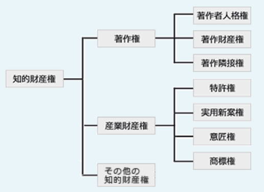
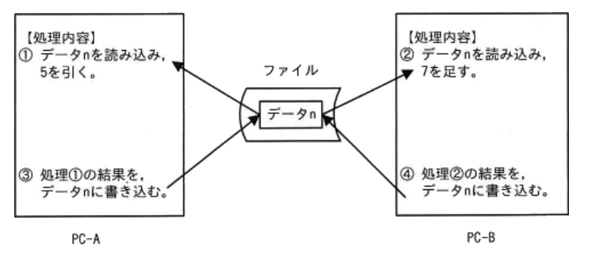
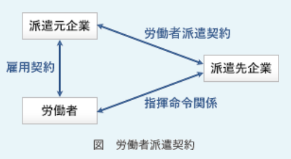
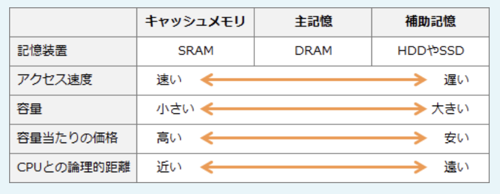
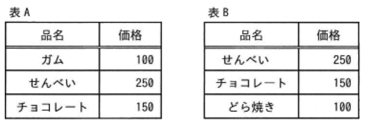
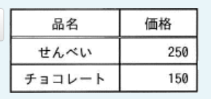
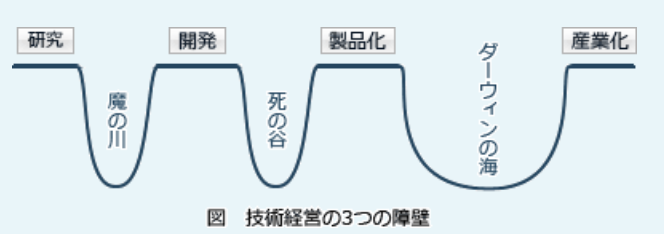

### 過去問(全範囲ランダム)

---
プロジェクトチームの要員に対し、プロジェクトの進行にとって望ましい行動を促進する仕組みを表す用語

- A.**インセンティブ(*incentive*)**  
刺激、奨励、誘因などの意味で、人々の物事に対する意欲を引き出す外部から与えられる要因のこと。「目標を達成するためにプロジェクトチームに対して与えられる出来高の仕組み」(インセンティブ制度)を設けることでノーリスクでプロジェクト進行に対する要員の意欲を高めることが可能

- コンピテンシー(*competency*)  
ビジネスにおいて高い業績を上げる人材の思考傾向や行動特性のこと

- コンプライアンス(*compliance*)  
企業倫理に基づき、法令や社会規範を遵守した企業活動を行うこと

- コンフリクト(*conflict*)  
衝突、争い、論争などの意味。コンピュータ関連では、複数のタスクが同時に同じ資源を利用しようとして発生する競合状態を表す

---
キャッシュフロー計算書において、キャッシュフローの減少要因となるもの

- A.**売掛金の増加**  
売上債権の増加は、期首と比較してその増加分が現金として外部に流出してしまったと考えるため、キャッシュフローの減少要因となる

- 減価償却費の増加  
減価償却費は、固定資産の取得に掛かった費用を使用期間に渡り費用化する手続きで、資金の流出を伴わない費用。キャッシュフロー計算のベースとなる税引前当期純利益はこの減価償却費が引かれている(マイナスの)状態なので、現金流出が無いという実態に合わせるためにキャッシュフロー計算書では減価償却の金額を加算(プラス)し、キャッシュフローゼロとして扱うため、キャッシュフローの増加要因となる

- 在庫の減少  
その減少分の在庫が現金化されたと考えるため、キャッシュフローの増加要因となる

- 短期借入金の増加  
企業内の現金が以前より多くなったと考えるため、キャッシュフローの増加要因となる

---
システムのテスト中に発見したバグを、原因別に集計して発生頻度の高い順に並べ、累積曲線を入れた図表

- A.**散布図**  
分析対象の項目を値の大きい順に並べた棒グラフに累積構成比を表す折れ線グラフを組み合わせた複合グラフで、主に複数の分析対象の中から管理対象とすべき重要な要素を識別するために使用される。システム開発のテストにおいては、原因別のバグ件数を分析し、優先して取り組むべき問題点を明確にするために利用できる(原因別の件数とそ占める割合みたいな感じ)

- 散布図  
縦軸・横軸に2項目の量や大きさ等を対応させて、分析対象のデータを打点した図で、2項目間の分布・相関関係を把握するのに使用される(GDPと人口みたいな)

- 特性要因図  
現れた特性(結果)とそれに影響を及ぼしたと思われる要因の関係を体系的に表わした図。多くの要因が複雑に絡みあっているときに、直接的な原因と間接的な原因に分別したり、真の問題点を明らかにしたりすることができる

- ヒストグラム  
収集したデータをいくつかの区間に分け、区間ごとに該当するデータの出現回数を棒グラフで示した図(年代で分けた人口統計など)

---
知的財産権のうち、産業財産権に該当するもの

- A.**意匠権**(イショウケン)  
製品の価値を高める形状やデザインを保護する、存続期間は出願日から25年

- A.**実用新案権**  
物品の形状、構造または組み合わせに係る考案のうち発明以外のものを保護する、存続期間は出願日から10年

- A.**特許権**  
自然の法則や仕組みを利用した価値ある発明を保護する、存続期間は出願日から20年

人間の知的活動によって創作された財産を保証する権利で、「著作権」と「産業財産権」に分類される。産業財産権は、主として企業活動に関する創作物を保護する権利で、権利として認められるためには関係機関に申請をして登録される必要がある。  
商標権は商品の名称やロゴマークなどを保護する(10年)

- 著作権  
主に文化芸術に関する創作物を保護する権利で、申請しなくとも創作された時点で発生する権利

---
新しい製品を開発する場合に検討するリスク軽減策に関する記述のうち、品質面のリスクを軽減させるもの

- A.**安定した技術を使った製品を開発する**  
安定した技術を使うことで製品に技術的不具合が生じる可能性を下げることができるため、リスク軽減に該当する

- A.**試作品を作成する**  
試作品を作成することで製品の機能や使い勝手などを確認でき、問題点や改善要望などを早い段階で取り入れることが可能になる。これによって不具合が後工程に残ったままになってしまう可能性を下げることができるのでリスク軽減に該当する

- 開発が遅れた場合の保険を掛ける  
リスクが顕在化した場合に備えて保険をかけているので、リスク移転に該当する

---
2台のPCから一つのファイルを並行して更新した。ファイル中のデータnに対する処理が1 ~ 4の順に行われたとき、nは最後にどの値になるか。nの初期値は10であった

- A.**17**  
1.PC-Aがデータnを読み込み、5を引く(5を保持する)  
2.PC-Bがデータnを読み込み、7を足す(17を保持する)  
3.PC-Aが1の結果を、データnに書き込む(5)  
4.PC-Bが2の結果を、データnに書き込む(17)  
複数のクライアントが同じデータを更新しようとするときは、排他制御によって更新の順序を制御しないと、更新処理の消失現象が起こるおそれがある

---
ITサービスマネジメントにおけるITサービス継続性管理とは、災害などの発生時にビジネスへの悪影響を最小限にするための活動である。ITサービス継続性管理においてPDCAサイクルのA(Act)に該当するもの

- A.**レビューやテストの実施結果に基づいて、必要であれば復旧計画書を見直す**  
*Act*に該当する。Checkの結果を受けて計画に対して継続や見直しなどの措置を行うフェーズ

- ITサービスを継続するための復旧方法などを定めた復旧計画書を策定する  
*Plan*に該当する。従来の実績や将来の予測などをもとにして計画を作成する

- 災害の発生を想定して、要員に対する定期的な教育や訓練を実施する  
*Do*に該当する。計画に沿って業務を行う

- 復旧計画の内容についてレビューやテストを実施して検証する  
*Check*に該当する。業務の実施が計画に沿っているかどうかを確認する

---
業務プロセスのモデルを説明したもの

- A.**システム化の対象となるビジネスの活動やデータの流れを明示したもの**

業務で必要なデータとそれに関わる業務活動がどのように絡みあいながら流れていくかに着目し、構造化・組織化したもの。システム化の前提となるモデル化では、E-R図やUMLによる業務・データ分析が行われる

- システム開発でプログラム作成に必要なデータ、機能などを記載したもの  
ソフトウェア詳細設計書やプログラム設計書の説明

- システム開発を外部委託するときの提案依頼に必要な条件を明示したもの  
RFP(*Request For Proposal*)の説明

- システムの開発、運用、保守に必要な組織、資源などを記載したもの  
システム化計画書の説明

---
経営課題と、それを実現するための手法の組み合わせ

- A.**SCM**(*Supply Chain Management*)  
部品の調達から販売までの一貫した効率的な業務プロセスを構築したい  
生産から販売に至る一連の流れに係る情報を一元管理することによって、全体としての効率を大幅に向上させる経営管理手法

- A.**CRM**(*Customer Relationship Management*)  
顧客の嗜好などの情報を把握し、製品の企画、販売促進につなげたい  
顧客に関するあらゆる情報を統合管理し、顧客との長期的な関係を企業活動に役立てる経営管理手法

- A.**POS**(*Point Of Sale*)  
販売時点で、商品名、数量などの売上に関する情報を把握し、適切な在庫補充や売れ筋商品の分析を行いたい  
商品・販売店・販売時間などの情報をリアルタイムで情報システムに取り込み、販売傾向の把握や在庫管理に役立てる管理手法

---
ある商品の前期、当期2期分の売上高と総費用は表のとおり。この商品の1期間の固定費は何千円か。総費用は固定費と変動費の合計であり、固定費及び売上高に対する変動費の割合は、前期、当期ともに変わらないものとする(単位:千円)

|     |前期  |当期   |
|-----|------|------|
|売上高|10,000|11,000|
|層費用|9,000 |9,600 |

- A.**3,000**

層費用は固定費と変動費の合計。変動費は売り上げの増加に伴い増加するので、以下の式で算出できる。  
変動費 = 売上高 * 変動比率  
(売上高 = 変動費 / 変動比率)  
(変動比率 = 変動費 / 売上高)  
固定費及び変動比率は一定という条件のため、固定費をa、変動比率をbとした連立方程式で固定費(a)を導出できる。  
a + 10,000b = 9,000 (前期)  
a + 11,000b = 9,600 (当期)  
1,000b = 600, b = 0.6  
a = 9,000 - 6,000 = 3,000(千円)

---
ある販売会社が扱っている商品の4月末の実在庫数が100個であり、5月10日までの受発注取引は表のとおりである。商品は発注目の5日後に入荷するものとし、販売会社と商品発注先の休日、及び前月以前の受発注取引を考えない場合、5月10日時点の引当可能在庫数は何個か。引当可能在庫数は、その時点の在庫のうち引当可能な数量とする

|取引日|商品の発注|商品の発注|
|-----|--------|---------|
|5月2日|40個    |-        |
|5月3日|-       |50個     |
|5月6日|20個    |-        |
|5月7日|-       |50個     |
|5月9日|30個    |-        |

- A.**60**  
5月7日発注の50個は5月10日には納入されていないので、  
100 - 40 - 20 - 30 + 50 = 60(個)

---
フェールセーフの説明

- A.**故障や操作ミスが発生しても、安全が保てるようにしておく**  
システムに不具合や故障が発生したときに、障害の影響範囲を最小限にとどめ、常に安全を最優先して制御を行う設計方針

工場のロボットの動作範囲内に人間が入った場合、ロボットを制御するシステムはセンサーで危険を察知し機械を停止する。また、道路信号機は停電や故障したときに両方向とも赤点滅(または黄点滅との組合せ)になるように設計されている

- 障害が発生した際に、正常な部分だけを動作させ、全体に支障を来さないようにする  
フェールソフトの考え方

- 組織内のコンピュータネットワークに外部から侵入されるのを防ぐ  
ネットワークからの不正なアクセスを防ぐのはファイアウォール

- 特定の条件に合致するデータだけをシステムに受け入れる  
人為的なミスによる障害を防ぐ、フールプルーフの考え方

---
コンビニエンスストアを全国にチェーン展開するA社では、過去10年間にわたる各店舗の詳細な販売データが本部に蓄積されている。これらの販売データ・過去10年間の気象データ・各店舗近隣のイベント情報との関係を分析して、気象条件・イベント情報と商品の販売量との関連性を把握し、1週間先までの天気予報とイベント情報から店舗ごとの販売予想をより高い精度で行うシステムを構築したい。このとき活用する技術

- A.**ディープラーニングなどのAI技術**

本システムに求められていることは、気象条件、イベント情報と商品の販売量との関連性を分析し、その分析結果に基づいて将来の予測を行うこと。揃っているデータを分析することが目的なので、センサーによるデータ収集(ア)と仮想現実技(VR)(イ)は無関係。  
分析対象となる10年分の販売データは相当なデータ量になる。全国に100店舗、商品数が50という相当少なめな数値で見積もっても分析対象のデータ数は優に1,000万件を超える。表計算ソフトは行数・列数が制限されることもあり(最大100万行程度)、そこまで多い量のデータ分析には向かない。ビッグデータに類する膨大な量のデータの分析では、ディープラーニングなどのAI技術を用いたシステムを構築し、それにデータを学習させる方法が有効

- IoTを用いたセンサーなどからの自動データ収集技術
- 仮想空間で現実のような体験を感じることができる仮想現実技術
- 表計算ソフトを用いて統計分析などを行う技術

---
インターネット上で通信販売を行っているA社は、販売促進策として他社が発行するメールマガジンに自社商品Yの広告を出すことにした。広告は、メールマガジンの購読者が広告中のURLをクリックすると、その商品ページが表示される仕組みになっている。この販売促進策の前提を表のとおりとしたとき、この販売促進策での収支がマイナスとならないようにするためには、商品Yの販売価格は少なくとも何円以上である必要があるか。購入者による商品Yの購入は1人1個に限定されるものし、他のコストは考えないものとする

|番号|説明|割合|
|---|---|----|
|1  |メルマガの購読者数|100,000人|
|2  |1のうち、広告中のURLをクリックする割合|2%|
|3  |2のうち、商品Yを購入する割合|10%|
|4  |商品Yの1個当たりの原価|1,000円|
|5  |販促策に掛かる費用の総額|200,000円|

- A.**2,000**

購入者の人数:  
100,000人 * 0.02 * 0.1 = 200人  
200,000 / 200 = 1,000  
1人当たり1,000円は利益を出す必要がある

---
表計算ソフトを用いて、ワークシートに示す各商品の月別売上額データを用いた計算を行う。セルE2に式"条件付個数(B2:D2, > 15000)"を入力した後、セルE3とE4に複写したとき、セルE4に表示される値

| |A|B|C|D|E|
|-|-|-|-|-|-|
|1|商品名|1月売上額|2月売上額|3月売上額|条件付個数|
|2|商品A|10,000|15,000|20,000||
|3|商品B|5,000|10,000|5,000||
|4|商品C|10,000|20,000|30,000||

- A.**2**

式"条件付個数(B2:D2, > 15000)"  
セルB2 ~ D2の中で15000より大きな値をもつセルの個数を返す。セル番地は相対参照なので、縦(行)方向に複写すると式中の行番号が1つ増える。E4には式"条件付個数(B4:D4, > 15000)"が格納されている

---
ファイルサーバに保存されている文書ファイルの内容をPCで直接編集した後、上書き保存しようとしたら「権限がないので保存できません」というメッセージが表示された。この文書ファイルと保存されているフォルダに設定されていた権限の組合せ

- A.ファイル読取り権限:**あり**
- A.ファイル書込み権限:**なし**
- A.フォルダ読取り権限:**あり**

ファイルやフォルダには、ユーザーやユーザーグループごとに「読取り」「書込み」「実行」などのアクセス権を設定することができる。  
・文書ファイルの内容をPCで直接編集した:  
ファイルサーバ上のファイルをPCで開けたということなので、ファイルとフォルダの読取り権限はある  
・上書き保存しようとしたら権限がなくて失敗  
ファイルの書込み権限はない

---
LPWAの特徴

- A.**低消費電力型の広域無線ネットワークであり、通信速度は携帯電話システムと比較して低速なものの、一般的な電池で数年以上の運用が可能な省電力性と、最大で数十kmの通信が可能な広域性を有している**  
*Low Power Wide Area*は、LP : *LowPower* = 省電力、WA : *WideArea* = 広範囲の名称の通り、省電力・広範囲を特徴とする無線通信規格の総称。伝送速度は遅いものの、省電力でWi-fiやBluetoothが届かない数kmから数十km間の通信をカバーする

IoT(*Internet of Things*)では、各所に配置された個々のIoTデバイスが内部バッテリーのみで長期間続けて稼働することになるため、バッテリー消費をいかに抑えるかがポイント。IoTデバイス同士は制御や情報取得のためにお互いに通信することになるが、この個々の通信はそれほど大きいデータ量ではないので、通信回線の高速性は重要ではない。これらの特徴を踏まえると、IoTネットワークには省電力・低速・広範囲のネットワークが適している。LPWAは、小型デバイスを多数配置した広範囲のIoTネットワークの運用を実現する手段として期待されている

- AIに関する技術であり、ルールなどを明示的にプログラミングすることなく、入力されたデータからコンピュータが新たな知識やルールなどを獲得できる  
機械学習の説明

- 分散型台帳技術の1つであり、複数の取引記録をまとめたデータを順次作成し、直前のデータのハッシュ値を埋め込むことによって、データを相互に関連付け、矛盾なく改ざんすることを困難にして、データの信頼性を高めている  
ブロックチェーンの説明

- 無線LANの暗号化方式であり、脆弱性が指摘されているWEPに代わって利用が推奨されている  
WPA2、WPA3に関する説明

---
労働者派遣法に基づき、A社がY氏をB社へ派遣することとなったときに成立する関係

- A.**B社とY氏との間の指揮命令関係**  
Y氏は派遣先企業であるB社の指揮命令の下で業務に従事することになる

労働者派遣契約は、派遣元企業の従業員が、派遣先企業の指揮命令の下で業務に従事できるようにした労働契約。労働者派遣契約の場合、雇用関係は派遣元企業と派遣労働者の間に、指揮命令関係は派遣先企業と派遣労働者の間に成立する。A社が派遣元企業、B社が派遣先企業、Y氏が派遣労働者となる

- A社とB社との間の委託関係  
A社とB社の間には労働者派遣契約関係が成立する

- A社とY氏との間の労働者派遣契約関係  
A社(派遣元企業)とY氏の間には雇用関係が成立する

- B社とY氏との間の雇用関係  
Y氏は派遣先企業であるB社の指揮命令の下で業務に従事することになる

---
イノベーションのジレンマ

- A.**優良な大企業が、革新的な技術の追求よりも、既存技術の向上でシェアを確保することに注力してしまい、結果的に市場でのシェアの確保に失敗する現象**  
イノベーション分野における理論の1つ。イノベーションを普及させトップに立った先行企業が、真の顧客ニーズを軽視して成功した製品の改良に注力しすぎた結果、破壊的イノベーションを武器にする後続企業にシェアを奪われてしまう現象のこと

- 最初に商品を消費したときに感じた価値や満足度が、消費する量が増えるに従い、徐々に低下していく現象  
限界効用逓減の法則に関する記述

- 自社の既存商品がシェアを占めている市場に、自社の新商品を導入することで、既存商品のシェアを奪ってしまう現象  
カニバリゼーションに関する記述

- 全売上の大部分を、少数の顧客が占めている状態  
パレートの法則に関する記述

---
HyperTextの特徴

- A.**文中の任意の場所にリンクを埋め込むことで関連した情報をたどれるようにした仕組みをもっている**  
ハイパーリンクという参照を使って複数の文書を相互に結び付ける仕組みでHTMLのベースになっている考え方

Webブラウザを介してインターネット上のハイパーテキストを閲覧する仕組みがWWW(*World Wide Web*)。インターネットに限った話ではなく、ローカル環境で扱う文書ファイルなどにも*HyperText*の仕組みは取り入れられている

- いろいろな数式を作成・編集できる機能をもっている  
LaTexなどの説明

- いろいろな図形を作成・編集できる機能をもっている  
SVG(*Scalable Vector Graphics*)などの説明

- 多様なテンプレートが用意されており、それらを利用できるようにしている  
CMS(*Contents Management System*)などが該当する(これだけでは何に関する記述か特定できない)

---
あるメーカーの当期損益の見込みは表のとおりであり、その後広告宣伝費が5億円、保有株式の受取配当金が3億円増加した。最終的な営業利益と経常利益はそれぞれ何億円になるか。広告宣伝費、保有株式の受取配当金以外は全て見込みどおりであったものとする(単位:億円)

|項目                 |金額 |
|--------------------|-----|
|売上高               |1,000|
|売上売価             |780  |
|販売費及び一般管理費   |130  |
|営業外収益            |20   |
|営業外費用            |16   |
|特別利益             |2     |
|特別損失             |1     |
|法人税、住民税及び事業税|50    |

A.営業利益:**85**  
A.経常利益:**92**  
広告宣伝費は「販売費及び一般管理費」、受取配当金は「営業外収益」に分類される

営業利益 = 売上高 - 売上原価 - 販売費及び一般管理費  
= 1,000 - 780 - 135 = 85  
経常利益 = 営業利益 + 営業外収益 - 営業外費用  
= 85 + 23 - 16 = 92

---
IoT機器やPCに保管されているデータを暗号化するためのセキュリティチップであり、暗号化に利用する鍵などの情報をチップの内部に記憶しており、外部から内部の情報の取出しが困難な構造をもつもの

- A.**TPM(*Trusted Platform Module*)**  
OSやアプリケーションの改ざん検知、端末認証、ストレージ全体の暗号化などを提供している

PCのマザーボード上に直付けされるセキュリティチップで、暗号化 / 復号や鍵ペアの生成、ハッシュ値の計算、デジタル署名の生成・検証などの機能を有する。内部のデータを読み取ろうとしてもチップへの干渉により物理的に破損する構造になっているため、外部からの攻撃に強い耐性がある

- GPU(*Graphics Processing Unit*)  
コンピュータにおいて画像処理を専門に担当するハードウェア部品

- NFC(*Near Field Communication*)  
至近距離(数cm ~ 1ｍ)での無線通信について定めた国際標準規格で、非接触型ICカードの技術に基づいて開発されたもの

- TLS(*Transport Layer Security*)  
認証、改ざん検知、暗号化通信などの機能を提供するセキュリティプロトコル

---
部外秘とすべき電子ファイルがある。このファイルの機密性を確保するために使用するセキュリティ対策技術

- A.**アクセス制御**  
組織内の情報資産に対して誰がどんな権限でアクセスできるかをコントロールすること。機密性を確保するための対策に該当する

- タイムスタンプ  
電子データに付与することで、付与時点での存在性及びその時刻以後の完全性を確認できる仕組み。完全性を確保するための対策に該当する

- デジタル署名  
電子データの改ざん検知及び送信者の正当性を確認する仕組み。完全性を確保するための対策に該当する

- ホットスタンバイ  
主系と待機系に同じシステムを起動しておき、障害が発生した時に即座に待機系に切り替えることができるようにした方式。可用性を確保するための対策に該当する

---
コンピュータの記憶階層におけるキャッシュメモリ、主記憶及び補助記憶と、それぞれに用いられる記憶装置の組合せ

- A.キャッシュメモリ:**SRAM**  
CPUと主記憶の速度差を埋めるために搭載される記憶装置で、SRAM(*Static RAM*)が用いられる

- A.主記憶:**DRAM**  
CPUが直接読み書きするために実行するプログラムやデータを記憶する装置で、DRAM(*Dynamic RAM*)が用いられる

- A.補助記憶:**SSD**  
主記憶以外の記憶装置のうち、主にコンピュータに常時接続される大容量の記憶装置をいい、磁気ディスクのHDD(*Hard Disk Drive*)や半導体メモリのSSD(*Solid State Drive*)が用いられる

---
システム障害が発生した際、インシデント管理を担当するサービスデスクの役割

- A.**既知の障害事象とその回避策の利用者への紹介**  
利用者に対して単一窓口(SPOC : *Single Point of Contact*)を提供して、インシデントなどの障害、サービス要求、標準的な変更などの様々な問い合わせを受付け、その記録を一元管理する組織。サービス提供者とサービス利用者の接点となり、日々発生するインシデントやサービス要求を処理する。  
サービスデスクでは利用者から受け付けた内容が既知の問題であり、その回避策(ワークアラウンド)が存在する場合には、その場で回避策を伝えて迅速な問題解決を促す

- システム障害対応後の利用者への教育  
インシデントの再発予防策を行うのは問題管理プロセスの役割

- 障害が発生している業務の代行処理  
サービス要求管理プロセスの役割。このプロセスは障害という枠にとらわれず、新規ユーザー登録、パスワードリセット、プリンターのトナー交換など日常的なトラブルにも対処する

- 障害の根本原因調査  
問題管理プロセスの役割

---
プロジェクトマネジメントの進め方に関する説明

- A.**目標を達成するための計画を作成し、実行中は品質、進捗、コストなどをコントロールし、目標の達成に導く**  
プロジェクト活動に知識、スキル、ツール、技法などを適用して、プロジェクト目標を達成できるように管理すること。プロジェクトを立ち上げ、計画を策定し、実行をコントロールし、終結させるまでの一連の活動をカバーしている。  
プロジェクトの実行中は、品質、コスト、進捗(いわゆるQCD)は当然として、その他にもコミュニケーション、ステークホルダとの関係、調達関係、変更要求などもコントロールの対象とする

- 企画、要件定義、システム開発、保守の順番で、開発を行う  
システム開発の手順

- 戦略、設計、移行、運用、改善のライフサイクルで、ITサービスを維持する  
ITサービスマネジメントの手順

- 予備調査、本調査、評価、結論の順番で、リスクの識別、コントロールが適切に実施されているかの確認を行う  
システム監査の手順

---
通信プロトコルとしてTCP / IPを用いるVPNには、インターネットを使用するインターネットVPNや通信事業者の独自ネットワークを使用するIP-VPNなどがある。インターネットVPNではできないが、IP-VPNではできること

- A.**帯域幅などの通信品質の保証**  

VPN(*Virtual Private Network*)は、IP-VPNとインターネットVPNに大別できる
・IP-VPN  
一般のインターネット網ではなく通信業者が用意した閉域IPネットワークを使用してVPNを構築する方式。構築コストが高いが、盗聴や改ざんのリスクが低く、混雑の影響を受けにくい。使用可能なプロトコルがIPに限られる  
・インターネットVPN  
セキュリティプロトコルであるIPsecやSSL / TLSの機能を使用して一般のインターネット網上にVPNを構築する方式。構築コストは安いが、盗聴や改ざんのリスクは増加する  
インターネットVPNと比較したときのIP-VPNの特長として、回線の稼働率や通信速度についてのSLAが用意され通信品質が保証されるという点がある。インターネットVPNは多くの人が利用するインターネット回線を利用するので帯域保証はない。IP電話、盗聴・改ざん防止、動画配信はどちらのサービスでもできるが、通信品質の保証を得るにはIP-VPNを選択する必要がある

- IP電話を用いた音声通話
- 盗聴、改ざんの防止
- 動画の配信

---
関係データベースにおいて、表Aと表Bの積集合演算を実行した結果

- A.  

積共通演算は、2つの表に共通するレコードのみから成る新しい表を返す演算。A∩(且つ)Bを表す

---
サーバ仮想化の特長

- A.**1台のコンピュータを複数台のサーバであるかのように動作させることができるので、物理的資源を需要に応じて柔軟に配分することができる**  
1台の物理サーバ上で複数のサーバOSを稼働させる技術

一般に、仮想化技術によって複数のサーバの機能を1台の物理サーバに統合した場合、機能ごとに物理サーバを用意したときと比較して以下のようなメリット・デメリットがある。  
・サーバの台数が少なくなるので物理的管理が簡易化できる  
・サーバの利用率が高くなり資源の有効利用ができる  
・負荷の度合いや処理量などに応じて、リソースの配分を柔軟に変更できる  
・1台のサーバに複数の機能を持たせるので、処理以外にかかるCPUのオーバーヘッドは高くなる  
・物理サーバに障害が発生した場合、その物理サーバで稼働している全ての仮想サーバに影響が出る

- コンピュータの機能をもったブレードを必要な数だけ筐体に差し込んでサーバを構成するので、柔軟に台数を増減することができる  
ブレードサーバの特長

- サーバを構成するコンピュータを他のサーバと接続せずに利用するので、セキュリティを向上させることができる  
スタンドアロンの特長

- サーバを構成する複数のコンピュータが同じ処理を実行して処理結果を照合するので、信頼性を向上させることができる  
ディアルシステムの特長

---
デザイン思考の例

- A.**アプローチの中心は常に製品やサービスの利用者であり、利用者の本質的なニーズに基づき、製品やサービスをデザインする**  
ビジネス上の課題に対して、デザイナーがデザインを行う際の思考プロセス(デザイナー的思考)を転用して問題にアプローチする手法のこと。デザイン思考のプロセスは、共感 => 問題定義 => 創造 => プロトタイプ => テストの5ステップを踏むとされている。顧客のニーズを出発点として、顧客が本当に欲する製品やサービスを企画・設計することを目的とし、既存の概念にとらわれずにイノベーションを生み出すデザイン方法として注目されている

- Webページのレイアウトなどを定義したスタイルシートを使用し、ホームページをデザインする  
CSS(*Cascading Style Sheets*)の例

- 業務の迅速化や効率化を図ることを目的に、業務プロセスを抜本的に再デザインする  
BPR(*Business Process Re-engineering*)の例

- データと手続を備えたオブジェクトの集まりとして捉え、情報システム全体をデザインする  
オブジェクト指向の例

---
下記項目で関係データベースで管理する社員票を設計する。他の項目から導出できる、冗長な項目

社員番号 : 社員名 : 生年月日 : 現在の満年齢 : 住所 : 趣味

- A.**現在の満年齢**  
冗長とは、余分や無駄の意味。単価と購入数量が分かっている時の合計金額など。既にある属性から計算等で求めることができるので、正規化の過程ではデータの保守性向上のため冗長な項目を排除するのが原則。現在の日付から生年月日を引くことで計算可能なため、現在の満年齢は冗長な項目に該当する

---
技術経営における新事業創出のプロセスを、研究・開発・事業化・産業化の4つに分類したとき、事業化から産業化を達成し、企業の業績に貢献するためには、新市場の立上げや競合製品の登場などの障壁がある。この障壁を意味する用語

- A.**ダーウィンの海**  
技術経営の成功を阻む障壁を表す言葉で、新技術を用いた開発した製品が市場で淘汰されてしまうこと。製品化までたどり着いた新製品が他企業との競争や顧客ニーズの荒波を乗り越え、事業化に達することの難しさを比喩した言葉。同じく技術経営の壁を意味する言葉に「魔の川」「死の谷」もある

- 囚人のジレンマ  
ゲーム理論に関するモデルの1つで、複数の囚人がいる状況で各々が自分にとってベストな選択をした結果、お互いに協力した時よりも全体としての利益が少なくなってしまう様子を表したもの

- ファイアウォール  
不正データの通過を阻止するためにネットワーク同士の境界に配置されるソフトウェア・ハードウェア

- ファイブフォース  
業界の収益性を決める5つの競争要因から、業界の構造分析をおこなう手法。「供給企業の交渉力」「買い手の交渉力」「競争企業間の敵対関係」という3つの内的要因と、「新規参入業者の脅威」「代替品の脅威」の2つの外的要因、計5つの要因から業界全体の魅力度を測る

---
アジャイル開発の方法論であるスクラムに関する記述

- A.**複雑で変化の激しい問題に対応するためのシステム開発のフレームワークであり、反復的かつ漸進的な手法として定義したものである**  
顧客の要求に応じて、迅速かつ適応的にソフトウェア開発を行う軽量な開発手法の総称。スクラム(*Scrum*)は、アジャイル開発の方法論の1つで、開発プロジェクトを数週間程度の短期間ごとに区切り、その期間内に分析・設計・実装・テストの一連の活動を行い、一部分の機能を完成させるという作業を繰り返しながら、段階的に動作可能なシステムを作り上げるフレームワーク。スクラム開発における反復の単位を「スプリント」と呼ぶ

- ソフトウェア開発組織及びプロジェクトのプロセスを改善するために、その組織の成熟度レベルを段階的に定義したものである  
CMMI(*Capability Maturity Model Integration* : 統合能力成熟度モデル)の説明

- ソフトウェア開発とその取引において、取得者と供給者が、作業内容の共通の物差しとするために定義したものである  
共通フレームの説明

- プロジェクトマネジメントの知識を体系化したものであり、複数の知識エリアから定義されているものである  
PMBOKの説明

---
サーバの仮想化技術において、あるハードウェアで稼働している仮想化されたサーバを停止することなく別のハードウェアに移動させ、移動前の状態から引き続きサーバの処理を継続させる技術

- A.**ライブマイグレーション(*Live Migration*)**  
ある物理サーバ上で稼働している仮想マシンを、OSやソフトウェアを停止させることなく別の物理サーバに移し替え、処理を継続させる技術。アプリケーションを実行状態のまま移動させる。切り替えによるダウンタイムはほとんどゼロで、移動前の処理やセッションが全て引き継がれるため可用性を損なうことがない。

- ストリーミング  
主に音声や動画などマルチメディアファイルについて、データをダウンロードをしながら順次再生をする方式

- デジタルサイネージ  
デジタル技術を活用して平面ディスプレイやプロジェクタなどに映像や情報を表示する広告媒体のこと。店舗や屋外に設置されている

- プラグアンドプレイ  
周辺機器を接続するのと同時に、自動的にPCがそれを認識しデバイスドライバのインストールと設定を行う機能

---
AIの活用領域には音声認識・画像認識・自然言語処理などがある。音声認識と自然言語処理の両方が利用されているシステムの事例

- A.**人から話しかけられた天気や交通情報などの質問を解釈して、ふさわしい内容を回答する**  
人の質問を文字の集まりに変換するのは音声認識、その意味を解釈し、適切な回答を組み立てるのは自然言語処理

- ドアをノックする音を検知して、カメラの前に立っている人の顔を認識し、ドアのロックを解除する  
様々な音の中からノックする音を検知するのは音声認識、人の顔を認識するのは画像認識

- 野外コンサートに来場する人の姿や話し声を検知して、会場の入り口を通過する人数を記録する  
人の姿を検知するのは画像認識、話し声を検知するのは音声認識

- 洋書に記載されている英文をカメラで読み取り、要約された日本文として編集する  
英文の画像から文字を抽出するのは画像認識、英文を要約し、日本語の文章にするのは自然言語処理

---
内外に宣言する最上位の情報セキュリティポリシーに記載すること

- A.**経営陣が情報セキュリティに取り組む姿勢**  
基本方針・対策基準・実施手順の3階層で構成されることが一般的。情報セキュリティポリシーの最上位に位置する文書は、組織の経営者が最終的な責任者となり「情報セキュリティに本格的に取り組む」という姿勢を示し、情報セキュリティの目標と適用範囲、その目標を達成するために企業がとるべき行動を社内外に宣言するもの

- 情報資産を守るための具体的で詳細な手順  
詳細な手順については個々の実施手順・運用規則・マニュアルなどに記載する。上記の3階層の中では実施手順に記載すること

- セキュリティ対策に掛ける費用  
IT関連予算内に記載する

- 守る対象とする具体的な個々の情報資産  
情報資産管理台帳に記載する

---
情報の取扱いに関する不適切な行為のうち、不正アクセス禁止法で定められている禁止行為に該当するもの

- A.**オフィス内で拾った手帳に記載されていた他人のIDとパスワードを無断で使い、ネットワークを介して自社のサーバにログインし、サーバに格納されていた人事評価情報を閲覧した**  
他人の認証情報を本人に許可なく使用し、ネットワークを介して認証が必要なページにアクセスしているので禁止行為に該当する

- A.**自分には閲覧権限のない人事評価情報を盗み見するために、他人のネットワークIDとパスワードを無断で入手し、自分の手帳に記録した**  
不正アクセス行為を行う目的で、他人の認証情報を保管する行為は禁止されている

- 部門の保管庫に保管されていた人事評価情報が入ったUSBメモリを上司に無断で持ち出し、自分のPCに直接接続してその人事評価情報をコピーした  
他人の認証情報を利用していないこと、USBメモリにアクセス制御機能が設けられていないことから禁止行為には該当しない。ただし、USBの無断持ち出しは窃盗罪、秘密情報の不正閲覧は民法上の不法行為や就業規則違反となる可能性がある

---
情報システムの調達の際に作成される文書

- A.調達する情報システムの概要や提案依頼事項、調達条件などを明示して提案書の提出を依頼する文書は**RFP**である。また、システム化の目的や業務概要などを示すことによって、関連する情報の提供を依頼する文書は**RFI**である  
・RFI(*Request For Information*)  
企業・組織がシステム調達や業務委託をする場合や、初めての取引となるベンダー企業に対して行う**情報提供要求**、またはその際に配布される文書のこと。RFIを発行することによって相手方が保有する技術・経験や、情報技術動向・導入予定のシステムが技術的に実現可能であるかなどを確認できる  
・RFP(*Request For Proposal*)  
情報システムの調達を予定している企業・組織が、発注先候補のベンダー企業に対して行う**提案依頼要求**、またはその際に配布される文書のこと。提案範囲・納期・システムの機能範囲・運用条件・性能要件・開発体制などのシステムの要件や調達条件が盛り込まれる

---
バイオメトリクス認証で利用する身体的特徴に関する記述

- A.バイオメトリクス認証における本人の身体的特徴としては、**偽造**が難しく、**経年変化**が小さいものが優れている  
個人ごとに異なる身体の特徴や行動パターンを比較することで認証を行う技術。事前に個人の身体的特徴等をシステムに登録しておき、認証時に入力されたデータとの類似度によって本人かどうかの判定を行う。  
・偽造について : 不正認証を防ぐためには偽造が困難な特徴を用いる必要がある。一般的に指紋認証や顔認証は偽造に弱いと言われている。判別が困難だと本人を他人と識別して拒絶してしまうリスク、他人を本人と識別してしまうリスクが高まるので、他人と本人の判別が明確にできる特徴が優れていると言える  
・経年変化について : 身体的特徴でも経年劣化しやすいもの、しにくいものがある。顔や声は経年により変化しやすいが、虹彩や静脈は変化がない。個人差が小さい特徴は誤認証のリスクが高くなるので適していない

---
受信した電子メールに添付されていた文書ファイルを開いたところ，PCの挙動がおかしくなった。この時に疑われる攻撃

- A.**マクロウイルス**  
文書ファイルや表計算ファイルに記載されているマクロ機能を悪用したマルウェア。不正なプログラムが仕込まれたWord / Excel形式などのファイルを開くことによって動作を開始する。マクロウイルス単体でファイル書換などの損害を被るだけでなく、他のマルウェアをダウンロードするなど連携して感染させるケースもあり、不審なファイルを開かないように注意が必要

- SQLインジェクション  
Webアプリケーションに対してデータベースへの命令文を構成する不正な入力データを与え、Webアプリケーションが想定していないSQL文を意図的に実行させることで、DBを破壊したり情報を不正取得したりする攻撃

- クロスサイトスクリプティング  
動的にWebページを生成するWebアプリケーションに対して、悪意のあるスクリプトを混入させることで、攻撃者が仕込んだ操作を実行させたり、別のサイトを横断してユーザーのクッキーや個人情報を盗んだりする攻撃手法

- ショルダーハッキング  
ディスプレイやキーボード操作を利用者の背後から盗み見て、パスワード等の秘密情報を記憶する行為

---
ブログにおけるトラックバックの説明

- A.**別の利用者のブログ記事へのリンクを張ると、リンクが張られた相手に対してその旨を通知する仕組み**  

- 一般利用者が、気になるニュースへのリンクやコメントなどを投稿するサービス  
コメント投稿サービスの説明

- ネットワーク上にブックマークを登録することによって、利用価値の高いWebサイト情報を他の利用者と共有するサービス  
ソーシャルブックマークの説明

- ブログに貼り付けたボタンをクリックすることで、SNSなどのソーシャルメディア上でリンクなどの情報を共有する機能  
ソーシャルボタンの説明

---
3人の候補者の中から兼任も許す方法で委員長と書記を1名ずつ選ぶ場合、3人の中から委員長1名の選び方が3通りで、3人の中から書記1名の選び方が3通りであるので、委員長と書記の選び方は全部で9通りある。5人の候補者の中から兼任も許す方法で委員長と書記を1名ずつ選ぶ場合の選び方

- A.**25**  
兼任できるため、それぞれの役職で選ぶ方法が5通りなので、5 * 5 = 25通り。兼任ができない場合は、5 * 4 = 20通り

---
令和2年95

---
令和2年12

---
令和2年34

---
令和2年49

---
令和2年89

---
令和元年62

---
令和元年45

---
令和2年20
