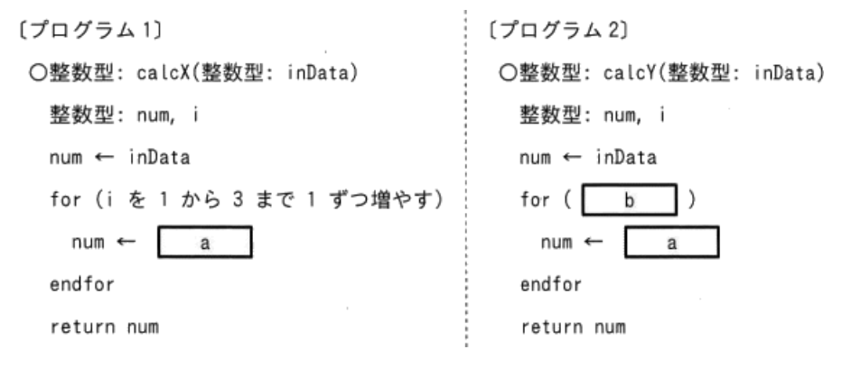
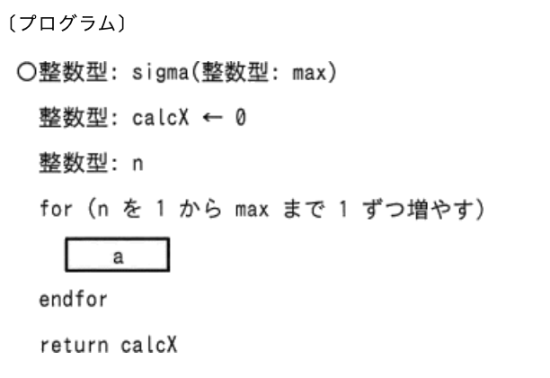
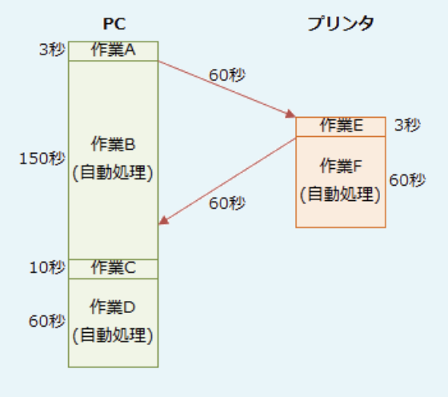
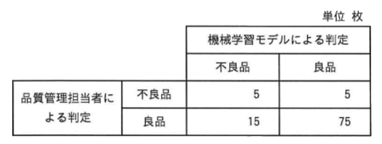
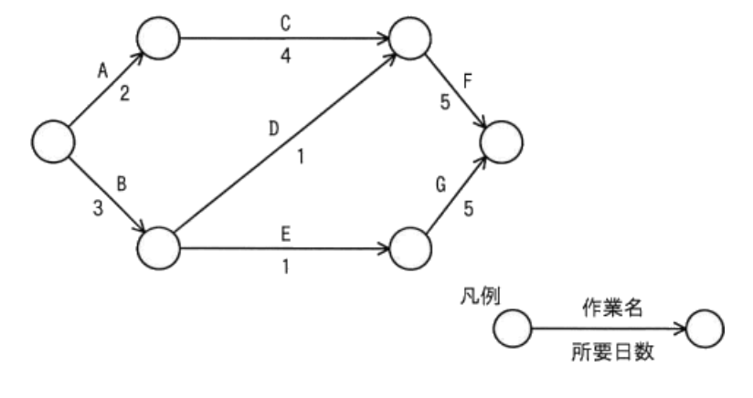
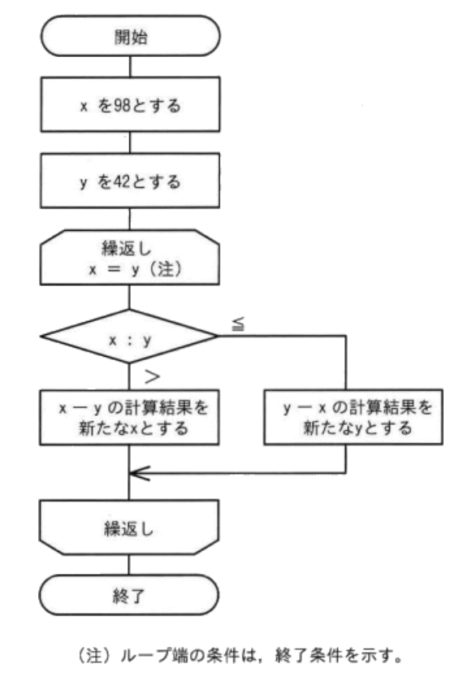
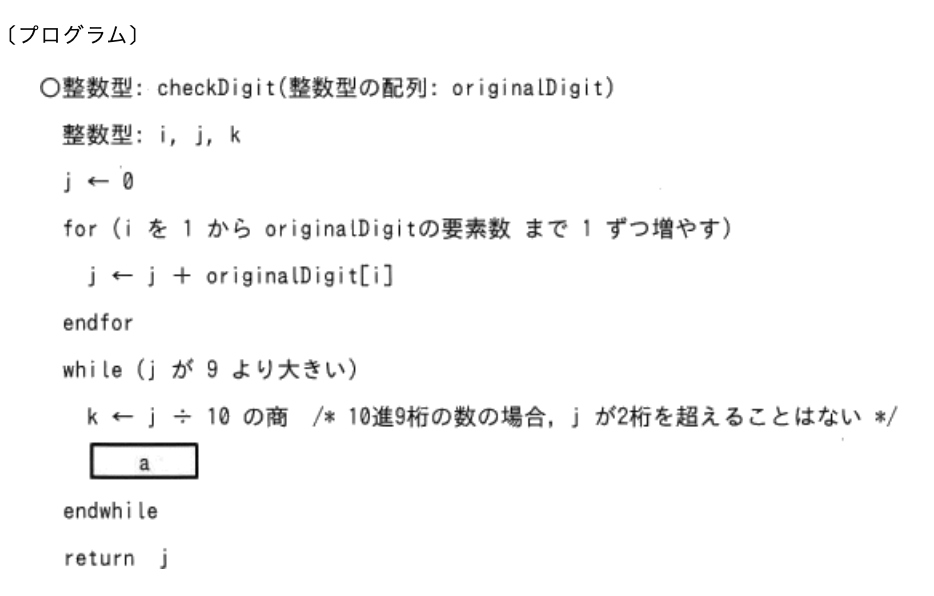

### 計算問題のみ
---
A社のある期の資産、負債及び純資産が次のとおりであるとき、経営の安全性指標の1つで、短期の支払能力を示す流動比率は何%か

- A.**200**

流動負債に対する流動資産の割合を示す財務指標で、この値が高いほど企業の短期支払い能力は高いと判断される。一般的には200%以上あれば問題ないとされ、逆に100％を下回っていると危険な状態にあると判断される。  
流動比率(%) = 流動資産 / 流動負債 * 100  
流動資産とは概ね1年以内に現金化できる資産のことで、現預金、売掛金、受取手形、前払金、棚卸資産などが含まれる。流動負債とは概ね1年以内に支払期限を迎える負債のことで、買掛金、支払手形、未払費用、短期借入金などが含まれる。  
貸借対照表より流動資産は3,000百万円、流動負債は1.500百万円なので、流動比率は200%となる

---
ソフトウェアの品質を判定する指標として、機能単位の不良件数をその開発規模で割った値を"不良密度"と定義する。不良密度の下限値と上限値を設定し、実績値がその範囲を逸脱した場合に問題ありと判定するとき、A工程では問題がなく、B工程で問題があると判定される機能はどれか。不良密度の下限値は0.25件 / KS、上限値は0.65件 / KSとする。不良密度の下限値、上限値及び開発規模は、両工程とも同じとする

|機能 |開発規模(KS)|A工程の不良件数|B工程の不良件数|
|----|-----------|-------------|------------|
|機能1|10        |6            |3           |
|機能2|20        |14           |10          |
|機能3|50        |10           |40          |
|機能4|80        |32           |8           |

- A.**機能4**  
A工程 : 32件 / 80KS = 0.4件 / KS, 問題なし  
B工程 : 8件 / 80KS = 0.1件 / KS, 問題あり

- 機能1  
A工程 : 6件 / 10KS = 0.6件 / KS, 問題なし  
B工程 : 3件 / 10KS = 0.3件 / KS, 問題なし

- 機能2  
A工程 : 14件 / 20KS = 0.7件 / KS, 問題あり  
B工程 : 10件 / 20KS = 0.5件 / KS, 問題なし

- 機能3  
A工程 : 10件 / 50KS = 0.2件 / KS, 問題あり  
B工程 : 40件 / 50KS = 0.8件 / KS, 問題あり

---
関数calcXと関数calcYは、引数inDataを用いて計算を行い、その結果を戻り値とする。関数calcXをcalcX(1)として呼び出すと、関数calcXの変数numの値が、1 → 3 → 7 → 13と変化し、戻り値は13となった。関数calcYをcalcY(1)として呼び出すと、関数calcYの変数numの値が、1 → 5 → 13 → 25と変化し、戻り値は25となった。プログラム中のa・bに入れる字句の適切な組合せ

- A.**a : num + 2 * i**
- A.**b : iを2から6まで2ずつ増やす**

a : 2 * num + iのとき  
num = 2 * 1 + 1 = 3  
num = 2 * 3 + 2 = 8  
num = 2 * 8 + 3 = 19

a : num + 2 * iのとき => こちらが適切  
num = 1 + 2 * 1 = 3  
num = 3 + 2 * 2 = 7  
num = 7 + 2 * 3 = 13

b : iを1から7まで3ずつ増やす  
num = 1 + 2 * 1 = 3  
num = 3 + 2 * 4 = 11  
num = 11 + 2 * 7 = 25

b : iを2から6まで2ずつ増やす => こちらが適切  
num = 1 + 2 * 2 = 5  
num = 5 + 2 * 4 = 13  
num = 13 + 2 * 6 = 25

---
製品Aの生産計画量、部品Bの総所要量及び在庫量が表のとおりであるとき、第2週における部品Bの発注量aの個数  
・製品Aの生産リードタイム(着手から完成までの期間)は無視する  
・製品Aを1個生産するためには部品Bが2個必要であり、部品Bは製品Aの生産以外には使われない  
・部品Bの発注は、各週の生産終了後に行い、翌週の生産開始までに入荷する  
・部品Bの安全在庫は、当該週の部品Bの総所要量の25%とする  
・部品Bの第1週の生産開始前の在庫量を100個とする

- A.**30**

部品Bの発注量は、各週の生産終了後に残る部品Bの在庫量が安全在庫を下回らないようにしなければならない。翌週の在庫量は、当週の在庫量に発注量を加えた数から、翌週の総所要量を差し引いた数になるため、以下の式を満たす発注量を求めることになる。  
「当週の在庫量 + 発注量 - 翌週の総所要量 = 安全在庫量」  
第1週の在庫量は20個で、発注量が入荷された後に第2週で80個使用する。安全在庫は「80個 * 25% = 20個」なので、生産終了後の在庫量が20個となるように発注すると、  
20 + n - 80 = 20  
n = 80 => 第1週の発注量は80個となる  
第2週の在庫量は20個で、発注量が入荷された後に第2週で40個使用する。安全在庫は「40個 * 25% = 10個」なので、生産終了後の在庫量が10個となるように発注すると、  
20 + n - 40 = 10  
n = 30 => これが正解

---
当期末損益計算資料から求められる経常利益

|                |     |
|----------------|-----|
|売上高           |3,000|
|売上原価          |1,500|
|販売費及び一般管理費|500  |
|営業外費用        |15   |
|特別損失          |300  |
|法人税            |300  |

- A.**985(百万円)**  
企業の普段の利益を表す指標で、営業利益に営業外損益を加算して求める  
経常利益 = 営業利益 + 業外収益 - 営業外費用  
営業利益は「売上総利益 - 販売費及び - 般管理費」、売上総利益は「売上高 - 売上原価」で求めるので、経常利益は以下の手順で求める  
売上総利益 = 3,000 - 1,500 = 1,500  
営業利益 = 1,500 - 500 = 1,000  
経常利益 = 1,000 - 15 = 985

---
関数sigmaは正の整数を引数maxで受け取り、1からmaxまでの整数の総和を戻り値とする。プログラム中のaに入れる字句として適切なもの

- A.**calcX ← calcX + n**  
関数sigmaは、1からmaxまでの整数の総和を返すので、sigma(5)を呼び出したとすると、15を返すのが適切な動作。  
それまでの合計値calcXにnの値を加算することを繰り返せばよいため、「calcX ← calcX + n」が適切

---
A3判の紙の長辺を半分に折るとA4判の大きさになり、短辺:長辺の比率は変わらない。A3判の長辺はA4判の長辺のおよそ何倍か

- A.**1.41**

用紙サイズ同士は相似形であり、用紙サイズが1つ小さくなるごとに用紙の面積が半分になる。辺の長さを見てみると、A4判の長辺はA3判の短辺と同じ、A4判の短辺はA3の長辺の半分の長さになっている。

A3判とA4判の短辺：長辺の比は変わらないため、  
x : 1 = 1 : x / 2  
x ** 2 / 2 = 1  
x ** 2 = 2  
x = 2 ** 0.5

---
売上高、変動費、固定費、営業日数が表のようなレストランで、年間400万円以上の利益を上げるためには、1営業日当たり少なくとも何人の来店客が必要か

|説明           |金額    |
|--------------|--------|
|客1人当たり売上高|3,000円 |
|客1人当たり変動費|1,000円 |
|年間の固定費    |2,000万円|
|年間の営業日数   |300日   |

- A.**40**  
変動比率 = 1 / 3  
損益分岐点売上高 + 利益 = 2,000万円 + 400万円 = 2,400万円  
2,400万円 / (1 - (1 / 3)) = 3,600万円  
1日当たりの必要売上高は、  
3,600万円 / 300日 = 12万円  
1日当たりの必要来客数は、  
120,000円 / 3000円 = 40人

---
ASP利用方式と自社開発の自社センター利用方式(以下"自社方式")の採算性を比較する。次の条件のとき、ASP利用方式の期待利益(効果額－費用)が自社方式よりも大きくなるのは、自社方式の初期投資額が何万円を超えたときか。比較期間は5年とする  
・両方式とも、システム利用による効果額は500万円 / 年とする  
・ASP利用方式の場合、初期費用は0円、利用料は300万円 / 年とする  
・自社方式の場合、初期投資額は定額法で減価償却計算を行い、5年後の残存簿価は0円とする。運用費は100万円 / 年とする  
・金利やその他の費用は考慮しないものとする

- A.**1,000万円**  
両方式の効果額は同じ(500万円 * 5年 = 2,500万円)。単純にASP利用方式の費用が自社方式の費用より小さければ、ASP利用方式の機体利益が大きくなるため、費用が逆転するポイントを考えていく  
・ASP方式では初期費用は0円、300万円 / 年なので、5年間の費用は**1,500万円**  
・初期投資額と運用費の合計。運用費は100万円 / 年なので、5年間の費用は、初期投資額A + 500万円  
ASP利用方式の費用(1,500万円)よりも、自社方式の費用が大きくなるのは、  
「1,500万円 < A + 500万円」  
初期投資額が1,000万円を超えればASP利用方式の期待利益のほうが大きくなる

---
ソフトウェア開発の仕事に対し、10名が15日間で完了する計画を立てた。しかし仕事開始日から5日間は、8名しか要員を確保できないことが分かった。計画どおり15日間で仕事を完了させるためには6日目以降は何名の要員が必要か。各要員の生産性は同じものとする

- A.**11名**  
作業が完成するまでに必要となる作業数(工数)は、要員数と時間の積で求める。今回の場合、工数は150人日となる。  
8人が仕事開始日から5日間で終了できる工数は、  
8人 * 5日 = 40人日  
残り110人日を10日で完成させるために必要な要員数は、  
110人日 / 10日 = 11人

---
120kステップのソフトウェアを開発した。開発の各工程における生産性の実績が表のとおりであるとき、開発全体の工数は何人月か。生産性は1人月当たりのkステップとする(単位:kステップ / 人月)

|工程|生産性|
|---|-----|
|設計|6.0  |
|製造|4.0  |

- **50**  
開発全体の工数は、設計工程に要する工数と製造工程に要する工数の合計となる。「開発規模(ステップ) / 生産性(ステップ / 人月) = 開発工数(人月)」が成り立つ。  
・設計工程  
120kステップを6.0kステップ / 人月で設計すると、20人月  
・設計工程  
120kステップを4.0kステップ / 人月で設計すると、30人月  
合計すると50人月となる

---
自分のデスクにあるPCと共有スペースにあるプリンターの起動を1人で行う。PCとプリンターの起動は図の条件で行い、それぞれの作業・処理は逐次実行する必要がある。自動処理の間は、移動やもう片方の作業を並行して行うことができる。自分のデスクにいる状態でPCの起動を開始し、移動してプリンターを起動した上で自分のデスクに戻り、PCの起動を終了するまでに必要な最短の時間

- A.**223**

PCのログイン画面起動の自動処理のタイミングでプリンタの起動を行う。  
PCの電源を入れる(3s)  
ログイン画面起動処置(150s)  
この間に、  
プリンタに移動(~~60s~~)  
プリンタの電源を入れて起動(~~3s~~)  
PCに戻る(~~60s~~)  
PCのログイン操作(10s)  
PCのアプリケーション起動処理(60s)  
要する時間を合算すると「3 + 150 + 10 + 60 = 223s」

---
与信限度額が3,000万円に設定されている取引先の5月31日業務終了時までの全取引が表のとおりであるとき、その時点での取引先の与信の余力は何万円か。受注分も与信に含めるものとし、満期日前の手形回収は回収とはみなさないものとする

- A.**1,900**

与信限度額とは、取引先ごとに定められる債権額の限度。債権額とは未回収の売上額、与信の余力は「与信限度額 - 現在の債権額」と考える。受注も含めた取引先に対する売上の合計は、  
400万円 + 300万円 + 600万円 + 200万円 = <u>1,500万円</u>  
回収済の金額は、満期日前の手形は回収とみなさないとあり、5 / 10に回収した手形の満期日は6 / 10なので、5 / 31時点では回収額に含まない。回収済の金額は5 / 31の現金回収の400万円のみ。5 / 31の取引先に対する債権額は、  
1,500万円 - 400万円 = 1,100万円  
与信限度額は3,000万円なので、与信の余力は、  
3,000万円 - 1,100万円 = 1,900万円

---
品質管理担当者が行っている検査を自動化することを考えた。10,000枚の製品画像と、それに対する品質管理担当者による不良品かどうかの判定結果を学習データとして与えることによって、製品が不良品かどうかを判定する機械学習モデルを構築した。100枚の製品画像に対してテストを行った結果は表のとおりである。品質管理担当者が不良品と判定した製品画像数に占める、機械学習モデルの判定が不良品と判定した製品画像数の割合を再現率としたとき、このテストにおける再現率

- A.**0.50**  
品質管理担当者が不良品と判断した数は10枚。そのうち機械学習モデルも不良と判定した数は5枚。再現率は0.5

---
ある製品の今月の売上高と費用。販売単価を1,000円から800円に変更するとき、赤字にならないためには少なくとも毎月何個を販売する必要があるか。固定費及び製品1個当たりの変動費は変化しないものとする。

- A.**6,000個**  
赤字にならないために必要な販売個数を知りたいため、利益ゼロの売上高である損益分岐点売上高を求めることになる。  
「損益分岐点売上高 = 固定費 / (1 - 変動比率)」  
変動比率は、売上高に対する変動費の割合。販売単価は800円、変動費は700円なので、変動比率は7 / 8。公式に公式に当てはめると、  
600,000円 / (1 - (7 / 8)) = 4,800,000円  
1個800円の製品を売るため、  
4,800,000円 / 800円 = 6,000個

---
図のアローダイアグラムにおいて、作業Bが2日遅れて完了した。そこで、予定通りの期間で全ての作業を完了させるため、作業Dに要員を追加することにした。作業Dに当初20名が割り当てられているとき、作業Dに追加する要員は最少で何名必要か。要員の作業効率は一律である

- A.**5**  
A, C, D => 20日  
A, C, E, F => 18日  
B, D => 20日  
B, E, F => 18日  
クリティカルパスの最短所要日数は20日。作業が2日遅れたため、作業Dを8日で終える必要がある。  
10日 * 20人 = 200人日  
200人日 / 8日 = 25人  
以上より、追加人数は少なくとも5人必要

---
インターネット上で通信販売を行っているA社は、販売促進策として他社が発行するメールマガジンに自社商品Yの広告を出すことにした。広告は、メールマガジンの購読者が広告中のURLをクリックすると、その商品ページが表示される仕組みになっている。この販売促進策の前提を表のとおりとしたとき、この販売促進策での収支がマイナスとならないようにするためには、商品Yの販売価格は少なくとも何円以上である必要があるか。購入者による商品Yの購入は1人1個に限定されるものし、他のコストは考えないものとする

|番号|説明|割合|
|---|---|----|
|1  |メルマガの購読者数|100,000人|
|2  |1のうち、広告中のURLをクリックする割合|2%|
|3  |2のうち、商品Yを購入する割合|10%|
|4  |商品Yの1個当たりの原価|1,000円|
|5  |販促策に掛かる費用の総額|200,000円|

- A.**2,000**

購入者の人数:  
100,000人 * 0.02 * 0.1 = 200人  
200,000 / 200 = 1,000  
1人当たり1,000円は利益を出す必要がある

---
伝送速度が20Mbps(bit / s)、伝送効率が80%である通信回線において、1Gバイトのデータを伝送するのに掛かる時間は何秒か。1Gバイト = 10 ** 3Mバイトとする

- **500**  
伝送効率は80%なので、  
20Mbps(bit / s) * 0.8 = 16Mbps(bit / s)  
1バイト = 8ビットなので、  
1Gバイト = 1000Mバイト = 8000Mbit  
伝送速度は、  
8000Mbit / 16Mbps(bit / s) = 500s

---
Dが2日遅延し、Fが3日前倒しして作業を完了した。作業全体の所要日数の変化

- A.**2日前倒し**  
予定の所要日数は、3つのパスのうち所要期間が最も多くなるパスの日数  
A, C, F => 2 + 4 + 5 = 11日  
B, D, F => 3 + 1 + 5 = 9日  
B, E, G => 3 + 1 + 2 = 9日  
当初は、11日間で作業全体が完了する予定だった。Dが2日遅れ、Fが3日前倒しとなるとアローダイアグラムは次のように変化する  
A, C, F => 2 + 4 + 2 = 8日  
B, D, F => 3 + 3 + 2 = 9日  
B, E, G => 3 + 1 + 2 = 9日  
作業全体が終了するのは9日目。したがって、両者を比較して2日前倒しとなる

---
図の工程の最短所要日数・最長所要日数

- A.最短所要日数 : **80**
- A.最長所要日数 : **100**

---
流れ図で示す処理を終了した時のxの値

- A.**14**

x > yなので、x ← 98 - 42 = 56  
x > yなので、x ← 56 - 42 = 14  
x <= yなので、y ← 42 - 14 = 28  
x <= yなので、y ← 28 - 14 = 14  
x = yとなり、繰返し処理が終了

---
流れ図Xで示す処理では、変数iの値が1 → 3 → 7 → 13と変化し、流れ図Yで示す処理では、変数iの値が、1 → 5 → 13 → 25と変化した。図中のa・bに入れる字句の適切な組合せ

- A.**a : i + 2k**
- A.**b : k : 2, 2, 6**

a : 2i + kのとき  
x = 2 * 1 + 1 = 3(次のi)  
x = 2 * 3 + 2 = 8(次のi)  
x = 2 * 8 + 3 = 19

a : i + 2kのとき => こちらが適切  
x = 1 + 2 * 1 = 3(次のi)  
x = 3 + 2 * 2 = 7(次のi)  
x = 7 + 2 * 3 = 13

b : k : 1, 3, 7のとき  
x = 1 + 2 * 1 = 3(次のi)  
x = 3 + 2 * 4 = 11(次のi)  
x = 11 + 2 * 7 = 25

b : k : 2, 2, 6のとき => こちらが適切(2から2ずつ6まで増やすの意味)  
x = 1 + 2 * 2 = 5(次のi)  
x = 5 + 2 * 4 = 13(次のi)  
x = 13 + 2 * 6 = 25

---
粗利益を求める計算式

- A.**(売上高) - (売上原価)**

- (営業利益) + (営業外収益) - (営業外費用)  
経常利益を求める計算式

- (経常利益) + (特別利益) - (特別損失)  
税引前当期純利益を求める計算式

- (税引前当期純利益) - (法人税、住民税及び事業税)  
(税引後)当期純利益を求める計算式

---
ある商品の月別の販売数を基に売上に関する計算を行う。セルB1に商品の単価が、セルB3 ~ B7に各月の商品の販売数が入力されている。セルC3に計算式"`B$1 * 合計(B$3:B3)/個数(B$3:B3)`"を入力して、セルC4 ~ C7に複写したときの、セルC5に表示される値

| |A  |B    |C      |
|-|---|-----|-------|
|1|単価|1,000|       |
|2|月  |販売数|計算結果|
|3|4月 |10   |       |
|4|5月 |8    |       |
|5|6月 |0    |       |
|6|7月 |4    |       |
|7|8月 |5    |       |

- A.**6,000**

`B$1` : 式を複写した際に、数字(縦方向)に参照セルが変化しない。今回であれば、常に値は1,000で変化しない  
`合計(B$3:B3)` : 所定のセルの段までの値の和  
`個数(B$3:B3)` : 所定のセルの段までの値の個数  
C5であれば、`合計(B$3:B5)` = 18、`個数(B$3:B5)` = 3となり、表示される値は6,000となる

---
あるメーカーの当期損益の見込みは表のとおりであり、その後広告宣伝費が5億円、保有株式の受取配当金が3億円増加した。最終的な営業利益と経常利益はそれぞれ何億円になるか。広告宣伝費、保有株式の受取配当金以外は全て見込みどおりであったものとする(単位 : 億円)

|項目                 |金額 |
|--------------------|-----|
|売上高               |1,000|
|売上売価             |780  |
|販売費及び一般管理費   |130  |
|営業外収益            |20   |
|営業外費用            |16   |
|特別利益             |2     |
|特別損失             |1     |
|法人税、住民税及び事業税|50    |

A.営業利益:**85**  
A.経常利益:**92**  
広告宣伝費は「販売費及び一般管理費」、受取配当金は「営業外収益」に分類される

営業利益 = 売上高 - 売上原価 - 販売費及び一般管理費  
= 1,000 - 780 - 135 = 85  
経常利益 = 営業利益 + 営業外収益 - 営業外費用  
= 85 + 23 - 16 = 92

---
次の体系をもつ電話番号において、80億個の番号を創出したい。番号の最低限必要な桁数は幾つか。桁数には"020"を含むこととする  
020AX...X(Aは1 ~ 3及び5 ~ 9のいずれかを指定)

- A.**13**  
左から4桁で8種類の文字を表せるので、5桁目以降には10億個の文字列を表現できる桁数が必要。9桁の数字(0 ~ 9億9999万9999)を組み合わせれば良い

---
関数checkDigitは、10進9桁の整数の各桁の数字が上位の桁から順に格納された整数型の配列originalDigitを引数として、次の手順で計算したチェックデジットを戻り値とする。プログラム中のaに入れる字句として、適切なものはどれか。配列の要素番号は1から始まる  
1.配列originalDigitの要素番号1 ~ 9の要素の値を合計する  
2.合計した値が9より大きい場合は、合計した値を10進の整数で表現したときの各桁の数字を合計する。この操作を、合計した値が9以下になるまで繰り返す  
3.2で得られた値をチェックデジットとする。

- A.**j ← k + (j - 10 * k)**

while文に入ったときの変数jには、for文の繰返し処理により、  
1の結果、配列originalDigitの要素番号1 ~ 9の要素の値を合計値が格納されている。  
2の結果、変数j >= 9の場合、「合計した値を10進の整数で表現したときの各桁の数字を合計する」ことになっている。j = 35の場合、jに格納する値は8  
プログラムを見ると、aの1行前では、k ← j ÷ 10の商という処理を行っている。これは変数kに変数jの十の位の数字を求める処理。j = 35であれば、kに3が格納される  
次に解答群を見ると、aは変数jに代入する処理なので、変数jの一の位の数字を求めてそれと変数k(十の位の数字)とを足し合わせる処理をしなければならないことが分かる。2桁の数の一の位の数字を求めるには、  
35 - 30 = 5 → 35 - 3 * 10 = 5  
このように、2桁の数からその十の位の数字 * 10を引くことによって実現でき、これを変数kと変数jを使って表すと「j - k * 10」という式になる

---
受験者10,000人の4教科の試験結果は表のとおりで、いずれの教科の得点分布も正規分布に従っていたとする。ある受験者の4教科の得点が全て71点であったときこの受験者が最も高い偏差値を得た教科はどれか

|   |平均点|標準偏差|
|---|-----|-------|
|国語|62   |5      |
|社会|55   |9      |
|数学|58   |6      |
|理科|60   |7      |

- A.**数学**  
(71点 - 58点) / 6点 = 2.1  
偏差値 = 2.1 * 10 + 50 = 71

偏差値は、集団の平均値を50、標準偏差の値を10として、ある値が平均からどれだけ離れているかを示す指標。  
偏差値は「(個人の得点 - 平均点) / 標準偏差 * 10 + 50」で求められる

- 国語  
(71点 - 62点) / 5点 = 1.8  
偏差値 = 1.8 * 10 + 50 = 68

- 社会  
(71点 - 55点) / 9点 = 1.7  
偏差値 = 1.7 * 10 + 50 = 67

- 理科  
(71点 - 60点) / 7点 = 1.5  
偏差値 = 1.5 * 10 + 50 = 65

---
CPUのクロック周波数や通信速度などを表すときに用いられる国際単位系(SI)接頭語に関する記述で適切なもの

- A.**Mの10の3乗倍はGである**  
メガの10**3倍はギガ

- Gの10の6乗倍はTである  
ギガの10\**6倍はペタ、テラはギガの10**3倍

- Mの10の6乗倍はGである  
メガの10\**6倍はテラ、ギガはメガの10**3倍

- Tの10の3乗倍はGである  
テラの10\**3倍はペタ、ギガはテラの10**-3倍
